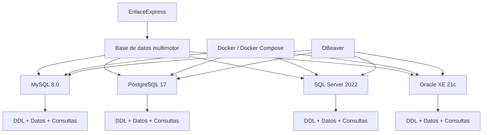
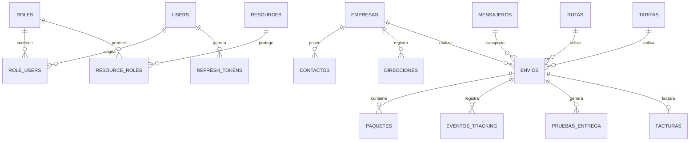
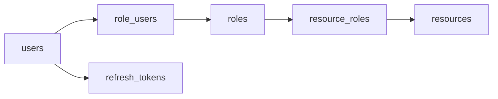
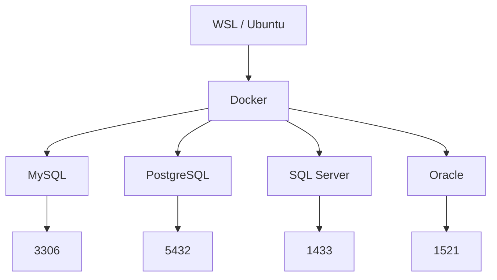
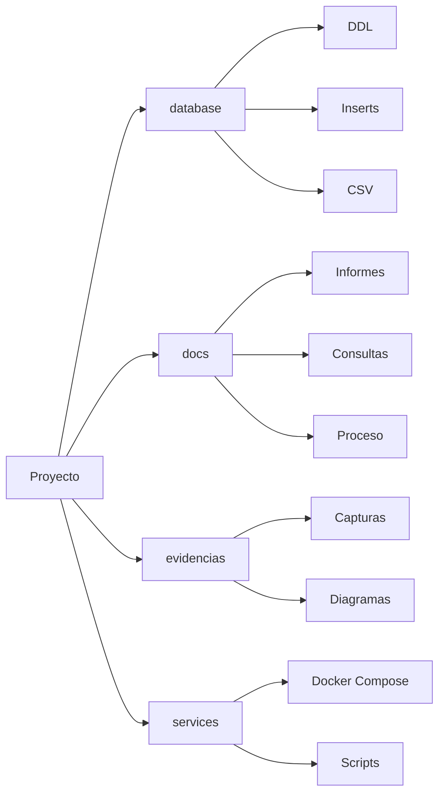

# EnlaceExpress — Multimotor Database

[](https://www.docker.com/)
[](https://ubuntu.com/)
[](https://www.mysql.com/)
[](https://www.postgresql.org/)
[](https://www.microsoft.com/sql-server)
[](https://www.oracle.com/database/)
[](https://dbeaver.io/)
[](https://git-scm.com/)
[](https://github.com/)

> Proyecto académico de implementación, configuración, documentación y verificación de una base de datos multimotor para **EnlaceExpress**.

---

## Contenido

- [EnlaceExpress — Multimotor Database](#enlaceexpress--multimotor-database)
  - [Contenido](#contenido)
  - [Descripción](#descripción)
  - [Arquitectura general](#arquitectura-general)
  - [Motores implementados](#motores-implementados)
  - [Acceso rápido](#acceso-rápido)
    - [Base de datos](#base-de-datos)
    - [Documentación](#documentación)
    - [Infraestructura](#infraestructura)
  - [Base de datos](#base-de-datos-1)
    - [Modelo de acceso](#modelo-de-acceso)
  - [RBAC](#rbac)
  - [Consultas avanzadas](#consultas-avanzadas)
  - [Interfaces gráficas](#interfaces-gráficas)
  - [Diagramas](#diagramas)
  - [Infraestructura Docker](#infraestructura-docker)
    - [Servicios](#servicios)
  - [Documentación](#documentación-1)
  - [Evidencias](#evidencias)
  - [Estructura del repositorio](#estructura-del-repositorio)
  - [Estado del proyecto](#estado-del-proyecto)
  - [Entorno utilizado](#entorno-utilizado)
  - [Autor](#autor)

---

## Descripción

**EnlaceExpress** es un proyecto de base de datos desarrollado bajo un enfoque multimotor, utilizando la misma estructura lógica en cuatro sistemas gestores de bases de datos:

| Motor                | Versión | Esquema                   |
| -------------------- | ------: | ------------------------- |
| MySQL                |     8.0 | `enlace_express`          |
| PostgreSQL           |      17 | `enlace_express / public` |
| Microsoft SQL Server |    2022 | `enlace_express / dbo`    |
| Oracle Database      |  XE 21c | `ENLACE_EXPRESS`          |

El proyecto incluye:

* Diseño e implementación de **18 tablas**.
* Claves primarias, foráneas y restricciones `UNIQUE`.
* Relaciones entre entidades.
* Control de usuarios y roles mediante RBAC.
* Triggers de actualización y auditoría.
* Datos de prueba.
* Consultas SQL de diferentes niveles.
* Diagramas entidad-relación.
* Verificación mediante herramientas gráficas.
* Contenedores Docker independientes para cada motor.
* Documentación del proceso de implementación.

---

## Arquitectura general



---

## Motores implementados

| Motor           |    Estado    | DDL                                                          | Datos                                                 | Documentación                           |
| --------------- | :----------: | ------------------------------------------------------------ | ----------------------------------------------------- | --------------------------------------- |
| MySQL 8.0       | `COMPLETADO` | [DDL](database/mysql/enlace_express_mysql_ddl.sql)           | [Inserts](database/mysql/inserts_mysql.sql)           | [README](database/mysql/README.md)      |
| PostgreSQL 17   | `COMPLETADO` | [DDL](database/postgresql/enlace_express_postgresql_ddl.sql) | [Inserts](database/postgresql/inserts_postgresql.sql) | [README](database/postgresql/README.md) |
| SQL Server 2022 | `COMPLETADO` | [DDL](database/sql-server/enlace_express_sqlserver_ddl.sql)  | [Inserts](database/sql-server/inserts_sqlserver.sql)  | [README](database/sql-server/README.md) |
| Oracle XE 21c   | `COMPLETADO` | [DDL](database/oracle/enlace_express_oracle_ddl.sql)         | [Inserts](database/oracle/inserts_oracle.sql)         | [README](database/oracle/README.md)     |

---

## Acceso rápido

### Base de datos

| Recurso                                        | Descripción                     |
| ---------------------------------------------- | ------------------------------- |
| [`database/`](database/)                       | Scripts SQL y archivos de datos |
| [`database/mysql/`](database/mysql/)           | Implementación MySQL            |
| [`database/postgresql/`](database/postgresql/) | Implementación PostgreSQL       |
| [`database/sql-server/`](database/sql-server/) | Implementación SQL Server       |
| [`database/oracle/`](database/oracle/)         | Implementación Oracle           |

### Documentación

| Documento                                                    | Descripción                               |
| ------------------------------------------------------------ | ----------------------------------------- |
| [`docs/PROCESO.md`](docs/PROCESO.md)                         | Proceso general del proyecto              |
| [`docs/GUI.md`](docs/GUI.md)                                 | Verificación mediante interfaces gráficas |
| [`docs/CONSULTAS-AVANZADAS.md`](docs/CONSULTAS-AVANZADAS.md) | Consultas SQL realizadas                  |
| [`docs/contexto/`](docs/contexto/)                           | Contexto y definición del proyecto        |
| [`docs/informes/`](docs/informes/)                           | Informes académicos                       |
| [`docs/semanas/`](docs/semanas/)                             | Metodología y trabajo por semanas         |

### Infraestructura

| Recurso                                                                | Descripción                            |
| ---------------------------------------------------------------------- | -------------------------------------- |
| [`services/motores-bd/`](services/motores-bd/)                         | Servicios Docker de los cuatro motores |
| [`services/motores-bd/start-all.sh`](services/motores-bd/start-all.sh) | Inicia todos los motores               |
| [`services/motores-bd/stop-all.sh`](services/motores-bd/stop-all.sh)   | Detiene todos los motores              |

---

## Base de datos

La estructura principal está compuesta por **18 tablas**:

```text
auditoria
contactos
direcciones
empresas
envios
eventos_tracking
facturas
mensajeros
paquetes
pruebas_entrega
refresh_tokens
resource_roles
resources
role_users
roles
rutas
tarifas
users
```

### Modelo de acceso



---

## RBAC

El proyecto incorpora un modelo de **control de acceso basado en roles (RBAC)**.



Roles utilizados:

| Rol               |
| ----------------- |
| `ADMIN`           |
| `CLIENTE_EMPRESA` |
| `DESPACHO`        |
| `MENSAJERO`       |
| `FACTURACION`     |
| `OPERADOR`        |

---

## Consultas avanzadas

Las consultas están organizadas por motor dentro de:

[`docs/CONSULTAS-AVANZADAS.md`](docs/CONSULTAS-AVANZADAS.md)

También se encuentran las evidencias individuales:

```text
evidencias/
└── 11-consultas-avanzadas/
    ├── 01-mysql/
    ├── 02-postgresql/
    ├── 03-sql-server/
    └── 04-oracle/
```

Se trabajaron operaciones como:

* `SELECT`
* `WHERE`
* `AND / IN`
* `BETWEEN`
* `LIKE`
* `ORDER BY`
* `COUNT`
* `SUM`
* `AVG`
* `MIN / MAX`
* `GROUP BY`
* `HAVING`
* `JOIN`
* `LEFT JOIN`
* Subconsultas
* `EXISTS`
* `CASE`
* `COALESCE`
* CTE
* Funciones de ventana
* `RANK`
* `ROW_NUMBER`
* `UNION`

---

## Interfaces gráficas

La estructura de la base de datos fue revisada mediante los gestores gráficos correspondientes:

| Motor      | Herramienta                  |
| ---------- | ---------------------------- |
| MySQL      | MySQL Workbench              |
| PostgreSQL | pgAdmin 4                    |
| SQL Server | SQL Server Management Studio |
| Oracle     | Oracle SQL Developer         |
| Multimotor | DBeaver                      |

La documentación completa de esta verificación se encuentra en:

[**GUI.md — Verificación de estructuras y tablas**](docs/GUI.md)

Las evidencias están organizadas en:

```text
evidencias/
├── 02-mysql/
├── 03-postgresql/
├── 04-sql-server/
├── 05-oracle/
├── 07-dbeaver/
└── 12-GUI/
```

---

## Diagramas

Cada motor cuenta con su propio diagrama entidad-relación:

```text
evidencias/
└── 13-diagramas/
    ├── mysql/
    │   └── ER-diagram.jpg
    ├── postgresql/
    │   └── ER-diagram.jpg
    ├── sql-server/
    │   └── ER-diagram.jpg
    └── oracle/
        └── ER-diagram.jpg
```

| Motor      | Diagrama                                                            |
| ---------- | ------------------------------------------------------------------- |
| MySQL      | [Ver ER Diagram](evidencias/13-diagramas/mysql/ER-diagram.jpg)      |
| PostgreSQL | [Ver ER Diagram](evidencias/13-diagramas/postgresql/ER-diagram.jpg) |
| SQL Server | [Ver ER Diagram](evidencias/13-diagramas/sql-server/ER-diagram.jpg) |
| Oracle     | [Ver ER Diagram](evidencias/13-diagramas/oracle/ER-diagram.jpg)     |

---

## Infraestructura Docker

Los cuatro motores se ejecutan mediante contenedores independientes.



### Servicios

| Servicio   | Puerto |
| ---------- | -----: |
| MySQL      | `3306` |
| PostgreSQL | `5432` |
| SQL Server | `1433` |
| Oracle     | `1521` |

Los archivos de configuración se encuentran en:

```text
services/motores-bd/
├── mysql/
├── postgres/
├── mssql/
├── oracle/
├── start-all.sh
├── stop-all.sh
└── README.md
```

---

## Documentación

El repositorio mantiene separadas la implementación, las evidencias y la documentación:



---

## Evidencias

Las evidencias están organizadas por etapas:

```text
evidencias/
├── 01-proyecto
├── 02-mysql
├── 03-postgresql
├── 04-sql-server
├── 05-oracle
├── 06-entorno-general
├── 07-dbeaver
├── 08-persistencia
├── 09-backups
├── 10-verificacion-final
├── 11-consultas-avanzadas
├── 12-GUI
└── 13-diagramas
```

Esto permite consultar de manera independiente la configuración, ejecución, persistencia, consultas, interfaces gráficas y verificación de cada motor.

---

## Estructura del repositorio

```text
bdii-2026ii-jairovaron404/
│
├── database/
│   ├── mysql/
│   ├── postgresql/
│   ├── sql-server/
│   └── oracle/
│
├── docs/
│   ├── contexto/
│   ├── informes/
│   └── semanas/
│
├── evidencias/
│   ├── configuracion/
│   ├── consultas/
│   ├── GUI/
│   └── diagramas/
│
├── services/
│   └── motores-bd/
│
├── .gitignore
└── README.md
```

---

## Estado del proyecto

| Componente              |    Estado    |
| ----------------------- | :----------: |
| MySQL 8.0               | `COMPLETADO` |
| PostgreSQL 17           | `COMPLETADO` |
| SQL Server 2022         | `COMPLETADO` |
| Oracle XE 21c           | `COMPLETADO` |
| Estructura de 18 tablas | `COMPLETADO` |
| Datos de prueba         | `COMPLETADO` |
| RBAC                    | `COMPLETADO` |
| Triggers                | `COMPLETADO` |
| Consultas SQL           | `COMPLETADO` |
| Diagramas ER            | `COMPLETADO` |
| Verificación GUI        | `COMPLETADO` |
| Docker Compose          | `COMPLETADO` |
| Persistencia            | `COMPLETADO` |
| Backups                 | `COMPLETADO` |
| Documentación           | `COMPLETADO` |

---

## Entorno utilizado

```text
Sistema operativo
└── Windows 11
    └── WSL / Ubuntu
        └── Docker
            ├── MySQL 8.0
            ├── PostgreSQL 17
            ├── SQL Server 2022
            └── Oracle XE 21c
```

Herramientas principales:

| Herramienta     | Uso                       |
| --------------- | ------------------------- |
| Docker          | Contenedores              |
| Docker Compose  | Orquestación de servicios |
| WSL / Ubuntu    | Entorno Linux             |
| DBeaver         | Administración multimotor |
| MySQL Workbench | Verificación MySQL        |
| pgAdmin 4       | Verificación PostgreSQL   |
| SSMS            | Verificación SQL Server   |
| SQL Developer   | Verificación Oracle       |
| Git / GitHub    | Control de versiones      |

---

## Autor

**Jairo de Jesús Varón Hernández**

Ingeniería de Sistemas
Universidad de La Guajira
2026