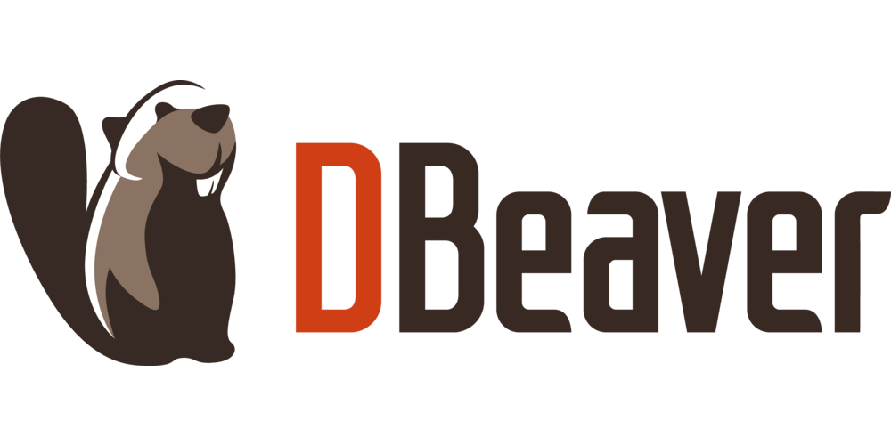

<!-- ========================================================= -->

<!--                         HEADER                            -->

<!-- ========================================================= -->

<div align="center">


<br>


<br>


<strong>Sistema de gestión de envíos, seguimiento y facturación</strong>

<sub>Un mismo modelo lógico implementado y validado en cuatro motores de bases de datos.</sub>

</div>

---

# EnlaceExpress

## Sobre el proyecto

**EnlaceExpress** es un proyecto académico desarrollado para la asignatura **Base de Datos II** de Ingeniería de Sistemas.

El proyecto representa una plataforma para la gestión de operaciones de mensajería y distribución, centralizando procesos relacionados con empresas, envíos, paquetes, rutas, seguimiento, entregas y facturación.

El modelo lógico fue implementado en cuatro motores de bases de datos, realizando las adaptaciones necesarias según el dialecto y las características de cada plataforma.

<div align="center">


</div>

---

## Alcance del sistema

El sistema permite gestionar los principales procesos de una plataforma de distribución:

<table align="center">
<tr>
<td align="center" width="25%">

<strong>Envíos</strong>

Registro, consulta, asignación y control de estados.

</td>

<td align="center" width="25%">

<strong>Seguimiento</strong>

Eventos de tracking y trazabilidad de los envíos.

</td>

<td align="center" width="25%">

<strong>Entregas</strong>

Gestión de paquetes y pruebas de entrega.

</td>

<td align="center" width="25%">

<strong>Facturación</strong>

Tarifas, facturas y estados de facturación.

</td>
</tr>
</table>

<br>

<table align="center">
<tr>
<td align="center" width="25%">

<strong>Usuarios</strong>

Usuarios, roles y permisos.

</td>

<td align="center" width="25%">

<strong>Autenticación</strong>

Sesiones y refresh tokens.

</td>

<td align="center" width="25%">

<strong>Auditoría</strong>

Registro de operaciones importantes.

</td>

<td align="center" width="25%">

<strong>Rutas</strong>

Rutas y asignación de mensajeros.

</td>
</tr>
</table>

---

# Arquitectura general

```text
                            ENLACEEXPRESS
                                  |
             +--------------------+--------------------+
             |                    |                    |
             v                    v                    v
        OPERACIÓN             SEGURIDAD           FACTURACIÓN
             |                    |                    |
      +------+------+        +----+----+          +----+----+
      |      |      |        |         |          |         |
    Envíos Paquetes Tracking RBAC  Autenticación Tarifas Facturas
      |      |      |        |         |
      +------+------+        |         |
             |               |         |
             v               v         v
        Modelo lógico     Usuarios   Roles
             |               |         |
             |               +----+----+
             |                    |
             v                    v
      +------+------+          Recursos
      |      |      |
      v      v      v
    MySQL PostgreSQL SQL Server
             |
             v
           Oracle
```

---

# Entorno tecnológico

Una de las características principales del proyecto es la implementación del mismo modelo lógico en cuatro motores de bases de datos.

Las siguientes imágenes corresponden a los recursos gráficos propios del proyecto y se encuentran almacenadas en `evidencias/01-proyecto/`.

<div align="center">

<table>
<tr>

<td align="center">

<br>
<strong>MySQL 8.0</strong>
</td>

<td align="center">

<br>
<strong>PostgreSQL 17</strong>
</td>

<td align="center">

<br>
<strong>SQL Server 2022</strong>
</td>

<td align="center">

<br>
<strong>Oracle XE 21c</strong>
</td>

<td align="center">

<br>
<strong>DBeaver</strong>
</td>

</tr>
</table>

</div>

### Motores implementados

<div align="center">

|                                              Motor                                              | Versión |      Esquema     |
| :---------------------------------------------------------------------------------------------: | :-----: | :--------------: |
|                    |   8.0   | `enlace_express` |
|          |    17   | `enlace_express` |
|  |   2022  |       `dbo`      |
|                  |  XE 21c | `ENLACE_EXPRESS` |

</div>

### Herramientas principales

<div align="center">


</div>

---

# Cuatro motores, un mismo modelo

```text
                         MODELO LÓGICO
                               |
              +----------------+----------------+
              |                |                |
              v                v                v
            MySQL         PostgreSQL       SQL Server
              |                |                |
              |                |                |
              +----------------+----------------+
                               |
                               v
                             Oracle

                MISMA LÓGICA DE NEGOCIO
                              +
                  ADAPTACIÓN DEL DIALECTO
                              +
                  CARACTERÍSTICAS NATIVAS
```

La equivalencia se mantiene a nivel lógico, mientras que cada motor utiliza las características y sintaxis apropiadas para su plataforma.

---

# Modelo de datos

El sistema está compuesto por **18 tablas**.

<div align="center">


</div>

### Tablas

```text
auditoria
contactos
direcciones
empresas
envios
eventos_tracking
facturas
mensajeros
paquetes
pruebas_entrega
refresh_tokens
resource_roles
resources
role_users
roles
rutas
tarifas
users
```

### Relaciones principales

```text
EMPRESAS
|
+-- CONTACTOS
|
+-- DIRECCIONES
|
+-- ENVIOS
|
+-- FACTURAS


ENVIOS
|
+-- PAQUETES
|
+-- EVENTOS_TRACKING
|
+-- PRUEBAS_ENTREGA
|
+-- RUTAS
|
+-- MENSAJEROS
|
+-- TARIFAS


USERS
|
+-- ROLE_USERS
|      |
|      +-- ROLES
|             |
|             +-- RESOURCE_ROLES
|                    |
|                    +-- RESOURCES
|
+-- REFRESH_TOKENS


AUDITORIA
```

### Modelo completo

[Consultar documentación del dominio](docs/DOMINIO.md)

### Diagramas ER

Los diagramas entidad-relación se mantienen como evidencia independiente para cada motor.

```text
evidencias/
└── 13-diagramas/
    ├── mysql/
    │   └── ER-diagram.jpg
    ├── postgresql/
    │   └── ER-diagram.jpg
    ├── sql-server/
    │   └── ER-diagram.jpg
    └── oracle/
        └── ER-diagram.jpg
```

---

# Control de acceso

EnlaceExpress utiliza un modelo de **Role-Based Access Control (RBAC)**.

<div align="center">


</div>

### Modelo de autorización

```text
                         USERS
                           |
                           v
                      ROLE_USERS
                           |
                           v
                         ROLES
                           |
                           v
                    RESOURCE_ROLES
                           |
                           v
                       RESOURCES
```

Los recursos representan operaciones del sistema mediante rutas y métodos HTTP, permitiendo asociar permisos a los diferentes roles.

---

# Flujo principal

```text
+----------------+
|    EMPRESA     |
+-------+--------+
        |
        | Solicita envío
        v
+----------------+
|     ENVÍO      |
+-------+--------+
        |
        v
+----------------+
|     RUTA       |
+-------+--------+
        |
        v
+----------------+
|    MENSAJERO   |
+-------+--------+
        |
        v
+----------------+
|    TRACKING    |
+-------+--------+
        |
        v
+----------------+
|    PAQUETE     |
+-------+--------+
        |
        v
+----------------+
|    ENTREGA     |
+-------+--------+
        |
        v
+----------------+
|    FACTURA     |
+----------------+
```

---

# Estados del sistema

## Envíos

```text
CREADO
  |
  v
ASIGNADO
  |
  v
EN_RECOGIDA
  |
  v
EN_TRANSITO
  |
  v
EN_ENTREGA
  |
  v
ENTREGADO
```

Estados adicionales:

```text
CANCELADO
CON_NOVEDAD
```

## Paquetes

```text
REGISTRADO
EN_TRANSITO
ENTREGADO
DEVUELTO
CON_NOVEDAD
```

## Facturas

```text
PENDIENTE
EMITIDA
PAGADA
ANULADA
VENCIDA
```

## Prioridades

<div align="center">


</div>

---

# Infraestructura

Los cuatro motores se ejecutan mediante servicios independientes utilizando Docker.

```text
services/
└── motores-bd/
    |
    +-- mysql/
    |   └── docker-compose.yml
    |
    +-- postgres/
    |   └── docker-compose.yml
    |
    +-- mssql/
    |   └── docker-compose.yml
    |
    +-- oracle/
    |   └── docker-compose.yml
    |
    +-- start-all.sh
    └── stop-all.sh
```

### Arquitectura de servicios

```text
                         DOCKER
                            |
          +-----------------+-----------------+
          |                 |                 |
          v                 v                 v
        MySQL          PostgreSQL        SQL Server
          |                 |                 |
          +-----------------+-----------------+
                            |
                            v
                          Oracle
```

### Servicios

<div align="center">


</div>

---

# Datos y persistencia

Se generaron e insertaron datos de prueba en los cuatro motores para validar la estructura, relaciones y consultas.

Cada motor dispone de sus propios archivos:

```text
database/
|
+-- mysql/
|   +-- datos_enlace_express_mysql.csv
|   +-- enlace_express_mysql_ddl.sql
|   +-- inserts_mysql.sql
|   └── README.md
|
+-- postgresql/
|   +-- datos_enlace_express_postgresql.csv
|   +-- enlace_express_postgresql_ddl.sql
|   +-- inserts_postgresql.sql
|   └── README.md
|
+-- sql-server/
|   +-- datos_enlace_express_sqlserver.csv
|   +-- enlace_express_sqlserver_ddl.sql
|   +-- inserts_sqlserver.sql
|   └── README.md
|
└── oracle/
    +-- datos_enlace_express_oracle.csv
    +-- enlace_express_oracle_ddl.sql
    +-- inserts_oracle.sql
    └── README.md
```

---

# Consultas avanzadas

Se implementaron y validaron **38 consultas avanzadas** en los cuatro motores.

<div align="center">


</div>

### Categorías

```text
SELECT
WHERE
IN
BETWEEN
LIKE
ORDER BY

COUNT
SUM
AVG

GROUP BY
HAVING

JOIN
Subconsultas
EXISTS

CASE
COALESCE

CTE
RANK
ROW_NUMBER

RBAC
UNION
```

### Documentación

[Consultar las 38 consultas avanzadas](docs/CONSULTAS-AVANZADAS.md)

### Evidencias

```text
evidencias/
└── 11-consultas-avanzadas/
    ├── 01-mysql/
    ├── 02-postgresql/
    ├── 03-sql-server/
    └── 04-oracle/
```

---

# Casos de uso

El proyecto cuenta con **16 casos de uso**.

<div align="center">


</div>

### Usuarios y roles

```text
Gestionar usuarios
Gestionar roles
Gestionar recursos
```

### Envíos

```text
Registrar envío
Consultar envío
Asignar mensajero
Gestionar rutas
```

### Seguimiento

```text
Registrar evento de tracking
Consultar seguimiento
```

### Entregas

```text
Gestionar paquetes
Registrar prueba de entrega
```

### Facturación

```text
Gestionar tarifas
Generar factura
Consultar factura
```

### Administración

```text
Consultar auditoría
Gestionar sesión y autenticación
```

### Documentación

[Consultar casos de uso](docs/CASOS-DE-USO.md)

### Evidencias

```text
evidencias/
└── 14-casos-de-uso/
```

---


## Backend Django

EnlaceExpress incorpora un backend desarrollado con Python y Django. Actualmente se está preparando su configuración inicial para integrar la aplicación con los motores de bases de datos contemplados en el proyecto.

### Tecnologías del backend

| Tecnología o componente   | Propósito                                                |
| ------------------------- | -------------------------------------------------------- |
| Python                    | Lenguaje del backend                                     |
| Django                    | Framework web                                            |
| PostgreSQL                | Motor seleccionado actualmente en la configuración local |
| MySQL                     | Motor contemplado por la configuración multimotor        |
| SQL Server                | Motor contemplado por la configuración multimotor        |
| Oracle                    | Motor contemplado por la configuración multimotor        |
| Variables de entorno      | Configuración de credenciales y parámetros               |
| Entorno virtual (`.venv`) | Aislamiento de las dependencias de Python                |
| Git y GitHub              | Control de versiones                                     |

### Estructura del backend

```text
backend/
├── config/
│   ├── settings/
│   │   └── __init__.py
│   ├── asgi.py
│   ├── wsgi.py
│   ├── database.py
│   └── project_python.py
├── .env.example
├── manage.py
└── requirements.txt
```

* `config/settings/`: configuración principal de Django.
* `config/database.py`: configuración de conexión según el motor seleccionado.
* `config/project_python.py`: selección del intérprete del entorno virtual.
* `.env.example`: plantilla de variables de entorno.
* `manage.py`: punto de entrada para los comandos de administración.

### Configuración del entorno

El backend utiliza un archivo `.env` local para definir los parámetros de ejecución y conexión. Este archivo contiene información específica del entorno y no debe publicarse en GitHub.

Las variables principales incluyen:

* `DJANGO_SECRET_KEY`: clave secreta de Django.
* `DJANGO_DEBUG`: modo de depuración.
* `DJANGO_ALLOWED_HOSTS`: hosts permitidos.
* `DB_ENGINE`: motor seleccionado.
* Variables específicas de conexión para PostgreSQL, MySQL, SQL Server y Oracle.

Los valores deben configurarse según el entorno local. No deben incluirse contraseñas ni claves reales en la documentación.

### Preparación y comprobación

Desde la terminal WSL/Linux, entra en el directorio `backend/`. Si el entorno virtual aún no existe, créalo y actívalo:

```bash
python3 -m venv .venv
source .venv/bin/activate
```

Instala las dependencias:

```bash
python -m pip install -r requirements.txt
```

Crea la configuración local a partir de la plantilla:

```bash
cp .env.example .env
```

Completa las variables necesarias antes de ejecutar Django.

Para comprobar la configuración y las dependencias:

```bash
.venv/bin/python manage.py check
.venv/bin/python -m pip check
```

Para consultar las migraciones:

```bash
.venv/bin/python manage.py showmigrations
```

Las migraciones deben aplicarse únicamente después de confirmar que el motor seleccionado está disponible y que las credenciales corresponden a la base de datos correcta.

### Estado actual

La configuración inicial del backend ha superado la comprobación del sistema de Django y la validación de dependencias instaladas. La configuración multimotor está preparada para seleccionar el motor mediante variables de entorno.

La conexión con cada motor, la aplicación de migraciones y la implementación de las funcionalidades de negocio deben validarse de forma independiente. La configuración inicial no implica que la API completa esté terminada.

---

# Herramientas gráficas

El proyecto fue administrado y verificado mediante herramientas gráficas específicas para cada motor.

<div align="center">

<table>
<tr>

<td align="center">

<br>
<strong>DBeaver</strong>
</td>

<td align="center">

<strong>Herramientas nativas</strong>

<br><br>

MySQL Workbench

<br>

pgAdmin 4

<br>

SQL Server Management Studio

<br>

Oracle SQL Developer

</td>

</tr>
</table>

</div>

### Entornos utilizados

```text
DBeaver
|
+-- MySQL
+-- PostgreSQL
+-- SQL Server
└── Oracle


Herramientas nativas
|
+-- MySQL Workbench
+-- pgAdmin 4
+-- SQL Server Management Studio
└── Oracle SQL Developer
```

---

# Estructura del repositorio

```text
EnlaceExpress/
|
+-- database/
|   |
|   +-- mysql/
|   |   +-- datos_enlace_express_mysql.csv
|   |   +-- enlace_express_mysql_ddl.sql
|   |   +-- inserts_mysql.sql
|   |   └── README.md
|   |
|   +-- postgresql/
|   |   +-- datos_enlace_express_postgresql.csv
|   |   +-- enlace_express_postgresql_ddl.sql
|   |   +-- inserts_postgresql.sql
|   |   └── README.md
|   |
|   +-- sql-server/
|   |   +-- datos_enlace_express_sqlserver.csv
|   |   +-- enlace_express_sqlserver_ddl.sql
|   |   +-- inserts_sqlserver.sql
|   |   └── README.md
|   |
|   └── oracle/
|       +-- datos_enlace_express_oracle.csv
|       +-- enlace_express_oracle_ddl.sql
|       +-- inserts_oracle.sql
|       └── README.md
|
+-- services/
|   └── motores-bd/
|
+-- docs/
|   +-- DOMINIO.md
|   +-- CASOS-DE-USO.md
|   +-- CONSULTAS-AVANZADAS.md
|   +-- REPOSITORIOS.md
|   +-- GUI.md
|   +-- PROCESO.md
|   +-- contexto/
|   +-- informes/
|   └── semanas/
|
+-- evidencias/
|   +-- 01-proyecto/
|   +-- 02-mysql/
|   +-- 03-postgresql/
|   +-- 04-sql-server/
|   +-- 05-oracle/
|   +-- 06-entorno-general/
|   +-- 07-dbeaver/
|   +-- 08-persistencia/
|   +-- 09-backups/
|   +-- 10-verificacion-final/
|   +-- 11-consultas-avanzadas/
|   +-- 12-GUI/
|   +-- 13-diagramas/
|   +-- 14-casos-de-uso/
|   └── 15-repositorios/
|
+-- .gitignore
└── README.md
```

---

# Documentación

<div align="center">

| Documento                                          | Descripción                      |
| :------------------------------------------------- | :------------------------------- |
| [Dominio](docs/DOMINIO.md)                         | Modelo y reglas del sistema      |
| [Casos de uso](docs/CASOS-DE-USO.md)               | Funcionalidades principales      |
| [Consultas avanzadas](docs/CONSULTAS-AVANZADAS.md) | Consultas SQL implementadas      |
| [Repositorios](docs/REPOSITORIOS.md)               | Organización de scripts y datos  |
| [GUI](docs/GUI.md)                                 | Herramientas gráficas utilizadas |
| [Proceso](docs/PROCESO.md)                         | Bitácora y proceso de desarrollo |
| [Informes](docs/informes/)                         | Informes académicos              |
| [Semanas](docs/semanas/)                           | Documentación por semanas        |

</div>

---

# Evidencias

Las evidencias se encuentran organizadas por etapas y componentes del proyecto.

```text
evidencias/
|
+-- 01-proyecto
+-- 02-mysql
+-- 03-postgresql
+-- 04-sql-server
+-- 05-oracle
+-- 06-entorno-general
+-- 07-dbeaver
+-- 08-persistencia
+-- 09-backups
+-- 10-verificacion-final
+-- 11-consultas-avanzadas
+-- 12-GUI
+-- 13-diagramas
+-- 14-casos-de-uso
└── 15-repositorios
```

### Evidencias destacadas

| Evidencia                 | Ubicación                            |
| :------------------------ | :----------------------------------- |
| Proyecto y herramientas   | `evidencias/01-proyecto/`            |
| Implementación MySQL      | `evidencias/02-mysql/`               |
| Implementación PostgreSQL | `evidencias/03-postgresql/`          |
| Implementación SQL Server | `evidencias/04-sql-server/`          |
| Implementación Oracle     | `evidencias/05-oracle/`              |
| Entorno general           | `evidencias/06-entorno-general/`     |
| DBeaver                   | `evidencias/07-dbeaver/`             |
| Persistencia              | `evidencias/08-persistencia/`        |
| Backups                   | `evidencias/09-backups/`             |
| Verificación final        | `evidencias/10-verificacion-final/`  |
| Consultas avanzadas       | `evidencias/11-consultas-avanzadas/` |
| Herramientas GUI          | `evidencias/12-GUI/`                 |
| Diagramas ER              | `evidencias/13-diagramas/`           |
| Casos de uso              | `evidencias/14-casos-de-uso/`        |
| Repositorio               | `evidencias/15-repositorios/`        |

---

# Estado del proyecto

<div align="center">

| Componente          |    Estado    |
| :------------------ | :----------: |
| Modelo lógico       | `COMPLETADO` |
| MySQL               | `COMPLETADO` |
| PostgreSQL          | `COMPLETADO` |
| SQL Server          | `COMPLETADO` |
| Oracle              | `COMPLETADO` |
| Datos de prueba     | `COMPLETADO` |
| Consultas avanzadas | `COMPLETADO` |
| RBAC                | `COMPLETADO` |
| Diagramas ER        | `COMPLETADO` |
| Casos de uso        | `COMPLETADO` |
| Evidencias          | `COMPLETADO` |
| Documentación       | `COMPLETADO` |
| Docker              | `COMPLETADO` |

</div>

---

# Metodología

El desarrollo utiliza **MIRIA — Integración Responsable de IA para el Aprendizaje** como apoyo para organizar, documentar y verificar el proceso.

El proceso registra:

```text
OBJETIVOS
    |
    v
REQUISITOS
    |
    v
DISEÑO
    |
    v
IMPLEMENTACIÓN
    |
    v
PRUEBAS
    |
    v
EVIDENCIAS
    |
    v
VERIFICACIÓN HUMANA
    |
    v
DOCUMENTACIÓN
```

[Consultar proceso del proyecto](docs/PROCESO.md)

---

# Resumen técnico

<div align="center">


<br><br>


</div>

```text
                         ENLACEEXPRESS
                              |
              +---------------+---------------+
              |               |               |
              v               v               v
           MODELO           DATOS         EVIDENCIAS
              |               |               |
              +---------------+---------------+
                              |
                              v
                       CUATRO MOTORES
                              |
            +-----------------+-----------------+
            |                 |                 |
            v                 v                 v
          MySQL          PostgreSQL        SQL Server
            |                 |                 |
            +-----------------+-----------------+
                              |
                              v
                            Oracle
```

---

# Autor

<div align="center">

<strong>Jairo Varón</strong>

Ingeniería de Sistemas

Universidad de La Guajira


</div>

---

<div align="center">

<strong>EnlaceExpress</strong>

<sub>Proyecto académico de implementación y validación de bases de datos multimotor.</sub>


</div>
