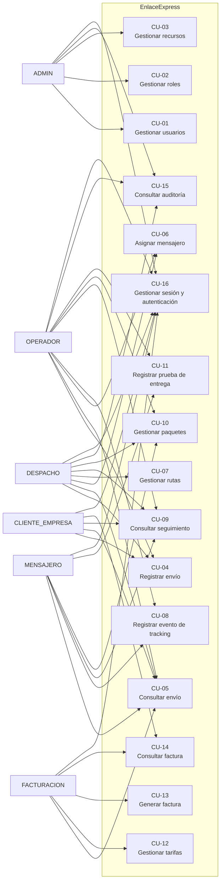
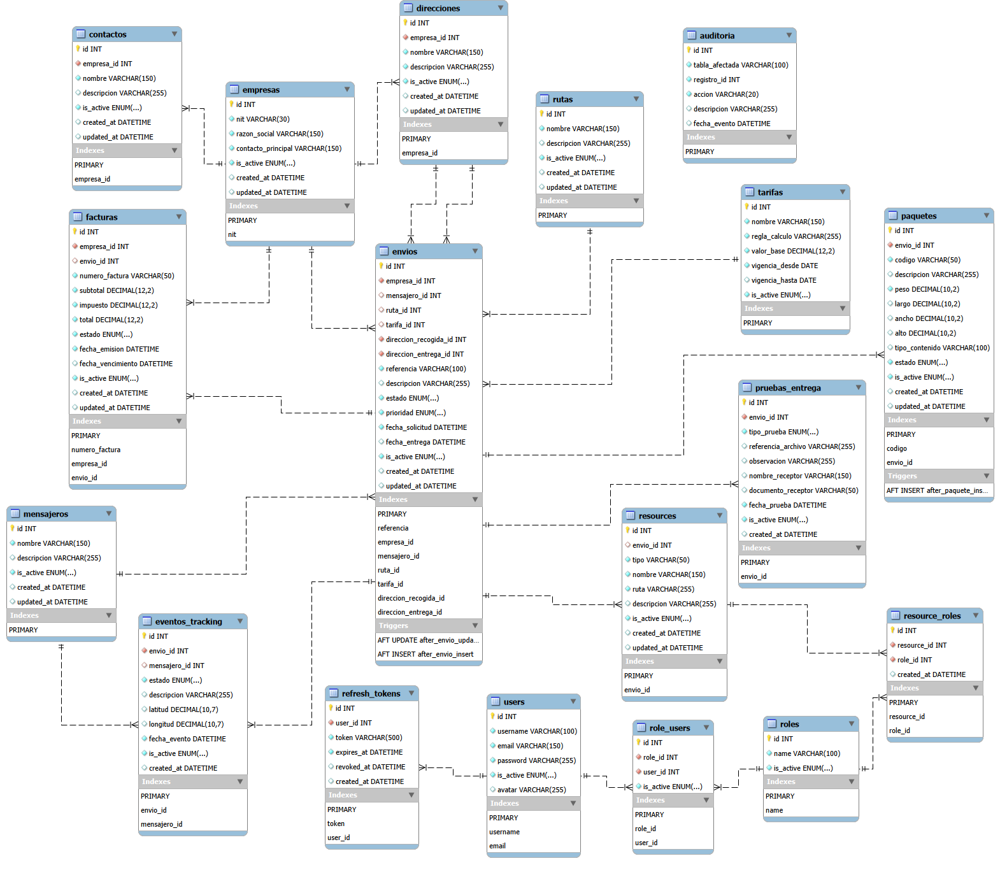
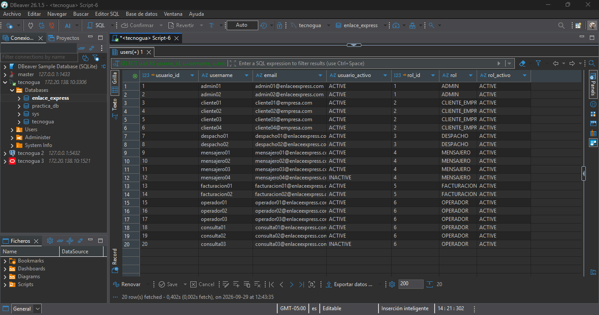
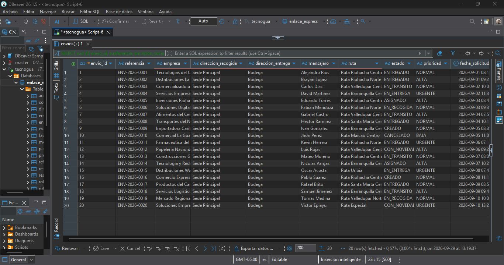
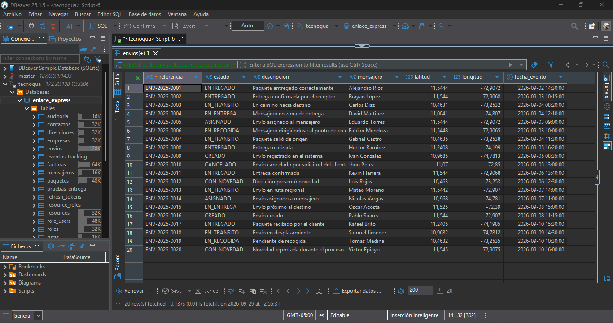
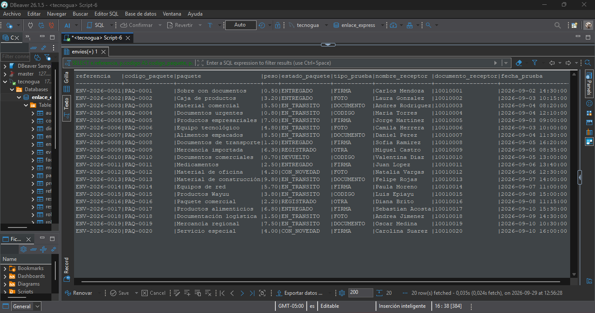
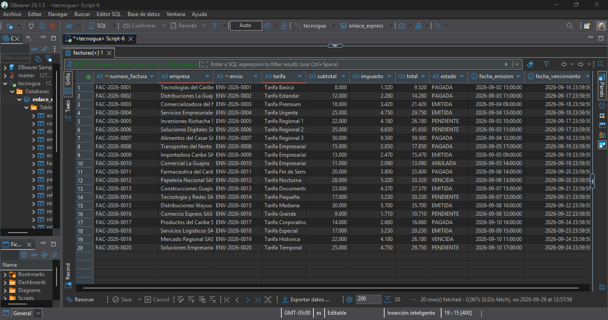
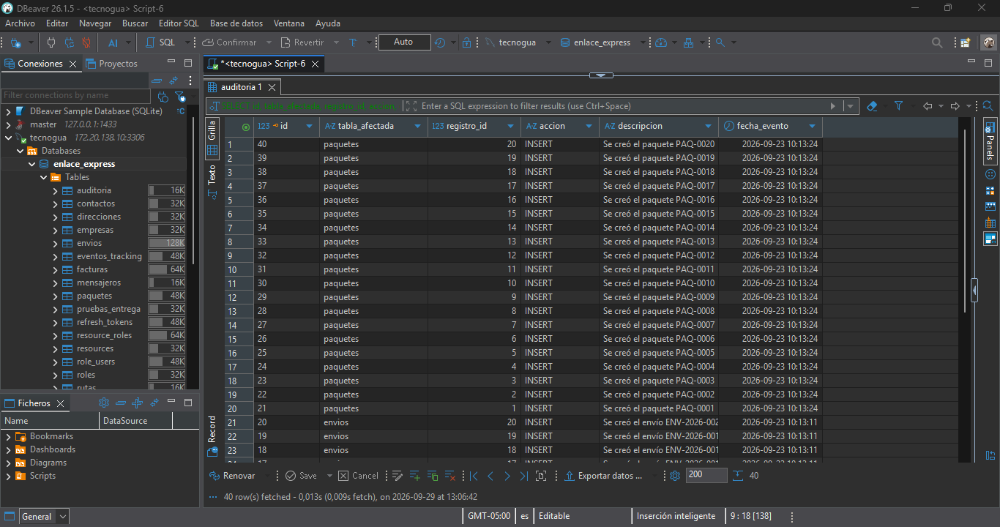

# Casos de uso – EnlaceExpress

## 1. Descripción general

EnlaceExpress es una plataforma para la gestión de envíos y operaciones relacionadas con la distribución de paquetes. El sistema permite registrar empresas, administrar envíos, gestionar paquetes, realizar seguimiento de los estados, asignar mensajeros, administrar rutas, gestionar tarifas y facturación, registrar pruebas de entrega y controlar el acceso de los usuarios.

Los casos de uso permiten representar las principales funcionalidades del sistema desde la perspectiva de los usuarios que interactúan con él.

El modelo de casos de uso se relaciona directamente con el dominio general de EnlaceExpress y con las estructuras implementadas en los cuatro motores de bases de datos:

- MySQL
- PostgreSQL
- SQL Server
- Oracle

La lógica funcional es común para los cuatro motores. Las diferencias entre ellos corresponden principalmente a aspectos físicos y sintácticos propios de cada sistema gestor.

---

## 2. Actores del sistema

EnlaceExpress cuenta con los siguientes roles principales:

| Actor | Descripción |
|---|---|
| ADMIN | Administra usuarios, roles, recursos y aspectos generales de seguridad del sistema. |
| CLIENTE_EMPRESA | Representa a las empresas que registran y consultan sus envíos. |
| DESPACHO | Gestiona la operación de los envíos, rutas y asignación de mensajeros. |
| MENSAJERO | Gestiona los envíos que tiene asignados y registra eventos durante la entrega. |
| FACTURACION | Gestiona tarifas y procesos relacionados con la facturación. |
| OPERADOR | Apoya la operación general y la gestión de información de los envíos. |

---

# 3. Diagrama general de casos de uso

El siguiente diagrama representa las principales interacciones entre los actores y las funcionalidades de EnlaceExpress.



> **Nota:** Las relaciones entre actores y casos de uso representan las funciones asignadas a cada rol dentro del modelo funcional del proyecto. La autorización efectiva de cada operación se implementa mediante el modelo RBAC compuesto por usuarios, roles y recursos.

---

# 4. Casos de uso

## CU-01 – Gestionar usuarios

### Actor principal

ADMIN

### Objetivo

Permitir al administrador gestionar los usuarios que tienen acceso a EnlaceExpress.

### Precondiciones

* El administrador debe estar autenticado.
* El administrador debe contar con los permisos correspondientes.

### Flujo principal

1. El administrador accede a la gestión de usuarios.
2. El sistema muestra los usuarios registrados.
3. El administrador puede registrar o modificar información de un usuario.
4. El administrador puede activar o desactivar usuarios.
5. El sistema valida la información.
6. El sistema almacena los cambios.

### Resultado esperado

El usuario queda registrado o actualizado correctamente y su estado queda disponible para el control de acceso.

### Tablas relacionadas

* `users`
* `role_users`
* `roles`

---

## CU-02 – Gestionar roles

### Actor principal

ADMIN

### Objetivo

Administrar los roles utilizados para controlar los permisos de los usuarios.

### Precondiciones

* El administrador debe estar autenticado.
* Debe contar con permisos administrativos.

### Flujo principal

1. El administrador accede a la gestión de roles.
2. El sistema muestra los roles disponibles.
3. El administrador registra o modifica un rol.
4. El sistema valida la información.
5. Se guarda la información del rol.

### Resultado esperado

Los roles del sistema quedan disponibles para asignarlos a los usuarios.

### Tablas relacionadas

* `roles`
* `role_users`

---

## CU-03 – Gestionar recursos

### Actor principal

ADMIN

### Objetivo

Administrar los recursos y operaciones que pueden ser utilizados por los diferentes roles.

### Precondiciones

* El administrador debe estar autenticado.

### Flujo principal

1. El administrador consulta los recursos registrados.
2. El sistema muestra las rutas y métodos disponibles.
3. El administrador registra o modifica un recurso.
4. El administrador puede asociar recursos con roles.
5. El sistema guarda los cambios.

### Resultado esperado

Los recursos quedan asociados a los roles correspondientes mediante el modelo de control de acceso.

### Tablas relacionadas

* `resources`
* `resource_roles`
* `roles`

---

## CU-04 – Registrar envío

### Actores principales

CLIENTE_EMPRESA, DESPACHO, OPERADOR

### Objetivo

Registrar un nuevo envío dentro de EnlaceExpress.

### Precondiciones

* La empresa debe existir.
* Las direcciones de recogida y entrega deben estar registradas.
* El usuario debe contar con permisos para registrar envíos.

### Flujo principal

1. El usuario inicia el registro del envío.
2. Selecciona la empresa asociada.
3. Selecciona la dirección de recogida.
4. Selecciona la dirección de entrega.
5. Registra la referencia del envío.
6. Define la prioridad y las fechas correspondientes.
7. El sistema valida la información.
8. El sistema registra el envío con estado `CREADO`.
9. Se genera el registro correspondiente de auditoría.

### Resultado esperado

El envío queda registrado y disponible para continuar con el proceso operativo.

### Tablas relacionadas

* `envios`
* `empresas`
* `direcciones`
* `auditoria`

---

## CU-05 – Consultar envío

### Actores principales

CLIENTE_EMPRESA, DESPACHO, MENSAJERO, FACTURACION, OPERADOR

### Objetivo

Consultar la información general de un envío.

### Precondiciones

* El envío debe existir.
* El usuario debe estar autenticado.

### Flujo principal

1. El usuario solicita la consulta.
2. El sistema recibe la referencia o identificador del envío.
3. El sistema busca la información correspondiente.
4. Se muestran los datos del envío.
5. Dependiendo del rol, se muestran únicamente las operaciones permitidas.

### Resultado esperado

El usuario obtiene la información disponible del envío.

### Tablas relacionadas

* `envios`
* `empresas`
* `direcciones`
* `rutas`
* `tarifas`
* `mensajeros`

---

## CU-06 – Asignar mensajero

### Actores principales

DESPACHO, OPERADOR

### Objetivo

Asignar un mensajero a un envío para realizar la operación de entrega.

### Precondiciones

* El envío debe existir.
* El mensajero debe estar registrado y activo.
* El usuario debe contar con permisos para realizar asignaciones.

### Flujo principal

1. El usuario consulta los envíos pendientes de asignación.
2. Selecciona un envío.
3. Consulta los mensajeros disponibles.
4. Selecciona un mensajero.
5. El sistema registra la asignación.
6. El estado del envío puede pasar a `ASIGNADO`.
7. Se actualiza la información correspondiente.

### Resultado esperado

El envío queda asociado al mensajero seleccionado.

### Tablas relacionadas

* `envios`
* `mensajeros`
* `rutas`
* `auditoria`

---

## CU-07 – Gestionar rutas

### Actores principales

DESPACHO

### Objetivo

Crear y administrar las rutas utilizadas para organizar los envíos.

### Precondiciones

* El usuario debe estar autenticado.
* Debe contar con permisos de despacho.

### Flujo principal

1. El usuario accede a la gestión de rutas.
2. Consulta las rutas existentes.
3. Registra o modifica una ruta.
4. El sistema valida la información.
5. La ruta queda disponible para asociarla con envíos.

### Resultado esperado

Las rutas quedan registradas y disponibles para la operación logística.

### Tablas relacionadas

* `rutas`
* `envios`

---

## CU-08 – Registrar evento de tracking

### Actores principales

MENSAJERO, OPERADOR

### Objetivo

Registrar un nuevo evento relacionado con el seguimiento de un envío.

### Precondiciones

* El envío debe existir.
* El usuario debe contar con permisos para registrar eventos.

### Flujo principal

1. El usuario selecciona el envío.
2. Selecciona el estado correspondiente.
3. Registra una descripción del evento.
4. Cuando corresponde, registra ubicación geográfica.
5. El sistema almacena el evento.
6. El seguimiento queda actualizado con el nuevo registro.

### Resultado esperado

El sistema conserva el historial del seguimiento del envío.

### Tablas relacionadas

* `eventos_tracking`
* `envios`
* `mensajeros`

---

## CU-09 – Consultar seguimiento

### Actores principales

CLIENTE_EMPRESA, DESPACHO, MENSAJERO

### Objetivo

Consultar el historial de eventos y el estado actual de un envío.

### Precondiciones

* El envío debe existir.
* El usuario debe estar autenticado.

### Flujo principal

1. El usuario consulta un envío.
2. El sistema obtiene sus eventos de tracking.
3. Los eventos se organizan cronológicamente.
4. Se muestra el estado actual y el historial disponible.

### Resultado esperado

El usuario puede conocer la evolución del envío desde su registro hasta su estado actual.

### Tablas relacionadas

* `envios`
* `eventos_tracking`
* `mensajeros`

---

## CU-10 – Gestionar paquetes

### Actores principales

DESPACHO, MENSAJERO, OPERADOR

### Objetivo

Registrar y administrar los paquetes asociados a un envío.

### Precondiciones

* El envío debe existir.
* El usuario debe tener permisos para gestionar paquetes.

### Flujo principal

1. El usuario selecciona un envío.
2. Registra un paquete.
3. Ingresa código, descripción, peso y dimensiones.
4. Define el tipo de contenido.
5. El sistema registra el paquete.
6. Se asigna el estado correspondiente.
7. El sistema puede registrar la operación en auditoría.

### Resultado esperado

El paquete queda asociado al envío y disponible para su seguimiento.

### Tablas relacionadas

* `paquetes`
* `envios`
* `auditoria`

---

## CU-11 – Registrar prueba de entrega

### Actores principales

MENSAJERO, OPERADOR

### Objetivo

Registrar la evidencia que demuestra la entrega de un envío.

### Precondiciones

* El envío debe existir.
* El usuario debe estar autorizado.
* Debe existir información relacionada con la entrega.

### Flujo principal

1. El usuario selecciona el envío.
2. Selecciona el tipo de prueba.
3. Registra el archivo o referencia correspondiente.
4. Registra observaciones cuando sean necesarias.
5. Registra el nombre y documento del receptor cuando corresponda.
6. El sistema almacena la prueba de entrega.

### Resultado esperado

La entrega queda respaldada mediante una prueba registrada en el sistema.

### Tablas relacionadas

* `pruebas_entrega`
* `envios`

### Tipos de prueba

Los tipos definidos para el sistema son:

* `FIRMA`
* `FOTO`
* `DOCUMENTO`
* `CODIGO`
* `OTRA`

---

## CU-12 – Gestionar tarifas

### Actor principal

FACTURACION

### Objetivo

Administrar las tarifas utilizadas para calcular el valor de los servicios de envío.

### Precondiciones

* El usuario debe estar autenticado.
* Debe contar con permisos de facturación.

### Flujo principal

1. El usuario consulta las tarifas existentes.
2. Registra o modifica una tarifa.
3. Define la regla de cálculo.
4. Define el valor base.
5. Establece el periodo de vigencia.
6. El sistema valida y almacena la información.

### Resultado esperado

Las tarifas quedan disponibles para ser utilizadas en los procesos relacionados con los envíos.

### Tablas relacionadas

* `tarifas`
* `envios`

---

## CU-13 – Generar factura

### Actor principal

FACTURACION

### Objetivo

Generar una factura relacionada con una empresa y, cuando corresponda, con un envío.

### Precondiciones

* La empresa debe existir.
* Deben existir los datos necesarios para calcular la factura.
* El usuario debe contar con permisos de facturación.

### Flujo principal

1. El usuario inicia la generación de una factura.
2. Selecciona la empresa.
3. Selecciona el envío cuando corresponda.
4. Define el subtotal.
5. Se calcula el impuesto.
6. Se obtiene el total.
7. El sistema genera el número de factura.
8. La factura queda registrada con el estado correspondiente.

### Resultado esperado

La factura queda almacenada y disponible para consulta.

### Tablas relacionadas

* `facturas`
* `empresas`
* `envios`
* `tarifas`

### Estados de factura

* `PENDIENTE`
* `EMITIDA`
* `PAGADA`
* `ANULADA`
* `VENCIDA`

---

## CU-14 – Consultar factura

### Actores principales

CLIENTE_EMPRESA, FACTURACION

### Objetivo

Consultar la información y estado de una factura.

### Precondiciones

* La factura debe existir.
* El usuario debe estar autenticado.

### Flujo principal

1. El usuario solicita una factura.
2. El sistema consulta la información.
3. Se muestran los datos de la empresa.
4. Se muestran los valores de la factura.
5. Se muestra el estado actual.
6. Cuando corresponde, se muestra el envío asociado.

### Resultado esperado

El usuario puede consultar la información disponible de la factura.

### Tablas relacionadas

* `facturas`
* `empresas`
* `envios`

---

## CU-15 – Consultar auditoría

### Actores principales

ADMIN, DESPACHO, OPERADOR

### Objetivo

Consultar los registros de auditoría generados por las operaciones del sistema.

### Precondiciones

* El usuario debe estar autenticado.
* Debe contar con permisos para consultar información de auditoría.

### Flujo principal

1. El usuario accede al módulo de auditoría.
2. El sistema consulta los registros disponibles.
3. El usuario puede revisar las operaciones registradas.
4. Se muestran los datos relacionados con la acción realizada.

### Resultado esperado

El usuario autorizado puede consultar el historial de operaciones registrado en la auditoría.

### Tablas relacionadas

* `auditoria`

### Operaciones de auditoría

Entre las operaciones que pueden registrarse se encuentran:

* `INSERT`
* Cambios de estado
* Registro de paquetes
* Otras operaciones definidas por la implementación del sistema

---

## CU-16 – Gestionar sesión y autenticación

### Actores principales

Todos los actores

### Objetivo

Permitir que los usuarios ingresen al sistema y administren su sesión de forma controlada.

### Precondiciones

* El usuario debe estar registrado.
* Las credenciales deben ser válidas.

### Flujo principal

1. El usuario proporciona sus credenciales.
2. El sistema valida la información.
3. El sistema identifica los roles asociados.
4. Se crea o renueva la sesión.
5. Se genera el mecanismo de autenticación correspondiente.
6. El usuario puede acceder a las operaciones permitidas.
7. Al cerrar la sesión, el mecanismo correspondiente puede ser revocado.

### Resultado esperado

El usuario puede acceder al sistema de acuerdo con sus roles y permisos.

### Tablas relacionadas

* `users`
* `roles`
* `role_users`
* `resources`
* `resource_roles`
* `refresh_tokens`

---

# 5. Resumen de casos de uso

| Código | Caso de uso                      | Actor principal | Tablas principales                                                              |
| ------ | -------------------------------- | --------------- | ------------------------------------------------------------------------------- |
| CU-01  | Gestionar usuarios               | ADMIN           | `users`, `role_users`, `roles`                                                  |
| CU-02  | Gestionar roles                  | ADMIN           | `roles`, `role_users`                                                           |
| CU-03  | Gestionar recursos               | ADMIN           | `resources`, `resource_roles`, `roles`                                          |
| CU-04  | Registrar envío                  | CLIENTE_EMPRESA | `envios`, `empresas`, `direcciones`, `auditoria`                                |
| CU-05  | Consultar envío                  | Varios          | `envios`, `empresas`, `direcciones`, `rutas`, `tarifas`, `mensajeros`           |
| CU-06  | Asignar mensajero                | DESPACHO        | `envios`, `mensajeros`, `rutas`                                                 |
| CU-07  | Gestionar rutas                  | DESPACHO        | `rutas`, `envios`                                                               |
| CU-08  | Registrar evento de tracking     | MENSAJERO       | `eventos_tracking`, `envios`, `mensajeros`                                      |
| CU-09  | Consultar seguimiento            | CLIENTE_EMPRESA | `envios`, `eventos_tracking`, `mensajeros`                                      |
| CU-10  | Gestionar paquetes               | DESPACHO        | `paquetes`, `envios`, `auditoria`                                               |
| CU-11  | Registrar prueba de entrega      | MENSAJERO       | `pruebas_entrega`, `envios`                                                     |
| CU-12  | Gestionar tarifas                | FACTURACION     | `tarifas`, `envios`                                                             |
| CU-13  | Generar factura                  | FACTURACION     | `facturas`, `empresas`, `envios`, `tarifas`                                     |
| CU-14  | Consultar factura                | FACTURACION     | `facturas`, `empresas`, `envios`                                                |
| CU-15  | Consultar auditoría              | ADMIN           | `auditoria`                                                                     |
| CU-16  | Gestionar sesión y autenticación | Todos           | `users`, `roles`, `role_users`, `resources`, `resource_roles`, `refresh_tokens` |

---

# 6. Relación entre casos de uso y dominio

Los casos de uso se relacionan directamente con las entidades definidas en el dominio de EnlaceExpress.

| Área del dominio                  | Casos de uso relacionados         |
| --------------------------------- | --------------------------------- |
| Empresas, contactos y direcciones | CU-04, CU-05                      |
| Gestión de envíos                 | CU-04, CU-05, CU-06, CU-08, CU-09 |
| Paquetes                          | CU-10                             |
| Seguimiento                       | CU-08, CU-09                      |
| Rutas y mensajeros                | CU-06, CU-07, CU-08               |
| Tarifas                           | CU-12, CU-13                      |
| Facturación                       | CU-13, CU-14                      |
| Pruebas de entrega                | CU-11                             |
| Usuarios y RBAC                   | CU-01, CU-02, CU-03, CU-16        |
| Autenticación                     | CU-16                             |
| Auditoría                         | CU-04, CU-10, CU-15               |

---

# 7. Relación con el modelo RBAC

El control de acceso de EnlaceExpress se basa en la relación entre usuarios, roles y recursos.

```text
USERS
  │
  │ N:M
  ▼
ROLE_USERS
  │
  ▼
ROLES
  │
  │ N:M
  ▼
RESOURCE_ROLES
  │
  ▼
RESOURCES
```

Los roles definidos son:

```text
ADMIN
CLIENTE_EMPRESA
DESPACHO
MENSAJERO
FACTURACION
OPERADOR
```

Los recursos representan operaciones del sistema, como:

```text
POST /envios
POST /asignaciones
POST /tracking
POST /facturas/consolidar
```

De esta forma, el sistema puede determinar qué operaciones están disponibles para cada usuario según los roles que tenga asignados.

---

# 8. Relación con los cuatro motores de bases de datos

Los casos de uso representan la lógica funcional general de EnlaceExpress y no dependen de un motor específico.

La misma funcionalidad se encuentra respaldada por las implementaciones realizadas en:

| Motor      | Base de datos / esquema  |
| ---------- | ------------------------ |
| MySQL      | `enlace_express`         |
| PostgreSQL | `enlace_express`         |
| SQL Server | `enlace_express` / `dbo` |
| Oracle     | `ENLACE_EXPRESS`         |

Las diferencias entre los motores corresponden a elementos físicos como:

* Tipos de datos.
* Identidad de registros.
* Restricciones.
* Enumeraciones.
* Sintaxis SQL.
* Triggers.
* Procedimientos almacenados.
* Características propias de cada motor.

Estas diferencias no modifican los casos de uso generales del sistema.

---

# 9. Evidencia de los casos de uso

La evidencia correspondiente a este documento se almacenará en:

```text
evidencias/
└── 14-casos-de-uso/
```

Se propone la siguiente organización:

```text
evidencias/
└── 14-casos-de-uso/
    ├── diagrama-casos-uso.png
    ├── 01-usuarios-roles.png
    ├── 02-gestion-envios.png
    ├── 03-seguimiento.png
    ├── 04-paquetes-entrega.png
    ├── 05-facturacion.png
    └── 06-auditoria.png
```

## 9.1 Diagrama general



Esta evidencia corresponde al diagrama general de casos de uso de EnlaceExpress.

---

## 9.2 Gestión de usuarios y control de acceso



> Consulta utilizada para obtener la evidencia.

```sql
SELECT
    u.id AS usuario_id,
    u.username,
    u.email,
    u.is_active AS usuario_activo,
    r.id AS rol_id,
    r.name AS rol,
    r.is_active AS rol_activo
FROM users u
LEFT JOIN role_users ru
    ON ru.user_id = u.id
LEFT JOIN roles r
    ON r.id = ru.role_id
ORDER BY u.id, r.id;
```

Debe mostrar evidencia relacionada con:

* Usuarios.
* Roles.
* Asignación de roles.
* Recursos.
* Permisos.

Casos relacionados:

* CU-01
* CU-02
* CU-03
* CU-16

---

## 9.3 Gestión de envíos



> Consulta utilizada para obtener la evidencia:

```sql
SELECT
    e.id AS envio_id,
    e.referencia,
    em.razon_social AS empresa,
    d1.nombre AS direccion_recogida,
    d2.nombre AS direccion_entrega,
    m.nombre AS mensajero,
    r.nombre AS ruta,
    e.estado,
    e.prioridad,
    e.fecha_solicitud
FROM envios e
JOIN empresas em
    ON em.id = e.empresa_id
JOIN direcciones d1
    ON d1.id = e.direccion_recogida_id
JOIN direcciones d2
    ON d2.id = e.direccion_entrega_id
LEFT JOIN mensajeros m
    ON m.id = e.mensajero_id
LEFT JOIN rutas r
    ON r.id = e.ruta_id
ORDER BY e.id;
```

Debe mostrar evidencia relacionada con:

* Registro de empresas.
* Direcciones.
* Registro de envíos.
* Consulta de envíos.
* Asignación de mensajeros.
* Rutas.

Casos relacionados:

* CU-04
* CU-05
* CU-06
* CU-07

---

## 9.4 Seguimiento de envíos



> Consulta utilizada para obtener la evidencia:

```sql
SELECT
    e.referencia,
    et.estado,
    et.descripcion,
    m.nombre AS mensajero,
    et.latitud,
    et.longitud,
    et.fecha_evento
FROM eventos_tracking et
JOIN envios e
    ON e.id = et.envio_id
LEFT JOIN mensajeros m
    ON m.id = et.mensajero_id
ORDER BY e.id, et.fecha_evento;
```

Debe mostrar evidencia relacionada con:

* Eventos de tracking.
* Estados del envío.
* Mensajeros.
* Historial de seguimiento.

Casos relacionados:

* CU-08
* CU-09

---

## 9.5 Paquetes y pruebas de entrega



> Consulta utilizada para obtener la evidencia:

```sql
SELECT
    e.referencia,
    p.codigo AS codigo_paquete,
    p.descripcion AS paquete,
    p.peso,
    p.estado AS estado_paquete,
    pe.tipo_prueba,
    pe.nombre_receptor,
    pe.documento_receptor,
    pe.fecha_prueba
FROM envios e
JOIN paquetes p
    ON p.envio_id = e.id
LEFT JOIN pruebas_entrega pe
    ON pe.envio_id = e.id
ORDER BY e.id, p.id, pe.fecha_prueba;
```

Debe mostrar evidencia relacionada con:

* Paquetes.
* Estados de paquetes.
* Pruebas de entrega.
* Tipo de prueba.
* Información del receptor.

Casos relacionados:

* CU-10
* CU-11

---

## 9.6 Tarifas y facturación



> Consulta utilizada para obtener la evidencia:

```sql
SELECT
    f.numero_factura,
    e.razon_social AS empresa,
    en.referencia AS envio,
    t.nombre AS tarifa,
    f.subtotal,
    f.impuesto,
    f.total,
    f.estado,
    f.fecha_emision,
    f.fecha_vencimiento
FROM facturas f
JOIN empresas e
    ON e.id = f.empresa_id
LEFT JOIN envios en
    ON en.id = f.envio_id
LEFT JOIN tarifas t
    ON t.id = en.tarifa_id
ORDER BY f.id;
```

Debe mostrar evidencia relacionada con:

* Tarifas.
* Valores base.
* Vigencia.
* Facturas.
* Estados de factura.
* Totales.

Casos relacionados:

* CU-12
* CU-13
* CU-14

---

## 9.7 Auditoría



> Consulta utilizada para obtener la evidencia:

```sql
SELECT
    id,
    tabla_afectada,
    registro_id,
    accion,
    descripcion,
    fecha_evento
FROM auditoria
ORDER BY id DESC;
```

Debe mostrar evidencia relacionada con los registros generados por las operaciones del sistema.

Caso relacionado:

* CU-15

---

# 10. Evidencias complementarias existentes

Los casos de uso también pueden apoyarse en las evidencias que ya forman parte del proyecto.

### Diagramas de base de datos

```text
evidencias/13-diagramas/
├── mysql/
├── postgresql/
├── sql-server/
└── oracle/
```

Estas evidencias permiten verificar la estructura de las entidades relacionadas con los casos de uso.

### Evidencias de interfaces nativas

```text
evidencias/12-GUI/
├── 01-mysql-workbench/
├── 02-postgresql-pgadmin-4/
├── 03-sql-server-ssms/
└── 04-oracle-sql-developer/
```

Estas evidencias muestran la comprobación de las bases de datos mediante las herramientas gráficas correspondientes a cada motor.

### Consultas avanzadas

```text
evidencias/11-consultas-avanzadas/
├── 01-mysql/
├── 02-postgresql/
├── 03-sql-server/
└── 04-oracle/
```

Estas evidencias permiten comprobar mediante consultas SQL diferentes operaciones sobre la información utilizada por los casos de uso.

---

# 11. Matriz de consolidación de evidencia

| Caso de uso | Evidencia principal       | Evidencia complementaria |
| ----------- | ------------------------- | ------------------------ |
| CU-01       | `01-usuarios-roles.png`   | GUI / consultas          |
| CU-02       | `01-usuarios-roles.png`   | GUI / consultas          |
| CU-03       | `01-usuarios-roles.png`   | GUI / consultas          |
| CU-04       | `02-gestion-envios.png`   | Diagramas / consultas    |
| CU-05       | `02-gestion-envios.png`   | Consultas avanzadas      |
| CU-06       | `02-gestion-envios.png`   | Diagramas / consultas    |
| CU-07       | `02-gestion-envios.png`   | Diagramas / consultas    |
| CU-08       | `03-seguimiento.png`      | Consultas avanzadas      |
| CU-09       | `03-seguimiento.png`      | Consultas avanzadas      |
| CU-10       | `04-paquetes-entrega.png` | Diagramas / consultas    |
| CU-11       | `04-paquetes-entrega.png` | Diagramas / consultas    |
| CU-12       | `05-facturacion.png`      | Consultas avanzadas      |
| CU-13       | `05-facturacion.png`      | Consultas avanzadas      |
| CU-14       | `05-facturacion.png`      | Consultas avanzadas      |
| CU-15       | `06-auditoria.png`        | GUI / consultas          |
| CU-16       | `01-usuarios-roles.png`   | GUI / consultas          |

---

# 12. Consolidación de la evidencia

La evidencia de los casos de uso no se limita a capturas individuales. Se consolida utilizando tres niveles:

### Nivel 1 – Modelo funcional

El archivo `docs/CASOS-DE-USO.md` documenta los actores, funcionalidades, precondiciones, flujos y resultados esperados.

### Nivel 2 – Modelo de datos

Los diagramas ER de cada motor permiten comprobar que las entidades necesarias para soportar los casos de uso están implementadas.

### Nivel 3 – Implementación y validación

Las evidencias de GUI y las consultas avanzadas permiten comprobar que las estructuras y los datos fueron implementados y consultados en los cuatro motores.

La organización general queda así:

```text
CASOS DE USO
     │
     ├── Modelo funcional
     │     └── docs/CASOS-DE-USO.md
     │
     ├── Modelo de dominio
     │     └── docs/DOMINIO.md
     │
     ├── Modelo de datos
     │     └── evidencias/13-diagramas/
     │
     ├── Implementación
     │     └── database/
     │
     ├── Validación mediante GUI
     │     └── evidencias/12-GUI/
     │
     └── Consultas
           ├── docs/CONSULTAS-AVANZADAS.md
           └── evidencias/11-consultas-avanzadas/
```

---

# 13. Cobertura de funcionalidades

Los 16 casos de uso cubren las principales áreas funcionales del sistema:

* Administración de usuarios.
* Control de roles.
* Control de recursos.
* Registro y consulta de envíos.
* Asignación de mensajeros.
* Gestión de rutas.
* Seguimiento de envíos.
* Gestión de paquetes.
* Pruebas de entrega.
* Gestión de tarifas.
* Facturación.
* Auditoría.
* Autenticación y sesiones.

Esto permite relacionar las funcionalidades principales del sistema con las entidades y estructuras implementadas en las cuatro bases de datos.

---

# 14. Relación con la documentación del proyecto

Los casos de uso complementan los demás documentos del proyecto:

| Documento                     | Función                                                                 |
| ----------------------------- | ----------------------------------------------------------------------- |
| `docs/DOMINIO.md`             | Describe el dominio y las entidades del sistema.                        |
| `docs/CASOS-DE-USO.md`        | Describe las funcionalidades desde la perspectiva de los actores.       |
| `docs/CONSULTAS-AVANZADAS.md` | Documenta las consultas realizadas sobre las bases de datos.            |
| `docs/PROCESO.md`             | Registra el proceso de desarrollo y las actividades realizadas.         |
| `docs/GUI.md`                 | Consolida las verificaciones realizadas mediante herramientas gráficas. |

---

# 15. Conclusión

Los casos de uso permiten representar las principales funcionalidades de EnlaceExpress y la interacción de los diferentes roles con el sistema.

Los 16 casos definidos cubren las operaciones relacionadas con usuarios, control de acceso, empresas, envíos, rutas, mensajeros, seguimiento, paquetes, pruebas de entrega, tarifas, facturación, auditoría y autenticación.

El modelo funcional es común para MySQL, PostgreSQL, SQL Server y Oracle, ya que los cuatro motores implementan el mismo dominio lógico. Las evidencias se consolidan mediante el documento de casos de uso, los diagramas de base de datos, las verificaciones realizadas en las herramientas gráficas y las consultas avanzadas.

De esta manera, los casos de uso sirven como enlace entre el funcionamiento esperado de EnlaceExpress, el modelo de dominio y la implementación de la base de datos en los cuatro motores.
