# Consultas Avanzadas

Este documento contiene las consultas SQL avanzadas realizadas sobre la base de datos **Enlace Express**, implementadas y verificadas en cuatro motores de bases de datos diferentes.

Las consultas abarcan diferentes operaciones, como filtros, ordenamientos, funciones de agregación, agrupaciones, `JOIN`, subconsultas, `EXISTS`, expresiones `CASE`, `COALESCE`, CTE, funciones de ventana, consultas con roles y permisos, `UNION` y consultas de mayor complejidad.

Para cada consulta se presenta el código SQL utilizado y su respectiva evidencia de ejecución en el motor correspondiente.

El documento se encuentra dividido en las siguientes secciones:

1. **MySQL**
2. **PostgreSQL**
3. **SQL Server**
4. **Oracle**

Las evidencias de ejecución se encuentran organizadas en la carpeta `evidencias/11-consultas-avanzadas/`, separadas por cada motor de base de datos.

---

## 1. MySQL

Las siguientes consultas fueron ejecutadas sobre la base de datos **Enlace Express** utilizando MySQL. Cada consulta incluye una breve descripción, el código SQL utilizado y la evidencia correspondiente de su ejecución.

### Consulta 1 — SELECT de envíos

Esta consulta permite visualizar todos los registros almacenados en la tabla `envios`.

```sql
SELECT *
FROM envios;
```

**Evidencia:**

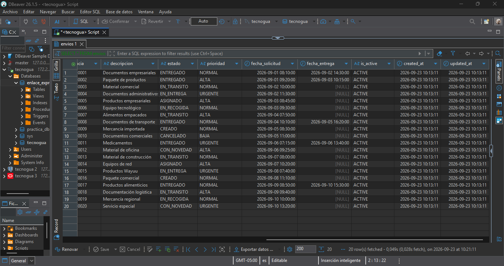

---

### Consulta 2 — SELECT con WHERE

Esta consulta permite mostrar únicamente los envíos cuyo estado actual es `ENTREGADO`.

```sql
SELECT
    id,
    referencia,
    empresa_id,
    estado,
    prioridad,
    fecha_solicitud,
    fecha_entrega
FROM envios
WHERE estado = 'ENTREGADO';
```

**Evidencia:**

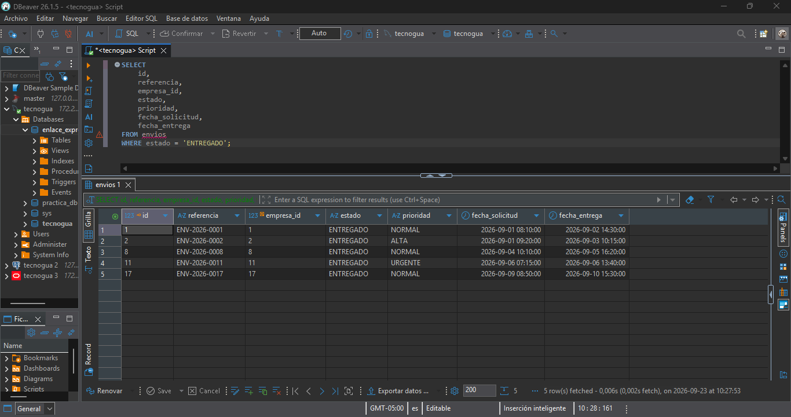

---

### Consulta 3 — WHERE con varias condiciones

Esta consulta combina `WHERE`, `AND` e `IN` para obtener los envíos activos que tienen prioridad alta o urgente.

```sql
SELECT
    id,
    referencia,
    estado,
    prioridad,
    fecha_solicitud
FROM envios
WHERE is_active = 'ACTIVE'
  AND prioridad IN ('ALTA', 'URGENTE');
```

**Evidencia:**

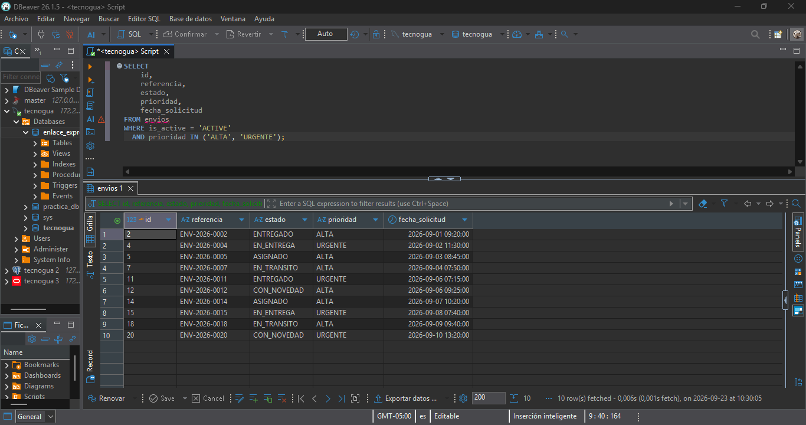

---

### Consulta 4 — IN

Esta consulta permite buscar envíos cuyo estado pertenece a una lista específica de estados.

```sql
SELECT
    id,
    referencia,
    estado,
    prioridad
FROM envios
WHERE estado IN ('EN_TRANSITO', 'EN_ENTREGA', 'EN_RECOGIDA');
```

**Evidencia:**

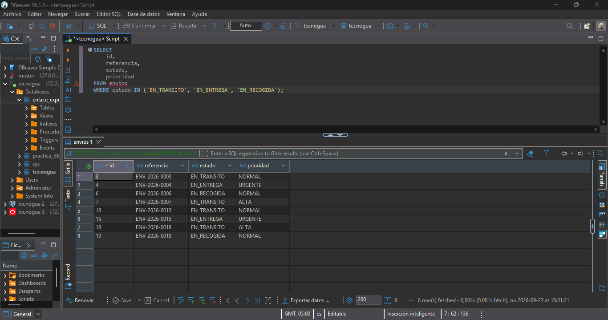

---

### Consulta 5 — BETWEEN

Esta consulta obtiene los envíos solicitados durante el periodo comprendido entre el 1 y el 5 de septiembre de 2026.

```sql
SELECT
    id,
    referencia,
    fecha_solicitud,
    estado
FROM envios
WHERE fecha_solicitud BETWEEN '2026-09-01 00:00:00'
                          AND '2026-09-05 23:59:59';
```

**Evidencia:**

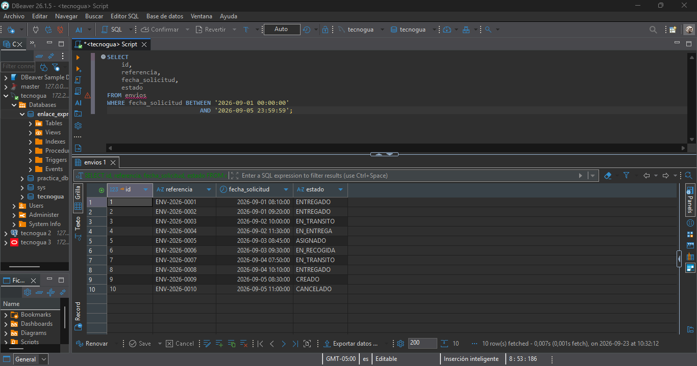

---

### Consulta 6 — LIKE

Esta consulta busca empresas cuyo nombre contiene la palabra `Caribe`.

```sql
SELECT
    id,
    nit,
    razon_social,
    contacto_principal
FROM empresas
WHERE razon_social LIKE '%Caribe%';
```

**Evidencia:**

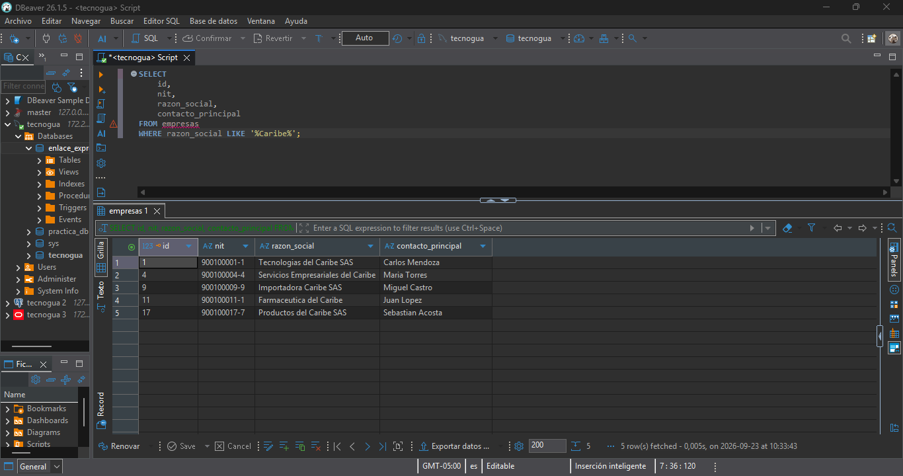

---

### Consulta 7 — LIKE con inicio de texto

Esta consulta busca empresas cuyo nombre comienza con la palabra `Comercial`.

```sql
SELECT
    id,
    razon_social,
    contacto_principal
FROM empresas
WHERE razon_social LIKE 'Comercial%';
```

**Evidencia:**

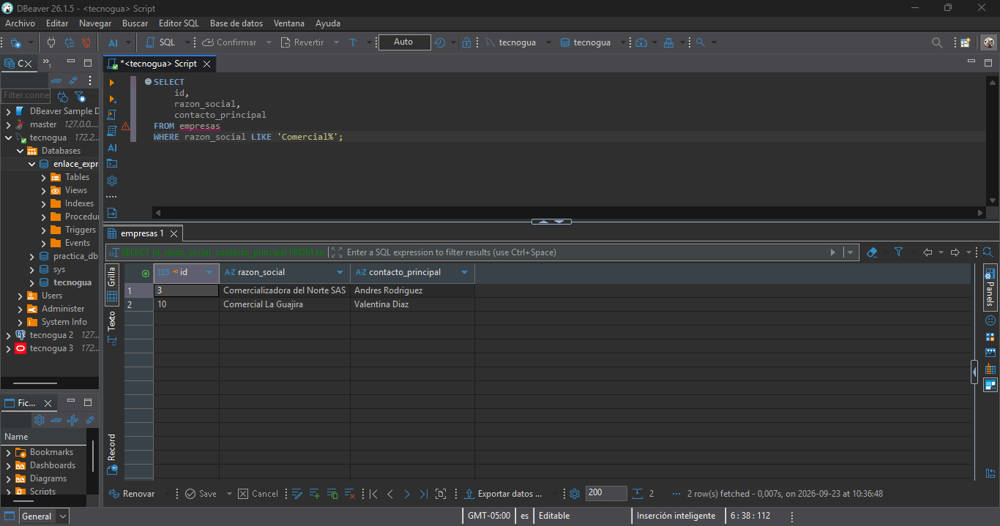

---

### Consulta 8 — ORDER BY ascendente

Esta consulta muestra las empresas ordenadas alfabéticamente por su razón social.

```sql
SELECT
    id,
    razon_social,
    contacto_principal
FROM empresas
ORDER BY razon_social ASC;
```

**Evidencia:**

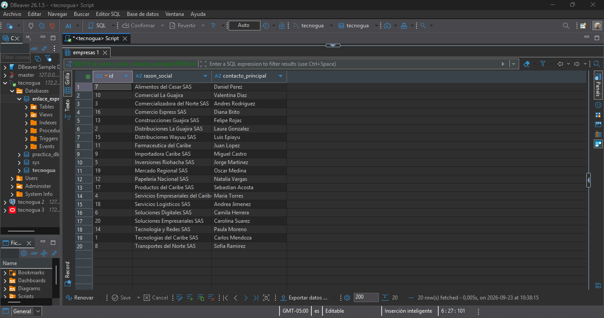

---

### Consulta 9 — ORDER BY descendente

Esta consulta muestra las tarifas ordenadas de mayor a menor según su valor base.

```sql
SELECT
    id,
    nombre,
    valor_base
FROM tarifas
ORDER BY valor_base DESC;
```

**Evidencia:**

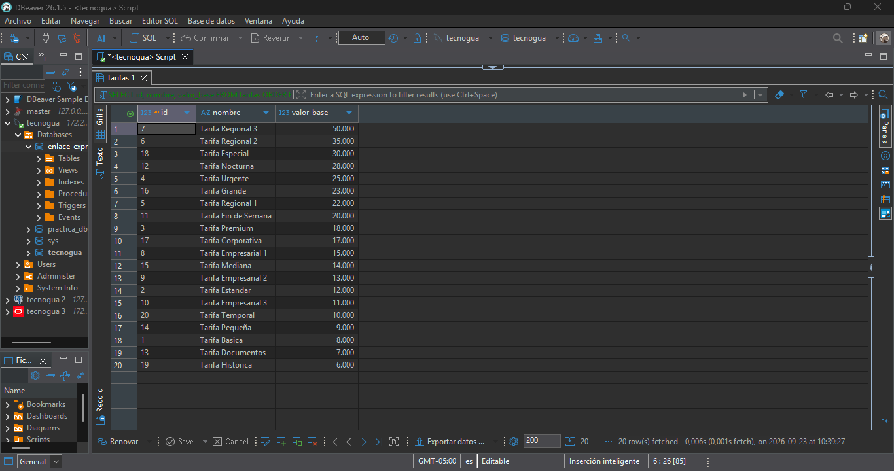

---

### Consulta 10 — COUNT

Esta consulta utiliza `COUNT` para determinar la cantidad total de envíos registrados.

```sql
SELECT COUNT(*) AS total_envios
FROM envios;
```

**Evidencia:**


---

### Consulta 11 — SUM

Esta consulta utiliza `SUM` para calcular el valor total de las facturas registradas.

```sql
SELECT
    SUM(total) AS total_facturado
FROM facturas;
```

**Evidencia:**


---

### Consulta 12 — AVG

Esta consulta calcula el valor promedio de las facturas mediante la función `AVG`.

```sql
SELECT
    AVG(total) AS promedio_facturas
FROM facturas;
```

**Evidencia:**


---

### Consulta 13 — MIN y MAX

Esta consulta permite identificar el menor y el mayor valor registrado en las facturas.

```sql
SELECT
    MIN(total) AS factura_minima,
    MAX(total) AS factura_maxima
FROM facturas;
```

**Evidencia:**


---

### Consulta 14 — GROUP BY por estado

Esta consulta agrupa los envíos según su estado y cuenta cuántos existen en cada grupo.

```sql
SELECT
    estado,
    COUNT(*) AS cantidad_envios
FROM envios
GROUP BY estado
ORDER BY cantidad_envios DESC;
```

**Evidencia:**

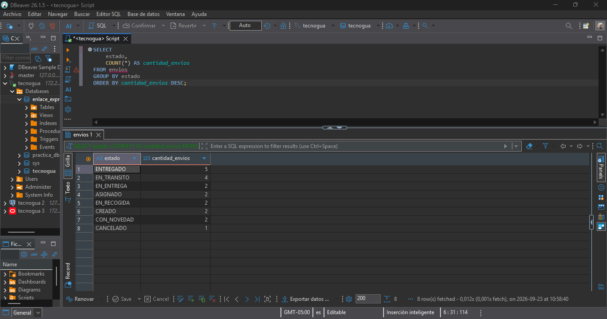

---

### Consulta 15 — GROUP BY de facturas

Esta consulta agrupa las facturas por estado y calcula tanto su cantidad como el valor total correspondiente a cada grupo.

```sql
SELECT
    estado,
    COUNT(*) AS cantidad_facturas,
    SUM(total) AS valor_total
FROM facturas
GROUP BY estado
ORDER BY valor_total DESC;
```

**Evidencia:**

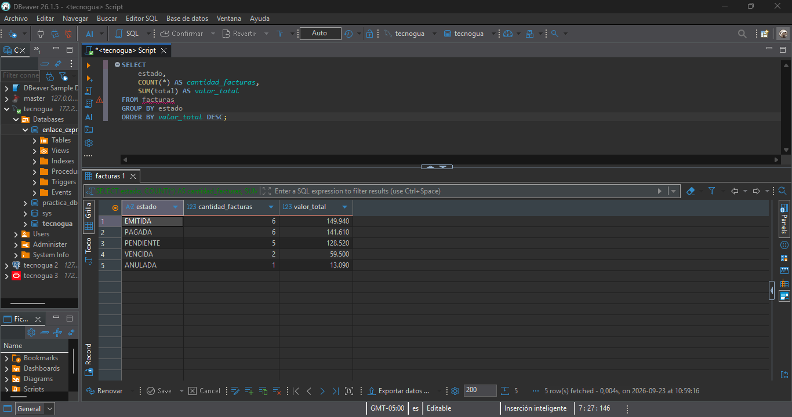

---

### Consulta 16 — GROUP BY con HAVING

Esta consulta agrupa los envíos por estado y utiliza `HAVING` para mostrar únicamente los grupos que contienen dos o más registros.

```sql
SELECT
    estado,
    COUNT(*) AS cantidad_envios
FROM envios
GROUP BY estado
HAVING COUNT(*) >= 2;
```

**Evidencia:**

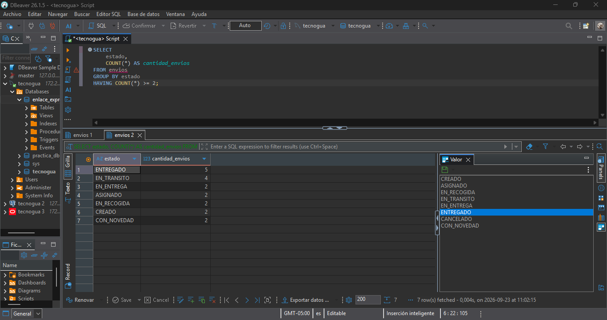

---

### Consulta 17 — INNER JOIN entre empresas y envíos

Esta consulta relaciona las empresas con los envíos mediante un `INNER JOIN`, permitiendo consultar información de ambas tablas.

```sql
SELECT
    e.id AS empresa_id,
    e.razon_social,
    en.id AS envio_id,
    en.referencia,
    en.estado,
    en.prioridad
FROM empresas e
INNER JOIN envios en
    ON e.id = en.empresa_id
ORDER BY e.id;
```

**Evidencia:**

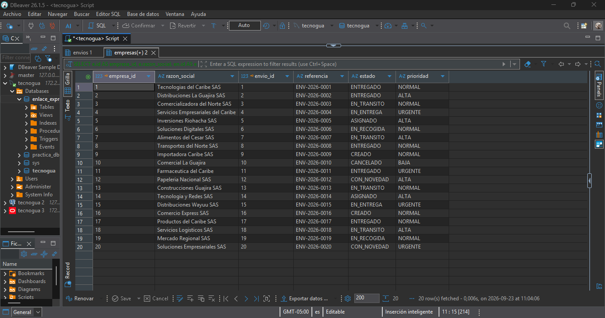

---

### Consulta 18 — Múltiples INNER JOIN

Esta consulta relaciona los envíos con las empresas y los mensajeros mediante varios `INNER JOIN`.

```sql
SELECT
    en.referencia,
    e.razon_social AS empresa,
    m.nombre AS mensajero,
    en.estado,
    en.prioridad
FROM envios en
INNER JOIN empresas e
    ON en.empresa_id = e.id
INNER JOIN mensajeros m
    ON en.mensajero_id = m.id
ORDER BY en.id;
```

**Evidencia:**

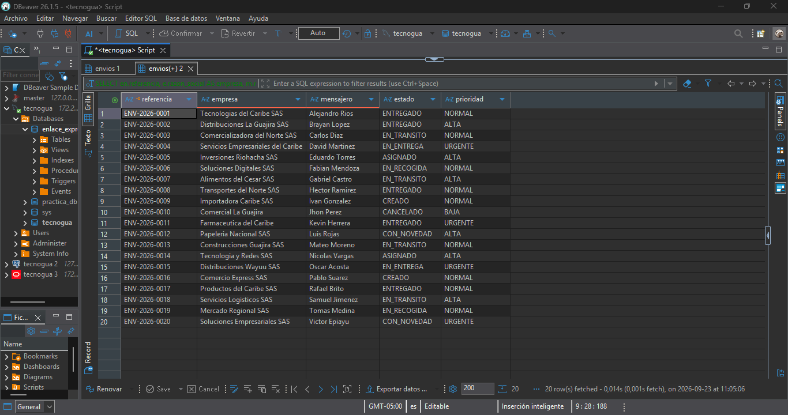

---

### Consulta 19 — LEFT JOIN

Esta consulta utiliza `LEFT JOIN` para mostrar las empresas junto con la cantidad de envíos asociados, conservando también las empresas que no tengan envíos.

```sql
SELECT
    e.id,
    e.razon_social,
    COUNT(en.id) AS cantidad_envios
FROM empresas e
LEFT JOIN envios en
    ON e.id = en.empresa_id
GROUP BY
    e.id,
    e.razon_social
ORDER BY cantidad_envios DESC;
```

**Evidencia:**

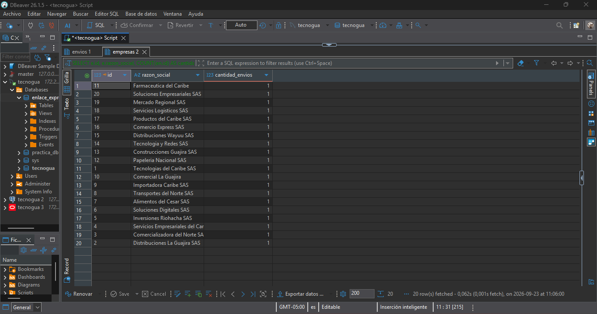

---

### Consulta 20 — JOIN entre envíos y paquetes

Esta consulta relaciona cada envío con sus paquetes para mostrar información de ambos registros.

```sql
SELECT
    en.referencia,
    en.estado AS estado_envio,
    p.codigo AS codigo_paquete,
    p.descripcion,
    p.peso,
    p.estado AS estado_paquete
FROM envios en
INNER JOIN paquetes p
    ON en.id = p.envio_id
ORDER BY en.id;
```

**Evidencia:**

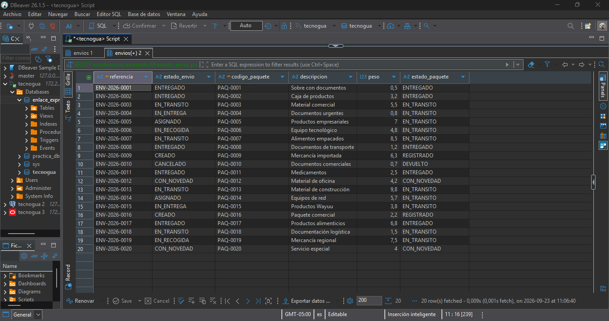

---

### Consulta 21 — JOIN entre envíos y facturas

Esta consulta relaciona las facturas con las empresas y los envíos para obtener información financiera asociada a cada envío.

```sql
SELECT
    en.referencia,
    e.razon_social AS empresa,
    f.numero_factura,
    f.subtotal,
    f.impuesto,
    f.total,
    f.estado AS estado_factura
FROM facturas f
INNER JOIN empresas e
    ON f.empresa_id = e.id
INNER JOIN envios en
    ON f.envio_id = en.id
ORDER BY f.id;
```

**Evidencia:**

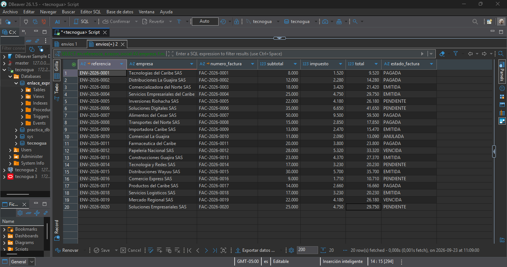

---

### Consulta 22 — Historial de tracking

Esta consulta relaciona los eventos de seguimiento con los envíos y mensajeros para mostrar el historial de cada evento.

```sql
SELECT
    en.referencia,
    et.estado,
    et.descripcion,
    m.nombre AS mensajero,
    et.latitud,
    et.longitud,
    et.fecha_evento
FROM eventos_tracking et
INNER JOIN envios en
    ON et.envio_id = en.id
INNER JOIN mensajeros m
    ON et.mensajero_id = m.id
ORDER BY et.fecha_evento;
```

**Evidencia:**

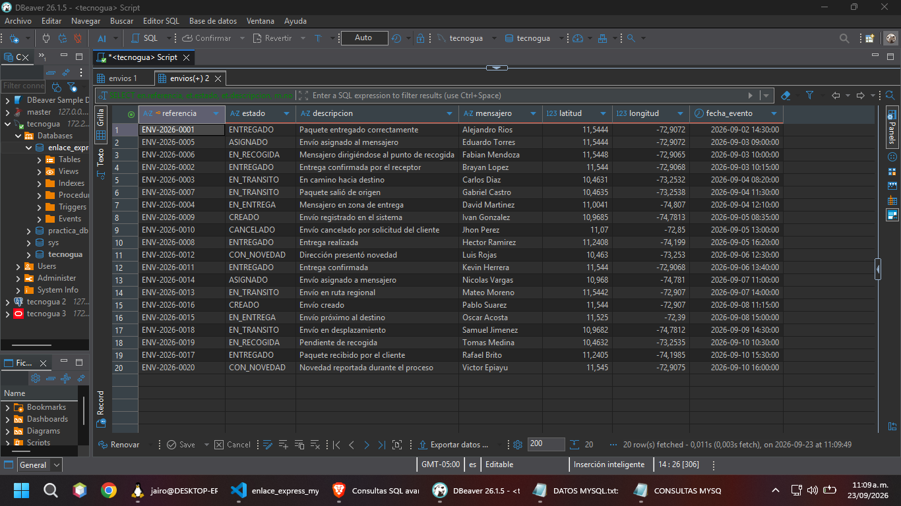

---

### Consulta 23 — Subconsulta con promedio

Esta consulta utiliza una subconsulta para obtener las facturas cuyo valor es superior al promedio general de las facturas.

```sql
SELECT
    numero_factura,
    total,
    estado
FROM facturas
WHERE total > (
    SELECT AVG(total)
    FROM facturas
)
ORDER BY total DESC;
```

**Evidencia:**

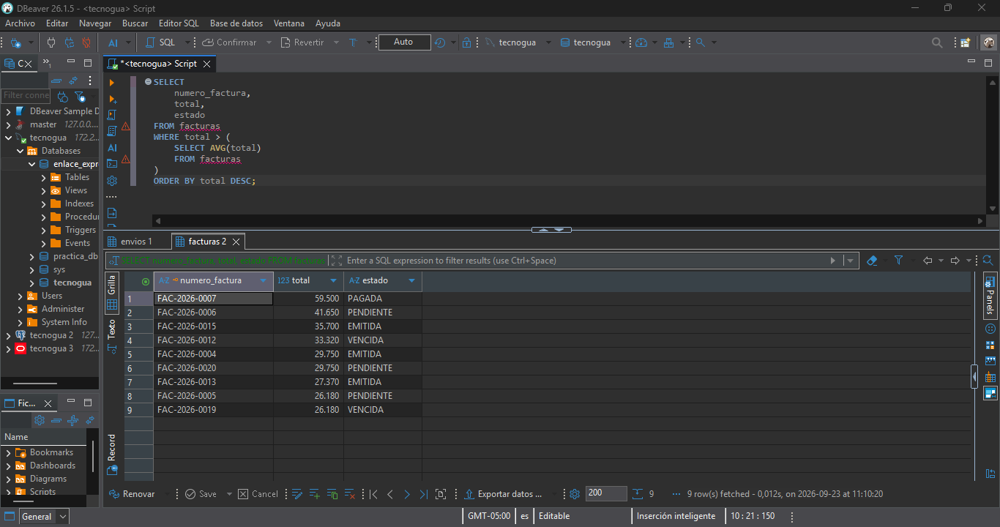

---

### Consulta 24 — EXISTS

Esta consulta utiliza `EXISTS` para obtener las empresas que tienen al menos un envío registrado.

```sql
SELECT
    id,
    razon_social
FROM empresas e
WHERE EXISTS (
    SELECT 1
    FROM envios en
    WHERE en.empresa_id = e.id
);
```

**Evidencia:**

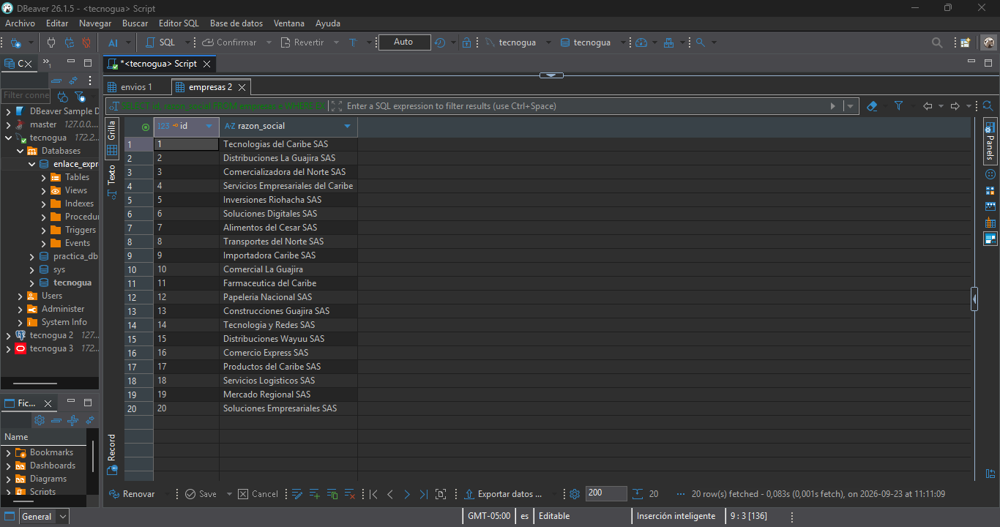

---

### Consulta 25 — CASE

Esta consulta utiliza `CASE` para clasificar los envíos según su estado y prioridad.

```sql
SELECT
    referencia,
    estado,
    prioridad,
    CASE
        WHEN estado = 'ENTREGADO' THEN 'Finalizado'
        WHEN estado = 'CANCELADO' THEN 'Cancelado'
        WHEN estado = 'CON_NOVEDAD' THEN 'Requiere atención'
        WHEN prioridad = 'URGENTE' THEN 'Prioridad inmediata'
        ELSE 'En proceso'
    END AS clasificacion
FROM envios
ORDER BY id;
```

**Evidencia:**

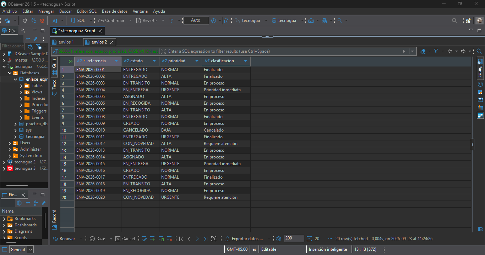

---

### Consulta 26 — COALESCE

Esta consulta utiliza `COALESCE` para reemplazar un posible valor `NULL` del identificador de envío por `0`.

```sql
SELECT
    f.numero_factura,
    e.razon_social AS empresa,
    COALESCE(f.envio_id, 0) AS envio_id,
    f.total,
    f.estado
FROM facturas f
INNER JOIN empresas e
    ON f.empresa_id = e.id;
```

**Evidencia:**

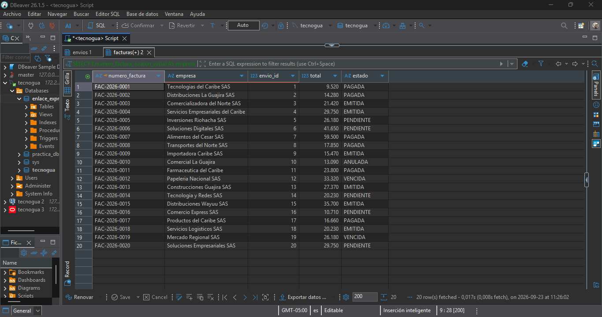

---

### Consulta 27 — CTE con WITH

Esta consulta utiliza una expresión común de tabla (`CTE`) para calcular la cantidad de envíos por empresa antes de relacionarla con la tabla de empresas.

```sql
WITH resumen_envios AS (
    SELECT
        empresa_id,
        COUNT(*) AS cantidad_envios
    FROM envios
    GROUP BY empresa_id
)
SELECT
    e.razon_social,
    r.cantidad_envios
FROM resumen_envios r
INNER JOIN empresas e
    ON r.empresa_id = e.id
ORDER BY r.cantidad_envios DESC;
```

**Evidencia:**

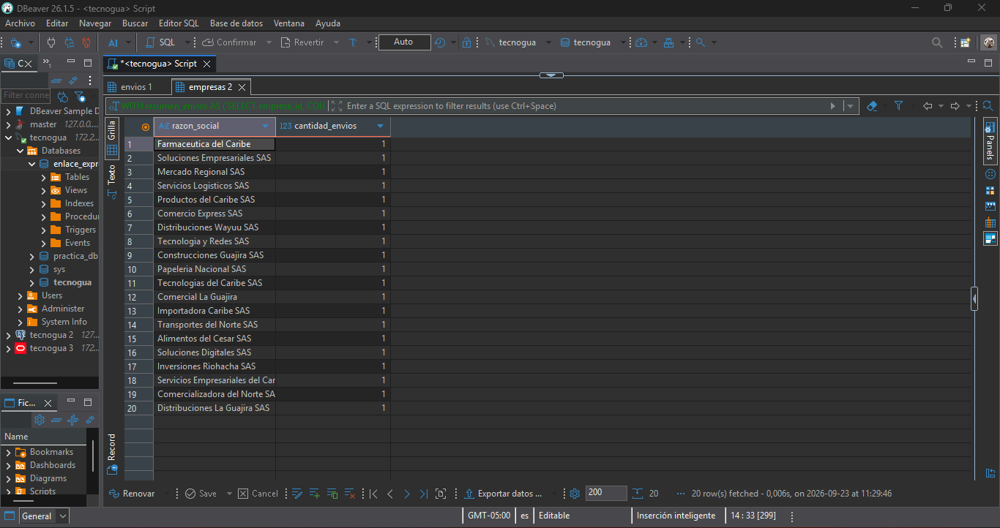

---

### Consulta 28 — RANK

Esta consulta utiliza la función de ventana `RANK()` para establecer una posición de las empresas según la cantidad de envíos.

```sql
SELECT
    e.razon_social,
    COUNT(en.id) AS cantidad_envios,
    RANK() OVER (
        ORDER BY COUNT(en.id) DESC
    ) AS posicion
FROM empresas e
LEFT JOIN envios en
    ON e.id = en.empresa_id
GROUP BY
    e.id,
    e.razon_social
ORDER BY posicion;
```

**Evidencia:**

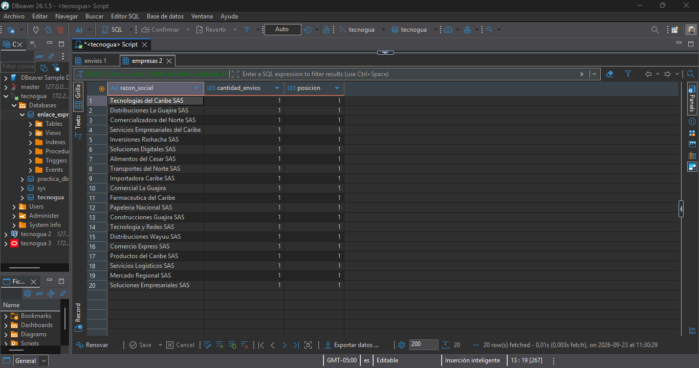

---

### Consulta 29 — ROW_NUMBER

Esta consulta utiliza `ROW_NUMBER()` y `PARTITION BY` para numerar los envíos de cada empresa de acuerdo con su fecha de solicitud.

```sql
SELECT
    e.razon_social,
    en.referencia,
    en.estado,
    ROW_NUMBER() OVER (
        PARTITION BY en.empresa_id
        ORDER BY en.fecha_solicitud
    ) AS numero_envio
FROM envios en
INNER JOIN empresas e
    ON en.empresa_id = e.id
ORDER BY e.id, numero_envio;
```

**Evidencia:**

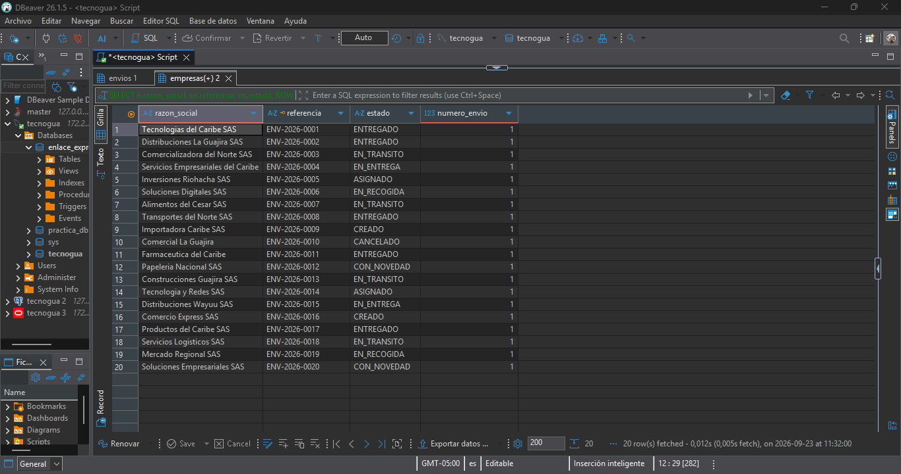

---

### Consulta 30 — Usuarios y roles

Esta consulta relaciona los usuarios con sus roles mediante las tablas intermedias correspondientes.

```sql
SELECT
    u.username,
    u.email,
    r.name AS rol,
    u.is_active
FROM users u
INNER JOIN role_users ru
    ON u.id = ru.user_id
INNER JOIN roles r
    ON ru.role_id = r.id
ORDER BY r.name, u.username;
```

**Evidencia:**

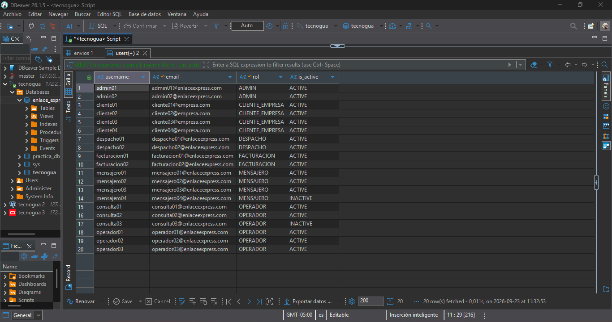

---

### Consulta 31 — Usuarios, roles y recursos

Esta consulta combina usuarios, roles y recursos para mostrar los permisos asociados a los usuarios activos.

```sql
SELECT
    u.username,
    r.name AS rol,
    res.method,
    res.path
FROM users u
INNER JOIN role_users ru
    ON u.id = ru.user_id
INNER JOIN roles r
    ON ru.role_id = r.id
INNER JOIN resource_roles rr
    ON r.id = rr.role_id
INNER JOIN resources res
    ON rr.resource_id = res.id
WHERE u.is_active = 'ACTIVE'
  AND r.is_active = 'ACTIVE'
  AND res.is_active = 'ACTIVE'
ORDER BY u.username, res.path;
```

**Evidencia:**

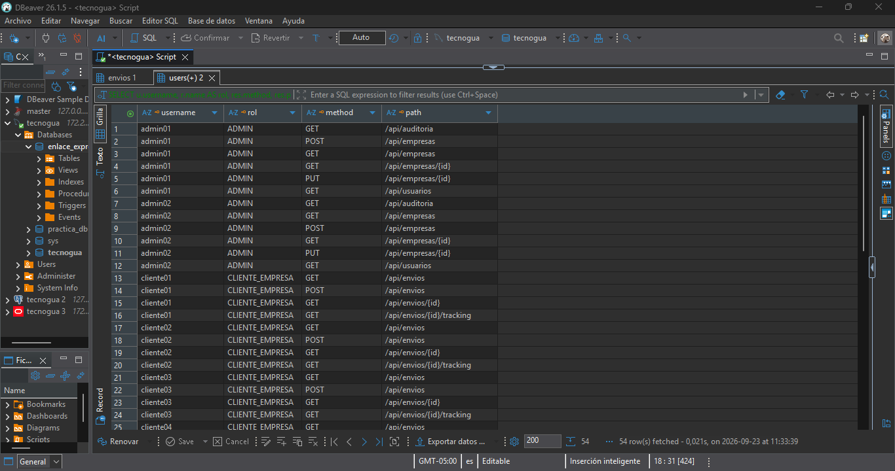

---

### Consulta 32 — UNION

Esta consulta utiliza `UNION` para combinar los nombres de empresas y mensajeros en un único resultado, identificando el tipo de registro.

```sql
SELECT
    razon_social AS nombre,
    'EMPRESA' AS tipo
FROM empresas

UNION

SELECT
    nombre,
    'MENSAJERO' AS tipo
FROM mensajeros

ORDER BY nombre;
```

**Evidencia:**


---

### Consulta 33 — Resumen financiero por empresa

Esta consulta genera un resumen de facturación por empresa, incluyendo cantidad de facturas, subtotales, impuestos, totales y promedio.

```sql
SELECT
    e.razon_social,
    COUNT(f.id) AS cantidad_facturas,
    SUM(f.subtotal) AS subtotal_total,
    SUM(f.impuesto) AS impuesto_total,
    SUM(f.total) AS total_facturado,
    AVG(f.total) AS promedio_factura
FROM empresas e
INNER JOIN facturas f
    ON e.id = f.empresa_id
GROUP BY
    e.id,
    e.razon_social
ORDER BY total_facturado DESC;
```

**Evidencia:**

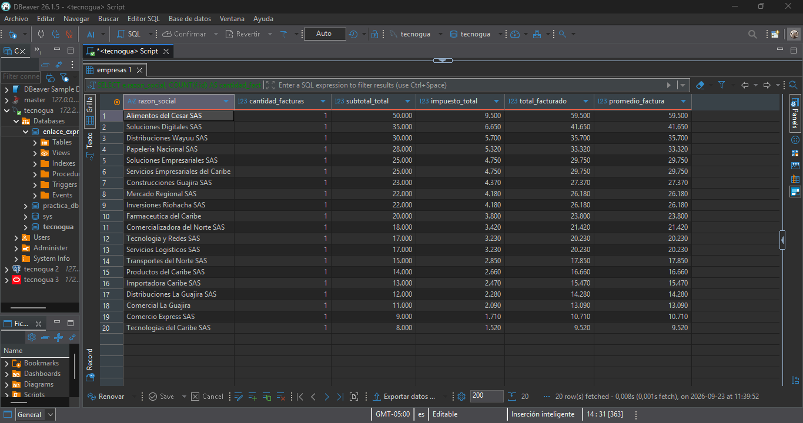

---

### Consulta 34 — Resumen de paquetes

Esta consulta agrupa los paquetes por estado y calcula la cantidad, el peso total, el peso promedio y el peso máximo.

```sql
SELECT
    estado,
    COUNT(*) AS cantidad_paquetes,
    SUM(peso) AS peso_total,
    AVG(peso) AS peso_promedio,
    MAX(peso) AS peso_maximo
FROM paquetes
GROUP BY estado
ORDER BY peso_total DESC;
```

**Evidencia:**

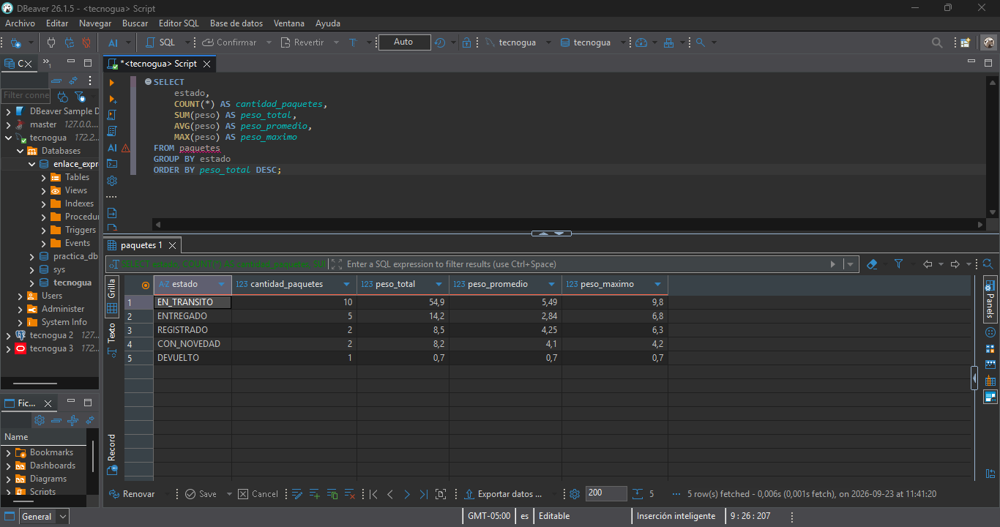

---

### Consulta 35 — Información completa de envíos

Esta consulta combina varias tablas para obtener información general del envío, empresa, mensajero, ruta, tarifa y factura asociada.

```sql
SELECT
    en.referencia,
    e.razon_social AS empresa,
    m.nombre AS mensajero,
    r.nombre AS ruta,
    t.nombre AS tarifa,
    en.estado AS estado_envio,
    en.prioridad,
    f.numero_factura,
    f.total AS valor_factura,
    f.estado AS estado_factura
FROM envios en
INNER JOIN empresas e
    ON en.empresa_id = e.id
INNER JOIN mensajeros m
    ON en.mensajero_id = m.id
INNER JOIN rutas r
    ON en.ruta_id = r.id
INNER JOIN tarifas t
    ON en.tarifa_id = t.id
LEFT JOIN facturas f
    ON en.id = f.envio_id
ORDER BY en.id;
```

**Evidencia:**

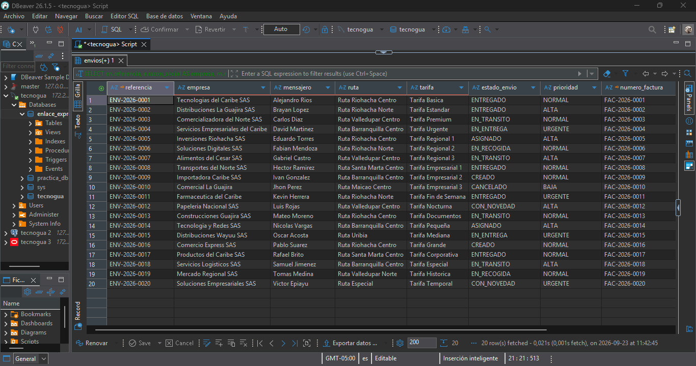

---

### Consulta 36 — Último evento de tracking

Esta consulta utiliza una subconsulta correlacionada para obtener el último evento registrado para cada envío.

```sql
SELECT
    en.referencia,
    en.estado AS estado_actual,
    et.estado AS ultimo_evento,
    et.descripcion,
    et.fecha_evento
FROM envios en
INNER JOIN eventos_tracking et
    ON en.id = et.envio_id
WHERE et.fecha_evento = (
    SELECT MAX(et2.fecha_evento)
    FROM eventos_tracking et2
    WHERE et2.envio_id = et.envio_id
)
ORDER BY en.id;
```

**Evidencia:**

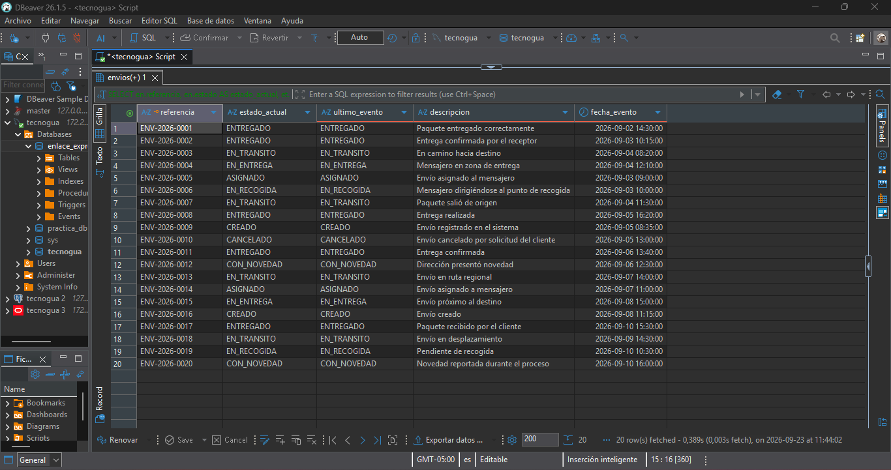

---

### Consulta 37 — Estados con varios envíos

Esta consulta agrupa los envíos por estado y utiliza `HAVING` para mostrar únicamente aquellos estados que tienen dos o más envíos.

```sql
SELECT
    estado,
    COUNT(*) AS cantidad
FROM envios
GROUP BY estado
HAVING COUNT(*) >= 2
ORDER BY cantidad DESC;
```

**Evidencia:**

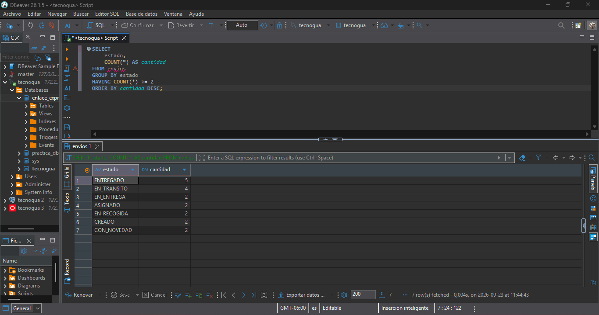

---

### Consulta 38 — Entregas por mensajero

Esta consulta combina `LEFT JOIN`, `COUNT`, `SUM`, `CASE`, `GROUP BY` y `ORDER BY` para mostrar el total de envíos y la cantidad de entregas realizadas por cada mensajero.

```sql
SELECT
    m.nombre AS mensajero,
    COUNT(en.id) AS total_envios,
    SUM(
        CASE
            WHEN en.estado = 'ENTREGADO' THEN 1
            ELSE 0
        END
    ) AS entregados
FROM mensajeros m
LEFT JOIN envios en
    ON m.id = en.mensajero_id
GROUP BY
    m.id,
    m.nombre
ORDER BY entregados DESC;
```

**Evidencia:**

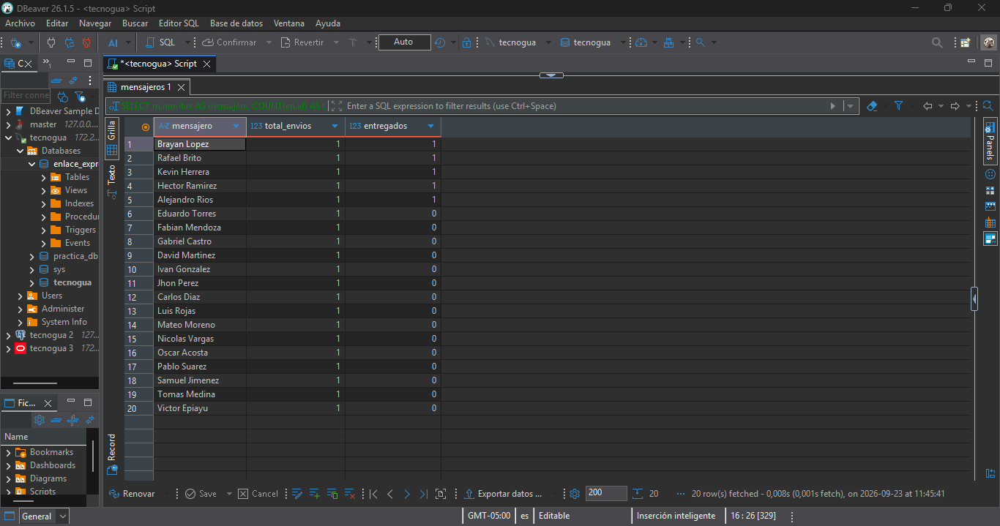

---

### Consulta adicional — Estado de paquetes y envíos

Esta consulta relaciona los envíos con sus paquetes y utiliza `CASE` para determinar el resultado general del proceso.

```sql
SELECT
    en.referencia,
    en.estado AS estado_envio,
    p.codigo AS paquete,
    p.estado AS estado_paquete,
    p.peso,
    CASE
        WHEN en.estado = 'ENTREGADO'
             AND p.estado = 'ENTREGADO'
            THEN 'Proceso completado'

        WHEN en.estado = 'CON_NOVEDAD'
             OR p.estado = 'CON_NOVEDAD'
            THEN 'Revisar novedad'

        ELSE 'Proceso en curso'
    END AS resultado
FROM envios en
INNER JOIN paquetes p
    ON en.id = p.envio_id
ORDER BY en.id;
```

**Evidencia:**

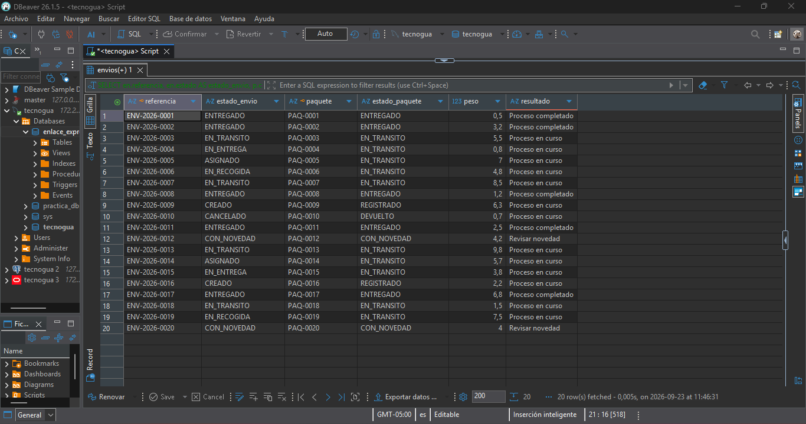

---

## 2. PostgreSQL

Las siguientes consultas fueron ejecutadas sobre la base de datos **Enlace Express** utilizando **PostgreSQL 17**. Cada consulta presenta una breve descripción, el código SQL utilizado y la evidencia correspondiente de su ejecución.

### Consulta 1 — SELECT de todos los envíos

Esta consulta permite visualizar todos los envíos registrados en la base de datos, ordenados por su identificador.

```sql
SELECT *
FROM envios
ORDER BY id;
```

**Evidencia:**

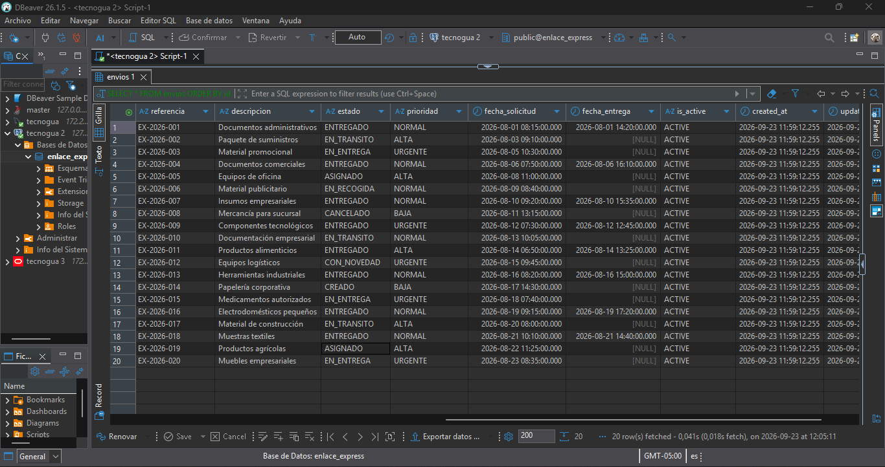

---

### Consulta 2 — WHERE de envíos entregados

Esta consulta permite obtener únicamente los envíos cuyo estado es `ENTREGADO`.

```sql
SELECT
    id,
    referencia,
    empresa_id,
    estado,
    prioridad,
    fecha_solicitud,
    fecha_entrega
FROM envios
WHERE estado = 'ENTREGADO'
ORDER BY fecha_entrega;
```

**Evidencia:**

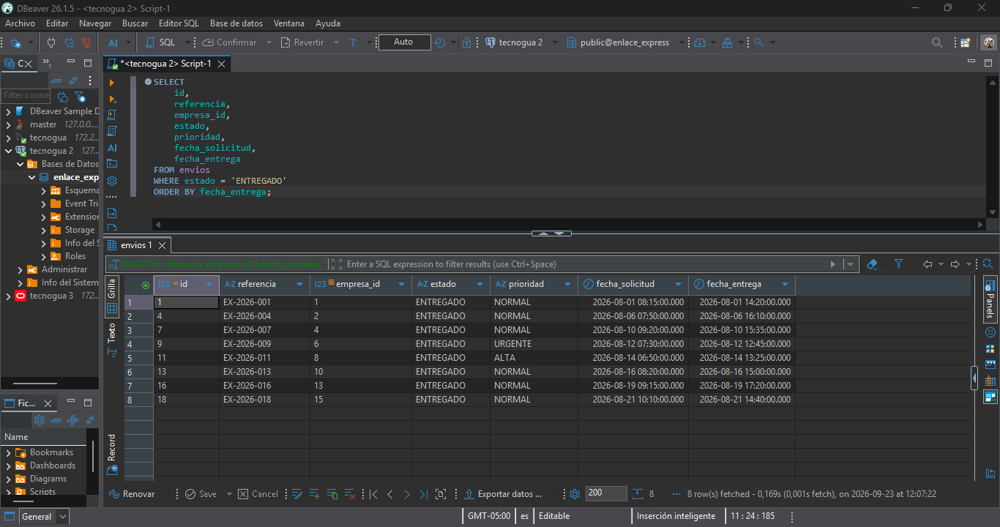

---

### Consulta 3 — AND e IN

Esta consulta combina `AND` e `IN` para obtener los envíos activos que tienen prioridad alta o urgente.

```sql
SELECT
    id,
    referencia,
    estado,
    prioridad,
    fecha_solicitud
FROM envios
WHERE is_active = 'ACTIVE'
  AND prioridad IN ('ALTA', 'URGENTE')
ORDER BY prioridad, fecha_solicitud;
```

**Evidencia:**

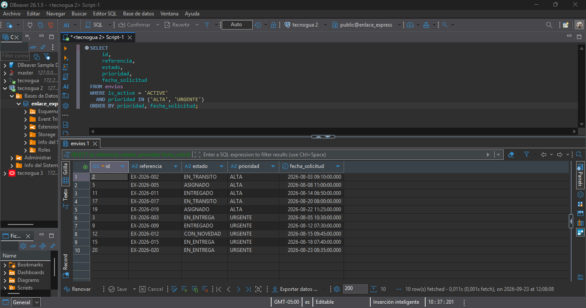

---

### Consulta 4 — IN con varios estados

Esta consulta permite buscar los envíos que se encuentran en cualquiera de los estados indicados.

```sql
SELECT
    id,
    referencia,
    estado,
    prioridad
FROM envios
WHERE estado IN ('EN_TRANSITO', 'EN_ENTREGA', 'ASIGNADO')
ORDER BY id;
```

**Evidencia:**

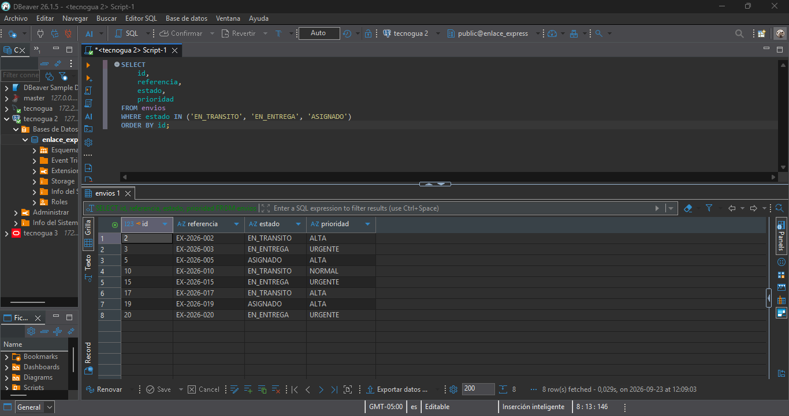

---

### Consulta 5 — BETWEEN

Esta consulta obtiene los envíos cuya fecha de solicitud se encuentra dentro de un rango específico.

```sql
SELECT
    id,
    referencia,
    fecha_solicitud,
    estado
FROM envios
WHERE fecha_solicitud BETWEEN
      '2026-08-01 00:00:00'
      AND '2026-08-15 23:59:59'
ORDER BY fecha_solicitud;
```

**Evidencia:**

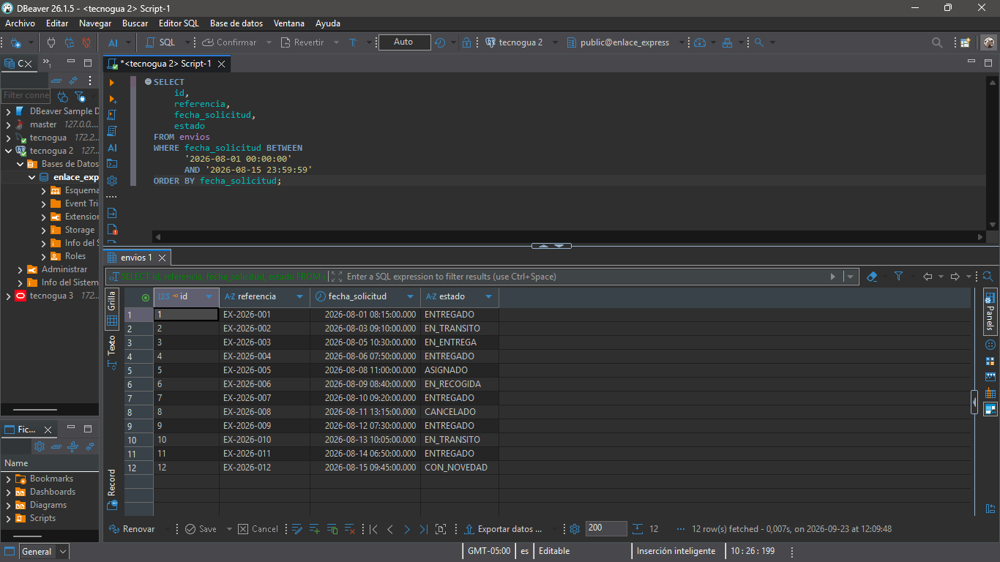

---

### Consulta 6 — LIKE para empresas

Esta consulta busca empresas cuya razón social contiene la palabra `Caribe`. En PostgreSQL se utiliza `ILIKE` para realizar una búsqueda que no diferencia entre mayúsculas y minúsculas.

```sql
SELECT
    id,
    nit,
    razon_social,
    contacto_principal
FROM empresas
WHERE razon_social ILIKE '%Caribe%'
ORDER BY razon_social;
```

**Evidencia:**

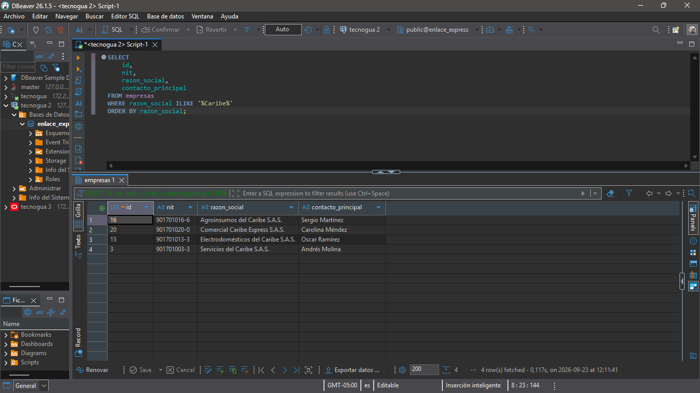

---

### Consulta 7 — LIKE al inicio del texto

Esta consulta busca empresas cuya razón social comienza con la palabra `Comercial`.

```sql
SELECT
    id,
    nit,
    razon_social,
    contacto_principal
FROM empresas
WHERE razon_social ILIKE 'Comercial%'
ORDER BY razon_social;
```

**Evidencia:**


---

### Consulta 8 — ORDER BY ascendente

Esta consulta muestra las empresas ordenadas alfabéticamente por su razón social.

```sql
SELECT
    id,
    razon_social,
    contacto_principal,
    is_active
FROM empresas
ORDER BY razon_social ASC;
```

**Evidencia:**

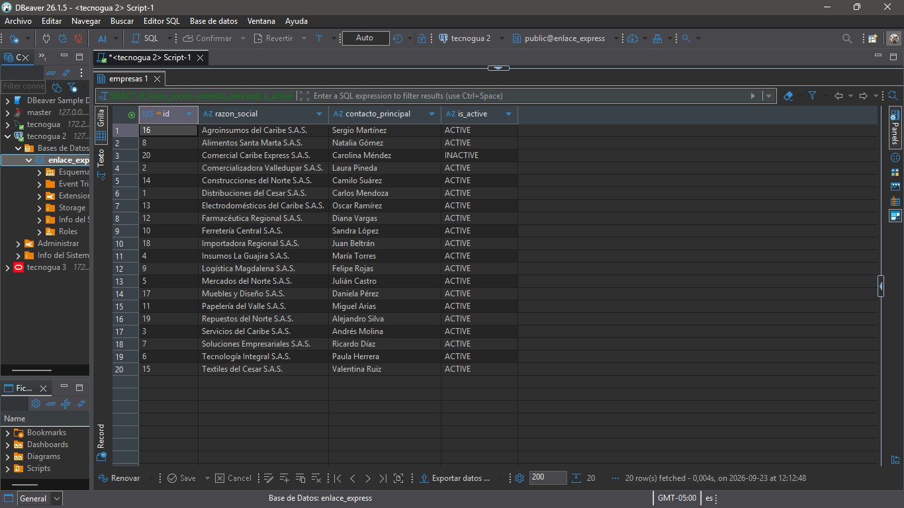

---

### Consulta 9 — ORDER BY descendente

Esta consulta muestra las tarifas ordenadas de mayor a menor según su valor base.

```sql
SELECT
    id,
    nombre,
    valor_base,
    is_active
FROM tarifas
ORDER BY valor_base DESC;
```

**Evidencia:**

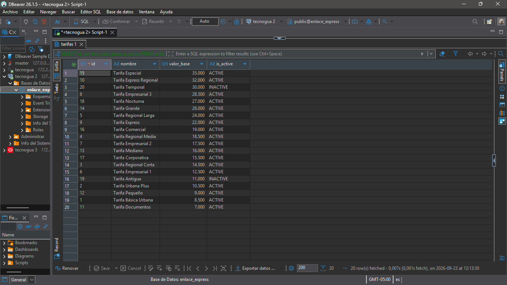

---

### Consulta 10 — COUNT

Esta consulta utiliza `COUNT` para determinar la cantidad total de envíos registrados.

```sql
SELECT COUNT(*) AS total_envios
FROM envios;
```

**Evidencia:**


---

### Consulta 11 — SUM

Esta consulta utiliza `SUM` para calcular el valor total de las facturas registradas.

```sql
SELECT
    SUM(total) AS total_facturado
FROM facturas;
```

**Evidencia:**


---

### Consulta 12 — AVG

Esta consulta calcula el valor promedio de las facturas. `ROUND` permite mostrar el resultado con dos decimales.

```sql
SELECT
    ROUND(AVG(total), 2) AS promedio_factura
FROM facturas;
```

**Evidencia:**


---

### Consulta 13 — MIN y MAX

Esta consulta identifica el menor y el mayor valor registrado entre las facturas.

```sql
SELECT
    MIN(total) AS factura_minima,
    MAX(total) AS factura_maxima
FROM facturas;
```

**Evidencia:**


---

### Consulta 14 — GROUP BY por estado

Esta consulta agrupa los envíos según su estado y muestra la cantidad existente en cada grupo.

```sql
SELECT
    estado,
    COUNT(*) AS cantidad
FROM envios
GROUP BY estado
ORDER BY cantidad DESC;
```

**Evidencia:**

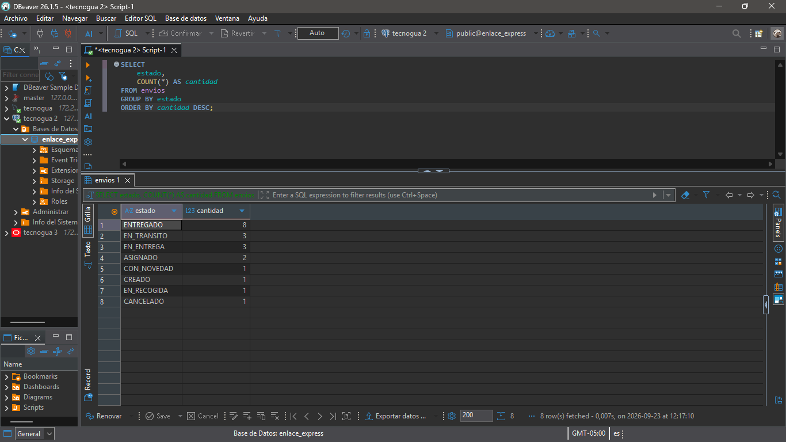

---

### Consulta 15 — GROUP BY de facturas

Esta consulta agrupa las facturas por estado y calcula la cantidad y el valor total de cada grupo.

```sql
SELECT
    estado,
    COUNT(*) AS cantidad_facturas,
    SUM(total) AS total_facturado
FROM facturas
GROUP BY estado
ORDER BY total_facturado DESC;
```

**Evidencia:**

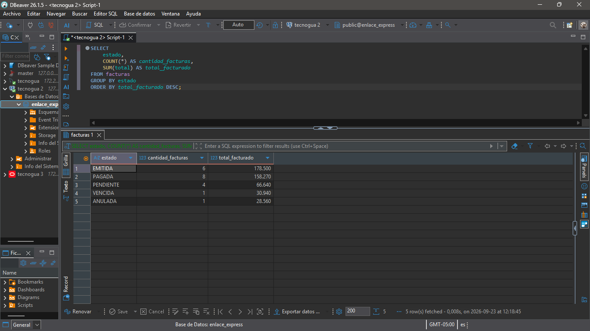

---

### Consulta 16 — HAVING

Esta consulta obtiene las empresas que tienen más de un envío registrado. `HAVING` permite filtrar los grupos después de realizar la agrupación.

```sql
SELECT
    e.id,
    e.razon_social,
    COUNT(en.id) AS cantidad_envios
FROM empresas e
INNER JOIN envios en
    ON e.id = en.empresa_id
GROUP BY e.id, e.razon_social
HAVING COUNT(en.id) > 1
ORDER BY cantidad_envios DESC;
```

**Evidencia:**


---

### Consulta 17 — INNER JOIN entre empresa y envío

Esta consulta relaciona las empresas con sus respectivos envíos mediante un `INNER JOIN`.

```sql
SELECT
    en.id AS envio_id,
    en.referencia,
    e.razon_social AS empresa,
    en.estado,
    en.prioridad
FROM envios en
INNER JOIN empresas e
    ON en.empresa_id = e.id
ORDER BY en.id;
```

**Evidencia:**

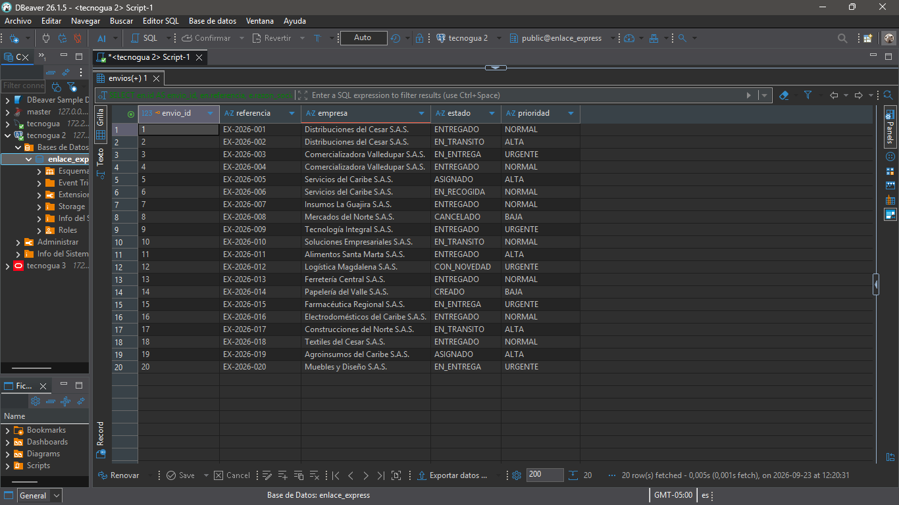

---

### Consulta 18 — Múltiples JOIN

Esta consulta relaciona los envíos con las empresas y los mensajeros mediante varios `INNER JOIN`.

```sql
SELECT
    en.id AS envio_id,
    en.referencia,
    e.razon_social AS empresa,
    m.nombre AS mensajero,
    en.estado,
    en.prioridad
FROM envios en
INNER JOIN empresas e
    ON en.empresa_id = e.id
INNER JOIN mensajeros m
    ON en.mensajero_id = m.id
ORDER BY en.id;
```

**Evidencia:**

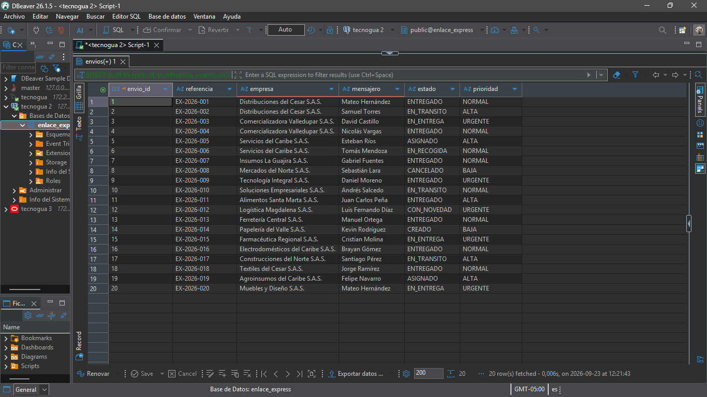

---

### Consulta 19 — LEFT JOIN

Esta consulta utiliza `LEFT JOIN` para mostrar todas las empresas junto con la cantidad de envíos asociados. También permite visualizar empresas que no tengan envíos.

```sql
SELECT
    e.id,
    e.razon_social,
    COUNT(en.id) AS cantidad_envios
FROM empresas e
LEFT JOIN envios en
    ON e.id = en.empresa_id
GROUP BY e.id, e.razon_social
ORDER BY cantidad_envios DESC, e.razon_social;
```

**Evidencia:**

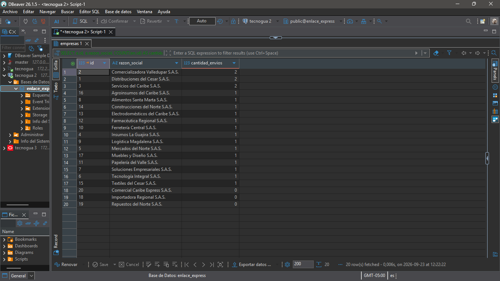

---

### Consulta 20 — JOIN entre envíos y paquetes

Esta consulta relaciona los envíos con sus paquetes para mostrar información de ambos registros.

```sql
SELECT
    en.id AS envio_id,
    en.referencia,
    p.codigo AS codigo_paquete,
    p.descripcion,
    p.peso,
    p.estado AS estado_paquete
FROM envios en
INNER JOIN paquetes p
    ON en.id = p.envio_id
ORDER BY en.id;
```

**Evidencia:**

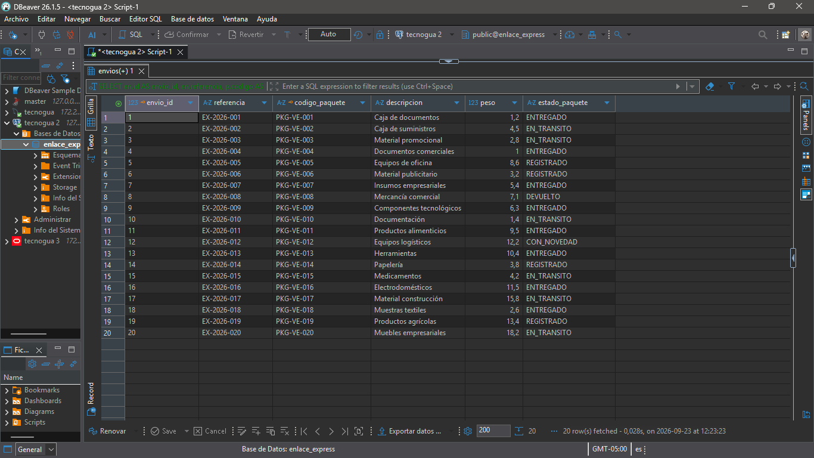

---

### Consulta 21 — JOIN entre envíos y facturas

Esta consulta relaciona los envíos con sus respectivas facturas para mostrar información financiera de cada registro.

```sql
SELECT
    en.id AS envio_id,
    en.referencia,
    f.numero_factura,
    f.subtotal,
    f.impuesto,
    f.total,
    f.estado AS estado_factura
FROM envios en
INNER JOIN facturas f
    ON en.id = f.envio_id
ORDER BY en.id;
```

**Evidencia:**

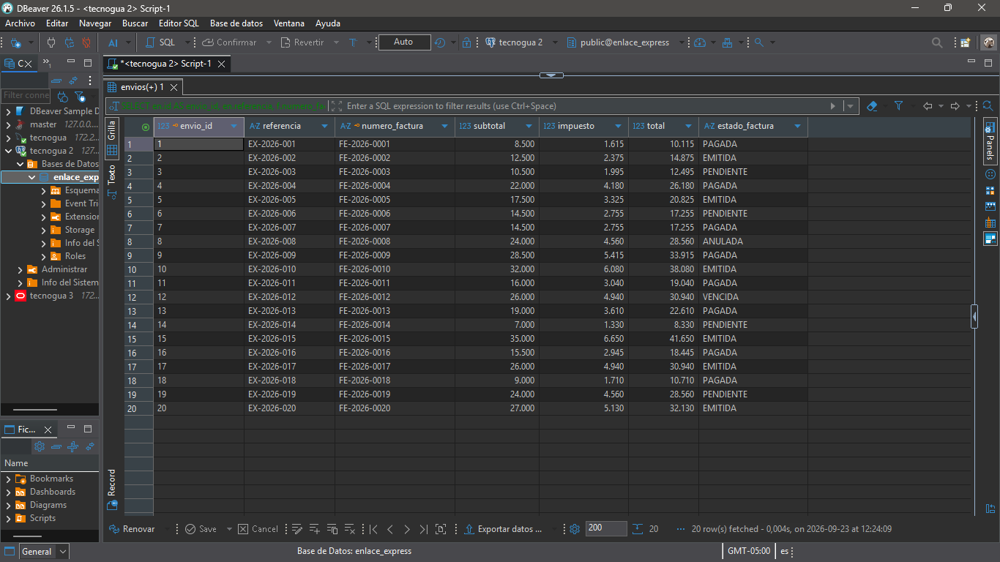

---

### Consulta 22 — JOIN de tracking y mensajeros

Esta consulta relaciona los eventos de tracking con los envíos y mensajeros para consultar el historial de seguimiento.

```sql
SELECT
    et.id AS evento_id,
    en.referencia,
    m.nombre AS mensajero,
    et.estado,
    et.descripcion,
    et.fecha_evento
FROM eventos_tracking et
INNER JOIN envios en
    ON et.envio_id = en.id
LEFT JOIN mensajeros m
    ON et.mensajero_id = m.id
ORDER BY et.fecha_evento;
```

**Evidencia:**

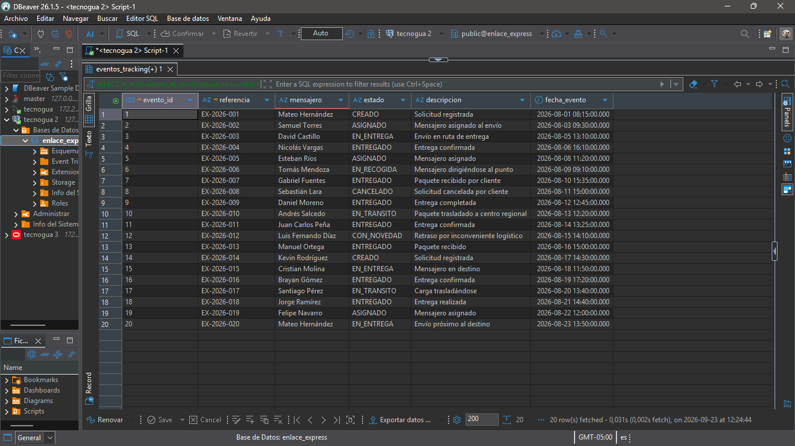

---

### Consulta 23 — Subconsulta con promedio

Esta consulta utiliza una subconsulta para obtener las facturas cuyo valor es superior al promedio general.

```sql
SELECT
    f.id,
    f.numero_factura,
    f.total,
    f.estado
FROM facturas f
WHERE f.total > (
    SELECT AVG(total)
    FROM facturas
)
ORDER BY f.total DESC;
```

**Evidencia:**

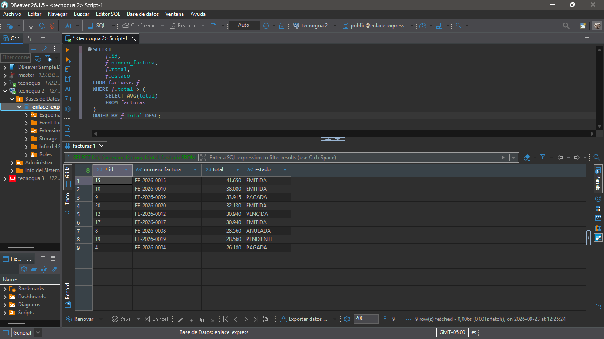

---

### Consulta 24 — EXISTS

Esta consulta utiliza `EXISTS` para identificar las empresas que tienen al menos un envío registrado.

```sql
SELECT
    e.id,
    e.razon_social,
    e.contacto_principal
FROM empresas e
WHERE EXISTS (
    SELECT 1
    FROM envios en
    WHERE en.empresa_id = e.id
)
ORDER BY e.razon_social;
```

**Evidencia:**


---

### Consulta 25 — CASE

Esta consulta utiliza `CASE` para clasificar los envíos según su estado y prioridad.

```sql
SELECT
    id,
    referencia,
    estado,
    prioridad,
    CASE
        WHEN estado = 'ENTREGADO' THEN 'Completado'
        WHEN estado IN ('EN_TRANSITO', 'EN_ENTREGA') THEN 'En proceso'
        WHEN estado = 'CANCELADO' THEN 'Cancelado'
        WHEN estado = 'CON_NOVEDAD' THEN 'Requiere atención'
        ELSE 'Pendiente'
    END AS clasificacion
FROM envios
ORDER BY id;
```

**Evidencia:**

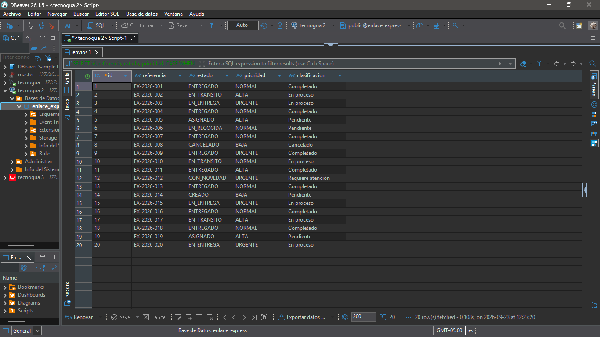

---

### Consulta 26 — COALESCE

Esta consulta utiliza `COALESCE` para proporcionar valores alternativos cuando una factura no existe para un envío.

```sql
SELECT
    en.id AS envio_id,
    en.referencia,
    COALESCE(f.numero_factura, 'SIN FACTURA') AS factura,
    COALESCE(f.total, 0.00) AS total_factura,
    COALESCE(f.estado::text, 'SIN ESTADO') AS estado_factura
FROM envios en
LEFT JOIN facturas f
    ON en.id = f.envio_id
ORDER BY en.id;
```

**Evidencia:**

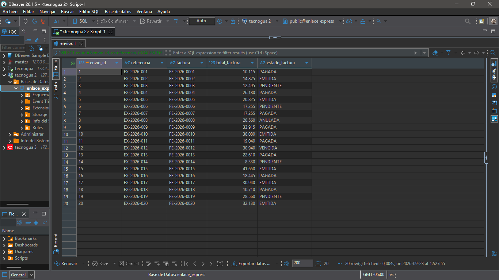

---

### Consulta 27 — CTE con WITH

Esta consulta utiliza un `CTE` para obtener un resumen de los envíos por empresa antes de realizar la consulta principal.

```sql
WITH resumen_envios AS (
    SELECT
        empresa_id,
        COUNT(*) AS cantidad_envios,
        COUNT(*) FILTER (WHERE estado = 'ENTREGADO') AS entregados
    FROM envios
    GROUP BY empresa_id
)
SELECT
    e.razon_social,
    r.cantidad_envios,
    r.entregados
FROM resumen_envios r
INNER JOIN empresas e
    ON r.empresa_id = e.id
ORDER BY r.cantidad_envios DESC, e.razon_social;
```

**Evidencia:**

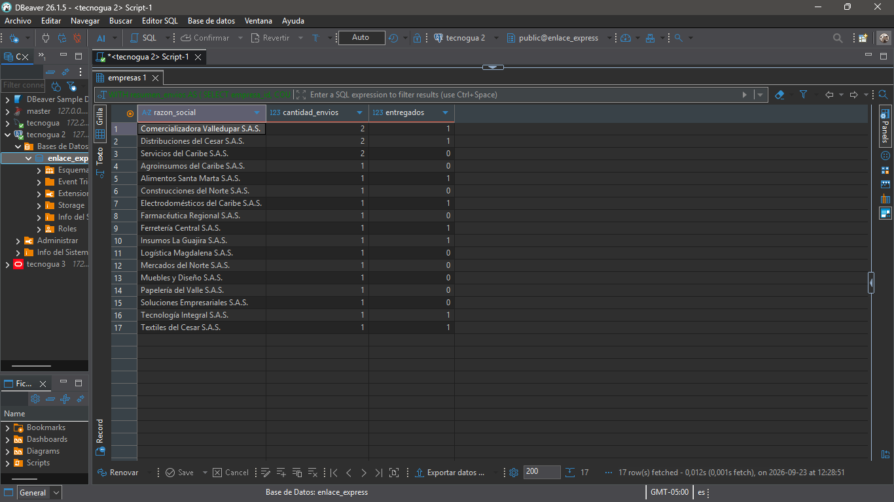

---

### Consulta 28 — RANK

Esta consulta utiliza la función de ventana `RANK()` para ordenar las empresas según la cantidad de envíos asociados.

```sql
SELECT
    e.razon_social,
    COUNT(en.id) AS cantidad_envios,
    RANK() OVER (
        ORDER BY COUNT(en.id) DESC
    ) AS ranking
FROM empresas e
LEFT JOIN envios en
    ON e.id = en.empresa_id
GROUP BY e.id, e.razon_social
ORDER BY ranking, e.razon_social;
```

**Evidencia:**

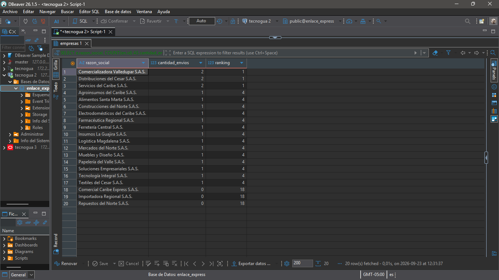

---

### Consulta 29 — ROW_NUMBER

Esta consulta utiliza `ROW_NUMBER()` junto con `PARTITION BY` para numerar los envíos de cada empresa según su fecha de solicitud.

```sql
SELECT
    e.razon_social,
    en.referencia,
    en.estado,
    en.fecha_solicitud,
    ROW_NUMBER() OVER (
        PARTITION BY e.id
        ORDER BY en.fecha_solicitud
    ) AS numero_envio_empresa
FROM envios en
INNER JOIN empresas e
    ON en.empresa_id = e.id
ORDER BY e.razon_social, numero_envio_empresa;
```

**Evidencia:**

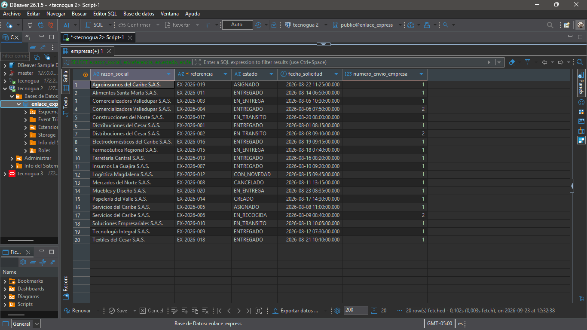

---

### Consulta 30 — Usuarios y roles

Esta consulta relaciona los usuarios con los roles asignados mediante las tablas correspondientes.

```sql
SELECT
    u.id AS usuario_id,
    u.username,
    u.email,
    r.name AS rol,
    u.is_active
FROM users u
INNER JOIN role_users ru
    ON u.id = ru.user_id
INNER JOIN roles r
    ON ru.role_id = r.id
ORDER BY r.name, u.username;
```

**Evidencia:**

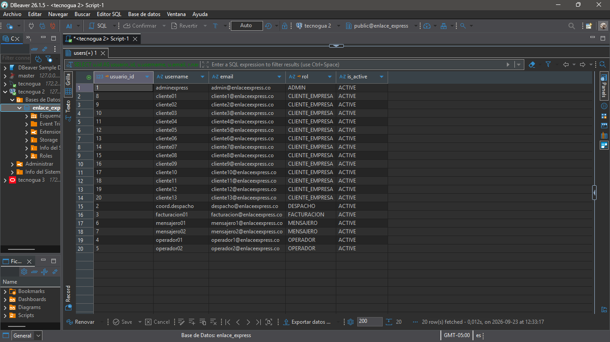

---

### Consulta 31 — Usuarios, roles y recursos

Esta consulta relaciona usuarios, roles y recursos para mostrar los recursos a los que tienen acceso los usuarios activos.

```sql
SELECT
    u.username,
    r.name AS rol,
    res.path,
    res.method
FROM users u
INNER JOIN role_users ru
    ON u.id = ru.user_id
INNER JOIN roles r
    ON ru.role_id = r.id
INNER JOIN resource_roles rr
    ON r.id = rr.role_id
INNER JOIN resources res
    ON rr.resource_id = res.id
WHERE u.is_active = 'ACTIVE'
  AND r.is_active = 'ACTIVE'
  AND res.is_active = 'ACTIVE'
ORDER BY u.username, res.path, res.method;
```

**Evidencia:**

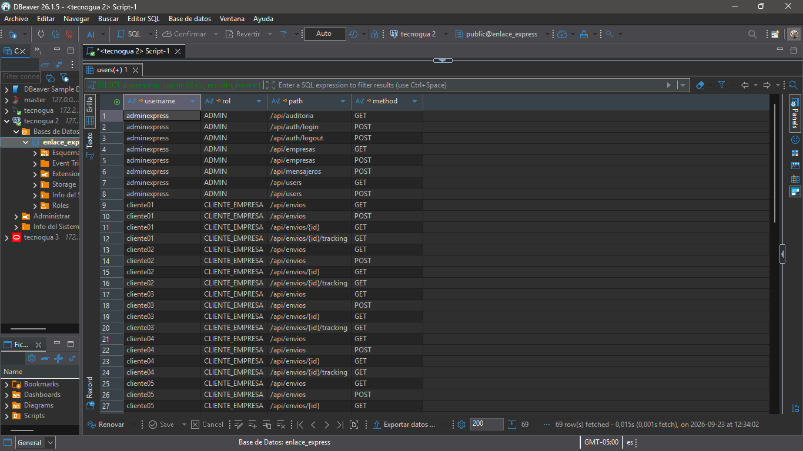

---

### Consulta 32 — UNION

Esta consulta utiliza `UNION` para combinar en un solo resultado los nombres de las empresas y los mensajeros, identificando el tipo de registro.

```sql
SELECT
    razon_social AS nombre,
    'EMPRESA' AS tipo
FROM empresas

UNION

SELECT
    nombre,
    'MENSAJERO' AS tipo
FROM mensajeros

ORDER BY tipo, nombre;
```

**Evidencia:**

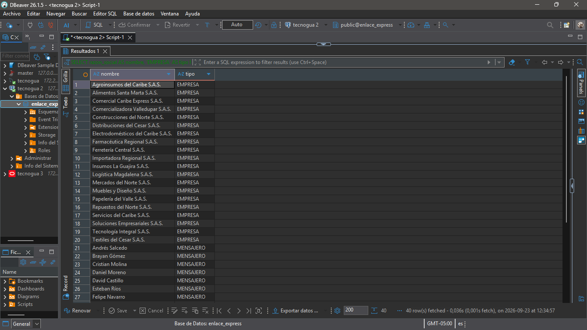

---

### Consulta 33 — Resumen de facturación por empresa

Esta consulta genera un resumen financiero por empresa, incluyendo cantidad de facturas, subtotal, impuestos, total facturado y promedio.

```sql
SELECT
    e.razon_social,
    COUNT(f.id) AS cantidad_facturas,
    COALESCE(SUM(f.subtotal), 0) AS subtotal,
    COALESCE(SUM(f.impuesto), 0) AS impuestos,
    COALESCE(SUM(f.total), 0) AS total_facturado,
    ROUND(COALESCE(AVG(f.total), 0), 2) AS promedio_factura
FROM empresas e
LEFT JOIN facturas f
    ON e.id = f.empresa_id
GROUP BY e.id, e.razon_social
ORDER BY total_facturado DESC;
```

**Evidencia:**

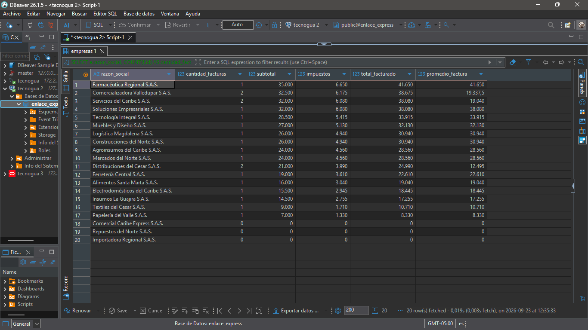

---

### Consulta 34 — Resumen de paquetes por estado

Esta consulta agrupa los paquetes por estado y calcula diferentes valores relacionados con su peso.

```sql
SELECT
    p.estado,
    COUNT(*) AS cantidad_paquetes,
    ROUND(AVG(p.peso), 2) AS peso_promedio,
    MIN(p.peso) AS peso_minimo,
    MAX(p.peso) AS peso_maximo,
    SUM(p.peso) AS peso_total
FROM paquetes p
GROUP BY p.estado
ORDER BY cantidad_paquetes DESC;
```

**Evidencia:**

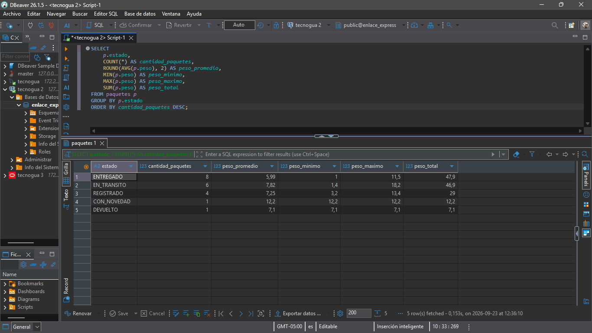

---

### Consulta 35 — Consulta completa de envíos

Esta consulta integra información de varias tablas relacionadas con cada envío, incluyendo empresa, mensajero, ruta, tarifa, factura y paquete.

```sql
SELECT
    en.id AS envio_id,
    en.referencia,
    e.razon_social AS empresa,
    m.nombre AS mensajero,
    r.nombre AS ruta,
    t.nombre AS tarifa,
    t.valor_base,
    en.estado AS estado_envio,
    en.prioridad,
    f.numero_factura,
    f.total AS total_factura,
    p.codigo AS codigo_paquete,
    p.peso
FROM envios en
INNER JOIN empresas e
    ON en.empresa_id = e.id
LEFT JOIN mensajeros m
    ON en.mensajero_id = m.id
LEFT JOIN rutas r
    ON en.ruta_id = r.id
LEFT JOIN tarifas t
    ON en.tarifa_id = t.id
LEFT JOIN facturas f
    ON en.id = f.envio_id
LEFT JOIN paquetes p
    ON en.id = p.envio_id
ORDER BY en.id;
```

**Evidencia:**

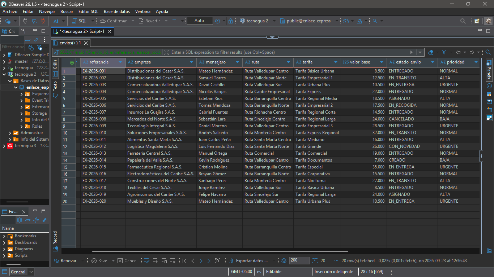

---

### Consulta 36 — Último evento de tracking

Esta consulta utiliza una subconsulta correlacionada para obtener el último evento registrado para cada envío.

```sql
SELECT
    en.id AS envio_id,
    en.referencia,
    et.estado,
    et.descripcion,
    et.fecha_evento
FROM envios en
INNER JOIN eventos_tracking et
    ON et.envio_id = en.id
WHERE et.fecha_evento = (
    SELECT MAX(et2.fecha_evento)
    FROM eventos_tracking et2
    WHERE et2.envio_id = en.id
)
ORDER BY en.id;
```

**Evidencia:**

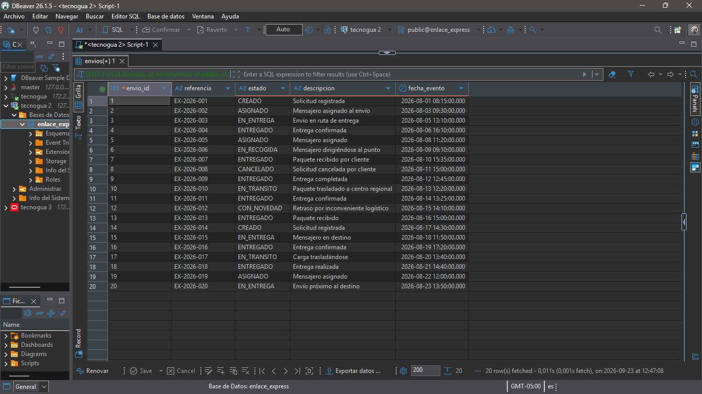

---

### Consulta 37 — HAVING con estados

Esta consulta agrupa los envíos por estado y utiliza `HAVING` para mostrar únicamente los estados que tienen al menos dos envíos.

```sql
SELECT
    estado,
    COUNT(*) AS cantidad_envios
FROM envios
GROUP BY estado
HAVING COUNT(*) >= 2
ORDER BY cantidad_envios DESC;
```

**Evidencia:**

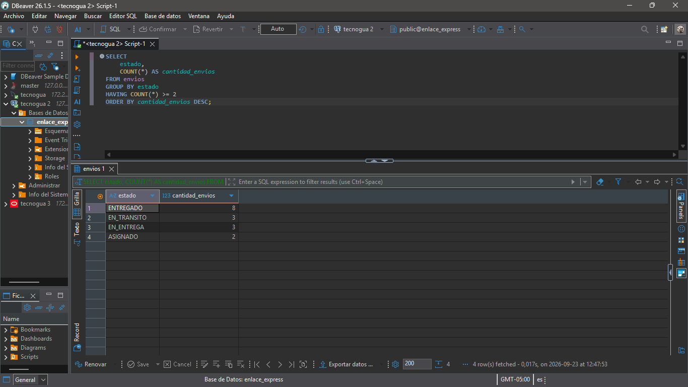

---

### Consulta 38 — Entregas por mensajero

Esta consulta combina `LEFT JOIN`, `COUNT`, `SUM`, `CASE` y `GROUP BY` para mostrar el total de envíos, los entregados, los que están en proceso y el porcentaje de entregas por mensajero.

```sql
SELECT
    m.id,
    m.nombre AS mensajero,
    COUNT(en.id) AS total_envios,
    SUM(
        CASE
            WHEN en.estado = 'ENTREGADO' THEN 1
            ELSE 0
        END
    ) AS entregados,
    SUM(
        CASE
            WHEN en.estado IN ('EN_TRANSITO', 'EN_ENTREGA') THEN 1
            ELSE 0
        END
    ) AS en_proceso,
    CASE
        WHEN COUNT(en.id) = 0 THEN 0
        ELSE ROUND(
            100.0 * SUM(
                CASE
                    WHEN en.estado = 'ENTREGADO' THEN 1
                    ELSE 0
                END
            ) / COUNT(en.id),
            2
        )
    END AS porcentaje_entregados
FROM mensajeros m
LEFT JOIN envios en
    ON m.id = en.mensajero_id
GROUP BY m.id, m.nombre
ORDER BY entregados DESC, m.nombre;
```

**Evidencia:**

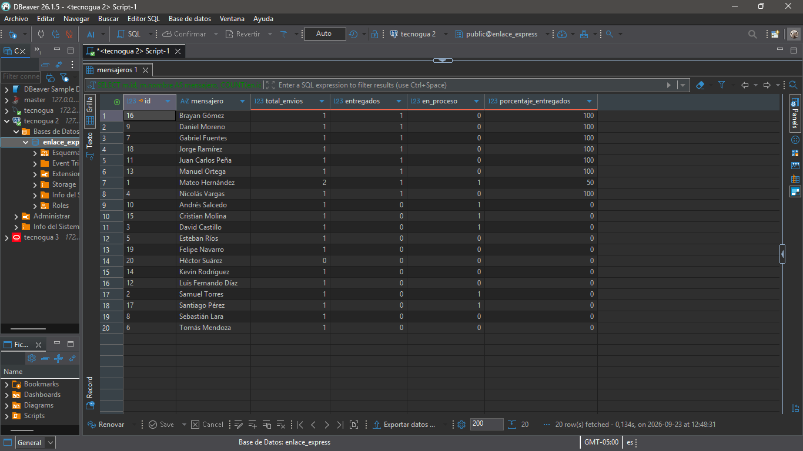

---

# 3. SQL Server

En esta sección se presentan las 38 consultas avanzadas ejecutadas sobre SQL Server. Las consultas fueron adaptadas al esquema `dbo` de la base de datos `enlace_express`.

Cada consulta incluye el código SQL, una breve explicación de su función y la evidencia del resultado obtenido.

## 3.1 Consultas básicas

### Consulta 01 — SELECT: todos los envíos

```sql
SELECT
    id,
    referencia,
    empresa_id,
    estado,
    prioridad,
    fecha_solicitud
FROM dbo.envios;
```

**Explicación:** Muestra los datos principales de todos los envíos registrados.

**Evidencia:**

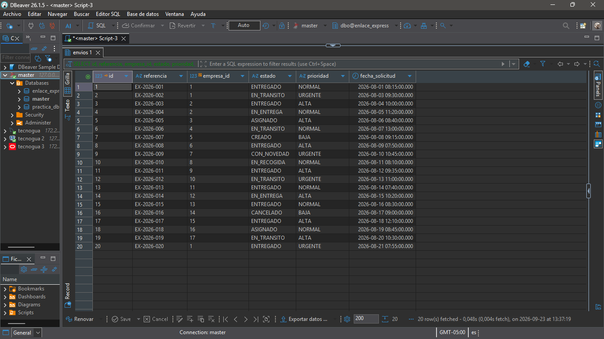

---

### Consulta 02 — WHERE: envíos entregados

```sql
SELECT
    id,
    referencia,
    estado,
    fecha_entrega
FROM dbo.envios
WHERE estado = 'ENTREGADO';
```

**Explicación:** Filtra los envíos cuyo estado actual es `ENTREGADO`.

**Evidencia:**

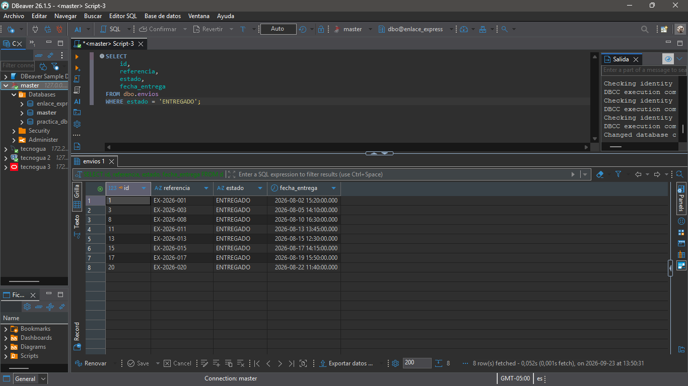

---

### Consulta 03 — AND + IN: prioridades alta o urgente

```sql
SELECT
    id,
    referencia,
    estado,
    prioridad
FROM dbo.envios
WHERE is_active = 'ACTIVE'
  AND prioridad IN ('ALTA', 'URGENTE');
```

**Explicación:** Muestra los envíos activos que tienen prioridad alta o urgente.

**Evidencia:**

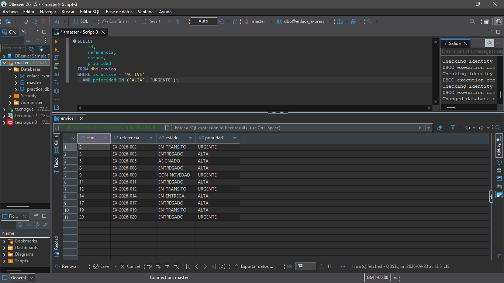

---

### Consulta 04 — IN: estados seleccionados

```sql
SELECT
    id,
    referencia,
    estado
FROM dbo.envios
WHERE estado IN ('ENTREGADO', 'EN_TRANSITO', 'EN_ENTREGA');
```

**Explicación:** Filtra los envíos que se encuentran en alguno de los estados indicados.

**Evidencia:**

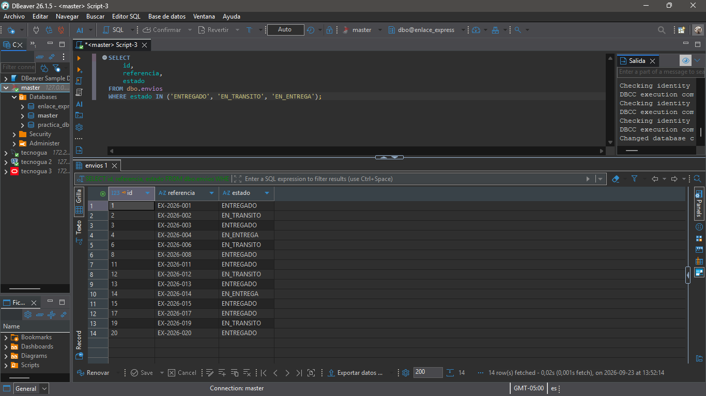

---

### Consulta 05 — BETWEEN: envíos entre dos fechas

```sql
SELECT
    id,
    referencia,
    fecha_solicitud,
    estado
FROM dbo.envios
WHERE fecha_solicitud BETWEEN
      '2026-08-01 00:00:00'
      AND
      '2026-08-10 23:59:59';
```

**Explicación:** Busca los envíos solicitados entre el 1 y el 10 de agosto de 2026.

**Evidencia:**

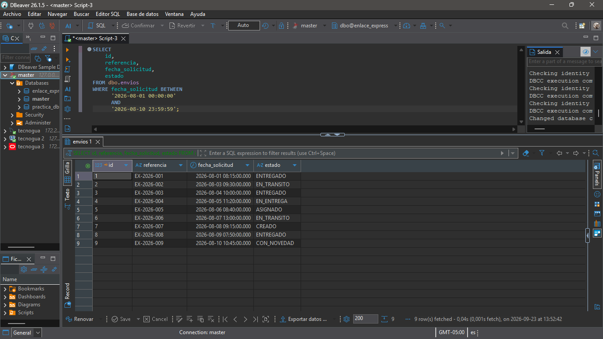

---

## 3.2 Consultas con LIKE

### Consulta 06 — LIKE: empresas que contienen "Caribe"

```sql
SELECT
    id,
    nit,
    razon_social
FROM dbo.empresas
WHERE razon_social LIKE '%Caribe%';
```

**Explicación:** Busca empresas cuyo nombre contiene la palabra `Caribe`.

**Evidencia:**

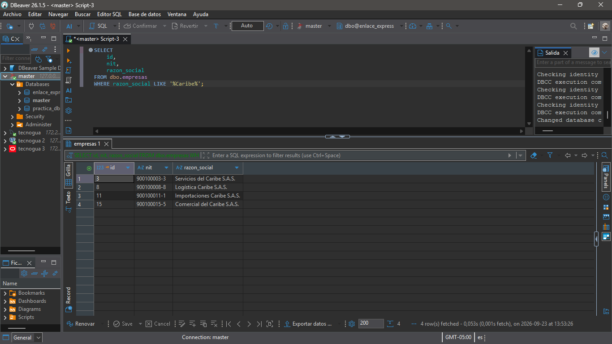

---

### Consulta 07 — LIKE: empresas que contienen "Comercial"

```sql
SELECT
    id,
    nit,
    razon_social
FROM dbo.empresas
WHERE razon_social LIKE '%Comercial%';
```

**Explicación:** Busca empresas cuyo nombre contiene la palabra `Comercial`.

**Evidencia:**


---

## 3.3 ORDER BY

### Consulta 08 — ORDER BY ASC: empresas ordenadas

```sql
SELECT
    id,
    nit,
    razon_social
FROM dbo.empresas
ORDER BY razon_social ASC;
```

**Explicación:** Ordena las empresas alfabéticamente por su razón social.

**Evidencia:**

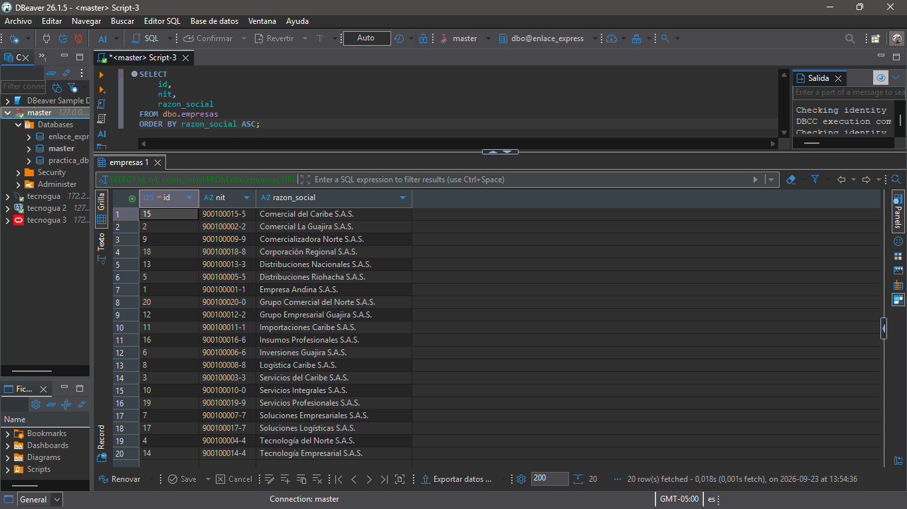

---

### Consulta 09 — ORDER BY DESC: tarifas

```sql
SELECT
    id,
    nombre,
    valor_base,
    is_active
FROM dbo.tarifas
ORDER BY valor_base DESC;
```

**Explicación:** Muestra las tarifas ordenadas desde el mayor hasta el menor valor base.

**Evidencia:**

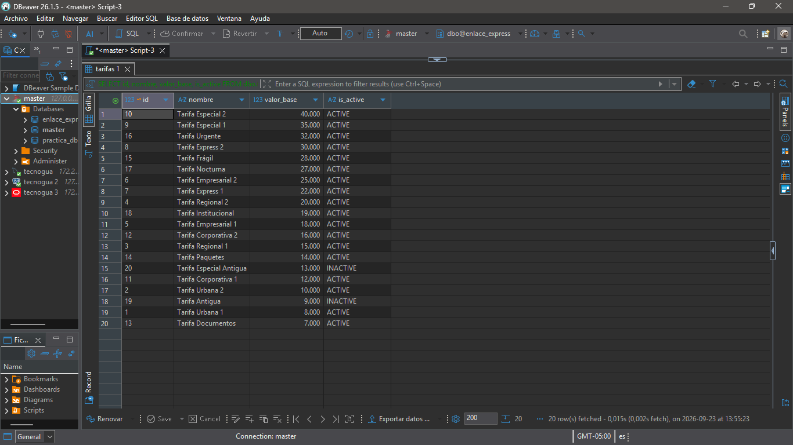

---

## 3.4 Funciones de agregación

### Consulta 10 — COUNT: cantidad total de envíos

```sql
SELECT
    COUNT(*) AS total_envios
FROM dbo.envios;
```

**Explicación:** Cuenta el número total de envíos registrados.

**Evidencia:**


---

### Consulta 11 — SUM: total facturado

```sql
SELECT
    SUM(total) AS total_facturado
FROM dbo.facturas
WHERE is_active = 'ACTIVE';
```

**Explicación:** Calcula la suma del valor de las facturas activas.

**Evidencia:**


---

### Consulta 12 — AVG: promedio de las facturas

```sql
SELECT
    CAST(AVG(total) AS DECIMAL(12,2)) AS promedio_facturas
FROM dbo.facturas
WHERE is_active = 'ACTIVE';
```

**Explicación:** Calcula el valor promedio de las facturas activas y lo muestra con dos decimales.

**Evidencia:**

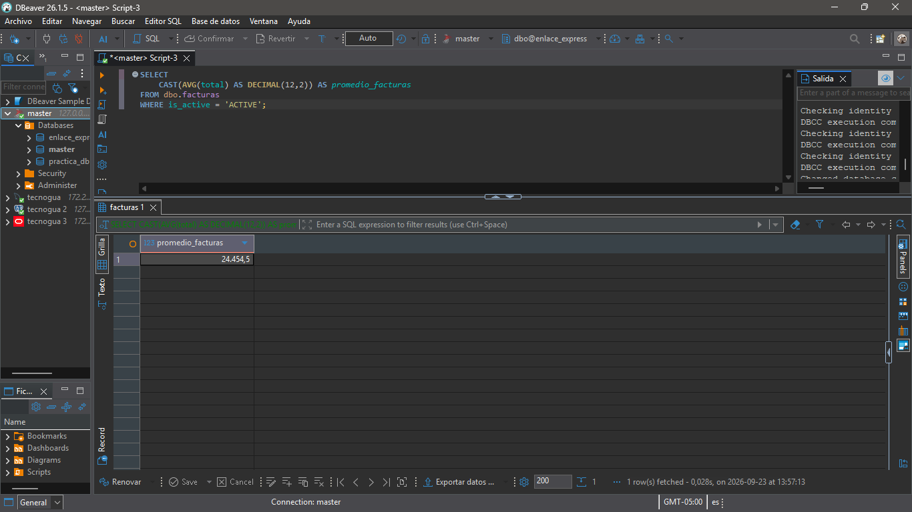

---

### Consulta 13 — MIN + MAX: factura mínima y máxima

```sql
SELECT
    MIN(total) AS factura_minima,
    MAX(total) AS factura_maxima
FROM dbo.facturas
WHERE is_active = 'ACTIVE';
```

**Explicación:** Obtiene el valor mínimo y máximo de las facturas activas.

**Evidencia:**

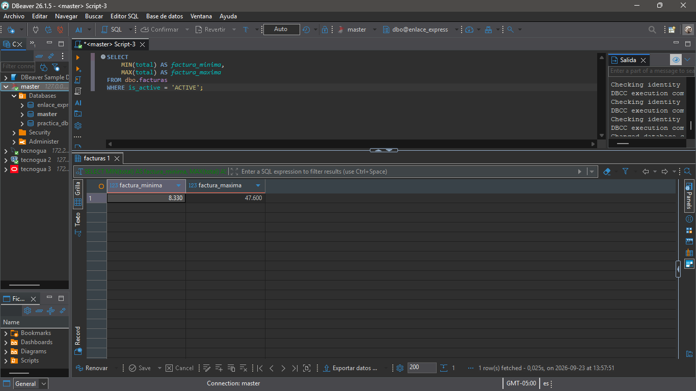

---

## 3.5 GROUP BY y HAVING

### Consulta 14 — GROUP BY: envíos por estado

```sql
SELECT
    estado,
    COUNT(*) AS cantidad_envios
FROM dbo.envios
GROUP BY estado
ORDER BY cantidad_envios DESC;
```

**Explicación:** Agrupa los envíos según su estado y cuenta cuántos existen en cada grupo.

**Evidencia:**

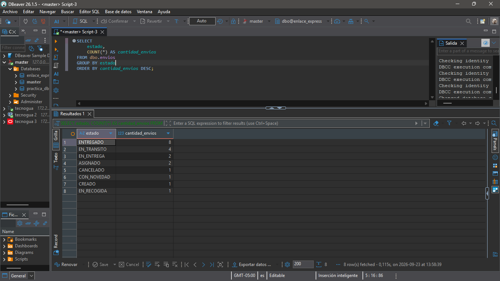

---

### Consulta 15 — GROUP BY + SUM: facturación por empresa

```sql
SELECT
    e.id AS empresa_id,
    e.razon_social,
    COUNT(f.id) AS cantidad_facturas,
    SUM(f.total) AS total_facturado
FROM dbo.empresas e
INNER JOIN dbo.facturas f
    ON f.empresa_id = e.id
GROUP BY
    e.id,
    e.razon_social
ORDER BY total_facturado DESC;
```

**Explicación:** Agrupa las facturas por empresa y calcula la cantidad y el total facturado.

**Evidencia:**

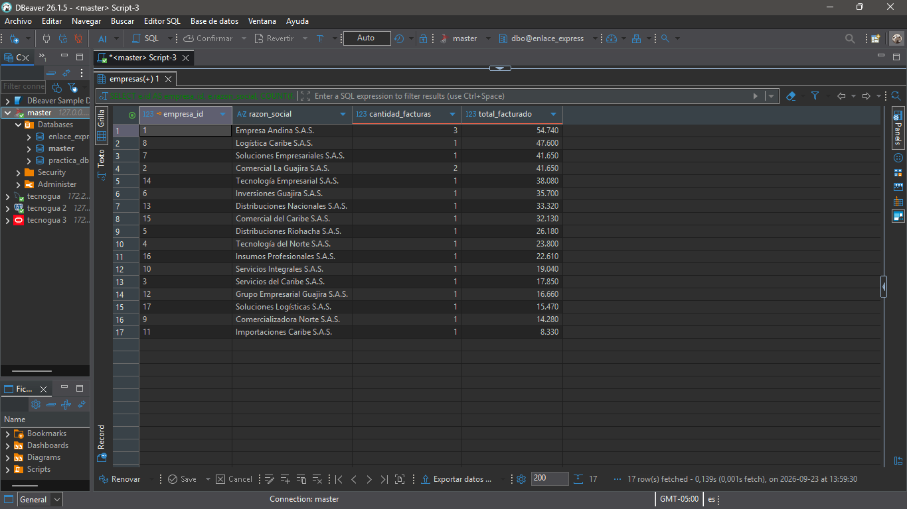

---

### Consulta 16 — GROUP BY + HAVING: empresas con más de un envío

```sql
SELECT
    e.id AS empresa_id,
    e.razon_social,
    COUNT(en.id) AS cantidad_envios
FROM dbo.empresas e
INNER JOIN dbo.envios en
    ON en.empresa_id = e.id
GROUP BY
    e.id,
    e.razon_social
HAVING COUNT(en.id) > 1
ORDER BY cantidad_envios DESC;
```

**Explicación:** Muestra las empresas que tienen más de un envío registrado.

**Evidencia:**

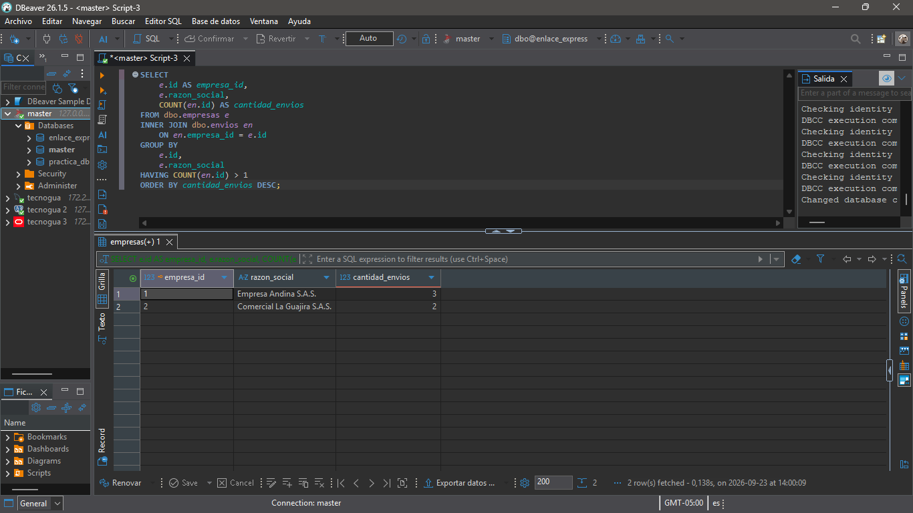

---

## 3.6 INNER JOIN

### Consulta 17 — INNER JOIN: empresa y envío

```sql
SELECT
    en.id AS envio_id,
    en.referencia,
    e.razon_social AS empresa,
    en.estado,
    en.prioridad
FROM dbo.envios en
INNER JOIN dbo.empresas e
    ON e.id = en.empresa_id
ORDER BY en.id;
```

**Explicación:** Relaciona cada envío con la empresa a la que pertenece.

**Evidencia:**

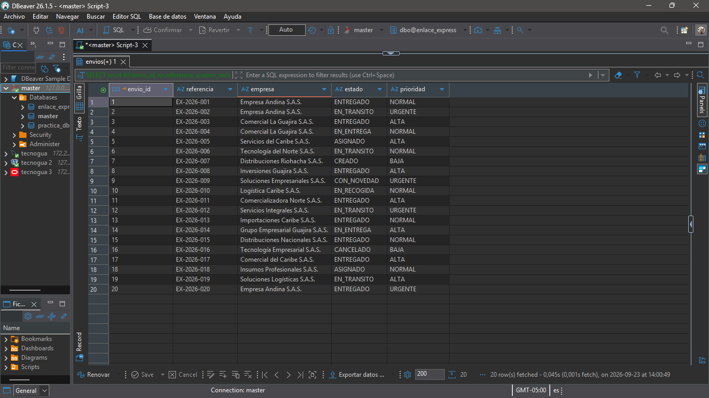

---

### Consulta 18 — MULTI JOIN: envío, empresa, mensajero y ruta

```sql
SELECT
    en.id AS envio_id,
    en.referencia,
    e.razon_social AS empresa,
    m.nombre AS mensajero,
    r.nombre AS ruta,
    en.estado,
    en.prioridad
FROM dbo.envios en
INNER JOIN dbo.empresas e
    ON e.id = en.empresa_id
INNER JOIN dbo.mensajeros m
    ON m.id = en.mensajero_id
INNER JOIN dbo.rutas r
    ON r.id = en.ruta_id
ORDER BY en.id;
```

**Explicación:** Combina información del envío, empresa, mensajero y ruta relacionada.

**Evidencia:**

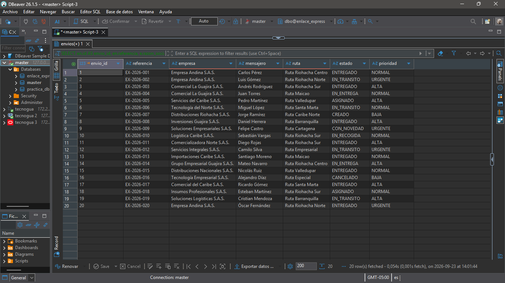

---

## 3.7 LEFT JOIN

### Consulta 19 — LEFT JOIN: empresas con y sin envíos

```sql
SELECT
    e.id AS empresa_id,
    e.razon_social,
    COUNT(en.id) AS cantidad_envios
FROM dbo.empresas e
LEFT JOIN dbo.envios en
    ON en.empresa_id = e.id
GROUP BY
    e.id,
    e.razon_social
ORDER BY
    cantidad_envios DESC,
    e.id;
```

**Explicación:** Muestra todas las empresas y cuenta sus envíos, incluyendo aquellas que no tienen envíos.

**Evidencia:**

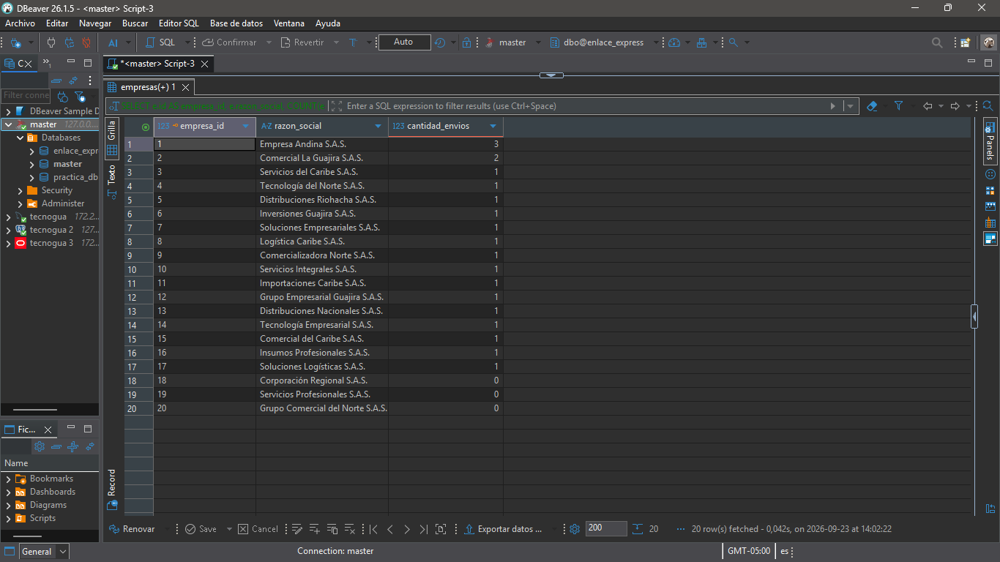

---

## 3.8 JOIN con paquetes

### Consulta 20 — JOIN: envíos y paquetes

```sql
SELECT
    en.id AS envio_id,
    en.referencia,
    p.codigo AS codigo_paquete,
    p.descripcion,
    p.peso,
    p.estado AS estado_paquete
FROM dbo.envios en
INNER JOIN dbo.paquetes p
    ON p.envio_id = en.id
ORDER BY en.id;
```

**Explicación:** Relaciona los envíos con los paquetes asociados a cada uno.

**Evidencia:**

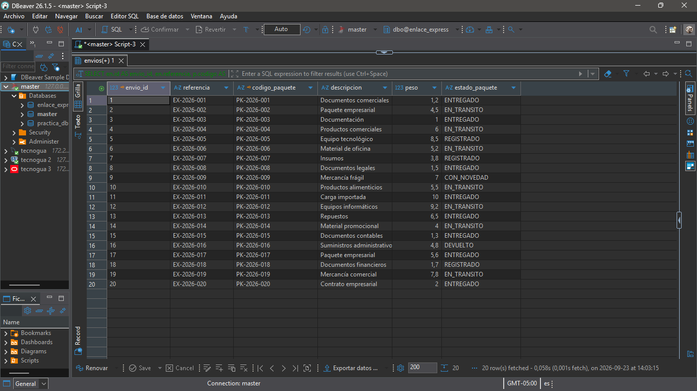

---

## 3.9 JOIN con facturas

### Consulta 21 — JOIN: envíos y facturas

```sql
SELECT
    en.id AS envio_id,
    en.referencia,
    f.numero_factura,
    f.subtotal,
    f.impuesto,
    f.total,
    f.estado AS estado_factura
FROM dbo.envios en
INNER JOIN dbo.facturas f
    ON f.envio_id = en.id
ORDER BY en.id;
```

**Explicación:** Relaciona los envíos con sus respectivas facturas.

**Evidencia:**

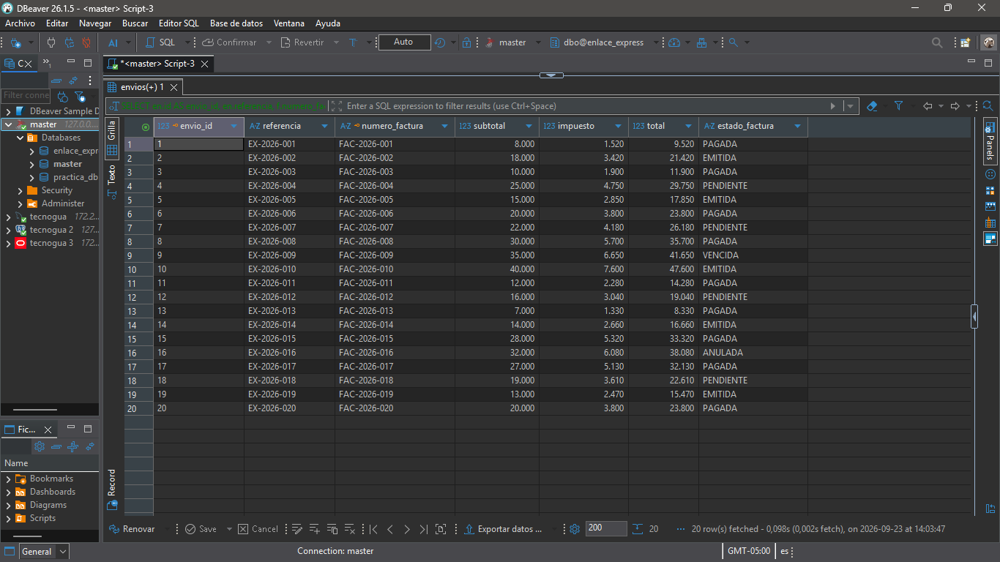

---

## 3.10 Consulta de tracking

### Consulta 22 — JOIN: envíos y tracking

```sql
SELECT
    en.id AS envio_id,
    en.referencia,
    et.estado AS estado_tracking,
    et.descripcion,
    et.latitud,
    et.longitud,
    et.fecha_evento
FROM dbo.envios en
INNER JOIN dbo.eventos_tracking et
    ON et.envio_id = en.id
ORDER BY et.fecha_evento;
```

**Explicación:** Muestra los eventos de seguimiento asociados a cada envío.

**Evidencia:**

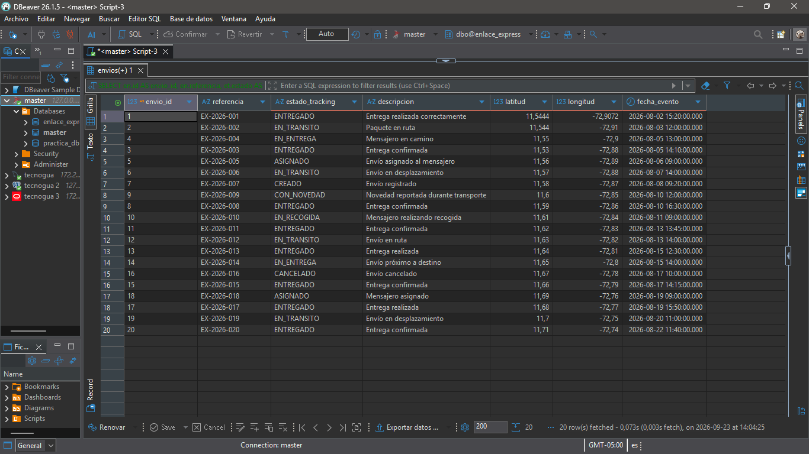

---

## 3.11 Subconsultas

### Consulta 23 — Subconsulta: facturas superiores al promedio

```sql
SELECT
    id,
    numero_factura,
    empresa_id,
    total,
    estado
FROM dbo.facturas
WHERE total > (
    SELECT AVG(total)
    FROM dbo.facturas
    WHERE is_active = 'ACTIVE'
)
ORDER BY total DESC;
```

**Explicación:** Muestra las facturas cuyo valor es superior al promedio de las facturas activas.

**Evidencia:**

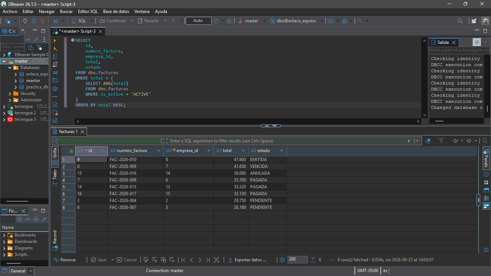

---

### Consulta 24 — EXISTS: empresas que tienen envíos

```sql
SELECT
    e.id,
    e.razon_social,
    e.nit
FROM dbo.empresas e
WHERE EXISTS (
    SELECT 1
    FROM dbo.envios en
    WHERE en.empresa_id = e.id
)
ORDER BY e.id;
```

**Explicación:** Muestra las empresas para las que existe al menos un envío relacionado.

**Evidencia:**

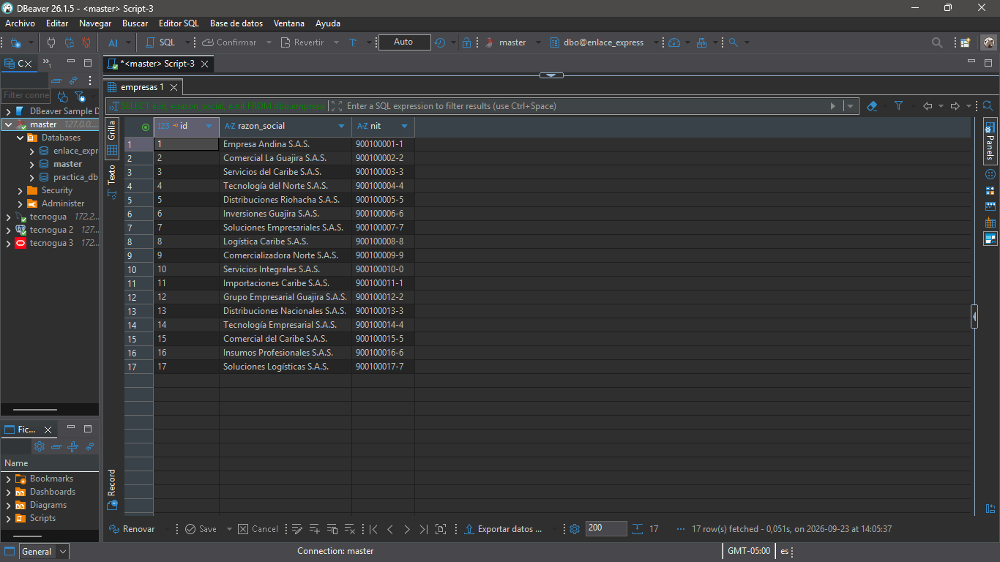

---

## 3.12 CASE

### Consulta 25 — CASE: clasificación de envíos

```sql
SELECT
    id,
    referencia,
    prioridad,
    estado,
    CASE
        WHEN prioridad = 'URGENTE' THEN 'Atención inmediata'
        WHEN prioridad = 'ALTA' THEN 'Atención prioritaria'
        WHEN prioridad = 'NORMAL' THEN 'Atención normal'
        ELSE 'Baja prioridad'
    END AS clasificacion
FROM dbo.envios
ORDER BY id;
```

**Explicación:** Clasifica los envíos según el nivel de prioridad registrado.

**Evidencia:**

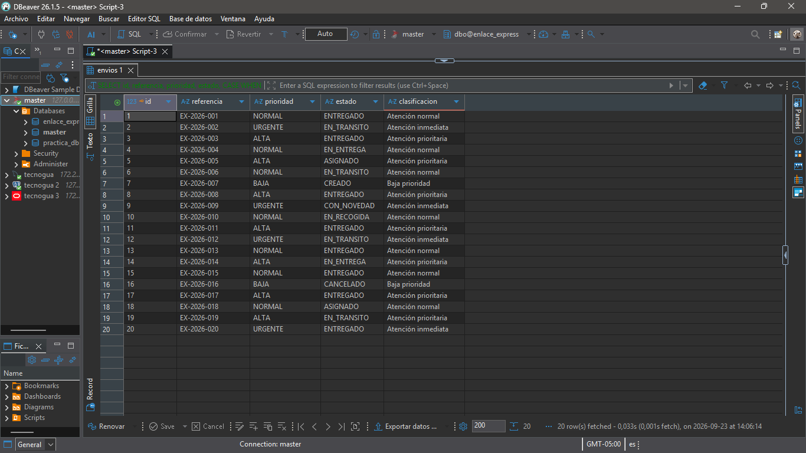

---

## 3.13 COALESCE

### Consulta 26 — COALESCE: fecha de entrega

```sql
SELECT
    id,
    referencia,
    fecha_solicitud,
    COALESCE(
        CONVERT(VARCHAR(19), fecha_entrega, 120),
        'Pendiente de entrega'
    ) AS fecha_entrega
FROM dbo.envios
ORDER BY id;
```

**Explicación:** Muestra la fecha de entrega cuando existe y, si es `NULL`, muestra el texto `Pendiente de entrega`.

**Evidencia:**

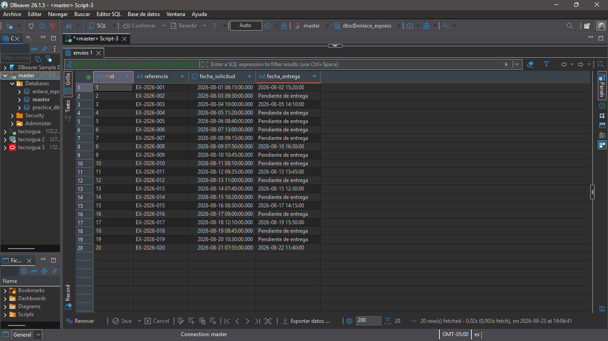

---

## 3.14 CTE — WITH

### Consulta 27 — CTE: resumen de envíos por empresa

```sql
WITH resumen_envios AS
(
    SELECT
        empresa_id,
        COUNT(*) AS cantidad_envios,
        SUM(
            CASE
                WHEN estado = 'ENTREGADO' THEN 1
                ELSE 0
            END
        ) AS entregados
    FROM dbo.envios
    GROUP BY empresa_id
)
SELECT
    e.id AS empresa_id,
    e.razon_social,
    r.cantidad_envios,
    r.entregados
FROM resumen_envios r
INNER JOIN dbo.empresas e
    ON e.id = r.empresa_id
ORDER BY r.cantidad_envios DESC;
```

**Explicación:** Utiliza un CTE para obtener el total de envíos y los envíos entregados por empresa.

**Evidencia:**

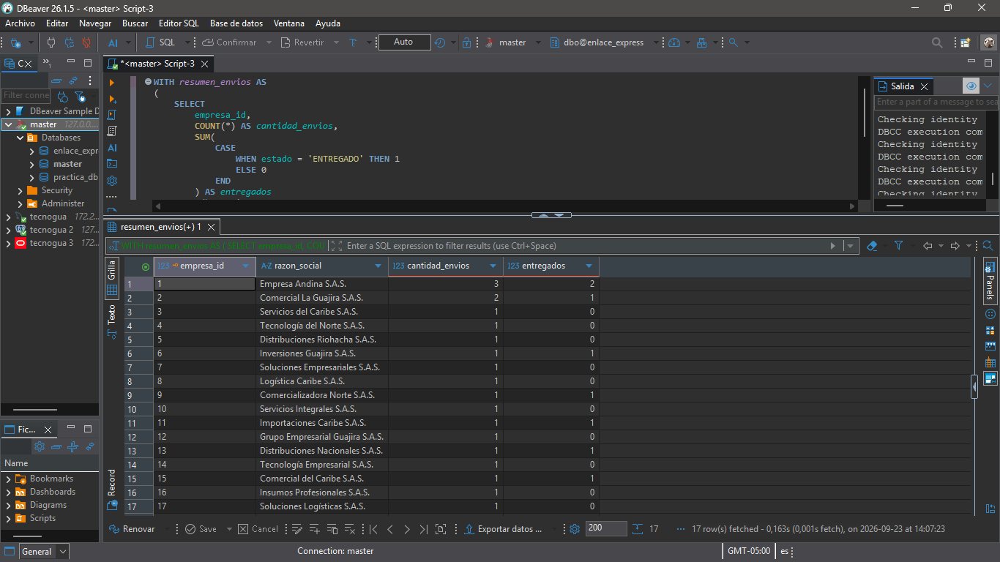

---

## 3.15 Funciones de ventana

### Consulta 28 — RANK: empresas según cantidad de envíos

```sql
SELECT
    e.id AS empresa_id,
    e.razon_social,
    COUNT(en.id) AS cantidad_envios,
    RANK() OVER (
        ORDER BY COUNT(en.id) DESC
    ) AS posicion
FROM dbo.empresas e
LEFT JOIN dbo.envios en
    ON en.empresa_id = e.id
GROUP BY
    e.id,
    e.razon_social
ORDER BY posicion, e.id;
```

**Explicación:** Asigna una posición a cada empresa según la cantidad de envíos registrados.

**Evidencia:**

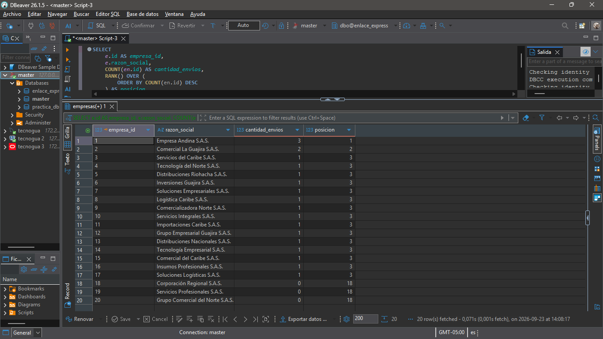

---

### Consulta 29 — ROW_NUMBER: orden de envíos

```sql
SELECT
    ROW_NUMBER() OVER (
        ORDER BY fecha_solicitud
    ) AS numero,
    id,
    referencia,
    fecha_solicitud,
    estado
FROM dbo.envios
ORDER BY fecha_solicitud;
```

**Explicación:** Asigna un número consecutivo a cada envío según su fecha de solicitud.

**Evidencia:**

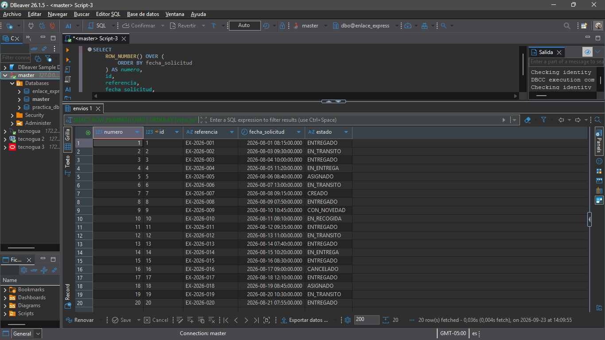

---

## 3.16 Usuarios y roles

### Consulta 30 — Usuarios y roles

```sql
SELECT
    u.id AS usuario_id,
    u.username,
    u.email,
    r.name AS rol
FROM dbo.users u
INNER JOIN dbo.role_users ru
    ON ru.user_id = u.id
INNER JOIN dbo.roles r
    ON r.id = ru.role_id
ORDER BY r.name, u.username;
```

**Explicación:** Muestra los usuarios registrados junto con los roles que tienen asignados.

**Evidencia:**

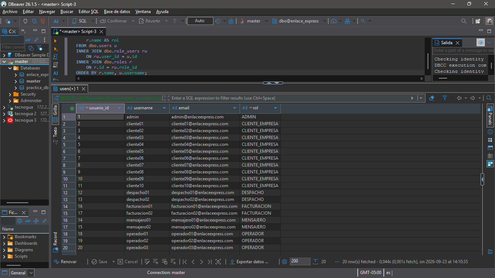

---

## 3.17 RBAC

### Consulta 31 — RBAC: usuarios, roles y recursos

```sql
SELECT
    r.name AS rol,
    res.path,
    res.method,
    res.is_active AS recurso_activo
FROM dbo.roles r
INNER JOIN dbo.resource_roles rr
    ON rr.role_id = r.id
INNER JOIN dbo.resources res
    ON res.id = rr.resource_id
WHERE r.is_active = 'ACTIVE'
  AND rr.is_active = 'ACTIVE'
  AND res.is_active = 'ACTIVE'
ORDER BY
    r.name,
    res.path,
    res.method;
```

**Explicación:** Relaciona los roles con los recursos activos y sus métodos disponibles.

**Evidencia:**

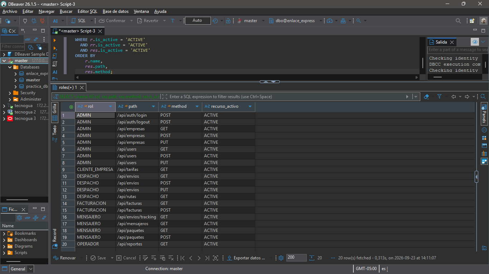

---

## 3.18 UNION

### Consulta 32 — UNION: empresas y mensajeros

```sql
SELECT
    'EMPRESA' AS tipo,
    razon_social AS nombre,
    is_active
FROM dbo.empresas

UNION

SELECT
    'MENSAJERO' AS tipo,
    nombre,
    is_active
FROM dbo.mensajeros

ORDER BY tipo, nombre;
```

**Explicación:** Combina en un solo resultado los nombres de empresas y mensajeros.

**Evidencia:**

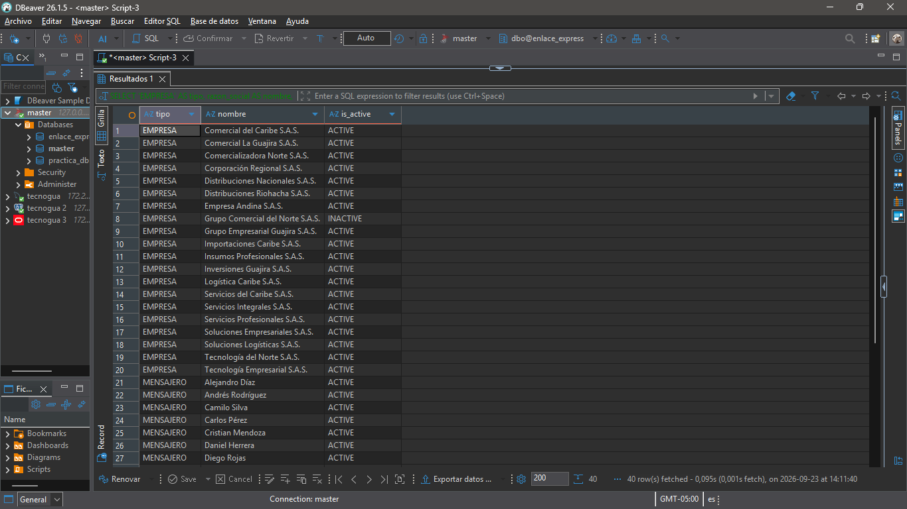

---

## 3.19 Consulta avanzada de facturación

### Consulta 33 — Resumen avanzado de facturación

```sql
SELECT
    e.id AS empresa_id,
    e.razon_social,
    COUNT(f.id) AS cantidad_facturas,
    SUM(f.subtotal) AS subtotal,
    SUM(f.impuesto) AS impuesto,
    SUM(f.total) AS total_facturado,
    AVG(f.total) AS promedio_factura,
    MIN(f.total) AS factura_minima,
    MAX(f.total) AS factura_maxima
FROM dbo.empresas e
LEFT JOIN dbo.facturas f
    ON f.empresa_id = e.id
GROUP BY
    e.id,
    e.razon_social
ORDER BY total_facturado DESC;
```

**Explicación:** Genera un resumen de la facturación de cada empresa utilizando varias funciones de agregación.

**Evidencia:**

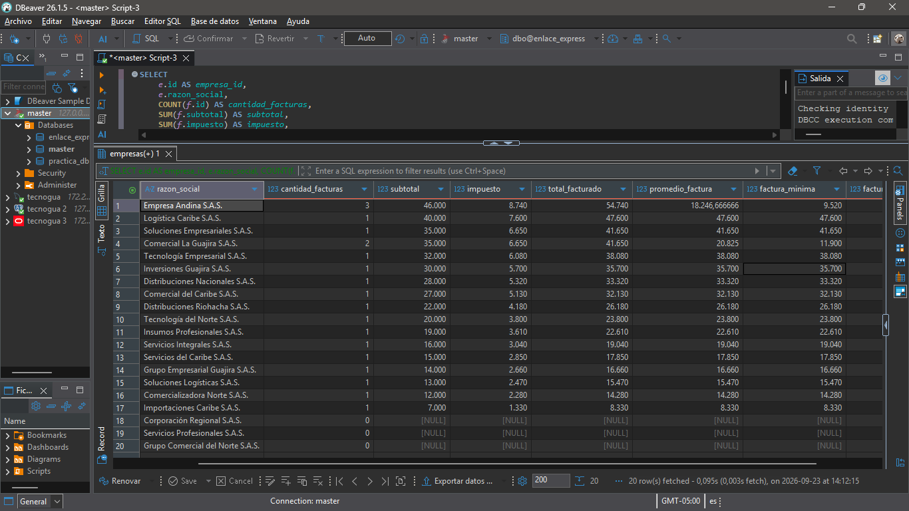

---

## 3.20 Consulta avanzada de paquetes

### Consulta 34 — Resumen de paquetes por estado

```sql
SELECT
    p.estado,
    COUNT(*) AS cantidad_paquetes,
    SUM(p.peso) AS peso_total,
    AVG(p.peso) AS peso_promedio,
    MIN(p.peso) AS peso_minimo,
    MAX(p.peso) AS peso_maximo
FROM dbo.paquetes p
GROUP BY p.estado
ORDER BY cantidad_paquetes DESC;
```

**Explicación:** Resume los paquetes agrupándolos por estado y calcula diferentes valores relacionados con su peso.

**Evidencia:**

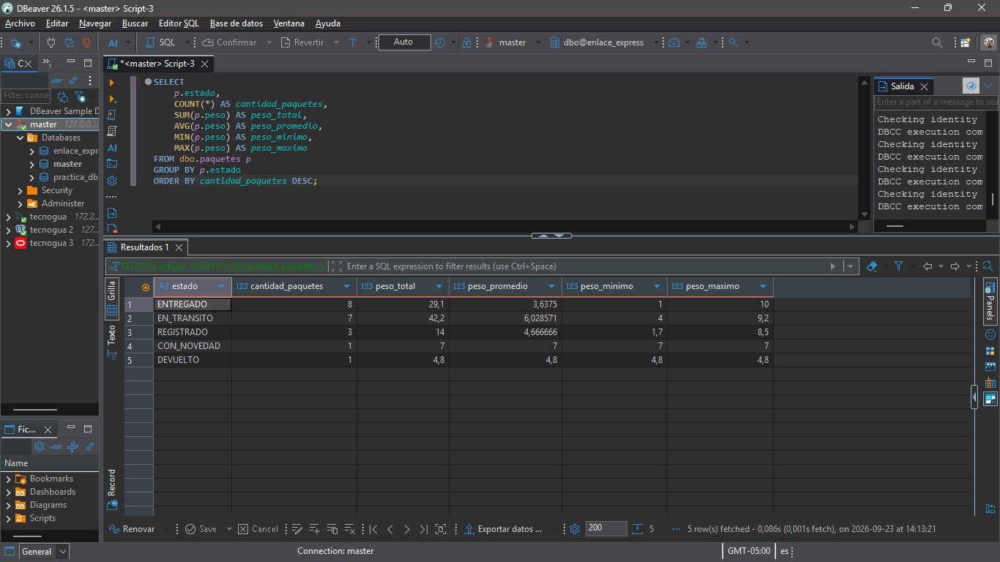

---

## 3.21 Consulta completa de envíos

### Consulta 35 — Consulta completa de envíos

```sql
SELECT
    en.id AS envio_id,
    en.referencia,
    e.razon_social AS empresa,
    m.nombre AS mensajero,
    r.nombre AS ruta,
    t.nombre AS tarifa,
    p.codigo AS paquete,
    p.peso,
    en.estado AS estado_envio,
    en.prioridad,
    f.numero_factura,
    f.total AS valor_factura,
    f.estado AS estado_factura,
    en.fecha_solicitud,
    en.fecha_entrega
FROM dbo.envios en
INNER JOIN dbo.empresas e
    ON e.id = en.empresa_id
LEFT JOIN dbo.mensajeros m
    ON m.id = en.mensajero_id
LEFT JOIN dbo.rutas r
    ON r.id = en.ruta_id
LEFT JOIN dbo.tarifas t
    ON t.id = en.tarifa_id
LEFT JOIN dbo.paquetes p
    ON p.envio_id = en.id
LEFT JOIN dbo.facturas f
    ON f.envio_id = en.id
ORDER BY en.id;
```

**Explicación:** Integra información del envío, empresa, mensajero, ruta, tarifa, paquete y factura.

**Evidencia:**

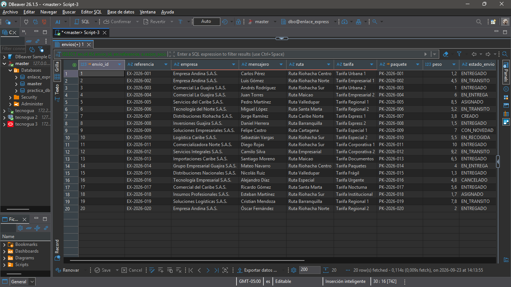

---

## 3.22 Consulta avanzada de seguimiento

### Consulta 36 — Último evento de tracking por envío

```sql
SELECT
    en.id AS envio_id,
    en.referencia,
    et.estado,
    et.descripcion,
    et.fecha_evento
FROM dbo.envios en
INNER JOIN dbo.eventos_tracking et
    ON et.id = (
        SELECT TOP 1 et2.id
        FROM dbo.eventos_tracking et2
        WHERE et2.envio_id = en.id
        ORDER BY et2.fecha_evento DESC
    )
ORDER BY en.id;
```

**Explicación:** Obtiene el último evento de tracking registrado para cada envío.

**Evidencia:**

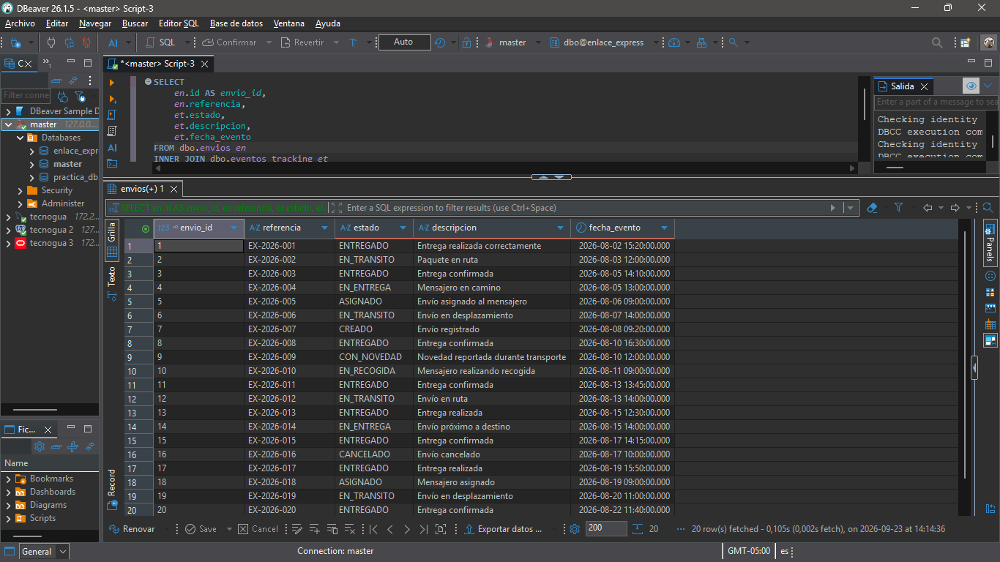

---

## 3.23 HAVING

### Consulta 37 — HAVING: estados con más de un envío

```sql
SELECT
    estado,
    COUNT(*) AS cantidad_envios
FROM dbo.envios
GROUP BY estado
HAVING COUNT(*) > 1
ORDER BY cantidad_envios DESC;
```

**Explicación:** Muestra los estados que tienen más de un envío registrado.

**Evidencia:**

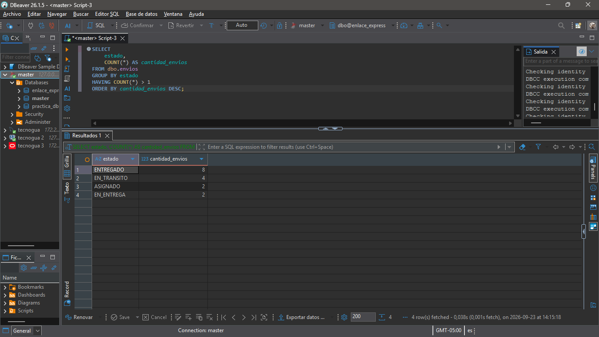

---

## 3.24 Consulta de entregas por mensajero

### Consulta 38 — Envíos por mensajero y porcentaje de entregas

```sql
SELECT
    m.id AS mensajero_id,
    m.nombre AS mensajero,
    COUNT(en.id) AS total_envios,
    SUM(
        CASE
            WHEN en.estado = 'ENTREGADO' THEN 1
            ELSE 0
        END
    ) AS envios_entregados,
    CAST(
        100.0 *
        SUM(
            CASE
                WHEN en.estado = 'ENTREGADO' THEN 1
                ELSE 0
            END
        )
        / NULLIF(COUNT(en.id), 0)
        AS DECIMAL(5,2)
    ) AS porcentaje_entregados
FROM dbo.mensajeros m
LEFT JOIN dbo.envios en
    ON en.mensajero_id = m.id
GROUP BY
    m.id,
    m.nombre
ORDER BY
    porcentaje_entregados DESC,
    total_envios DESC;
```

**Explicación:** Muestra el total de envíos de cada mensajero, cuántos fueron entregados y el porcentaje de entregas.

**Evidencia:**

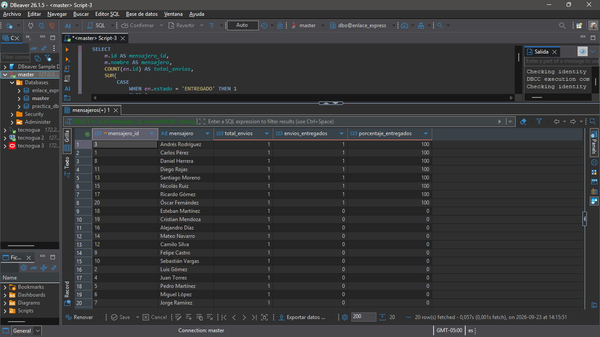

---

# 4. Oracle

En esta sección se presentan las 38 consultas avanzadas ejecutadas sobre Oracle para la base de datos `ENLACE_EXPRESS`. Las consultas fueron adaptadas a la sintaxis de Oracle y mantienen el mismo orden utilizado en los demás motores de base de datos.

Cada consulta incluye el código SQL, una breve explicación y la evidencia correspondiente.

## 4.1 Consultas básicas

### Consulta 01 — SELECT: todos los envíos

```sql
SELECT ID,
       REFERENCIA,
       EMPRESA_ID,
       ESTADO,
       PRIORIDAD,
       FECHA_SOLICITUD
FROM ENVIOS
ORDER BY ID;
```

**Explicación:** Muestra los datos principales de todos los envíos registrados.

**Evidencia:**

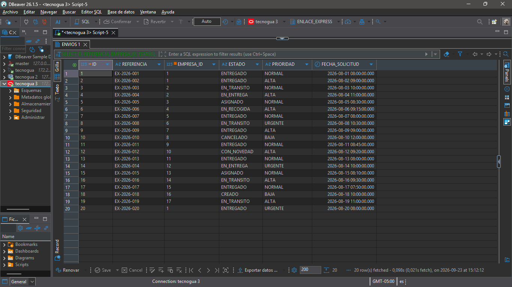

---

### Consulta 02 — WHERE: envíos entregados

```sql
SELECT ID,
       REFERENCIA,
       ESTADO,
       FECHA_ENTREGA
FROM ENVIOS
WHERE ESTADO = 'ENTREGADO'
ORDER BY ID;
```

**Explicación:** Filtra los envíos cuyo estado es `ENTREGADO`.

**Evidencia:**

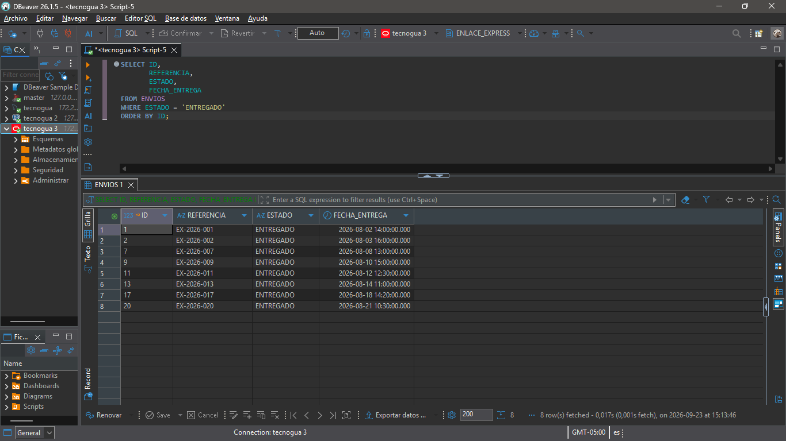

---

### Consulta 03 — AND + IN: prioridades

```sql
SELECT ID,
       REFERENCIA,
       ESTADO,
       PRIORIDAD
FROM ENVIOS
WHERE IS_ACTIVE = 'ACTIVE'
  AND PRIORIDAD IN ('ALTA', 'URGENTE')
ORDER BY ID;
```

**Explicación:** Muestra los envíos activos que tienen prioridad alta o urgente.

**Evidencia:**

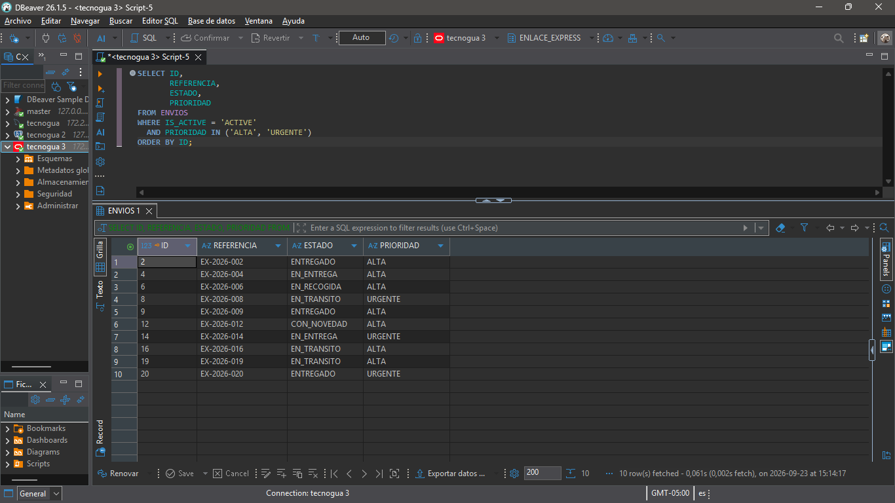

---

### Consulta 04 — IN: estados seleccionados

```sql
SELECT ID,
       REFERENCIA,
       ESTADO
FROM ENVIOS
WHERE ESTADO IN ('ENTREGADO', 'EN_TRANSITO', 'EN_ENTREGA')
ORDER BY ID;
```

**Explicación:** Filtra los envíos que se encuentran en alguno de los estados indicados.

**Evidencia:**

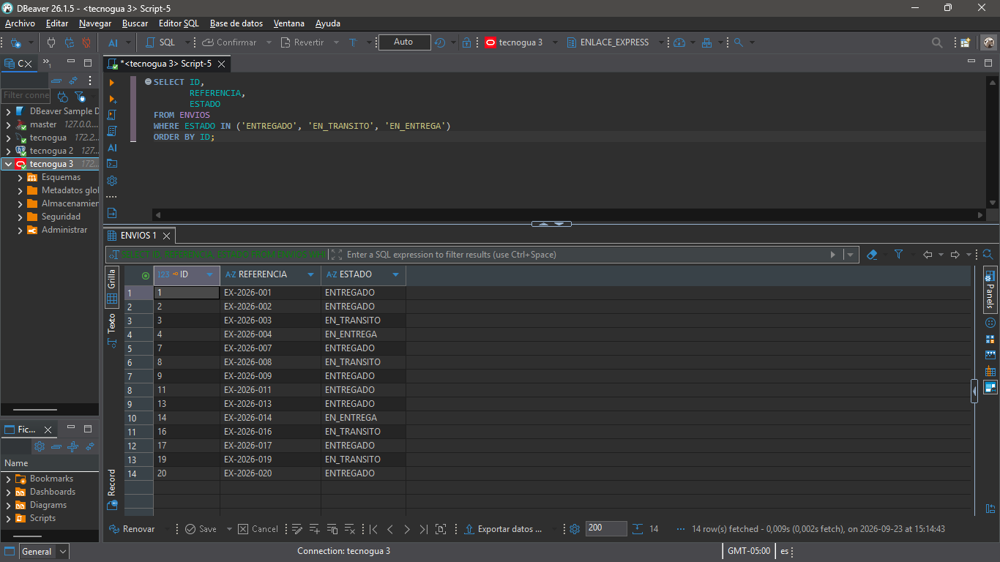

---

### Consulta 05 — BETWEEN: envíos entre fechas

```sql
SELECT ID,
       REFERENCIA,
       FECHA_SOLICITUD,
       ESTADO
FROM ENVIOS
WHERE FECHA_SOLICITUD BETWEEN
      TIMESTAMP '2026-08-01 00:00:00'
      AND TIMESTAMP '2026-08-10 23:59:59'
ORDER BY FECHA_SOLICITUD;
```

**Explicación:** Busca los envíos solicitados entre el 1 y el 10 de agosto de 2026.

**Evidencia:**

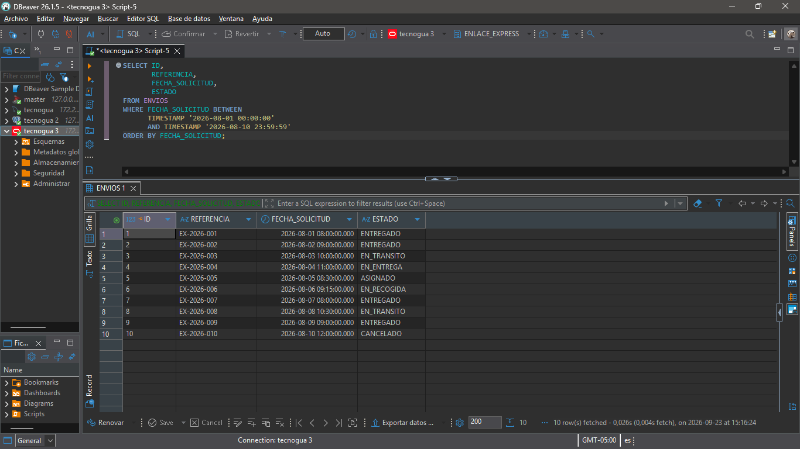

---

## 4.2 Consultas con LIKE

### Consulta 06 — LIKE: empresas que contienen "Caribe"

```sql
SELECT ID,
       NIT,
       RAZON_SOCIAL
FROM EMPRESAS
WHERE RAZON_SOCIAL LIKE '%Caribe%'
ORDER BY ID;
```

**Explicación:** Busca empresas cuyo nombre contiene la palabra `Caribe`.

**Evidencia:**


---

### Consulta 07 — LIKE: empresas que contienen "Comercial"

```sql
SELECT ID,
       NIT,
       RAZON_SOCIAL
FROM EMPRESAS
WHERE RAZON_SOCIAL LIKE '%Comercial%'
ORDER BY ID;
```

**Explicación:** Busca empresas cuyo nombre contiene la palabra `Comercial`.

**Evidencia:**

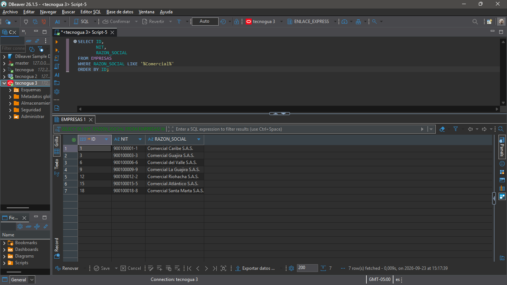

---

## 4.3 ORDER BY

### Consulta 08 — ORDER BY ASC: empresas

```sql
SELECT ID,
       NIT,
       RAZON_SOCIAL,
       IS_ACTIVE
FROM EMPRESAS
ORDER BY RAZON_SOCIAL ASC;
```

**Explicación:** Ordena las empresas alfabéticamente por su razón social.

**Evidencia:**

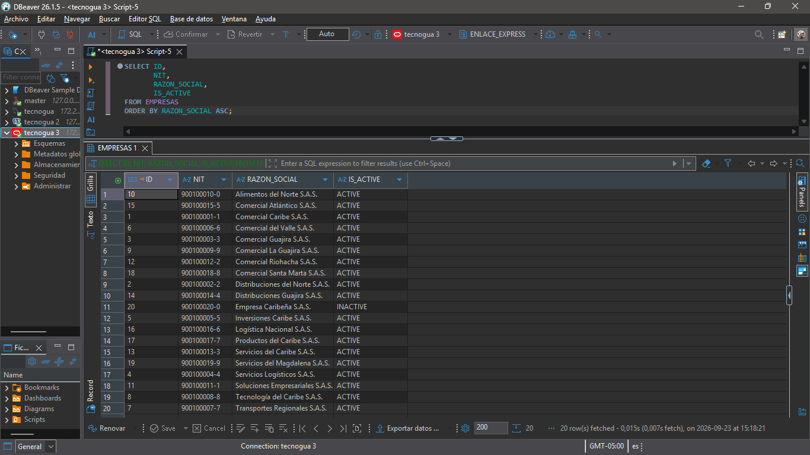

---

### Consulta 09 — ORDER BY DESC: tarifas

```sql
SELECT ID,
       NOMBRE,
       VALOR_BASE,
       IS_ACTIVE
FROM TARIFAS
ORDER BY VALOR_BASE DESC;
```

**Explicación:** Ordena las tarifas desde el mayor hasta el menor valor base.

**Evidencia:**

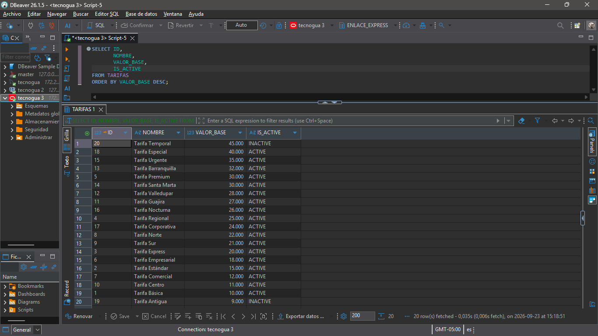

---

## 4.4 Funciones de agregación

### Consulta 10 — COUNT: total de envíos

```sql
SELECT COUNT(*) AS TOTAL_ENVIOS
FROM ENVIOS;
```

**Explicación:** Cuenta el número total de envíos registrados.

**Evidencia:**


---

### Consulta 11 — SUM: total facturado

```sql
SELECT SUM(TOTAL) AS TOTAL_FACTURADO
FROM FACTURAS
WHERE IS_ACTIVE = 'ACTIVE';
```

**Explicación:** Calcula el total de las facturas activas.

**Evidencia:**


---

### Consulta 12 — AVG: promedio de facturas

```sql
SELECT ROUND(AVG(TOTAL), 2) AS PROMEDIO_FACTURAS
FROM FACTURAS
WHERE IS_ACTIVE = 'ACTIVE';
```

**Explicación:** Calcula el promedio del valor de las facturas activas con dos decimales.

**Evidencia:**


---

### Consulta 13 — MIN + MAX: facturas

```sql
SELECT MIN(TOTAL) AS FACTURA_MINIMA,
       MAX(TOTAL) AS FACTURA_MAXIMA
FROM FACTURAS
WHERE IS_ACTIVE = 'ACTIVE';
```

**Explicación:** Obtiene el valor mínimo y máximo de las facturas activas.

**Evidencia:**


---

## 4.5 GROUP BY y HAVING

### Consulta 14 — GROUP BY: estados de envíos

```sql
SELECT ESTADO,
       COUNT(*) AS CANTIDAD_ENVIOS
FROM ENVIOS
GROUP BY ESTADO
ORDER BY CANTIDAD_ENVIOS DESC;
```

**Explicación:** Agrupa los envíos por estado y cuenta cuántos existen en cada grupo.

**Evidencia:**

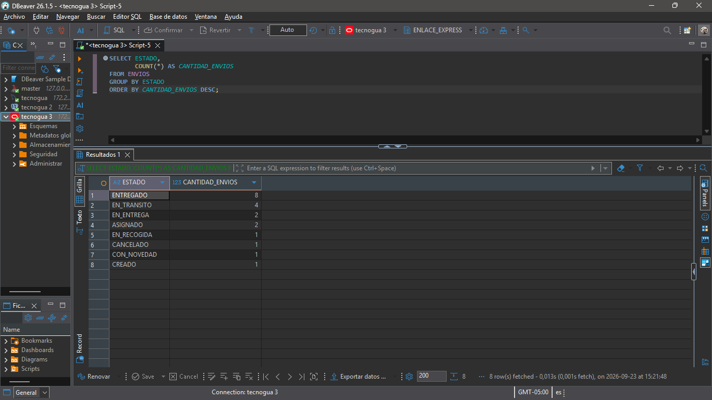

---

### Consulta 15 — GROUP BY + SUM: facturación por empresa

```sql
SELECT E.ID AS EMPRESA_ID,
       E.RAZON_SOCIAL,
       COUNT(F.ID) AS CANTIDAD_FACTURAS,
       SUM(F.TOTAL) AS TOTAL_FACTURADO
FROM EMPRESAS E
INNER JOIN FACTURAS F
    ON F.EMPRESA_ID = E.ID
GROUP BY E.ID,
         E.RAZON_SOCIAL
ORDER BY TOTAL_FACTURADO DESC;
```

**Explicación:** Agrupa las facturas por empresa y calcula la cantidad de facturas y el total facturado.

**Evidencia:**

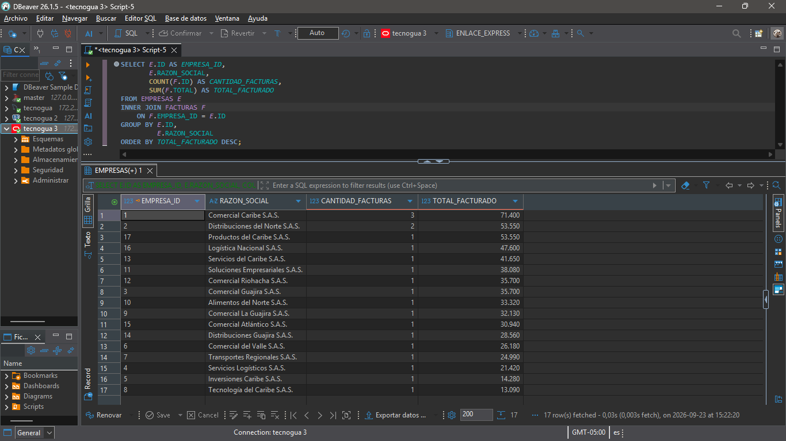

---

### Consulta 16 — GROUP BY + HAVING: empresas con varios envíos

```sql
SELECT E.ID AS EMPRESA_ID,
       E.RAZON_SOCIAL,
       COUNT(EN.ID) AS CANTIDAD_ENVIOS
FROM EMPRESAS E
INNER JOIN ENVIOS EN
    ON EN.EMPRESA_ID = E.ID
GROUP BY E.ID,
         E.RAZON_SOCIAL
HAVING COUNT(EN.ID) > 1
ORDER BY CANTIDAD_ENVIOS DESC;
```

**Explicación:** Muestra las empresas que tienen más de un envío.

**Evidencia:**

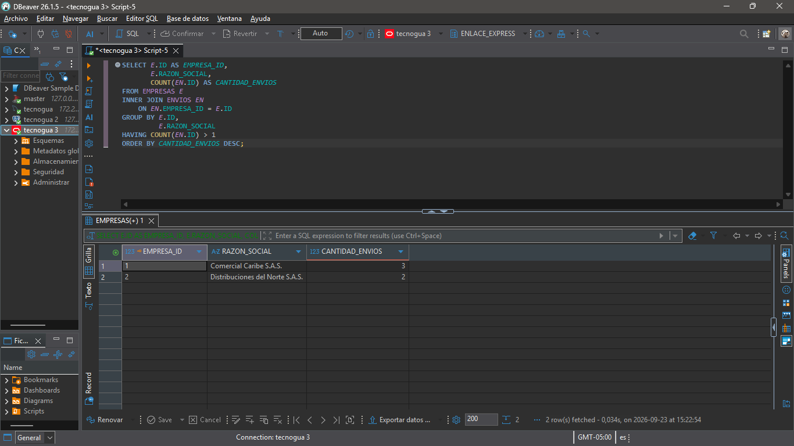

---

## 4.6 INNER JOIN

### Consulta 17 — INNER JOIN: empresa y envío

```sql
SELECT EN.ID AS ENVIO_ID,
       EN.REFERENCIA,
       E.RAZON_SOCIAL AS EMPRESA,
       EN.ESTADO,
       EN.PRIORIDAD
FROM ENVIOS EN
INNER JOIN EMPRESAS E
    ON E.ID = EN.EMPRESA_ID
ORDER BY EN.ID;
```

**Explicación:** Relaciona cada envío con la empresa correspondiente.

**Evidencia:**

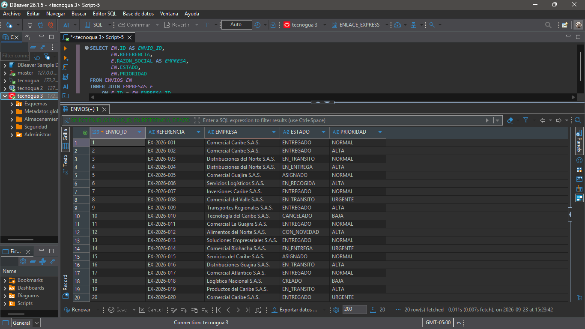

---

### Consulta 18 — Múltiples JOIN: mensajero y ruta

```sql
SELECT EN.ID AS ENVIO_ID,
       EN.REFERENCIA,
       E.RAZON_SOCIAL AS EMPRESA,
       M.NOMBRE AS MENSAJERO,
       R.NOMBRE AS RUTA,
       EN.ESTADO,
       EN.PRIORIDAD
FROM ENVIOS EN
INNER JOIN EMPRESAS E
    ON E.ID = EN.EMPRESA_ID
INNER JOIN MENSAJEROS M
    ON M.ID = EN.MENSAJERO_ID
INNER JOIN RUTAS R
    ON R.ID = EN.RUTA_ID
ORDER BY EN.ID;
```

**Explicación:** Combina la información del envío, empresa, mensajero y ruta.

**Evidencia:**

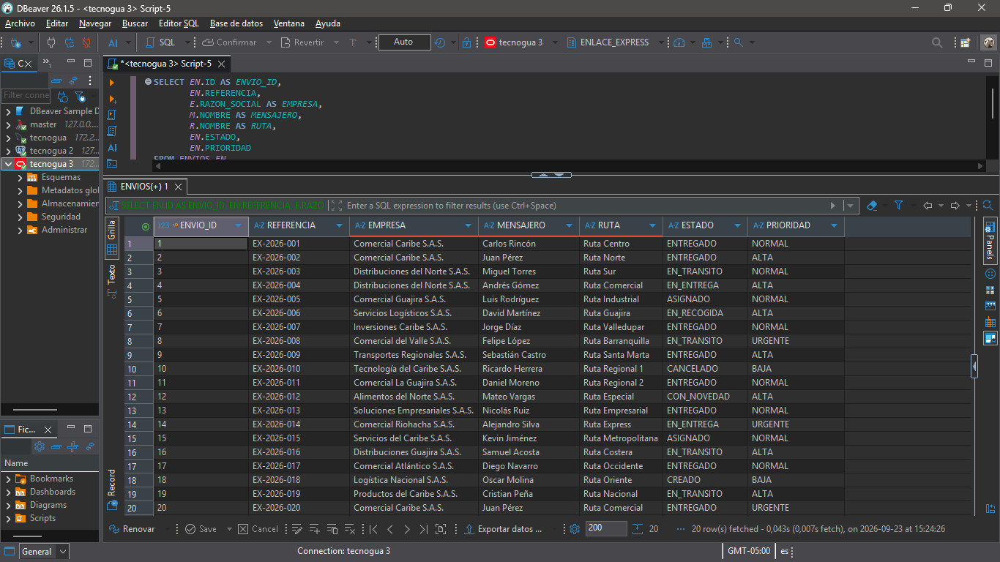

---

## 4.7 LEFT JOIN

### Consulta 19 — LEFT JOIN: empresas con envíos

```sql
SELECT E.ID AS EMPRESA_ID,
       E.RAZON_SOCIAL,
       COUNT(EN.ID) AS CANTIDAD_ENVIOS
FROM EMPRESAS E
LEFT JOIN ENVIOS EN
    ON EN.EMPRESA_ID = E.ID
GROUP BY E.ID,
         E.RAZON_SOCIAL
ORDER BY CANTIDAD_ENVIOS DESC,
         E.ID;
```

**Explicación:** Muestra todas las empresas y cuenta sus envíos, incluyendo las empresas que no tienen envíos.

**Evidencia:**

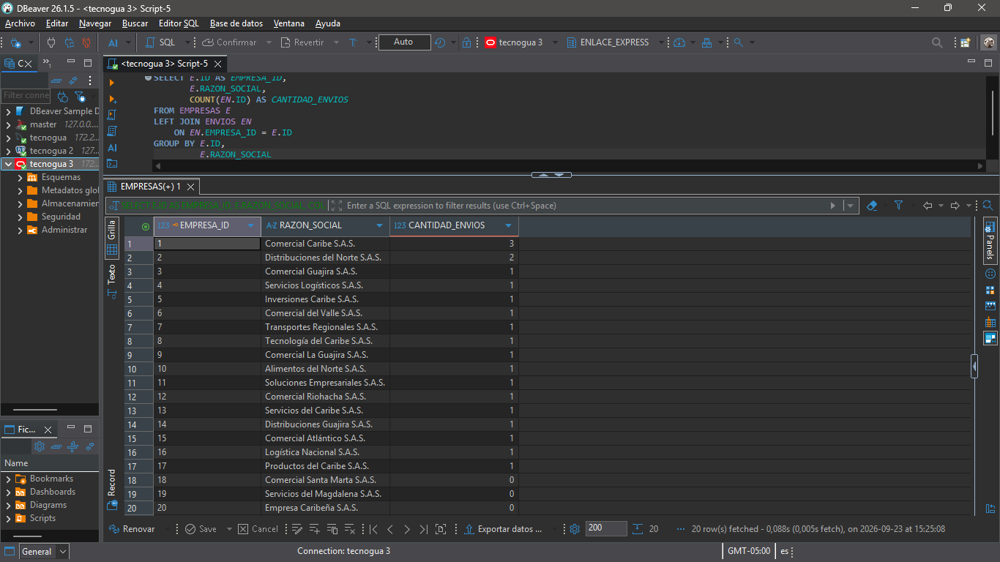

---

## 4.8 JOIN con paquetes

### Consulta 20 — JOIN: paquetes asociados a los envíos

```sql
SELECT EN.ID AS ENVIO_ID,
       EN.REFERENCIA,
       P.CODIGO AS CODIGO_PAQUETE,
       P.DESCRIPCION,
       P.PESO,
       P.ESTADO AS ESTADO_PAQUETE
FROM ENVIOS EN
INNER JOIN PAQUETES P
    ON P.ENVIO_ID = EN.ID
ORDER BY EN.ID;
```

**Explicación:** Relaciona cada envío con los paquetes asociados.

**Evidencia:**

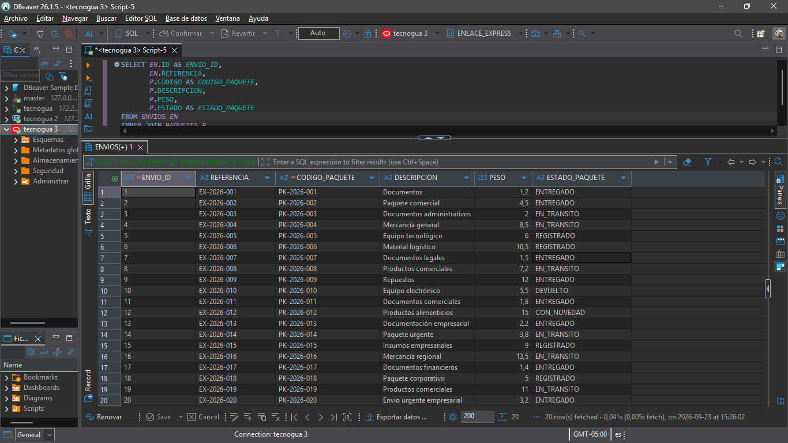

---

## 4.9 JOIN con facturas

### Consulta 21 — JOIN: envíos y facturas

```sql
SELECT EN.ID AS ENVIO_ID,
       EN.REFERENCIA,
       F.NUMERO_FACTURA,
       F.SUBTOTAL,
       F.IMPUESTO,
       F.TOTAL,
       F.ESTADO AS ESTADO_FACTURA
FROM ENVIOS EN
INNER JOIN FACTURAS F
    ON F.ENVIO_ID = EN.ID
ORDER BY EN.ID;
```

**Explicación:** Relaciona los envíos con sus respectivas facturas.

**Evidencia:**

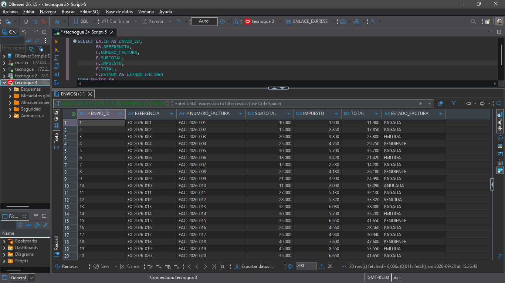

---

## 4.10 Consulta de tracking

### Consulta 22 — JOIN: envíos y tracking

```sql
SELECT EN.ID AS ENVIO_ID,
       EN.REFERENCIA,
       ET.ESTADO AS ESTADO_TRACKING,
       ET.DESCRIPCION,
       ET.LATITUD,
       ET.LONGITUD,
       ET.FECHA_EVENTO
FROM ENVIOS EN
INNER JOIN EVENTOS_TRACKING ET
    ON ET.ENVIO_ID = EN.ID
ORDER BY ET.FECHA_EVENTO;
```

**Explicación:** Muestra los eventos de seguimiento asociados a los envíos.

**Evidencia:**

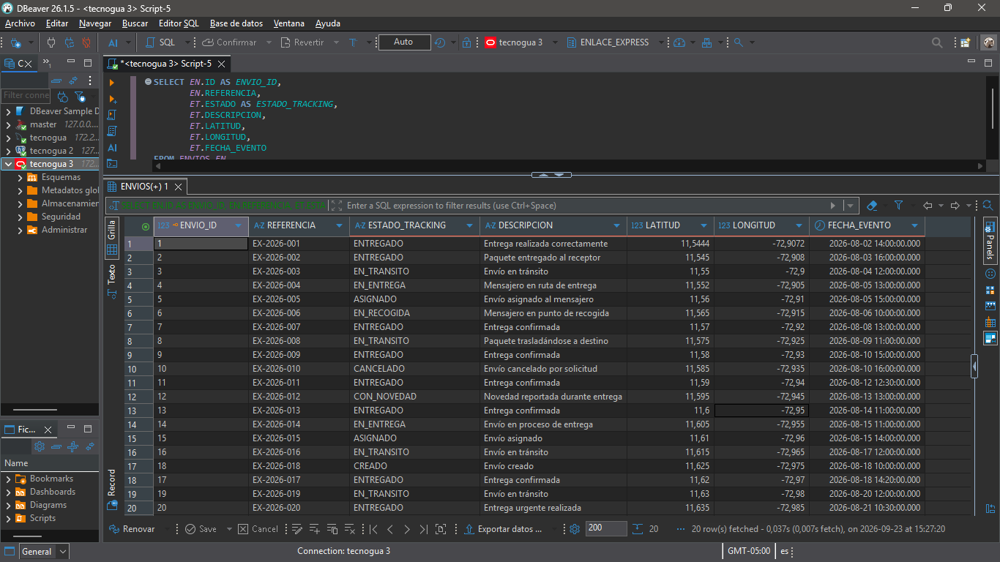

---

## 4.11 Subconsultas

### Consulta 23 — Subconsulta: facturas superiores al promedio

```sql
SELECT ID,
       NUMERO_FACTURA,
       EMPRESA_ID,
       TOTAL,
       ESTADO
FROM FACTURAS
WHERE TOTAL > (
    SELECT AVG(TOTAL)
    FROM FACTURAS
    WHERE IS_ACTIVE = 'ACTIVE'
)
ORDER BY TOTAL DESC;
```

**Explicación:** Muestra las facturas cuyo valor está por encima del promedio de las facturas activas.

**Evidencia:**

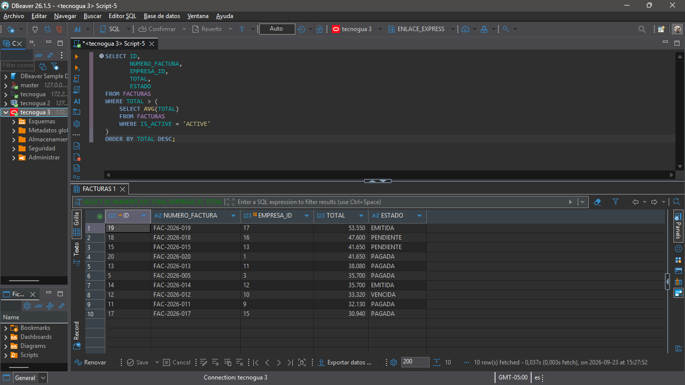

---

### Consulta 24 — EXISTS: empresas con envíos

```sql
SELECT E.ID,
       E.RAZON_SOCIAL,
       E.NIT
FROM EMPRESAS E
WHERE EXISTS (
    SELECT 1
    FROM ENVIOS EN
    WHERE EN.EMPRESA_ID = E.ID
)
ORDER BY E.ID;
```

**Explicación:** Muestra las empresas que tienen al menos un envío relacionado.

**Evidencia:**

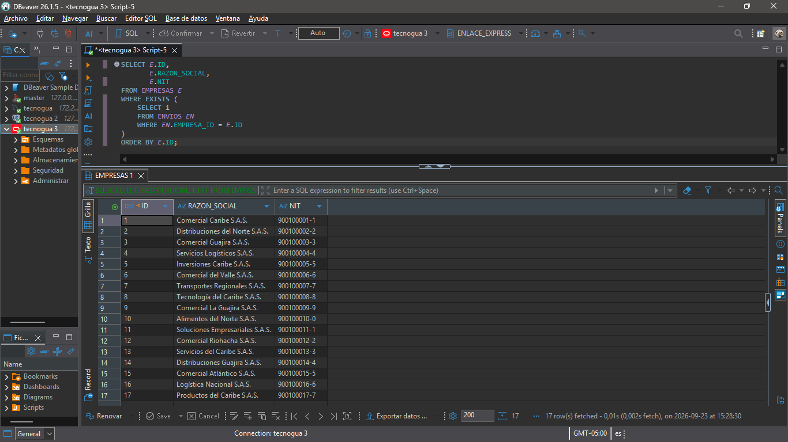

---

## 4.12 CASE

### Consulta 25 — CASE: clasificación de envíos

```sql
SELECT ID,
       REFERENCIA,
       PRIORIDAD,
       ESTADO,
       CASE
           WHEN PRIORIDAD = 'URGENTE'
               THEN 'Atención inmediata'
           WHEN PRIORIDAD = 'ALTA'
               THEN 'Atención prioritaria'
           WHEN PRIORIDAD = 'NORMAL'
               THEN 'Atención normal'
           ELSE 'Baja prioridad'
       END AS CLASIFICACION
FROM ENVIOS
ORDER BY ID;
```

**Explicación:** Clasifica los envíos según su nivel de prioridad.

**Evidencia:**

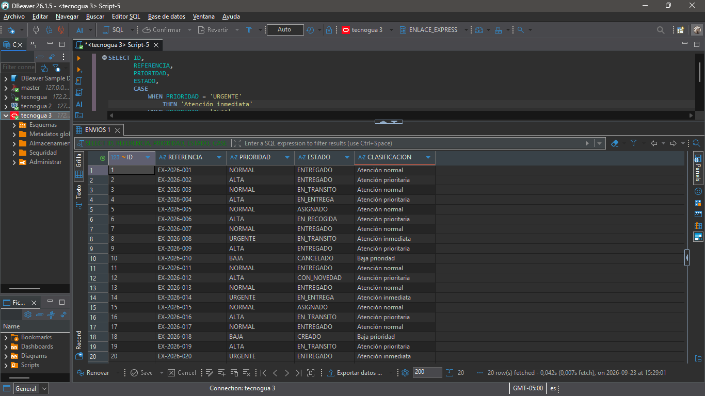

---

## 4.13 COALESCE

### Consulta 26 — COALESCE: fecha de entrega

```sql
SELECT ID,
       REFERENCIA,
       FECHA_SOLICITUD,
       COALESCE(
           TO_CHAR(FECHA_ENTREGA, 'YYYY-MM-DD HH24:MI:SS'),
           'Pendiente de entrega'
       ) AS FECHA_ENTREGA
FROM ENVIOS
ORDER BY ID;
```

**Explicación:** Muestra la fecha de entrega y, cuando no existe, muestra `Pendiente de entrega`.

**Evidencia:**

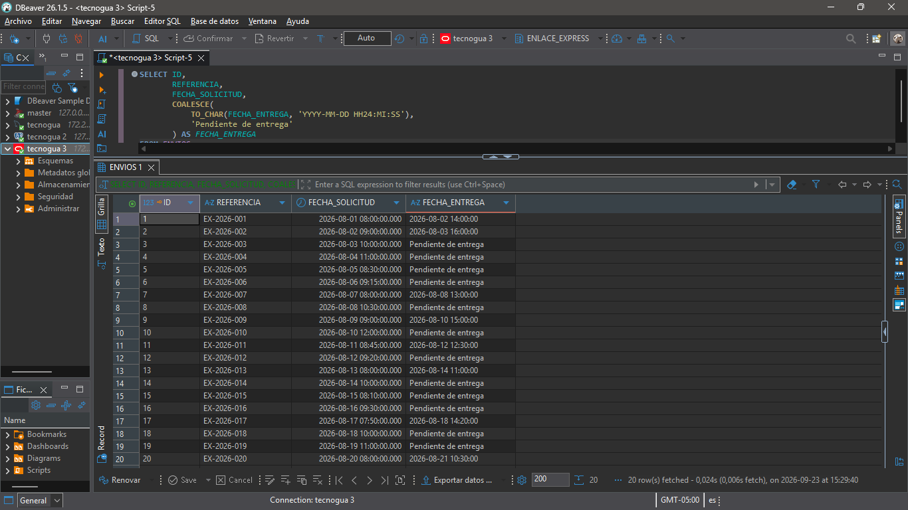

---

## 4.14 CTE — WITH

### Consulta 27 — CTE: resumen de envíos por empresa

```sql
WITH RESUMEN_ENVIOS AS
(
    SELECT EMPRESA_ID,
           COUNT(*) AS CANTIDAD_ENVIOS,
           SUM(
               CASE
                   WHEN ESTADO = 'ENTREGADO'
                   THEN 1
                   ELSE 0
               END
           ) AS ENTREGADOS
    FROM ENVIOS
    GROUP BY EMPRESA_ID
)
SELECT E.ID AS EMPRESA_ID,
       E.RAZON_SOCIAL,
       R.CANTIDAD_ENVIOS,
       R.ENTREGADOS
FROM RESUMEN_ENVIOS R
INNER JOIN EMPRESAS E
    ON E.ID = R.EMPRESA_ID
ORDER BY R.CANTIDAD_ENVIOS DESC;
```

**Explicación:** Utiliza un CTE para calcular el total de envíos y los envíos entregados por empresa.

**Evidencia:**

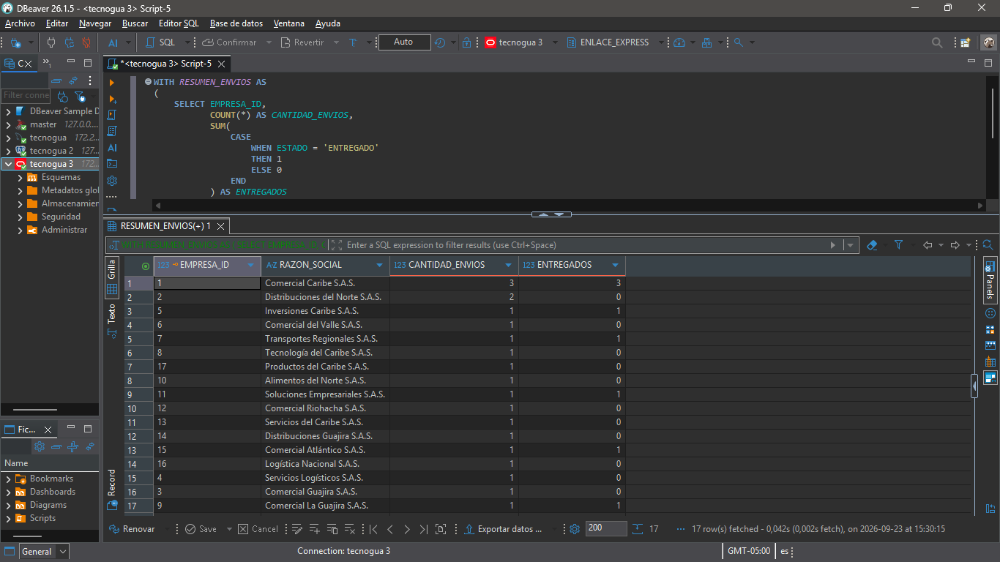

---

## 4.15 Funciones de ventana

### Consulta 28 — RANK: empresas según cantidad de envíos

```sql
SELECT E.ID AS EMPRESA_ID,
       E.RAZON_SOCIAL,
       COUNT(EN.ID) AS CANTIDAD_ENVIOS,
       RANK() OVER (
           ORDER BY COUNT(EN.ID) DESC
       ) AS POSICION
FROM EMPRESAS E
LEFT JOIN ENVIOS EN
    ON EN.EMPRESA_ID = E.ID
GROUP BY E.ID,
         E.RAZON_SOCIAL
ORDER BY POSICION,
         E.ID;
```

**Explicación:** Asigna una posición a cada empresa según la cantidad de envíos registrados.

**Evidencia:**

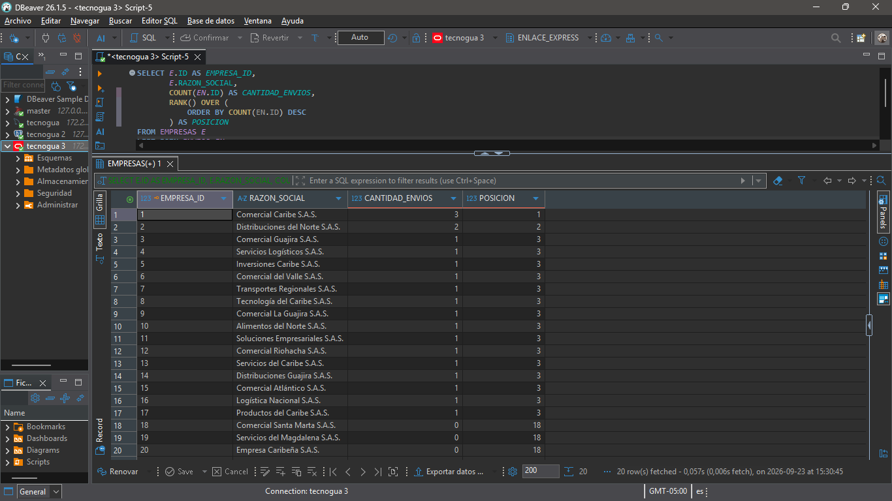

---

### Consulta 29 — ROW_NUMBER: numerar envíos

```sql
SELECT ROW_NUMBER() OVER (
           ORDER BY FECHA_SOLICITUD
       ) AS NUMERO,
       ID,
       REFERENCIA,
       FECHA_SOLICITUD,
       ESTADO
FROM ENVIOS
ORDER BY FECHA_SOLICITUD;
```

**Explicación:** Asigna un número consecutivo a cada envío según su fecha de solicitud.

**Evidencia:**

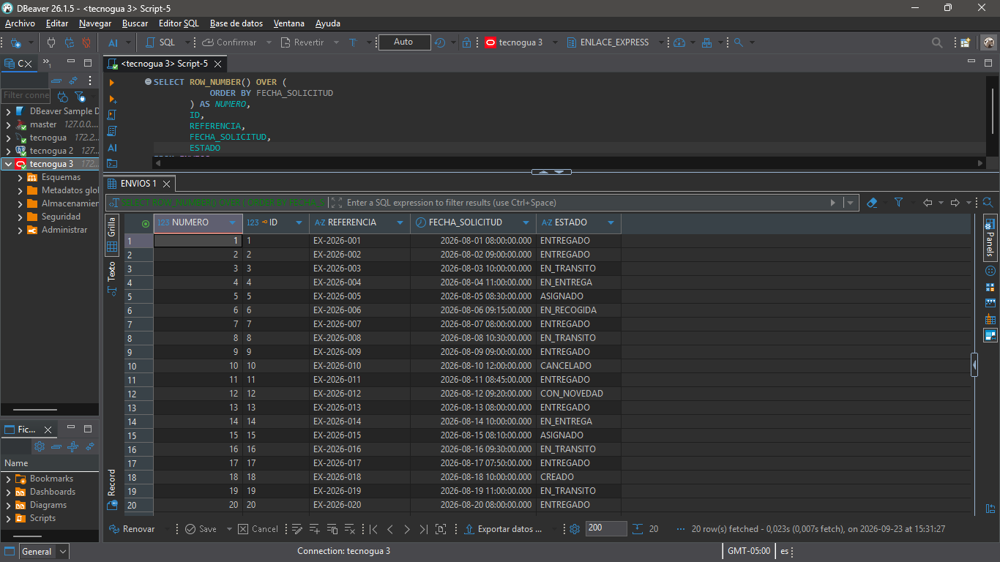

---

## 4.16 Usuarios y roles

### Consulta 30 — Usuarios y roles

```sql
SELECT U.ID AS USUARIO_ID,
       U.USERNAME,
       U.EMAIL,
       R.NAME AS ROL
FROM USERS U
INNER JOIN ROLE_USERS RU
    ON RU.USER_ID = U.ID
INNER JOIN ROLES R
    ON R.ID = RU.ROLE_ID
ORDER BY R.NAME,
         U.USERNAME;
```

**Explicación:** Muestra los usuarios registrados y los roles que tienen asignados.

**Evidencia:**

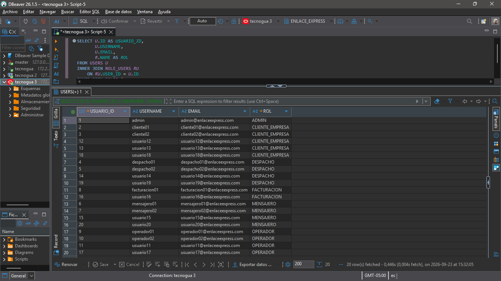

---

## 4.17 RBAC

### Consulta 31 — RBAC: roles y recursos

```sql
SELECT R.NAME AS ROL,
       RES.PATH,
       RES.METHOD,
       RES.IS_ACTIVE AS RECURSO_ACTIVO
FROM ROLES R
INNER JOIN RESOURCE_ROLES RR
    ON RR.ROLE_ID = R.ID
INNER JOIN RESOURCES RES
    ON RES.ID = RR.RESOURCE_ID
WHERE R.IS_ACTIVE = 'ACTIVE'
  AND RR.IS_ACTIVE = 'ACTIVE'
  AND RES.IS_ACTIVE = 'ACTIVE'
ORDER BY R.NAME,
         RES.PATH,
         RES.METHOD;
```

**Explicación:** Muestra los recursos activos relacionados con cada rol.

**Evidencia:**

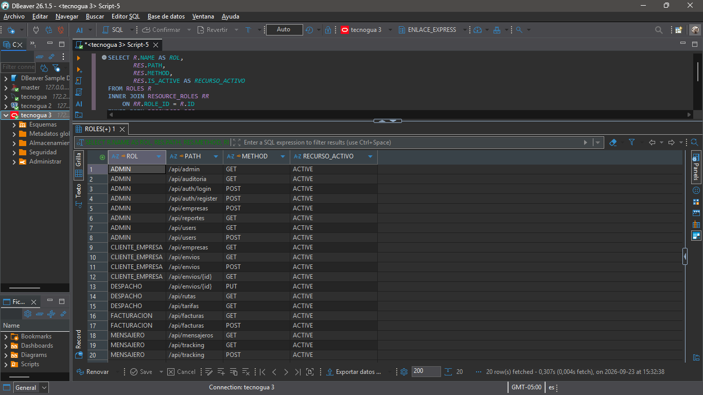

---

## 4.18 UNION

### Consulta 32 — UNION: empresas y mensajeros

```sql
SELECT 'EMPRESA' AS TIPO,
       RAZON_SOCIAL AS NOMBRE,
       IS_ACTIVE
FROM EMPRESAS

UNION

SELECT 'MENSAJERO' AS TIPO,
       NOMBRE,
       IS_ACTIVE
FROM MENSAJEROS

ORDER BY TIPO,
         NOMBRE;
```

**Explicación:** Combina los nombres de empresas y mensajeros en un solo resultado.

**Evidencia:**

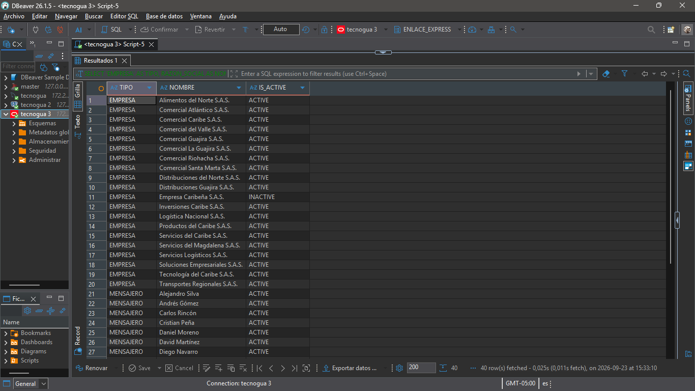

---

## 4.19 Consulta avanzada de facturación

### Consulta 33 — Resumen avanzado de facturación

```sql
SELECT E.ID AS EMPRESA_ID,
       E.RAZON_SOCIAL,
       COUNT(F.ID) AS CANTIDAD_FACTURAS,
       SUM(F.SUBTOTAL) AS SUBTOTAL,
       SUM(F.IMPUESTO) AS IMPUESTO,
       SUM(F.TOTAL) AS TOTAL_FACTURADO,
       ROUND(AVG(F.TOTAL), 2) AS PROMEDIO_FACTURA,
       MIN(F.TOTAL) AS FACTURA_MINIMA,
       MAX(F.TOTAL) AS FACTURA_MAXIMA
FROM EMPRESAS E
LEFT JOIN FACTURAS F
    ON F.EMPRESA_ID = E.ID
GROUP BY E.ID,
         E.RAZON_SOCIAL
ORDER BY TOTAL_FACTURADO DESC NULLS LAST;
```

**Explicación:** Genera un resumen de la facturación por empresa utilizando varias funciones de agregación.

**Evidencia:**

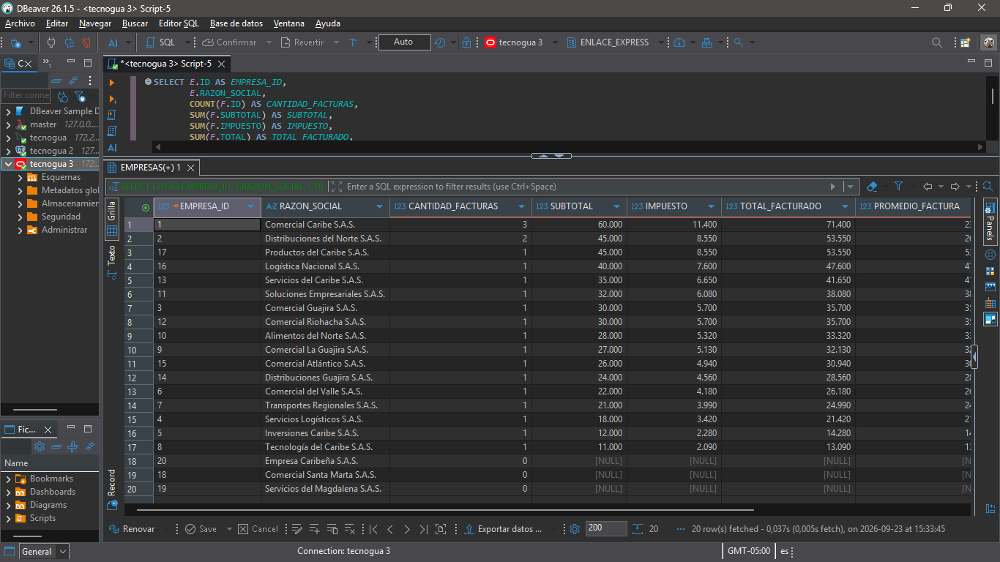

---

## 4.20 Consulta avanzada de paquetes

### Consulta 34 — Resumen de paquetes por estado

```sql
SELECT P.ESTADO,
       COUNT(*) AS CANTIDAD_PAQUETES,
       SUM(P.PESO) AS PESO_TOTAL,
       ROUND(AVG(P.PESO), 2) AS PESO_PROMEDIO,
       MIN(P.PESO) AS PESO_MINIMO,
       MAX(P.PESO) AS PESO_MAXIMO
FROM PAQUETES P
GROUP BY P.ESTADO
ORDER BY CANTIDAD_PAQUETES DESC;
```

**Explicación:** Resume los paquetes por estado y calcula diferentes valores relacionados con su peso.

**Evidencia:**

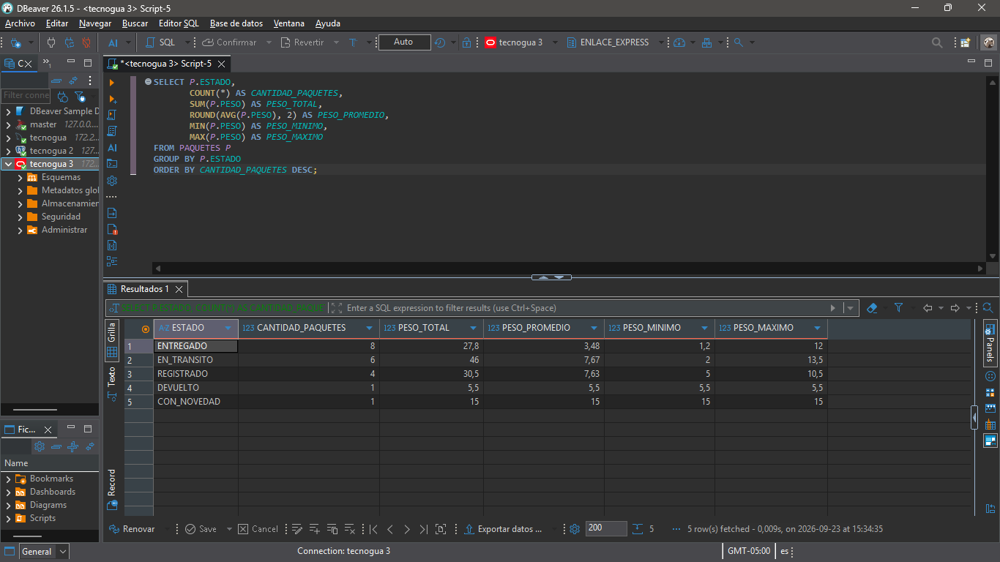

---

## 4.21 Consulta completa de envíos

### Consulta 35 — Consulta completa de envíos

```sql
SELECT EN.ID AS ENVIO_ID,
       EN.REFERENCIA,
       E.RAZON_SOCIAL AS EMPRESA,
       M.NOMBRE AS MENSAJERO,
       R.NOMBRE AS RUTA,
       T.NOMBRE AS TARIFA,
       P.CODIGO AS PAQUETE,
       P.PESO,
       EN.ESTADO AS ESTADO_ENVIO,
       EN.PRIORIDAD,
       F.NUMERO_FACTURA,
       F.TOTAL AS VALOR_FACTURA,
       F.ESTADO AS ESTADO_FACTURA,
       EN.FECHA_SOLICITUD,
       EN.FECHA_ENTREGA
FROM ENVIOS EN
INNER JOIN EMPRESAS E
    ON E.ID = EN.EMPRESA_ID
LEFT JOIN MENSAJEROS M
    ON M.ID = EN.MENSAJERO_ID
LEFT JOIN RUTAS R
    ON R.ID = EN.RUTA_ID
LEFT JOIN TARIFAS T
    ON T.ID = EN.TARIFA_ID
LEFT JOIN PAQUETES P
    ON P.ENVIO_ID = EN.ID
LEFT JOIN FACTURAS F
    ON F.ENVIO_ID = EN.ID
ORDER BY EN.ID;
```

**Explicación:** Integra información del envío, empresa, mensajero, ruta, tarifa, paquete y factura.

**Evidencia:**

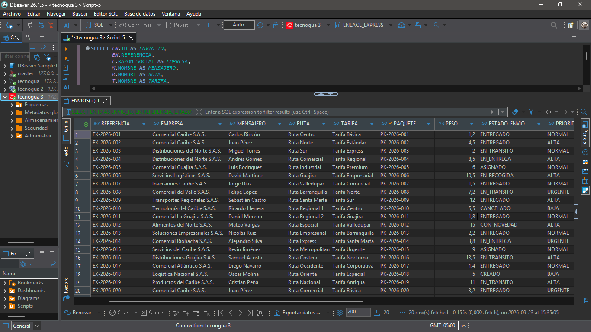

---

## 4.22 Consulta avanzada de seguimiento

### Consulta 36 — Último evento de tracking por envío

```sql
SELECT EN.ID AS ENVIO_ID,
       EN.REFERENCIA,
       ET.ESTADO,
       ET.DESCRIPCION,
       ET.FECHA_EVENTO
FROM ENVIOS EN
INNER JOIN EVENTOS_TRACKING ET
    ON ET.ID = (
        SELECT ET2.ID
        FROM EVENTOS_TRACKING ET2
        WHERE ET2.ENVIO_ID = EN.ID
        ORDER BY ET2.FECHA_EVENTO DESC
        FETCH FIRST 1 ROW ONLY
    )
ORDER BY EN.ID;
```

**Explicación:** Obtiene el evento de tracking más reciente registrado para cada envío.

**Evidencia:**

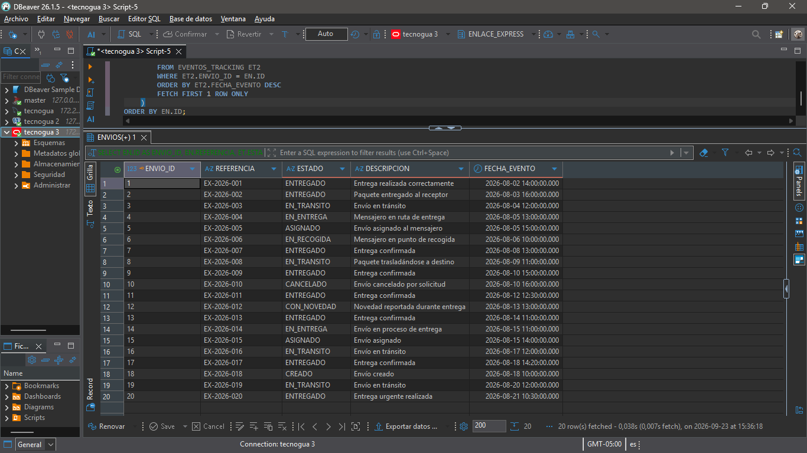

---

## 4.23 HAVING

### Consulta 37 — HAVING: estados con más de un envío

```sql
SELECT ESTADO,
       COUNT(*) AS CANTIDAD_ENVIOS
FROM ENVIOS
GROUP BY ESTADO
HAVING COUNT(*) > 1
ORDER BY CANTIDAD_ENVIOS DESC;
```

**Explicación:** Muestra los estados que tienen más de un envío registrado.

**Evidencia:**

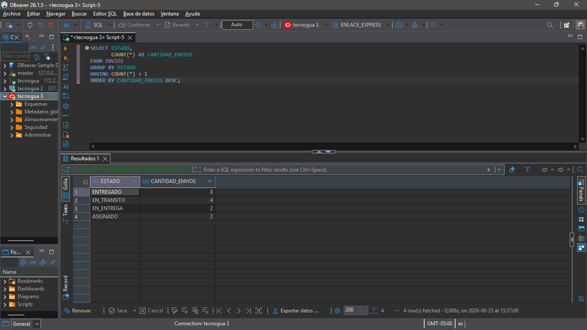

---

## 4.24 Consulta de entregas por mensajero

### Consulta 38 — Envíos por mensajero y porcentaje de entregas

```sql
SELECT M.ID AS MENSAJERO_ID,
       M.NOMBRE AS MENSAJERO,
       COUNT(EN.ID) AS TOTAL_ENVIOS,
       SUM(
           CASE
               WHEN EN.ESTADO = 'ENTREGADO'
               THEN 1
               ELSE 0
           END
       ) AS ENVIOS_ENTREGADOS,
       ROUND(
           100 *
           SUM(
               CASE
                   WHEN EN.ESTADO = 'ENTREGADO'
                   THEN 1
                   ELSE 0
               END
           )
           / NULLIF(COUNT(EN.ID), 0),
           2
       ) AS PORCENTAJE_ENTREGADOS
FROM MENSAJEROS M
LEFT JOIN ENVIOS EN
    ON EN.MENSAJERO_ID = M.ID
GROUP BY M.ID,
         M.NOMBRE
ORDER BY PORCENTAJE_ENTREGADOS DESC NULLS LAST,
         TOTAL_ENVIOS DESC;
```

**Explicación:** Muestra el total de envíos de cada mensajero, cuántos fueron entregados y el porcentaje de entregas.

**Evidencia:**

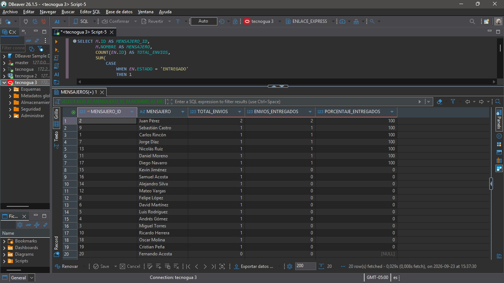

---

## Conclusión

Las 38 consultas realizadas permitieron aplicar y comprobar diferentes operaciones de SQL sobre la base de datos **Enlace Express** en MySQL, PostgreSQL, SQL Server y Oracle. Se trabajó con filtros, funciones de agregación, relaciones entre tablas, subconsultas, CTE, funciones de ventana, `UNION`, `CASE` y consultas relacionadas con usuarios y permisos. Las evidencias obtenidas permiten verificar el funcionamiento de cada consulta en los diferentes motores de bases de datos.
