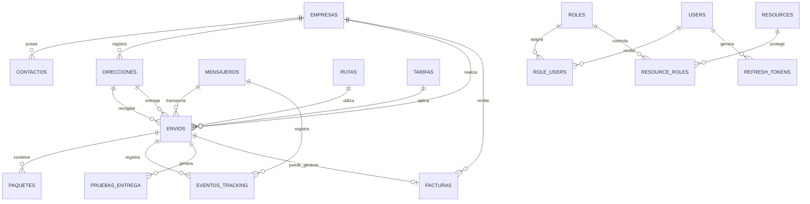
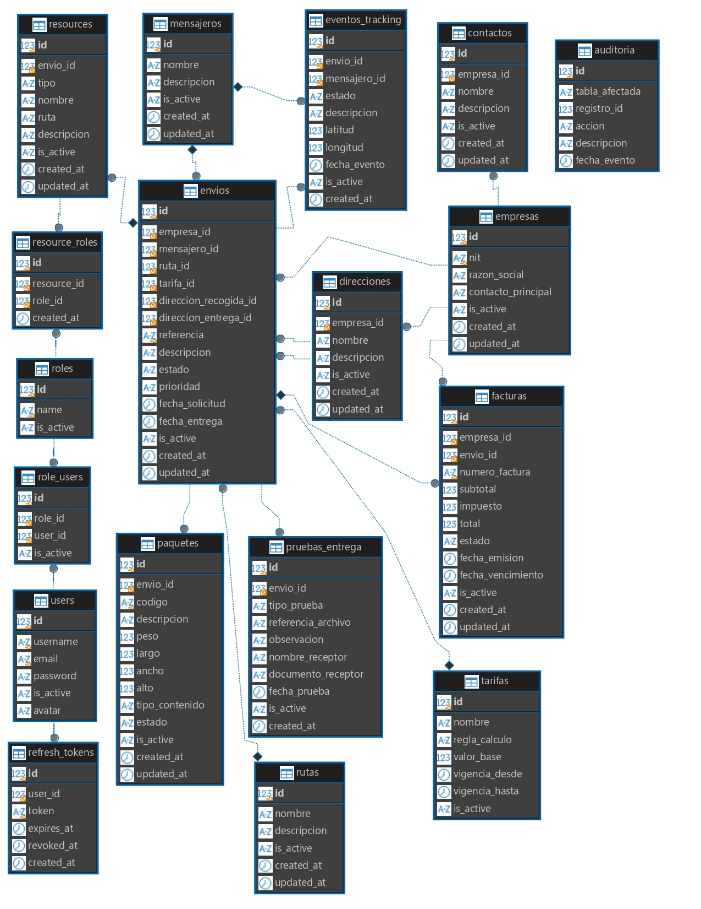
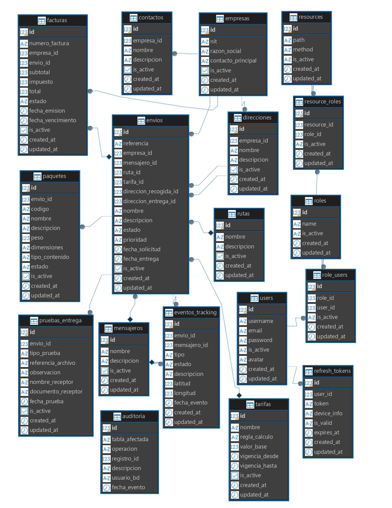
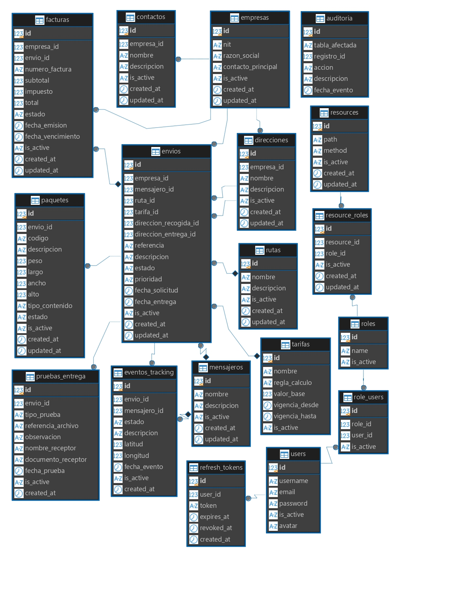
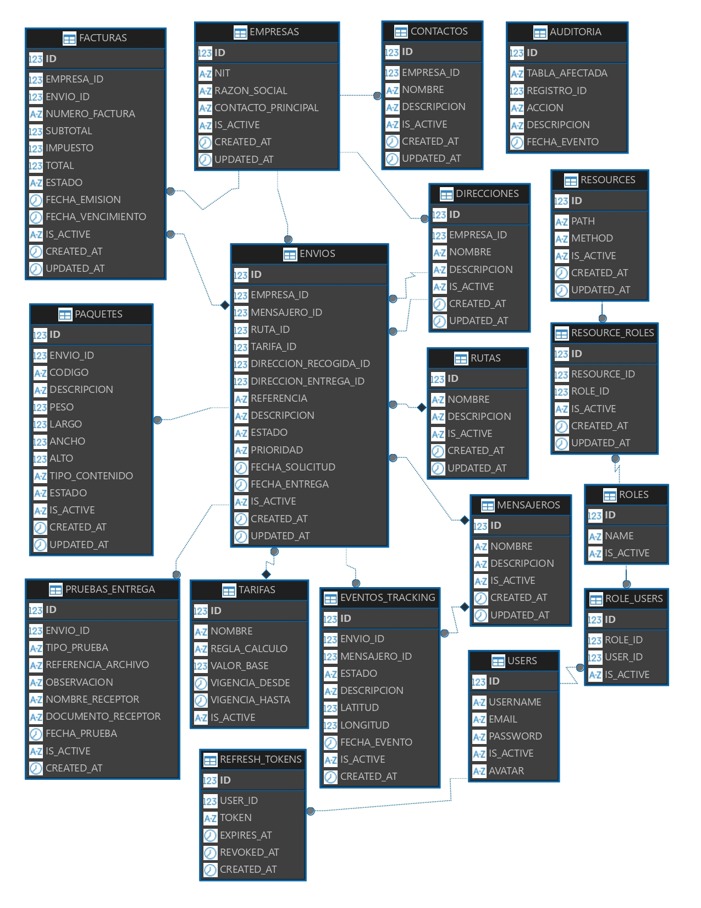

# Dominio de EnlaceExpress

## 1. Descripción general

**EnlaceExpress** es un sistema orientado a la gestión de envíos y servicios de mensajería para empresas. El sistema permite administrar empresas, direcciones, contactos, envíos, paquetes, rutas, mensajeros, tarifas, facturación y seguimiento de los envíos.

El modelo de datos también incorpora funciones relacionadas con la seguridad y el control de acceso, como usuarios, roles, recursos, asignación de permisos y tokens de autenticación.

El proyecto implementa este mismo modelo lógico en cuatro motores de bases de datos:

* MySQL
* PostgreSQL
* SQL Server
* Oracle

Las cuatro implementaciones mantienen las mismas entidades principales y relaciones del dominio. Las diferencias entre motores corresponden principalmente a la forma en que cada sistema gestor implementa tipos de datos, restricciones, autoincrementos, esquemas y otras características propias.

---

## 2. Modelo general del dominio

El dominio de EnlaceExpress se centra en el proceso de gestión de un envío.

Una empresa registra un envío indicando una referencia, direcciones de recogida y entrega, prioridad y otros datos relacionados. El envío puede ser asignado a un mensajero, utilizar una ruta y aplicar una tarifa.

Cada envío puede contener uno o varios paquetes y puede generar diferentes eventos de seguimiento durante su recorrido. Al finalizar el proceso se puede registrar una prueba de entrega y asociar la información de facturación correspondiente.

De forma complementaria, el sistema administra usuarios y permisos mediante un modelo de control de acceso basado en roles (RBAC).

---

## 3. Entidades principales

La estructura principal del dominio está compuesta por 18 tablas:

```text
auditoria
contactos
direcciones
empresas
envios
eventos_tracking
facturas
mensajeros
paquetes
pruebas_entrega
refresh_tokens
resource_roles
resources
role_users
roles
rutas
tarifas
users
```

Estas entidades pueden agruparse en cuatro áreas principales:

### Gestión empresarial y logística

```text
empresas
contactos
direcciones
envios
paquetes
rutas
mensajeros
tarifas
```

### Seguimiento y entrega

```text
eventos_tracking
pruebas_entrega
```

### Facturación

```text
facturas
```

### Seguridad, acceso y auditoría

```text
users
roles
role_users
resources
resource_roles
refresh_tokens
auditoria
```

---

## 4. Modelo de relaciones

Las principales relaciones del dominio se representan mediante el siguiente modelo:



El modelo muestra que `envios` constituye una de las entidades centrales del sistema, ya que relaciona la empresa, las direcciones, el mensajero, la ruta, la tarifa, los paquetes, el seguimiento y la facturación.

---

## 5. Empresas, contactos y direcciones

La entidad `empresas` representa a las organizaciones que utilizan el servicio de EnlaceExpress.

Cada empresa contiene información como:

* Identificación tributaria.
* Razón social.
* Contacto principal.
* Estado de la empresa.
* Fecha de creación y actualización.

Una empresa puede registrar diferentes contactos mediante la tabla `contactos`.

También puede registrar diferentes direcciones mediante la tabla `direcciones`. Estas direcciones pueden utilizarse posteriormente como puntos de recogida o entrega de los envíos.

Las relaciones principales son:

```text
EMPRESA
   ├── CONTACTOS
   ├── DIRECCIONES
   ├── ENVIOS
   └── FACTURAS
```

---

## 6. Gestión de envíos

La entidad `envios` representa el proceso principal del sistema.

Cada envío pertenece a una empresa y contiene una referencia única que permite identificarlo. También registra las direcciones de recogida y entrega, y puede estar asociado con:

* Un mensajero.
* Una ruta.
* Una tarifa.
* Una o varias unidades de paquete.
* Eventos de seguimiento.
* Una prueba de entrega.
* Una factura.

El envío maneja diferentes estados:

```text
CREADO
ASIGNADO
EN_RECOGIDA
EN_TRANSITO
EN_ENTREGA
ENTREGADO
CANCELADO
CON_NOVEDAD
```

También maneja diferentes niveles de prioridad:

```text
BAJA
NORMAL
ALTA
URGENTE
```

El estado permite representar la evolución del envío durante el proceso de distribución.

---

## 7. Gestión de paquetes

La tabla `paquetes` representa los elementos físicos asociados a un envío.

Cada paquete pertenece a un envío y contiene información como:

* Código de identificación.
* Descripción.
* Peso.
* Largo.
* Ancho.
* Alto.
* Tipo de contenido.
* Estado.

Los estados definidos para los paquetes son:

```text
REGISTRADO
EN_TRANSITO
ENTREGADO
DEVUELTO
CON_NOVEDAD
```

La relación principal es:

```text
ENVIO
  └── PAQUETES
```

Un envío puede contener varios paquetes.

---

## 8. Seguimiento de envíos

La tabla `eventos_tracking` permite registrar los diferentes acontecimientos relacionados con el recorrido de un envío.

Cada evento pertenece a un envío y puede estar asociado con un mensajero.

La información registrada incluye:

* Estado del envío.
* Descripción del evento.
* Latitud.
* Longitud.
* Fecha del evento.
* Mensajero relacionado.

Esto permite mantener un historial del recorrido del envío.

La relación puede representarse como:

```text
ENVIO
  │
  └── EVENTOS_TRACKING
           │
           └── MENSAJERO
```

La información de latitud y longitud permite almacenar la ubicación relacionada con un evento de seguimiento.

---

## 9. Rutas y mensajeros

La tabla `rutas` representa las rutas disponibles para el proceso de distribución.

Un envío puede asociarse a una ruta determinada.

La tabla `mensajeros` representa las personas encargadas de transportar los envíos.

Un envío puede tener un mensajero asignado y los eventos de seguimiento también pueden registrar el mensajero que realizó la operación.

La relación general es:

```text
RUTA ────────┐
             │
             ▼
           ENVIO
             ▲
             │
MENSAJERO ───┘
```

---

## 10. Tarifas

La tabla `tarifas` representa las reglas económicas utilizadas para calcular el valor de los servicios de envío.

Cada tarifa contiene información como:

* Nombre.
* Regla de cálculo.
* Valor base.
* Fecha de inicio de vigencia.
* Fecha de finalización de vigencia.
* Estado.

Un envío puede utilizar una tarifa determinada.

La relación es:

```text
TARIFA
   │
   └── ENVIO
```

La separación de las tarifas permite administrar diferentes reglas de cálculo sin modificar directamente la estructura de los envíos.

---

## 11. Facturación

La tabla `facturas` permite registrar la información económica asociada a las empresas y a los envíos.

Una factura contiene:

* Número de factura.
* Empresa.
* Envío relacionado, cuando corresponda.
* Subtotal.
* Impuesto.
* Total.
* Fecha de emisión.
* Fecha de vencimiento.
* Estado.

Los estados definidos son:

```text
PENDIENTE
EMITIDA
PAGADA
ANULADA
VENCIDA
```

La facturación se relaciona principalmente con:

```text
EMPRESA
   │
   └── FACTURA
          │
          └── ENVIO
```

---

## 12. Pruebas de entrega

La tabla `pruebas_entrega` permite registrar la evidencia asociada a la entrega de un envío.

Se pueden registrar diferentes tipos de prueba:

```text
FIRMA
FOTO
DOCUMENTO
CODIGO
OTRA
```

Además, se puede almacenar información relacionada con el receptor, observaciones y una referencia al archivo utilizado como evidencia.

La relación principal es:

```text
ENVIO
   └── PRUEBA_ENTREGA
```

Esto permite conservar información que respalda la finalización del proceso de entrega.

---

## 13. Usuarios y control de acceso

EnlaceExpress incorpora un modelo de **control de acceso basado en roles (RBAC)**.

Este modelo permite relacionar usuarios con roles y roles con recursos del sistema.

La estructura es:

```text
USERS
   │
   ▼
ROLE_USERS
   │
   ▼
ROLES
   │
   ▼
RESOURCE_ROLES
   │
   ▼
RESOURCES
```

Los roles utilizados en el sistema son:

| Rol               | Descripción general                              |
| ----------------- | ------------------------------------------------ |
| `ADMIN`           | Administración general del sistema               |
| `CLIENTE_EMPRESA` | Funciones relacionadas con las empresas clientes |
| `DESPACHO`        | Gestión de operaciones de despacho               |
| `MENSAJERO`       | Funciones relacionadas con la distribución       |
| `FACTURACION`     | Funciones relacionadas con facturación           |
| `OPERADOR`        | Operaciones generales del sistema                |

La tabla `role_users` permite asignar roles a usuarios.

La tabla `resources` representa recursos protegidos del sistema, identificados mediante una ruta y un método.

La tabla `resource_roles` establece qué roles tienen acceso a cada recurso.

---

## 14. Autenticación y sesiones

La tabla `refresh_tokens` forma parte del mecanismo de autenticación.

Cada registro se relaciona con un usuario y almacena información necesaria para controlar la vigencia y revocación del token.

Se registran principalmente:

* Usuario.
* Token.
* Fecha de expiración.
* Fecha de revocación.
* Fecha de creación.

La relación es:

```text
USER
  └── REFRESH_TOKENS
```

---

## 15. Auditoría

La tabla `auditoria` permite registrar acciones realizadas sobre diferentes registros del sistema.

La información almacenada incluye:

* Tabla afectada.
* Identificador del registro.
* Acción realizada.
* Descripción.
* Fecha del evento.

La auditoría permite conservar un registro de cambios importantes realizados sobre la información.

En la implementación MySQL se utilizan mecanismos de base de datos, como triggers, para registrar automáticamente determinadas operaciones sobre los envíos y paquetes.

Estas características pueden variar en su implementación física según el motor utilizado, pero cumplen la misma función dentro del dominio: conservar información de auditoría.

---

## 16. Reglas y características principales del dominio

A partir del modelo de datos se identifican las siguientes reglas:

1. Cada empresa debe tener un identificador tributario único.
2. Cada envío pertenece a una empresa.
3. Cada envío tiene una referencia única.
4. Un envío debe tener una dirección de recogida y una dirección de entrega.
5. Un envío puede tener un mensajero asignado.
6. Un envío puede utilizar una ruta.
7. Un envío puede aplicar una tarifa.
8. Un envío puede contener varios paquetes.
9. Un envío puede generar múltiples eventos de seguimiento.
10. Los eventos de seguimiento pueden registrar información de ubicación.
11. Un envío puede tener información de prueba de entrega.
12. Las facturas se relacionan con empresas y pueden relacionarse con un envío.
13. Los usuarios pueden tener uno o varios roles.
14. Los roles pueden tener acceso a diferentes recursos.
15. Los usuarios pueden generar tokens de actualización para la autenticación.
16. El sistema conserva información de auditoría sobre determinadas operaciones.

---

## 17. Estados principales

El dominio utiliza diferentes estados para representar el ciclo de vida de la información.

### Estados de envíos

```text
CREADO → ASIGNADO → EN_RECOGIDA → EN_TRANSITO → EN_ENTREGA → ENTREGADO
```

También pueden presentarse los estados:

```text
CANCELADO
CON_NOVEDAD
```

### Estados de paquetes

```text
REGISTRADO
EN_TRANSITO
ENTREGADO
DEVUELTO
CON_NOVEDAD
```

### Estados de facturas

```text
PENDIENTE
EMITIDA
PAGADA
ANULADA
VENCIDA
```

### Estados de registros

Varias entidades utilizan estados generales:

```text
ACTIVE
INACTIVE
```

Estos permiten activar o desactivar registros sin eliminarlos físicamente.

---

## 18. Modelo lógico común para los cuatro motores

El proyecto utiliza un modelo lógico común para los cuatro motores de bases de datos.

```text
                  ENLACEEXPRESS
                       │
                 MODELO LÓGICO
                       │
              ┌────────┴────────┐
              │                 │
        18 entidades       Reglas del dominio
              │                 │
              └────────┬────────┘
                       │
       ┌───────────────┼────────────────┐
       │               │                │
     MySQL        PostgreSQL        SQL Server
       │               │                │
       └───────────────┼────────────────┘
                       │
                     Oracle
```

Los cuatro motores representan el mismo dominio de información. La implementación física se adapta a las características de cada sistema gestor.

Entre las diferencias de implementación se encuentran los tipos de datos, mecanismos de generación de identificadores, representación de estados, esquemas y restricciones.

Por esta razón, las estructuras no necesitan ser idénticas a nivel de sintaxis para conservar la equivalencia del dominio.

---

## 19. Evidencia del modelo de datos

El proyecto cuenta con diagramas entidad-relación correspondientes a los cuatro motores implementados.

### MySQL



### PostgreSQL



### SQL Server



### Oracle



Estos diagramas permiten verificar visualmente la estructura de las entidades y sus relaciones en cada implementación.

---

## 20. Evidencias complementarias

La estructura de las 18 tablas también fue verificada mediante las herramientas gráficas nativas de cada motor.

Las evidencias se encuentran organizadas en:

```text
evidencias/12-GUI/
├── 01-mysql-workbench/
├── 02-postgresql-pgadmin-4/
├── 03-sql-server-ssms/
└── 04-oracle-sql-developer/
```

Estas evidencias contienen la revisión individual de las 18 tablas en cada motor.

Las consultas realizadas sobre este dominio se encuentran documentadas de forma independiente en:

```text
docs/CONSULTAS-AVANZADAS.md
```

y sus respectivas evidencias visuales se encuentran en:

```text
evidencias/11-consultas-avanzadas/
```

---

## 21. Relación del dominio con las consultas avanzadas

El dominio definido para EnlaceExpress sirve como base para las consultas SQL realizadas en los cuatro motores.

Las consultas utilizan información relacionada principalmente con:

* Empresas.
* Envíos.
* Paquetes.
* Facturas.
* Mensajeros.
* Rutas.
* Tarifas.
* Eventos de seguimiento.
* Usuarios y roles.

De esta forma, las consultas avanzadas permiten comprobar el funcionamiento del modelo y consultar la información desde diferentes perspectivas, manteniendo el mismo dominio lógico en MySQL, PostgreSQL, SQL Server y Oracle.

---

## 22. Conclusión

El dominio de EnlaceExpress está orientado a la gestión integral de envíos para empresas, incluyendo la administración de paquetes, rutas, mensajeros, seguimiento, pruebas de entrega, tarifas y facturación.

El modelo también incorpora mecanismos de seguridad mediante usuarios, roles y recursos, además de mecanismos de autenticación y auditoría.

Las cuatro bases de datos implementadas utilizan este mismo dominio lógico y mantienen las 18 entidades principales. Las diferencias existentes entre MySQL, PostgreSQL, SQL Server y Oracle corresponden a la adaptación de la estructura a las características propias de cada motor.

Por lo tanto, el dominio de EnlaceExpress se considera **uno solo**, mientras que las cuatro bases de datos representan diferentes implementaciones físicas del mismo modelo de información.
