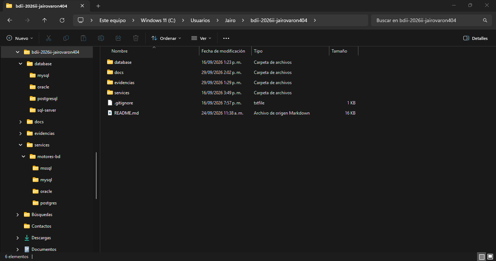
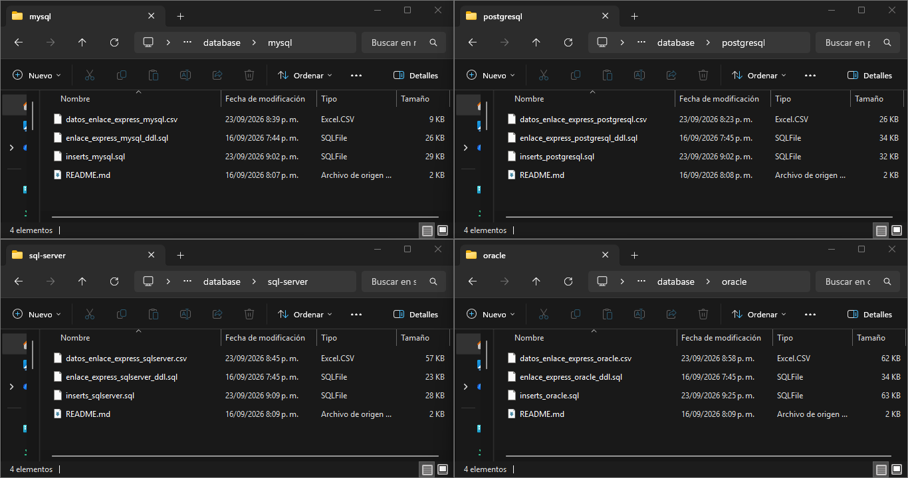
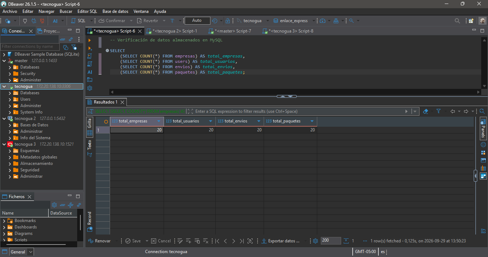
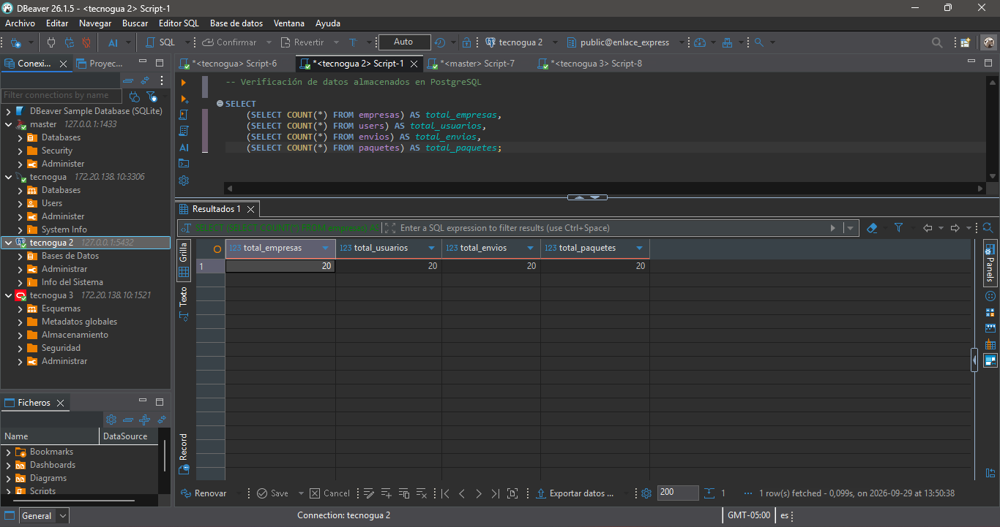
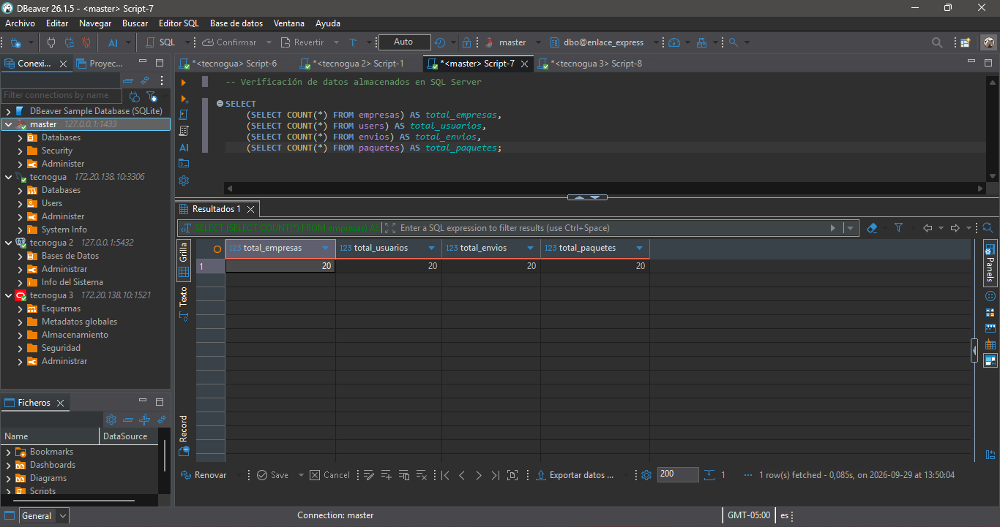
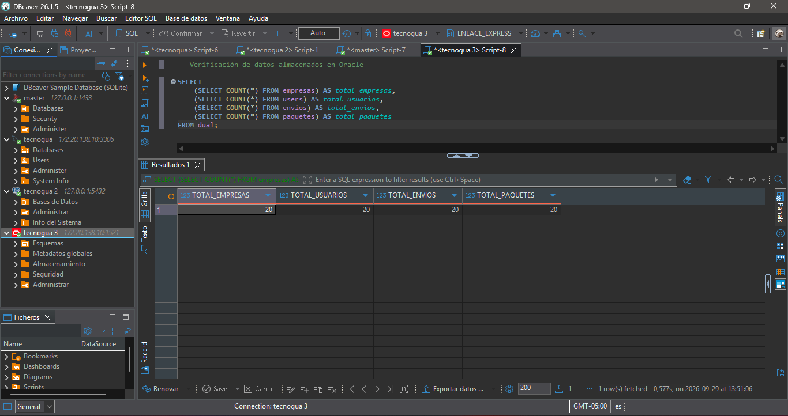

# Repositorios o mecanismos equivalentes

## 1. Descripción

El proyecto EnlaceExpress cuenta con un repositorio organizado que contiene los scripts, datos y documentación necesarios para trabajar con los cuatro motores de bases de datos utilizados: MySQL, PostgreSQL, SQL Server y Oracle.

Cada motor cuenta con sus propios archivos de estructura, inserción de datos y datos en formato CSV. Esto permite mantener una organización independiente para cada implementación y facilita la revisión y reproducción del proyecto.

## 2. Estructura del repositorio

La siguiente evidencia muestra la estructura general del repositorio del proyecto. En ella se encuentran las carpetas principales utilizadas para almacenar las bases de datos, documentación, evidencias y demás componentes del proyecto.



## 3. Scripts de las bases de datos

La siguiente evidencia muestra la organización de los archivos correspondientes a los cuatro motores de bases de datos.

Cada carpeta contiene el script DDL para crear la estructura de la base de datos, el script de inserción de datos, los datos en formato CSV y un archivo README con información del motor correspondiente.



```text
database/
├── mysql/
│   ├── datos_enlace_express_mysql.csv
│   ├── enlace_express_mysql_ddl.sql
│   ├── inserts_mysql.sql
│   └── README.md
│
├── oracle/
│   ├── datos_enlace_express_oracle.csv
│   ├── enlace_express_oracle_ddl.sql
│   ├── inserts_oracle.sql
│   └── README.md
│
├── postgresql/
│   ├── datos_enlace_express_postgresql.csv
│   ├── enlace_express_postgresql_ddl.sql
│   ├── inserts_postgresql.sql
│   └── README.md
│
└── sql-server/
    ├── datos_enlace_express_sqlserver.csv
    ├── enlace_express_sqlserver_ddl.sql
    ├── inserts_sqlserver.sql
    └── README.md
```

### Descripción de los archivos

* **`*_ddl.sql`**: contiene la estructura de la base de datos, incluyendo tablas, relaciones, restricciones y demás elementos necesarios para crearla.
* **`inserts_*.sql`**: contiene los datos utilizados para poblar las tablas de cada motor.
* **`datos_*.csv`**: contiene los datos organizados en formato CSV como mecanismo adicional para disponer de la información.
* **`README.md`**: contiene información específica sobre la implementación de cada motor.

## 4. Datos en MySQL

La siguiente evidencia muestra la información almacenada en la base de datos EnlaceExpress implementada en MySQL.

La consulta permite comprobar que existen registros en las tablas principales `empresas`, `users`, `envios` y `paquetes`.



## 5. Datos en PostgreSQL

La siguiente evidencia muestra la información almacenada en la implementación de EnlaceExpress sobre PostgreSQL.

Se verifican los registros existentes en las tablas principales mediante una consulta de conteo.



## 6. Datos en SQL Server

La siguiente evidencia muestra los datos almacenados en la implementación de EnlaceExpress sobre SQL Server.

La consulta permite comprobar la cantidad de registros disponibles en las tablas principales del sistema.



## 7. Datos en Oracle

La siguiente evidencia muestra los datos almacenados en la implementación de EnlaceExpress sobre Oracle.

Se realiza la misma verificación de las tablas principales, adaptando la consulta al funcionamiento de Oracle.



## 8. Consolidación de la evidencia

Las evidencias anteriores permiten comprobar que el proyecto EnlaceExpress cuenta con un repositorio organizado y con los archivos necesarios para cada uno de los cuatro motores de bases de datos.

También se verifica que las implementaciones contienen datos almacenados en las tablas principales, manteniendo el mismo modelo lógico del proyecto con las adaptaciones correspondientes a cada motor.
