# INFORME DE IMPLEMENTACIÓN DE MOTORES DE BASE DE DATOS

## 1. Información del proyecto

### 1.1 Nombre del proyecto

**Implementación de Motores de Bases de Datos con Docker**

### 1.2 Descripción

El proyecto consiste en implementar y ejecutar cuatro motores de bases de datos mediante Docker:

- MySQL 8.0
- PostgreSQL 17
- SQL Server 2022
- Oracle Database XE 21c

Cada motor cuenta con su propia configuración, almacenamiento persistente y puerto de conexión.

También se realizaron pruebas de conexión mediante DBeaver y verificaciones para comprobar que los servicios funcionan correctamente.

### 1.3 Autor

**Autor:** Jairo de Jesús Varón Hernández
**Programa:** Ingeniería de Sistemas 
**Proyecto:** IA Lab - Motores de Bases de Datos

### 1.4 Entorno de trabajo

| Herramienta | Uso |
|---|---|
| Windows | Sistema operativo principal |
| WSL / Ubuntu | Entorno Linux |
| Docker | Ejecución de los motores |
| Docker Compose | Configuración de los servicios |
| DBeaver | Conexión y administración de las bases de datos |

### 1.5 Fecha

**23 de agosto de 2026** 

---

## 2. Introducción

Las bases de datos son fundamentales para almacenar y administrar la información utilizada por diferentes sistemas y aplicaciones.

En este proyecto se implementaron cuatro motores de bases de datos: **MySQL, PostgreSQL, SQL Server y Oracle XE**, utilizando Docker para facilitar su instalación, configuración y ejecución.

Cada motor fue configurado de forma independiente, con sus respectivos puertos y almacenamiento persistente. Posteriormente, se verificó su funcionamiento mediante Docker y se realizaron conexiones desde DBeaver.

Este informe presenta de forma resumida el proceso realizado, las configuraciones utilizadas, las pruebas realizadas y las evidencias obtenidas durante la implementación.

---

## 3. Objetivos

### 3.1 Objetivo general

Implementar y configurar cuatro motores de bases de datos mediante Docker, permitiendo su ejecución, almacenamiento persistente y conexión desde DBeaver.

### 3.2 Objetivos específicos

- Configurar MySQL, PostgreSQL, SQL Server y Oracle XE mediante Docker Compose.
- Establecer los puertos y conexiones necesarios para cada motor.
- Configurar almacenamiento persistente para conservar los datos.
- Verificar el funcionamiento de los cuatro servicios mediante Docker.
- Conectar y comprobar los motores desde DBeaver.
- Documentar el proceso y las evidencias obtenidas durante la implementación.

---

## 4. Requisitos y herramientas utilizadas

Para realizar el proyecto se utilizaron las siguientes herramientas y tecnologías:

### 4.1 Sistema operativo

**Windows**, como sistema operativo principal del equipo.

### 4.2 WSL

**WSL (Windows Subsystem for Linux)**, utilizado para disponer de un entorno Linux desde Windows.

### 4.3 Docker

**Docker**, utilizado para ejecutar cada motor de base de datos dentro de un contenedor independiente.

### 4.4 Docker Compose

**Docker Compose**, utilizado para definir y administrar la configuración de cada servicio mediante archivos `docker-compose.yml`.

### 4.5 DBeaver

**DBeaver**, utilizado como cliente gráfico para realizar las conexiones, consultar y comprobar el funcionamiento de las bases de datos.

### 4.6 Motores de bases de datos

Los motores implementados fueron:

| Motor | Versión | Puerto |
|---|---:|---:|
| MySQL | 8.0 | 3306 |
| PostgreSQL | 17 | 5432 |
| SQL Server | 2022 | 1433 |
| Oracle XE | 21c | 1521 |

---

## 5. Arquitectura de la solución

### 5.1 Descripción de la arquitectura

La solución utiliza **Windows como sistema principal**, WSL como entorno Linux y Docker para ejecutar los cuatro motores de bases de datos en contenedores independientes.

Los servicios se encuentran organizados dentro del proyecto `ia-lab` y pueden ejecutarse de manera independiente o simultánea.

### 5.2 Comunicación entre Windows, WSL y Docker

La comunicación se realiza de la siguiente manera:

```text
Windows
   │
   ▼
WSL / Ubuntu
   │
   ▼
Docker
   │
   ├── MySQL
   ├── PostgreSQL
   ├── SQL Server
   └── Oracle XE
````

Los puertos de los contenedores se publican hacia el entorno local, permitiendo que herramientas como DBeaver se conecten a las bases de datos desde Windows.

### 5.3 Red de Docker

Los servicios utilizan una red de Docker para facilitar la comunicación entre los contenedores cuando es necesario.

Cada motor mantiene su propio contenedor y configuración, mientras que los datos se almacenan mediante directorios persistentes.

### 5.4 Puertos utilizados

| Motor      | Puerto |
| ---------- | -----: |
| MySQL      |   3306 |
| PostgreSQL |   5432 |
| SQL Server |   1433 |
| Oracle XE  |   1521 |

Estos puertos permiten realizar las conexiones desde DBeaver utilizando `127.0.0.1` como dirección del servidor.

### 5.5 Diagrama de arquitectura

```text
┌─────────────────────────────────────────────┐
│                  WINDOWS                    │
│                                             │
│                  DBeaver                    │
└─────────────────────┬───────────────────────┘
                      │
                127.0.0.1
                      │
┌─────────────────────▼───────────────────────┐
│                 WSL / UBUNTU                │
│                                             │
│                    Docker                   │
│                                             │
│  ┌──────────┐  ┌────────────┐               │
│  │  MySQL   │  │ PostgreSQL │               │
│  │  :3306   │  │   :5432    │               │
│  └──────────┘  └────────────┘               │
│                                             │
│  ┌──────────────┐  ┌────────────┐           │
│  │ SQL Server   │  │ Oracle XE  │           │
│  │    :1433     │  │   :1521    │           │
│  └──────────────┘  └────────────┘           │
│                                             │
└─────────────────────────────────────────────┘
```

La arquitectura permite mantener los cuatro motores separados, facilitar su administración y realizar conexiones desde herramientas externas como DBeaver.

---

## 6. Estructura del proyecto

### 6.1 Estructura general

El proyecto se encuentra organizado dentro del directorio `ia-lab`. La estructura separa los archivos de configuración de los datos generados por los motores de bases de datos.

La organización principal es:

```text
ia-lab/
├── data/
└── services/
    └── motores-bd/
````

### 6.2 Directorios de servicios

Dentro de `services/motores-bd/` se encuentra la configuración de los cuatro motores:

```text
motores-bd/
├── mysql/
├── postgres/
├── mssql/
├── oracle/
├── start-all.sh
├── stop-all.sh
└── README.md
```

Cada directorio contiene la configuración y documentación correspondiente a su motor.

### 6.3 Directorios de datos persistentes

Los datos de los motores se almacenan en el directorio:

```text
~/ia-lab/data/
```

Dentro de este directorio se encuentran los espacios utilizados para la persistencia de MySQL, PostgreSQL, SQL Server y Oracle.

Esta configuración permite conservar los datos aunque los contenedores sean detenidos o reiniciados.

### 6.4 Archivos de configuración

Cada motor utiliza un archivo `docker-compose.yml` para definir su servicio y un archivo `.env` para las variables de configuración.

La estructura es:

```text
motores-bd/
├── mysql/
│   ├── .env
│   └── docker-compose.yml
├── postgres/
│   ├── .env
│   └── docker-compose.yml
├── mssql/
│   ├── .env
│   └── docker-compose.yml
└── oracle/
    ├── .env
    └── docker-compose.yml
```

### 6.5 Scripts de administración

El proyecto incluye dos scripts para facilitar la administración de los servicios:

| Archivo        | Función                               |
| -------------- | ------------------------------------- |
| `start-all.sh` | Inicia los motores de bases de datos  |
| `stop-all.sh`  | Detiene los motores de bases de datos |

Estos scripts permiten administrar los servicios sin tener que iniciar o detener cada contenedor individualmente.

### 6.6 Evidencia de la estructura

A continuación se presenta la estructura real del proyecto obtenida desde WSL.

> 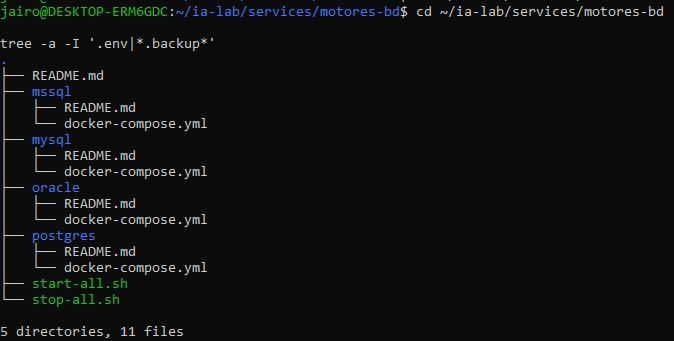

La captura muestra la organización de los servicios, archivos de configuración y scripts principales del proyecto.

---

## 7. Implementación de MySQL

<p align="center">
  
</p>

### 7.1 Configuración

MySQL se implementó mediante Docker utilizando la imagen oficial `mysql:8.0`. El servicio se configuró para ejecutarse de forma independiente y permitir conexiones desde el equipo.

```bash
cd ~/ia-lab/services/motores-bd/mysql
cat docker-compose.yml
```

> 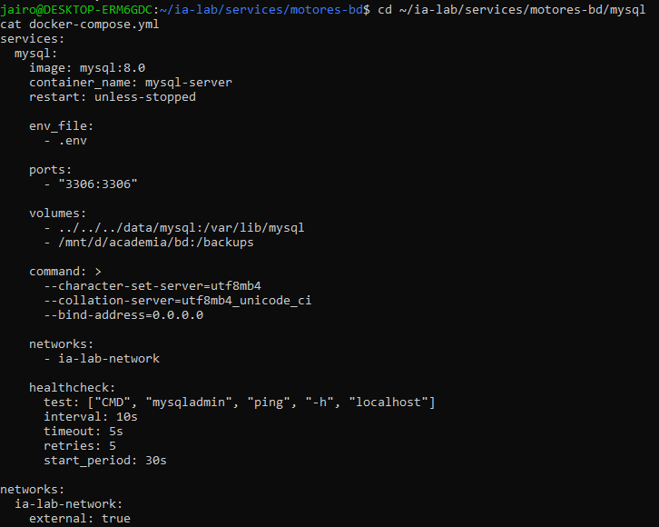

### 7.2 Docker Compose

Docker Compose permite definir y ejecutar el contenedor de MySQL junto con su configuración de forma sencilla y repetible.

```bash
cd ~/ia-lab/services/motores-bd/mysql
sudo docker compose config
```

> 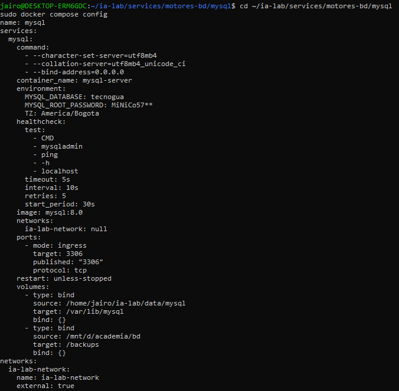

### 7.3 Variables de entorno

Las credenciales y otros valores de configuración se manejan mediante un archivo `.env`, evitando escribir directamente estos datos dentro del archivo `docker-compose.yml`.

```bash
cd ~/ia-lab/services/motores-bd/mysql
ls -la
```

> 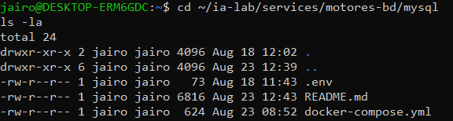

### 7.4 Persistencia de datos

Los datos de MySQL se almacenan en el directorio persistente:

```text
~/ia-lab/data/mysql
```

Esto permite conservar la información de la base de datos aunque el contenedor sea detenido o reiniciado.

```bash
sudo ls -lah ~/ia-lab/data/mysql
```

> 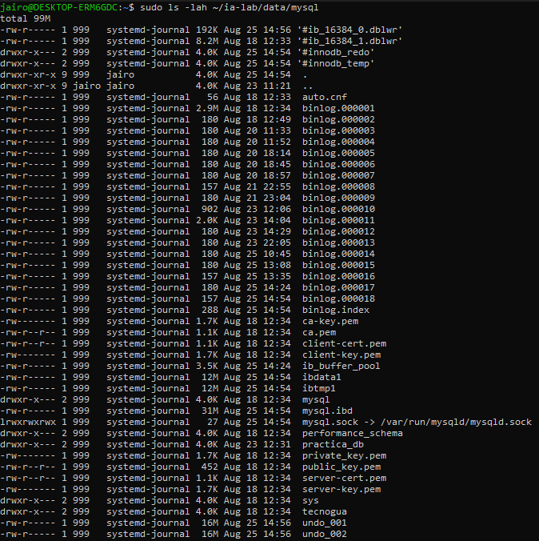

### 7.5 Ejecución del contenedor

El contenedor utilizado para MySQL se identifica como:

```text
mysql-server
```

Su funcionamiento se comprobó mediante Docker.

```bash
sudo docker ps --filter "name=mysql-server" \
--format "table {{.Names}}\t{{.Image}}\t{{.Status}}\t{{.Ports}}"
```

El resultado esperado debe mostrar el contenedor activo y, después de iniciar correctamente, en estado `healthy`.

> 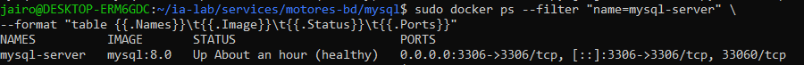

### 7.6 Base de datos utilizada

Para las pruebas se utilizó la base de datos:

```text
tecnogua
```

```bash
sudo docker exec -it mysql-server \
mysql -uadmin -p
```

El comando solicitará la contraseña configurada para MySQL.

> 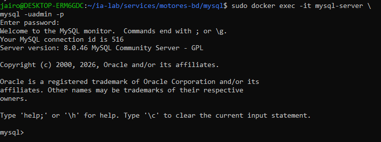

### 7.7 Conexión mediante DBeaver

La conexión a MySQL se realizó desde DBeaver utilizando los siguientes datos:

| Parámetro     | Valor       |
| ------------- | ----------- |
| Motor         | MySQL       |
| Host          | `127.0.0.1` |
| Puerto        | `3306`      |
| Base de datos | `tecnogua`  |
| Usuario       | `admin`      |

La conexión fue comprobada desde DBeaver y se obtuvo una conexión exitosa.

> 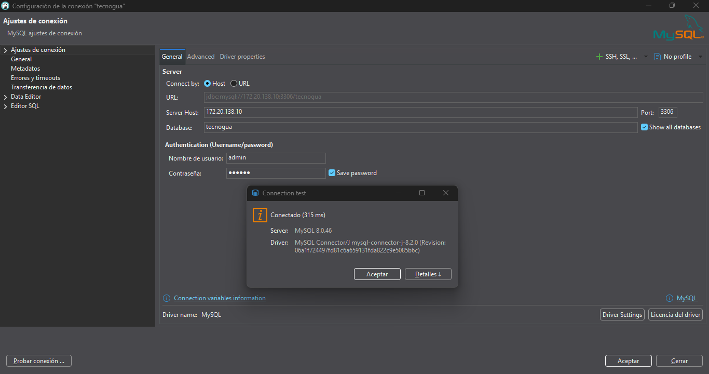

### 7.8 Pruebas de funcionamiento

Se verificó que MySQL estuviera disponible y aceptando conexiones mediante el puerto `3306`.

```bash
nc -zv 127.0.0.1 3306
````

Resultado obtenido:

```text
Connection to 127.0.0.1 3306 port [tcp/mysql] succeeded!
```

También se comprobó el acceso al servidor MySQL desde el contenedor utilizando el usuario `admin`:

```bash
sudo docker exec -it mysql-server \
mysql -uadmin -p
```

Una vez establecida la conexión, se verificó la disponibilidad de las bases de datos mediante:

```sql
SHOW DATABASES;
```

En el resultado se confirmó la existencia de la base de datos `tecnogua`.

> 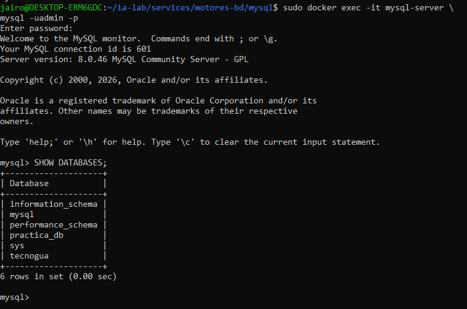

*La captura muestra la conexión exitosa al servidor MySQL y la disponibilidad de la base de datos `tecnogua`.*

---

## 8. Implementación de PostgreSQL

<p align="center">
  
</p>

### 8.1 Configuración

PostgreSQL se implementó mediante Docker utilizando la imagen `postgres:17`. El servicio se configuró para permitir conexiones desde el equipo y mantener los datos de forma persistente.

```bash
cd ~/ia-lab/services/motores-bd/postgres
cat docker-compose.yml
```

> 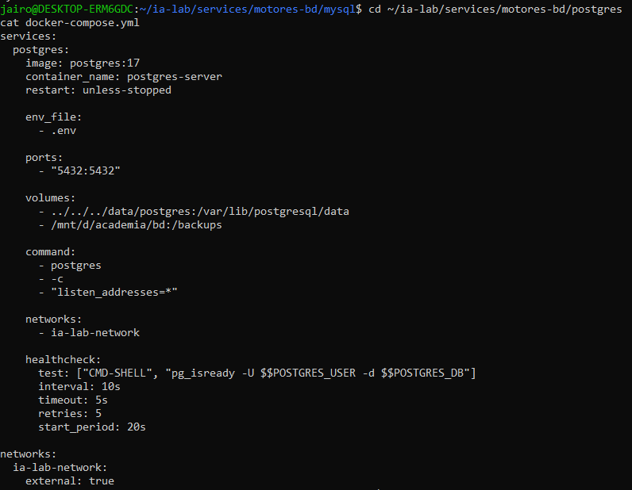

### 8.2 Docker Compose

Docker Compose permite definir y administrar el contenedor de PostgreSQL junto con sus parámetros de ejecución.

```bash
cd ~/ia-lab/services/motores-bd/postgres
sudo docker compose config
```

El resultado debe mostrar la configuración del servicio sin errores.

> 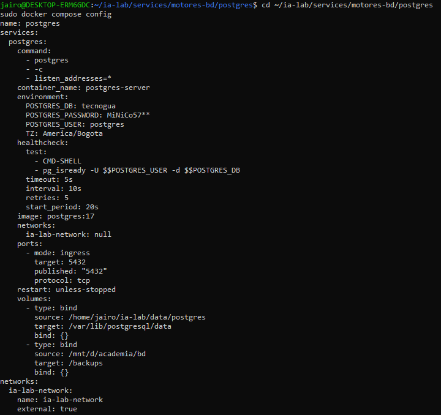

### 8.3 Variables de entorno

Las credenciales y demás valores de configuración se almacenan en el archivo `.env`.

```bash
cd ~/ia-lab/services/motores-bd/postgres
ls -la
```

> 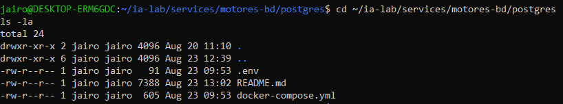

### 8.4 Persistencia de datos

Los datos de PostgreSQL se almacenan en un directorio persistente del proyecto:

```text
ls -lah ~/ia-lab/data/postgres
```

Esto permite conservar la información de la base de datos cuando el contenedor se detiene o reinicia.

```bash
sudo ls -lah ~/ia-lab/data/postgres
```

> 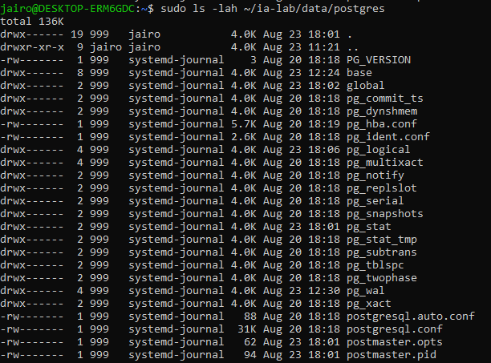

### 8.5 Ejecución del contenedor

El contenedor utilizado para PostgreSQL es:

```text
postgres-server
```

Su estado puede comprobarse mediante Docker.

```bash
sudo docker ps --filter "name=postgres-server" \
--format "table {{.Names}}\t{{.Image}}\t{{.Status}}\t{{.Ports}}"
```

El contenedor debe aparecer activo y, después de completar su inicio, en estado `healthy`.

> 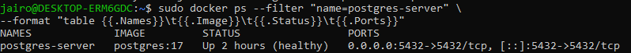

### 8.6 Base de datos utilizada

Para las pruebas se utilizó la base de datos:

```text
tecnogua
```

La existencia de la base de datos puede comprobarse directamente desde PostgreSQL.

```bash
sudo docker exec -it postgres-server \
psql -U ialab -l
```

En el resultado debe aparecer la base de datos `tecnogua`.

> 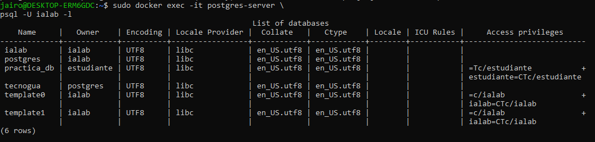

### 8.7 Conexión mediante DBeaver

La conexión a PostgreSQL se realizó mediante DBeaver utilizando:

| Parámetro     | Valor       |
| ------------- | ----------- |
| Motor         | PostgreSQL  |
| Host          | `127.0.0.1` |
| Puerto        | `5432`      |
| Base de datos | `tecnogua`  |
| Usuario       | `postgres`  |

La conexión fue comprobada desde DBeaver y se obtuvo una conexión exitosa.

> 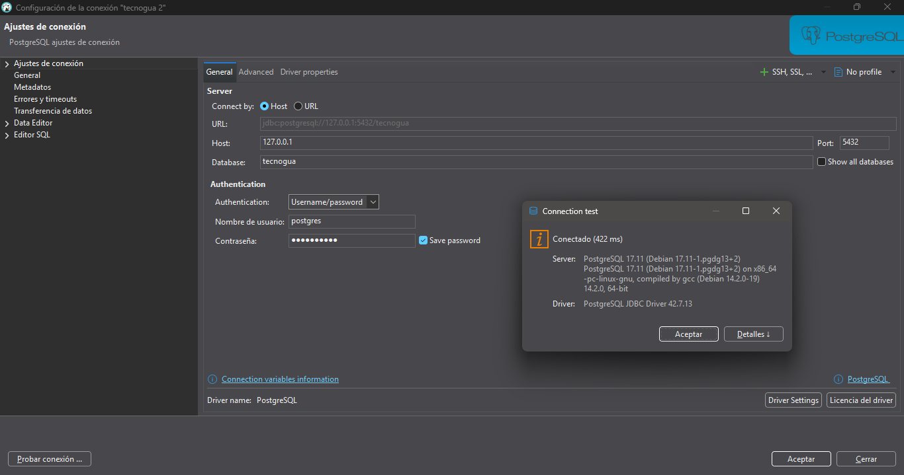

---

### 8.8 Pruebas de funcionamiento

Se verificó que PostgreSQL estuviera disponible mediante el puerto `5432`.

```bash
nc -zv 127.0.0.1 5432
```

Resultado esperado:

```text
Connection to 127.0.0.1 5432 port [tcp/postgresql] succeeded!
```

También se puede comprobar directamente que PostgreSQL responde:

```bash
sudo docker exec postgres-server \
pg_isready -U ialab
```

Resultado esperado:

```text
/var/run/postgresql:5432 - accepting connections
```

> 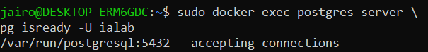

---

## 9. Implementación de SQL Server

<p align="center">
  
</p>

### 9.1 Configuración

SQL Server se implementó mediante Docker utilizando la imagen `mcr.microsoft.com/mssql/server:2022-latest`. El servicio se configuró para permitir conexiones desde el equipo y mantener los datos de forma persistente.

```bash
cd ~/ia-lab/services/motores-bd/mssql
cat docker-compose.yml
```

> 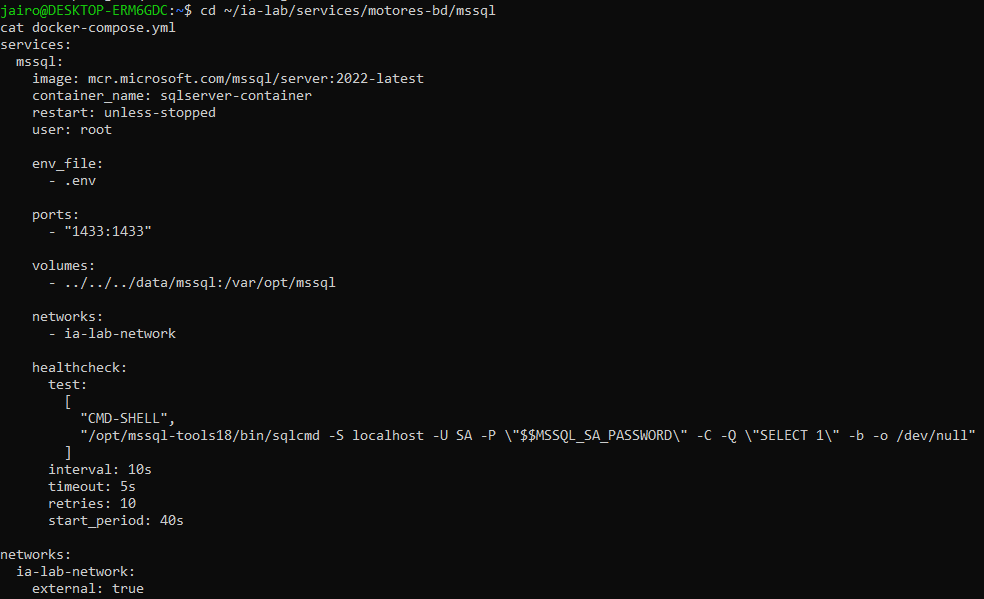

### 9.2 Docker Compose

Docker Compose permite definir y administrar el contenedor de SQL Server junto con sus parámetros de ejecución.

```bash
cd ~/ia-lab/services/motores-bd/mssql
sudo docker compose config
```

El resultado debe mostrar la configuración sin errores.

> 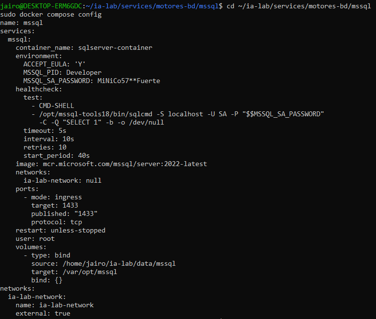

### 9.3 Variables de entorno

Las credenciales y otros valores de configuración se almacenan en el archivo `.env`.

```bash
cd ~/ia-lab/services/motores-bd/mssql
ls -la
```

> 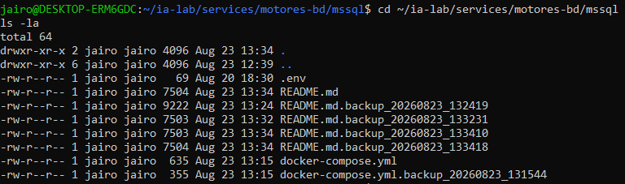

### 9.4 Persistencia de datos

Los datos de SQL Server se almacenan en:

```text
~/ia-lab/data/mssql
```

Este directorio permite conservar la información de las bases de datos aunque el contenedor sea detenido o reiniciado.

```bash
ls -lah ~/ia-lab/data/mssql
```

Para mostrar la estructura principal:

```bash
tree -L 2 ~/ia-lab/data/mssql
```

> 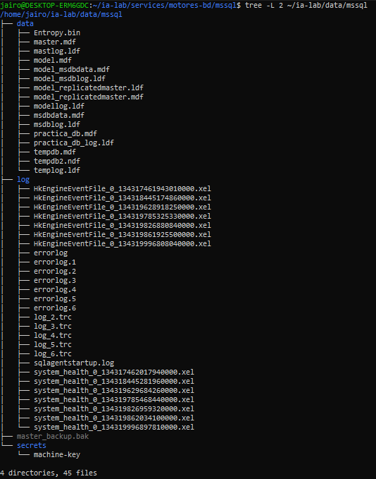

### 9.5 Ejecución del contenedor

El contenedor utilizado para SQL Server es:

```text
sqlserver-container
```

Su estado puede comprobarse mediante Docker.

```bash
sudo docker ps --filter "name=sqlserver-container" \
--format "table {{.Names}}\t{{.Image}}\t{{.Status}}\t{{.Ports}}"
```

El contenedor debe aparecer activo y en estado `healthy`.

> 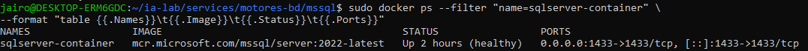

### 9.6 Base de datos utilizada

Para las pruebas de SQL Server se utilizó la base de datos:

```text
practica_db
````

La existencia de la base de datos se comprobó directamente desde el contenedor mediante `sqlcmd`:

```bash
cd ~/ia-lab/services/motores-bd/mssql

set -a
source .env
set +a

sudo docker exec -it sqlserver-container \
/opt/mssql-tools18/bin/sqlcmd \
-S localhost -U SA -P "$MSSQL_SA_PASSWORD" -C \
-Q "SELECT name FROM sys.databases;"
```

El resultado permite verificar que `practica_db` se encuentra disponible en el servidor SQL Server.

> 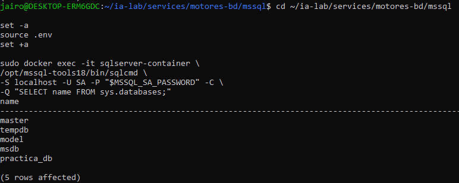

*La captura muestra la lista de bases de datos de SQL Server, incluyendo `practica_db`.*

### 9.7 Backup de la base de datos

Durante la implementación de SQL Server se generó un archivo de respaldo con el propósito de comprobar el funcionamiento del mecanismo de backup.

El archivo generado fue:

```text
~/ia-lab/data/mssql/master_backup.bak
```

La existencia del archivo se comprobó mediante el siguiente comando:

```bash
sudo ls -lh ~/ia-lab/data/mssql/*.bak
```

Como resultado, se obtuvo:

```text
-rw-r----- 1 root root 824K Aug 23 10:27 /home/jairo/ia-lab/data/mssql/master_backup.bak
```

Posteriormente, se verificó la información contenida en el archivo de respaldo mediante la instrucción `RESTORE HEADERONLY` de SQL Server. Esta consulta permite obtener los metadatos del backup y comprobar la base de datos a la que corresponde.

Para realizar la comprobación se ejecutó:

```bash
cd ~/ia-lab/services/motores-bd/mssql

set -a
source .env
set +a

sudo docker exec -it sqlserver-container \
/opt/mssql-tools18/bin/sqlcmd \
-S localhost \
-U SA \
-P "$MSSQL_SA_PASSWORD" \
-C \
-Q "RESTORE HEADERONLY FROM DISK = '/var/opt/mssql/master_backup.bak';" \
-W \
-s "|"
```

En la salida obtenida se identificaron los campos `DatabaseName` y `BackupTypeDescription`. La primera evidencia muestra la existencia del archivo `master_backup.bak` y la ejecución de `RESTORE HEADERONLY` sobre dicho respaldo.

> 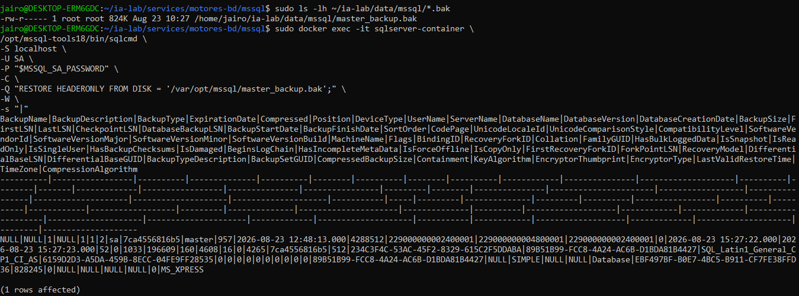

Para facilitar la interpretación de los resultados, se realizó una presentación resumida de los datos obtenidos mediante la siguiente validación:

```text
========================================
     VALIDACIÓN DEL BACKUP - SQL SERVER
========================================
DatabaseName          : master
BackupTypeDescription : Database
========================================
```

> 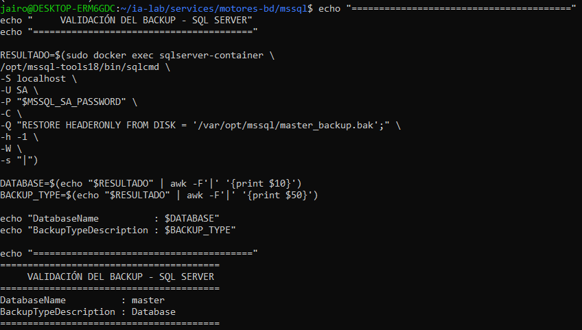

Los resultados permitieron confirmar que el archivo `master_backup.bak` corresponde a la base de datos `master` y que el tipo de respaldo registrado es `Database`. De esta manera, se comprobó el funcionamiento del mecanismo de backup implementado en SQL Server.

### 9.8 Conexión mediante DBeaver

La conexión a SQL Server se realizó desde DBeaver utilizando:

| Parámetro     | Valor         |
| ------------- | ------------- |
| Motor         | SQL Server    |
| Host          | `127.0.0.1`   |
| Puerto        | `1433`        |
| Base de datos | `practica_db` |
| Usuario       | `sa`          |

La conexión fue comprobada desde DBeaver y se obtuvo una conexión exitosa.

> 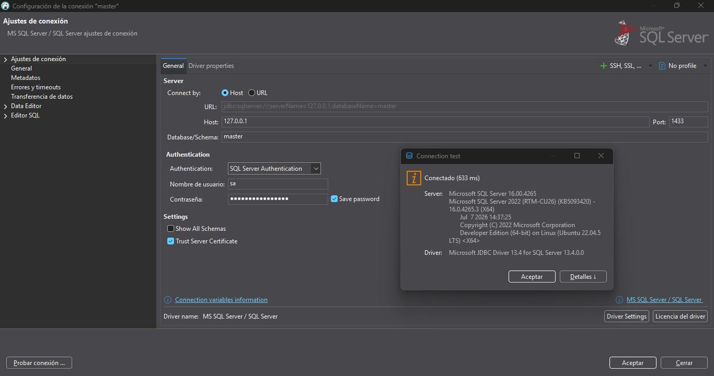

---

### 9.9 Pruebas de funcionamiento

Se verificó que SQL Server estuviera disponible mediante el puerto `1433`.

```bash
nc -zv 127.0.0.1 1433
```

Resultado esperado:

```text
Connection to 127.0.0.1 1433 port [tcp/ms-sql-s] succeeded!
```

También se puede comprobar el estado del contenedor:

```bash
sudo docker ps --filter "name=sqlserver-container" \
--format "{{.Names}} - {{.Status}}"
```

El resultado debe indicar que el contenedor está `healthy`.

> 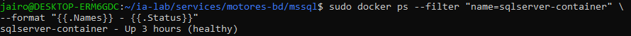

---

## 10. Implementación de Oracle XE

<p align="center">
  
</p>

### 10.1 Configuración

Oracle XE se implementó mediante Docker utilizando la imagen `gvenzl/oracle-xe:21-slim`. El servicio fue configurado para permitir conexiones desde el equipo y conservar los datos de forma persistente.

```bash
cd ~/ia-lab/services/motores-bd/oracle
cat docker-compose.yml
```

> 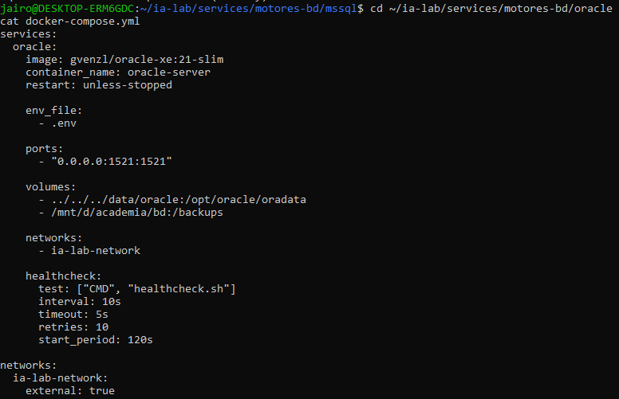

### 10.2 Docker Compose

Docker Compose permite definir y administrar el contenedor de Oracle XE junto con sus parámetros de ejecución.

```bash
cd ~/ia-lab/services/motores-bd/oracle
sudo docker compose config
```

La configuración debe mostrarse sin errores.

> 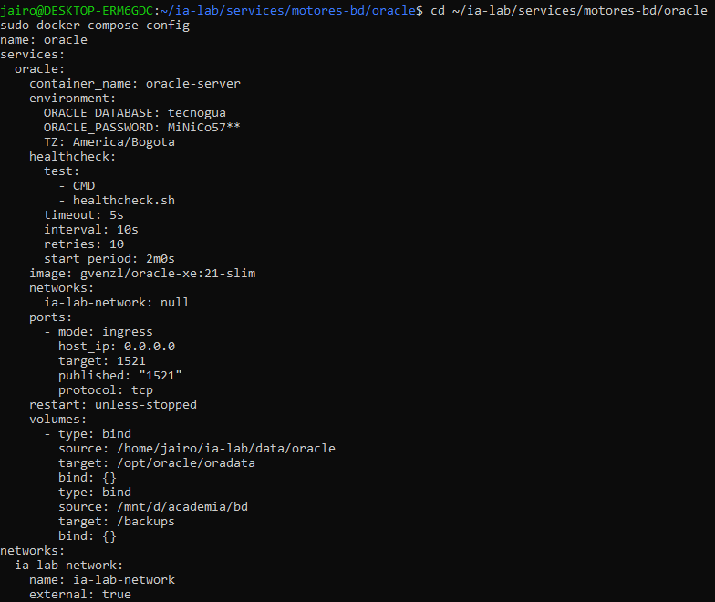

### 10.3 Variables de entorno

Las credenciales y otros valores de configuración se almacenan en el archivo `.env`.

```bash
cd ~/ia-lab/services/motores-bd/oracle
ls -la
```

> 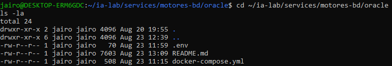

### 10.4 Persistencia de datos

Los datos de Oracle XE se almacenan en:

```text
~/ia-lab/data/oracle
```

Este directorio permite conservar la información de Oracle aunque el contenedor sea detenido o reiniciado.

```bash
ls -lah ~/ia-lab/data/oracle
```

Para mostrar una estructura más detallada:

```bash
sudo tree -L 3 ~/ia-lab/data/oracle
```

> 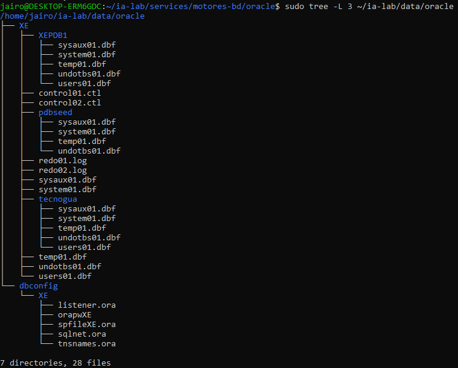

### 10.5 Configuración del servicio

El contenedor de Oracle XE utilizado en el proyecto es:

```text
oracle-server
```

Su estado puede comprobarse mediante Docker.

```bash
sudo docker ps --filter "name=oracle-server" \
--format "table {{.Names}}\t{{.Image}}\t{{.Status}}\t{{.Ports}}"
```

El contenedor debe aparecer activo y en estado `healthy`.

> 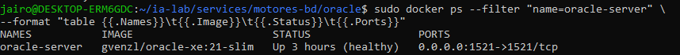

### 10.6 Usuarios y bases de datos

Oracle XE utiliza usuarios administrativos para gestionar la instancia y las bases de datos. Durante la implementación se verificaron los usuarios disponibles y su estado.

La consulta utilizada fue:

```bash
cd ~/ia-lab/services/motores-bd/oracle

set -a
source .env
set +a

sudo docker exec -i oracle-server \
sqlplus -s "system/$ORACLE_PASSWORD@//127.0.0.1:1521/XE" <<'SQL'

SET PAGESIZE 100
SET LINESIZE 200

SELECT USERNAME, ACCOUNT_STATUS
FROM DBA_USERS
ORDER BY USERNAME;

EXIT;
SQL
````

La consulta permitió comprobar los usuarios registrados en Oracle XE y su estado de acceso.

Entre los usuarios que se encuentran activos se identificaron:

```text
USERNAME
----------------
OPS$ORACLE       OPEN
SYS              OPEN
SYSRAC           OPEN
SYSTEM           OPEN
```

> 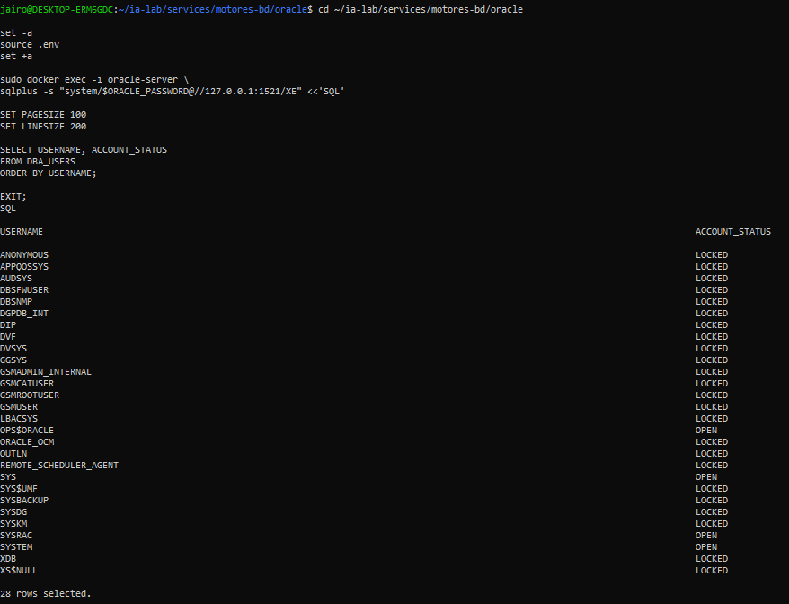

### 10.7 DATA_PUMP_DIR

Oracle XE dispone del directorio `DATA_PUMP_DIR`, utilizado para las operaciones de exportación e importación de datos mediante Oracle Data Pump.

Para verificar la configuración de este directorio, se realizó una consulta sobre la vista `DBA_DIRECTORIES` utilizando el usuario `SYSTEM` y la conexión correspondiente a la instancia Oracle XE:

```bash
cd ~/ia-lab/services/motores-bd/oracle

set -a
source .env
set +a

sudo docker exec -i oracle-server \
sqlplus -s "system/$ORACLE_PASSWORD@//127.0.0.1:1521/XE" <<'SQL'

SET PAGESIZE 100
SET LINESIZE 200

SELECT DIRECTORY_NAME, DIRECTORY_PATH
FROM DBA_DIRECTORIES
WHERE DIRECTORY_NAME = 'DATA_PUMP_DIR';

EXIT;

SQL
```

La consulta permitió identificar el nombre del directorio y la ruta física configurada para `DATA_PUMP_DIR` dentro de la instancia de Oracle XE.

> 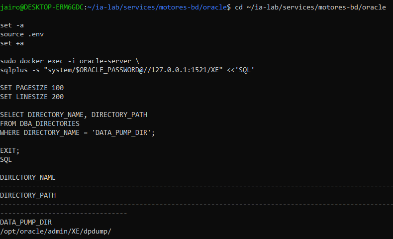

### 10.8 Conexión mediante DBeaver

La conexión a Oracle XE se realizó desde DBeaver utilizando:

| Parámetro | Valor       |
| --------- | ----------- |
| Motor     | Oracle      |
| Host      | `127.0.0.1` |
| Puerto    | `1521`      |
| Servicio  | `tecnogua`  |
| Usuario   | `SYSTEM`    |

La conexión fue comprobada desde DBeaver y se obtuvo una conexión exitosa.

> 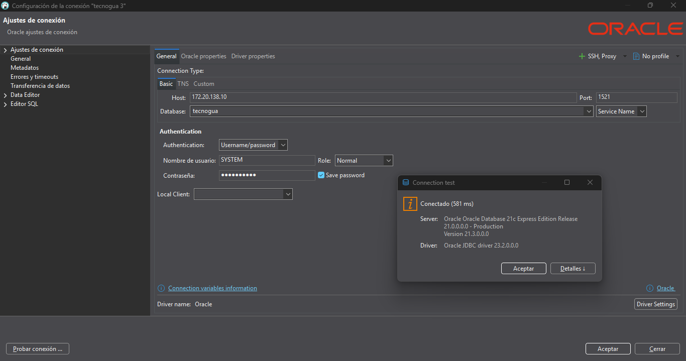

### 10.9 Pruebas de funcionamiento

Se verificó que Oracle XE estuviera disponible mediante el puerto `1521`.

```bash
nc -zv 127.0.0.1 1521
```

Resultado esperado:

```text
Connection to 127.0.0.1 1521 port [tcp/*] succeeded!
```

También se comprobó el estado del contenedor:

```bash
sudo docker ps --filter "name=oracle-server" \
--format "{{.Names}} - {{.Status}}"
```

El resultado debe indicar que el contenedor se encuentra `healthy`.

> 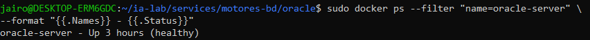

---

## 11. Integración de los cuatro motores

Los cuatro motores de bases de datos se ejecutan de manera simultánea mediante Docker. Cada servicio utiliza su propio contenedor y puerto, permitiendo acceder a ellos desde el equipo y desde herramientas como DBeaver.

### 11.1 Servicios ejecutándose simultáneamente

Se verificó que los cuatro contenedores se encuentran activos:

* MySQL: `mysql-server`
* PostgreSQL: `postgres-server`
* SQL Server: `sqlserver-container`
* Oracle XE: `oracle-server`

```bash
sudo docker ps \
--format "table {{.Names}}\t{{.Image}}\t{{.Status}}\t{{.Ports}}" \
| grep -E "mysql-server|postgres-server|sqlserver-container|oracle-server"
```

El resultado debe mostrar los cuatro servicios en ejecución y en estado `healthy`.

> 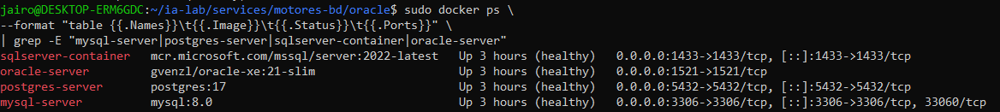

### 11.2 Puertos publicados

Cada motor utiliza un puerto diferente para recibir conexiones desde el equipo:

| Motor      | Contenedor            | Puerto |
| ---------- | --------------------- | -----: |
| MySQL      | `mysql-server`        | `3306` |
| PostgreSQL | `postgres-server`     | `5432` |
| SQL Server | `sqlserver-container` | `1433` |
| Oracle XE  | `oracle-server`       | `1521` |

Estos puertos permiten establecer las conexiones desde DBeaver utilizando `127.0.0.1`.

```bash
sudo docker ps \
--format "table {{.Names}}\t{{.Ports}}" \
| grep -E "mysql-server|postgres-server|sqlserver-container|oracle-server"
```

> 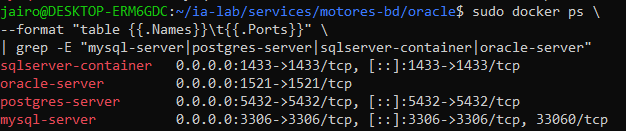

### 11.3 Red Docker

Los servicios utilizan una red de Docker para permitir la comunicación entre los contenedores que forman parte del proyecto.

```bash
sudo docker network ls
```

Para revisar la red utilizada por los servicios:

```bash
sudo docker network inspect ia-lab-network
```

> 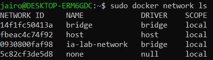

### 11.4 Verificación de los contenedores

Se realizó una comprobación general del estado de los servicios mediante Docker Compose.

```bash
sudo docker compose ls
```

El resultado debe mostrar los cuatro proyectos:

```text
mssql
mysql
oracle
postgres
```

También se realizó una validación de la configuración:

```bash
cd ~/ia-lab/services/motores-bd

for motor in mysql postgres mssql oracle; do
    echo "===== $motor ====="
    cd ~/ia-lab/services/motores-bd/$motor
    sudo docker compose config >/dev/null && echo "OK"
done
```

> 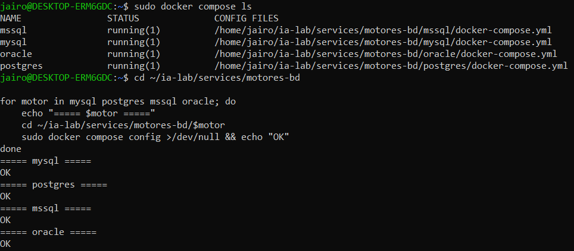

### 11.5 Verificación de los puertos

Finalmente, se comprobó que los cuatro puertos se encuentran disponibles para aceptar conexiones.

```bash
echo "===== PUERTOS ====="

echo "MySQL 3306:"
nc -zv 127.0.0.1 3306

echo "PostgreSQL 5432:"
nc -zv 127.0.0.1 5432

echo "SQL Server 1433:"
nc -zv 127.0.0.1 1433

echo "Oracle 1521:"
nc -zv 127.0.0.1 1521
```

El resultado esperado es similar a:

```text
MySQL 3306:
Connection to 127.0.0.1 3306 port [tcp/mysql] succeeded!

PostgreSQL 5432:
Connection to 127.0.0.1 5432 port [tcp/postgresql] succeeded!

SQL Server 1433:
Connection to 127.0.0.1 1433 port [tcp/ms-sql-s] succeeded!

Oracle 1521:
Connection to 127.0.0.1 1521 port [tcp/*] succeeded!
```

> 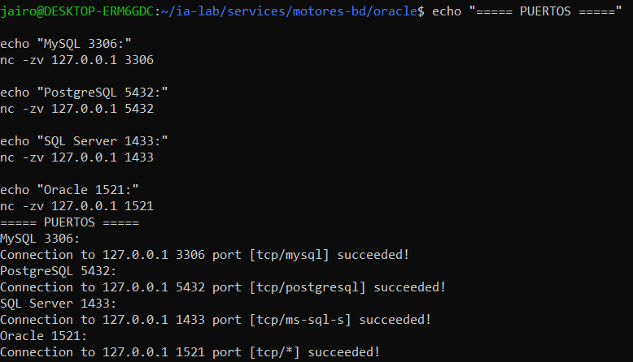

## 12. Conexiones mediante DBeaver

<p align="center">
  
</p>

DBeaver se utilizó como cliente gráfico para comprobar la conexión con los cuatro motores de bases de datos. Las conexiones se realizaron utilizando `127.0.0.1` y los puertos publicados por Docker.

### 12.1 Conexión a MySQL

La conexión a MySQL se realizó mediante DBeaver utilizando el puerto `3306`.

Configuración utilizada:

- Host: `127.0.0.1`
- Puerto: `3306`
- Usuario: `admin`
- Base de datos: `tecnogua`

> 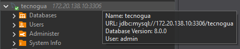


### 12.2 Conexión a PostgreSQL

La conexión a PostgreSQL se realizó mediante DBeaver utilizando el puerto `5432`.

Configuración utilizada:

- Host: `127.0.0.1`
- Puerto: `5432`
- Usuario: `postgres`
- Base de datos: `tecnogua`

> 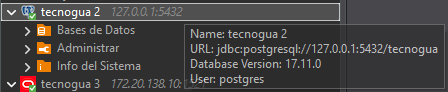


### 12.3 Conexión a SQL Server

La conexión a SQL Server se realizó mediante DBeaver utilizando el puerto `1433`.

Configuración utilizada:

- Host: `127.0.0.1`
- Puerto: `1433`
- Usuario: `sa`
- Base de datos: `master`

> 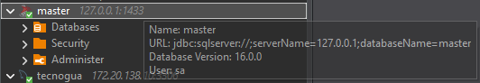


### 12.4 Conexión a Oracle XE

La conexión a Oracle XE se realizó mediante DBeaver utilizando el puerto `1521`.

Configuración utilizada:

- Host: `127.0.0.1`
- Puerto: `1521`
- Usuario: `SYSTEM`
- Servicio: `tecnogua`

> 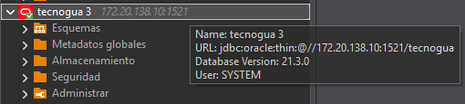


### 12.5 Verificación final de las conexiones

Después de configurar las cuatro conexiones, se verificó desde DBeaver que todos los motores estuvieran disponibles simultáneamente.

El resultado esperado es que las cuatro conexiones aparezcan activas y sin errores.

> 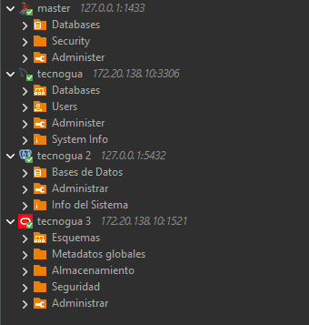

---

## 13. Persistencia de datos

La persistencia permite conservar los datos de las bases de datos aunque los contenedores sean detenidos o reiniciados. Para esto, cada motor utiliza un directorio del proyecto `ia-lab/data`.

### 13.1 Persistencia en MySQL

MySQL utiliza el directorio:

```text
~/ia-lab/data/mysql
````

Este directorio está asociado al almacenamiento de datos del contenedor mediante Docker.

Verificación del directorio:

```bash
sudo ls -lah ~/ia-lab/data/mysql
```

> 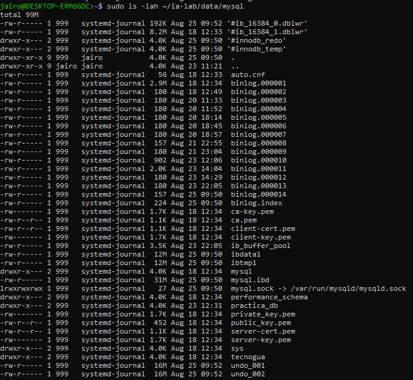

### 13.2 Persistencia en PostgreSQL

PostgreSQL utiliza el directorio:

```text
~/ia-lab/data/postgres
```

Este directorio permite conservar los datos de PostgreSQL fuera del ciclo de vida del contenedor.

Verificación del directorio:

```bash
sudo ls -lah ~/ia-lab/data/postgres
```

> 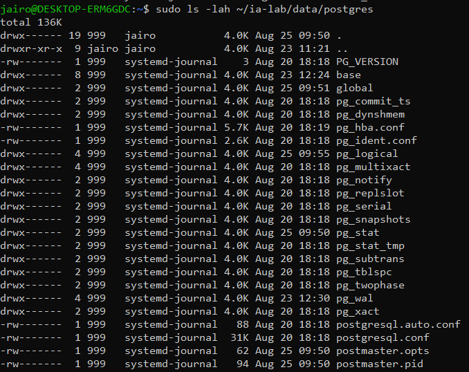

### 13.3 Persistencia en SQL Server

SQL Server utiliza el directorio:

```text
~/ia-lab/data/mssql
```

Dentro de este directorio se encuentran los archivos de datos y registros utilizados por SQL Server.

Verificación:

```bash
ls -lah ~/ia-lab/data/mssql
```

También se puede comprobar el directorio de datos:

```bash
sudo ls -lah ~/ia-lab/data/mssql/data
```

> 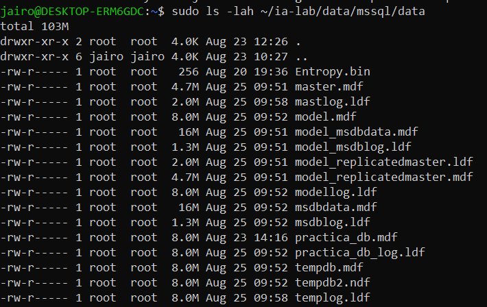

### 13.4 Persistencia en Oracle XE

Oracle XE utiliza el directorio:

```text
~/ia-lab/data/oracle
```

Este directorio contiene los archivos necesarios para conservar la información y configuración de Oracle.

Verificación:

```bash
sudo ls -lah ~/ia-lab/data/oracle
```

> 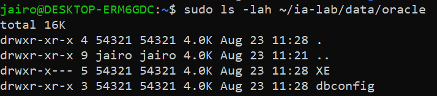

### Verificación general

La estructura de almacenamiento persistente utilizada por los cuatro motores es:

```text
ia-lab/
└── data/
    ├── mysql/
    ├── postgres/
    ├── mssql/
    └── oracle/
```

Esta configuración permite mantener los datos separados de los contenedores y conservarlos durante reinicios de los servicios.

```bash
cd ~/ia-lab
sudo tree -L 1 data
````

> 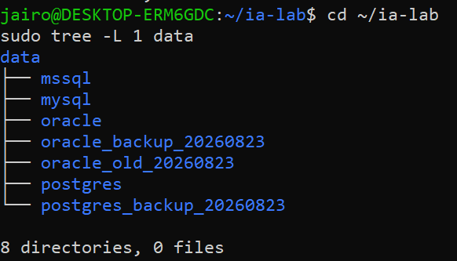

---

## 14. Backups y recuperación

Los backups permiten conservar una copia de la información de una base de datos y utilizarla posteriormente para recuperar los datos en caso de pérdida o daño.

### 14.1 Backup de SQL Server

Se realizó un respaldo de la base de datos de SQL Server utilizando un archivo con extensión `.bak`.

El archivo de respaldo se encuentra dentro del almacenamiento persistente del proyecto:

```text
~/ia-lab/data/mssql/master_backup.bak
````

Verificación del backup:

```bash
sudo ls -lh ~/ia-lab/data/mssql/master_backup.bak
```

> 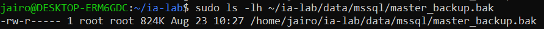

### 14.2 Archivos de respaldo

El directorio de SQL Server contiene el archivo de respaldo junto con los archivos utilizados por el motor.

Para comprobar su contenido se ejecutó:

```bash
sudo ls -lah ~/ia-lab/data/mssql
```

> 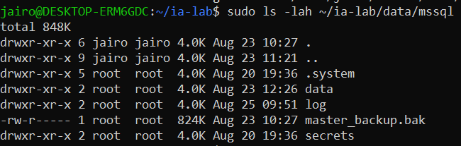

### 14.3 Directorios persistentes

El backup se almacena dentro del directorio persistente de SQL Server:

```text
~/ia-lab/data/mssql
```

Este directorio se encuentra asociado al almacenamiento utilizado por el contenedor de SQL Server, permitiendo conservar los archivos fuera del ciclo de vida del contenedor.

Verificación:

```bash
cd ~/ia-lab/services/motores-bd/mssql

sudo grep -n -A 8 -B 3 "volumes:" docker-compose.yml
```

> 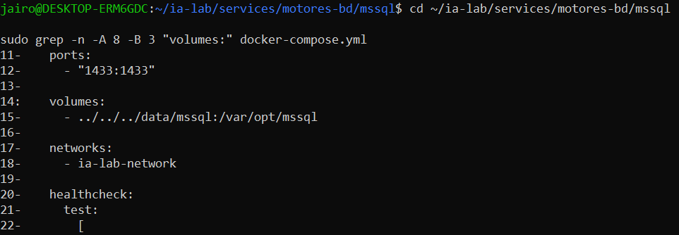

### 14.4 Consideraciones sobre recuperación

El archivo `.bak` permite realizar una recuperación de la base de datos mediante las herramientas de SQL Server.

El backup debe conservarse en un almacenamiento persistente y verificarse periódicamente para asegurar que pueda utilizarse cuando sea necesario.

La eliminación de los volúmenes de Docker puede provocar la pérdida de los datos almacenados en ellos, por lo que se recomienda conservar los archivos de respaldo de forma independiente.

```bash
cd ~/ia-lab/data/mssql
sudo ls -lh master_backup.bak
````

Después:

```bash
cd ~/ia-lab/data/mssql
sudo ls -lah
```

Y para demostrar que Docker realmente está utilizando ese directorio:

```bash
cd ~/ia-lab/services/motores-bd/mssql
sudo grep -n -A 8 -B 3 "volumes:" docker-compose.yml
```

> 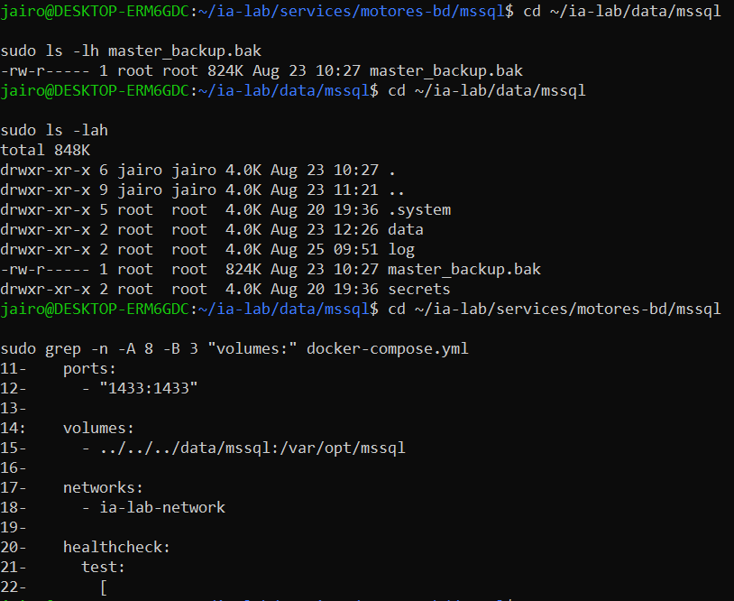

*El `.bak` constituye el respaldo disponible para una recuperación posterior.*

---

## 15. Scripts de administración

Para facilitar la administración de los cuatro motores se crearon dos scripts que permiten iniciar y detener los servicios de Docker de forma centralizada.

### 15.1 start-all.sh

El script `start-all.sh` permite iniciar los cuatro motores de bases de datos utilizando sus respectivos archivos `docker-compose.yml`.

Ubicación:

```text
~/ia-lab/services/motores-bd/start-all.sh
````

Para consultar su contenido:

```bash
cd ~/ia-lab/services/motores-bd
sudo cat start-all.sh
```

> 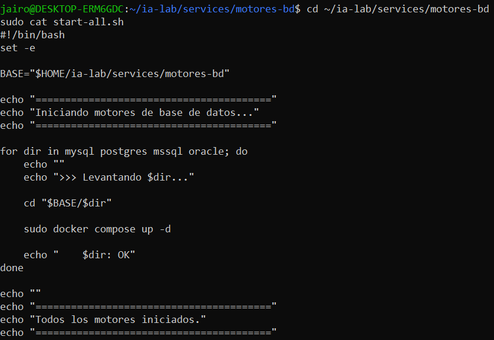

Para ejecutarlo:

```bash
cd ~/ia-lab/services/motores-bd
./start-all.sh
```

Después se puede comprobar el estado de los contenedores:

```bash
sudo docker ps
```

> 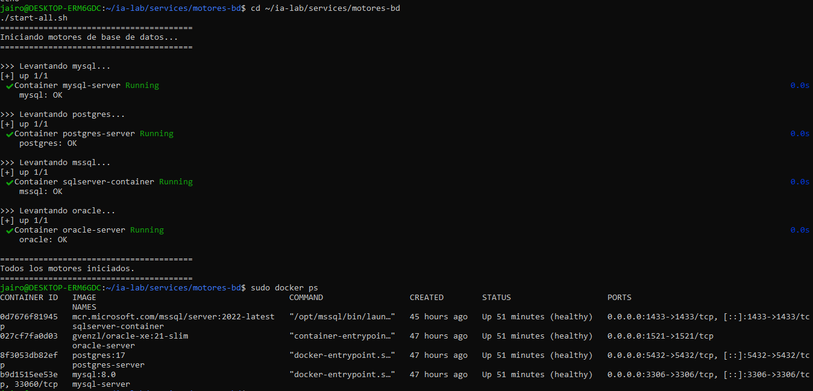

### 15.2 stop-all.sh

El script `stop-all.sh` permite detener los servicios de los cuatro motores.

Ubicación:

```text
~/ia-lab/services/motores-bd/stop-all.sh
```

Para consultar su contenido:

```bash
cd ~/ia-lab/services/motores-bd
cat stop-all.sh
```

> 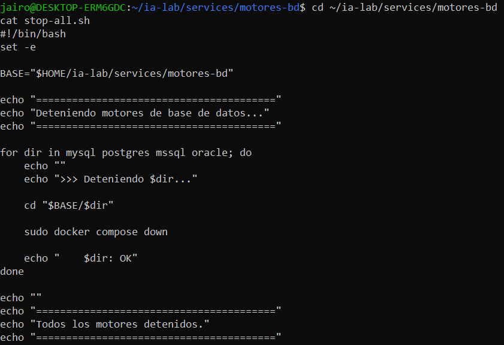

Para ejecutarlo:

```bash
cd ~/ia-lab/services/motores-bd
./stop-all.sh
```

El estado de los servicios puede comprobarse con:

```bash
sudo docker ps
```

> 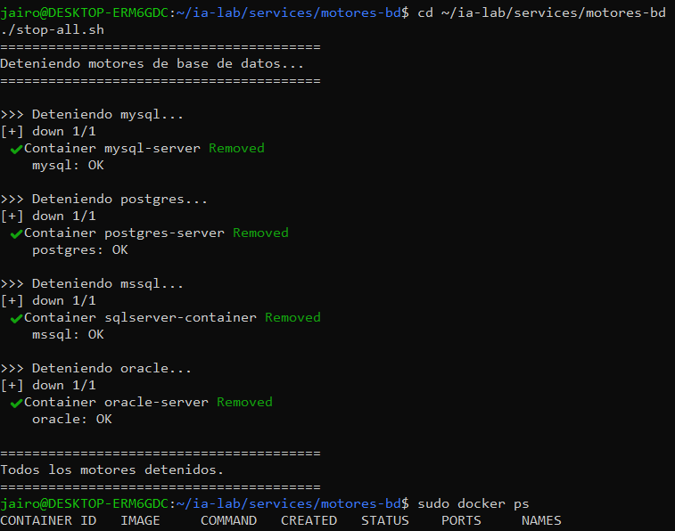

### 15.3 Comandos utilizados

Durante la administración del proyecto se utilizaron principalmente los siguientes comandos:

```bash
# Iniciar todos los motores
cd ~/ia-lab/services/motores-bd
./start-all.sh

# Detener todos los motores
cd ~/ia-lab/services/motores-bd
./stop-all.sh

# Ver contenedores activos
sudo docker ps

# Ver todos los contenedores
sudo docker ps -a

# Ver los proyectos Docker Compose
sudo docker compose ls

# Verificar la configuración de un motor
sudo docker compose config

# Ver los logs de un contenedor
sudo docker logs mysql-server --tail 50

# Verificar los puertos
nc -zv 127.0.0.1 3306
nc -zv 127.0.0.1 5432
nc -zv 127.0.0.1 1433
nc -zv 127.0.0.1 1521
```

Estos comandos permitieron iniciar, detener, revisar y verificar el funcionamiento de los servicios durante la implementación.

---

## 16. Validación final

Se realizó una validación general del proyecto para comprobar que los cuatro motores de bases de datos, sus contenedores, puertos y conexiones funcionaran correctamente.

### 16.1 Validación de Docker Compose

Se verificó la configuración de Docker Compose de cada motor mediante:

```bash
cd ~/ia-lab/services/motores-bd

echo "===== MYSQL ====="
cd mysql
sudo docker compose config > /tmp/mysql-compose-config.yml
echo "MySQL: $([ -s /tmp/mysql-compose-config.yml ] && echo OK || echo ERROR)"

echo ""
echo "===== POSTGRESQL ====="
cd ../postgres
sudo docker compose config > /tmp/postgres-compose-config.yml
echo "PostgreSQL: $([ -s /tmp/postgres-compose-config.yml ] && echo OK || echo ERROR)"

echo ""
echo "===== SQL SERVER ====="
cd ../mssql
sudo docker compose config > /tmp/mssql-compose-config.yml
echo "SQL Server: $([ -s /tmp/mssql-compose-config.yml ] && echo OK || echo ERROR)"

echo ""
echo "===== ORACLE ====="
cd ../oracle
sudo docker compose config > /tmp/oracle-compose-config.yml
echo "Oracle: $([ -s /tmp/oracle-compose-config.yml ] && echo OK || echo ERROR)"
````

El resultado obtenido fue:

```text
MySQL: OK
PostgreSQL: OK
SQL Server: OK
Oracle: OK
```

> 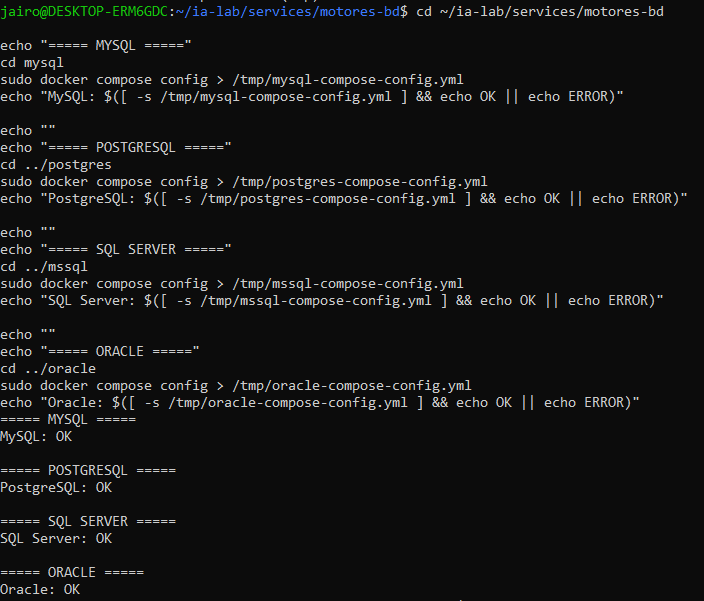

### 16.2 Estado de los contenedores

Se comprobó que los cuatro contenedores estuvieran ejecutándose y en estado `healthy`.

Comando utilizado:

```bash
sudo docker ps \
--format "table {{.Names}}\t{{.Status}}\t{{.Ports}}"
```

El resultado esperado es similar a:

```text
NAMES                  STATUS
sqlserver-container    Up ... (healthy)
oracle-server          Up ... (healthy)
postgres-server        Up ... (healthy)
mysql-server           Up ... (healthy)
```

> 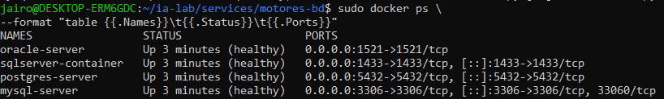

### 16.3 Estado de los puertos

Se verificó que los puertos publicados por Docker estuvieran disponibles desde el sistema.

```bash
echo "===== PUERTOS ====="

echo "MySQL 3306:"
nc -zv 127.0.0.1 3306

echo "PostgreSQL 5432:"
nc -zv 127.0.0.1 5432

echo "SQL Server 1433:"
nc -zv 127.0.0.1 1433

echo "Oracle 1521:"
nc -zv 127.0.0.1 1521
```

El resultado obtenido fue:

```text
MySQL 3306:
Connection to 127.0.0.1 3306 port [tcp/mysql] succeeded!

PostgreSQL 5432:
Connection to 127.0.0.1 5432 port [tcp/postgresql] succeeded!

SQL Server 1433:
Connection to 127.0.0.1 1433 port [tcp/ms-sql-s] succeeded!

Oracle 1521:
Connection to 127.0.0.1 1521 port [tcp/*] succeeded!
```

> 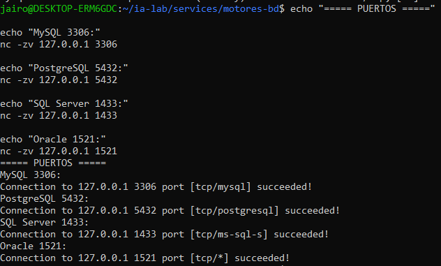

### 16.4 Estado de las conexiones en DBeaver

Finalmente, se verificaron las conexiones desde DBeaver. Los cuatro motores fueron conectados correctamente y se mostraron activos.

Los motores comprobados fueron:

* MySQL
* PostgreSQL
* SQL Server
* Oracle XE

Evidencia:

> 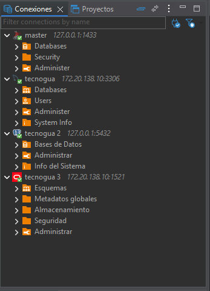

### 16.5 Resultado final

La validación final confirmó el correcto funcionamiento de la implementación:

| Elemento           | Resultado   |
| ------------------ | ----------- |
| MySQL              | OK          |
| PostgreSQL         | OK          |
| SQL Server         | OK          |
| Oracle XE          | OK          |
| Docker Compose     | OK          |
| Contenedores       | Healthy     |
| Puertos            | Disponibles |
| Conexiones DBeaver | Correctas   |

En conclusión, los cuatro motores de bases de datos quedaron configurados, ejecutándose mediante Docker y disponibles para conexión desde DBeaver.

---

## 17. Estructura final del proyecto

### 17.1 Árbol del proyecto

La estructura final del proyecto se organizó separando los servicios de Docker de los datos persistentes generados por los motores de bases de datos.

La estructura principal del proyecto se distribuye en los directorios `data/` y `services/motores-bd/`.

#### Directorio de datos persistentes

El directorio `data/` contiene los directorios utilizados para almacenar los datos persistentes de los diferentes motores de bases de datos, así como los respaldos generados durante la implementación.

```text
ia-lab/
└── data/
    ├── mssql/
    ├── mysql/
    ├── oracle/
    ├── oracle_backup_20260823/
    ├── oracle_old_20260823/
    ├── postgres/
    └── postgres_backup_20260823/
```

La estructura anterior se comprobó mediante el comando:

```bash
cd ~/ia-lab
tree data -L 1
```

Evidencia del directorio `data/`:

> 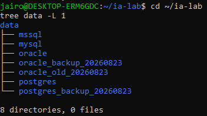

#### Directorio de servicios de los motores de bases de datos

El directorio `services/motores-bd/` contiene las configuraciones de los servicios Docker correspondientes a MySQL, PostgreSQL, SQL Server y Oracle. Cada motor cuenta con su archivo de variables de entorno, documentación y configuración de Docker Compose.

```text
services/
└── motores-bd/
    ├── README.md
    ├── mysql/
    │   ├── .env
    │   ├── README.md
    │   └── docker-compose.yml
    ├── postgres/
    │   ├── .env
    │   ├── README.md
    │   └── docker-compose.yml
    ├── mssql/
    │   ├── .env
    │   ├── README.md
    │   └── docker-compose.yml
    ├── oracle/
    │   ├── .env
    │   ├── README.md
    │   └── docker-compose.yml
    ├── start-all.sh
    └── stop-all.sh
```

La estructura se comprobó mediante:

```bash
tree -a ~/ia-lab/services/motores-bd -L 2
```

La opción `-a` permite incluir archivos ocultos como `.env`, mientras que `-L 2` limita la profundidad mostrada para facilitar la lectura de la estructura.

Evidencia del directorio `services/motores-bd/`:

> 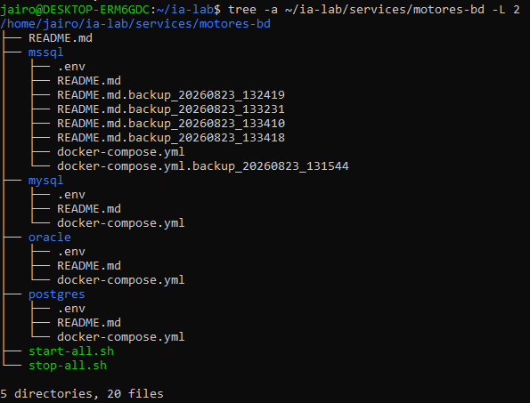

> **Nota:** Los directorios de `data/` contienen los archivos generados por los motores de bases de datos y sus respaldos. Por esta razón, en la evidencia se muestran únicamente sus directorios principales, evitando incluir el contenido interno de los datos persistentes.

### 17.2 Descripción de los directorios principales

| Directorio             | Descripción                                                   |
| ---------------------- | ------------------------------------------------------------- |
| `data/`                | Contiene los datos persistentes de los motores.               |
| `services/motores-bd/` | Contiene la configuración y administración de los servicios.  |
| `mysql/`               | Configuración del contenedor de MySQL.                        |
| `postgres/`            | Configuración del contenedor de PostgreSQL.                   |
| `mssql/`               | Configuración del contenedor de SQL Server.                   |
| `oracle/`              | Configuración del contenedor de Oracle XE.                    |
| `.env`                 | Contiene variables de entorno utilizadas por cada servicio.   |
| `docker-compose.yml`   | Define la configuración de cada contenedor.                   |
| `start-all.sh`         | Inicia los cuatro motores.                                    |
| `stop-all.sh`          | Detiene los cuatro motores.                                   |
| `README.md`            | Documenta la configuración y funcionamiento de los servicios. |

La estructura permite mantener organizados los archivos de configuración, los datos persistentes y los scripts de administración del proyecto.

---

## 18. Conclusiones

La implementación permitió configurar y ejecutar correctamente cuatro motores de bases de datos: MySQL, PostgreSQL, SQL Server y Oracle XE, utilizando Docker sobre WSL.

Se comprobó que los servicios funcionan correctamente, mantienen sus datos mediante almacenamiento persistente y pueden ser administrados desde DBeaver.

También se verificaron los puertos, las conexiones y el estado de los contenedores, además de realizar un backup de SQL Server.

Finalmente, se logró una estructura organizada del proyecto, con archivos de configuración, documentación y scripts para facilitar la administración de los servicios.