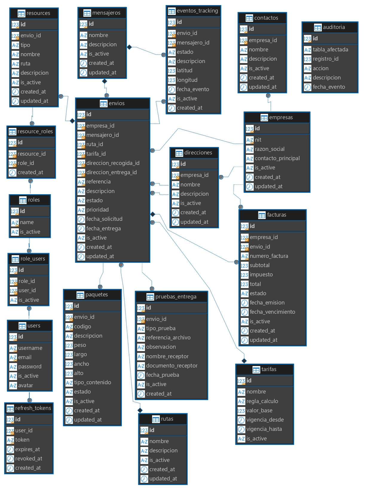

# INFORME DE VERIFICACIÓN DE BASES DE DATOS

## 1. Objetivo

El objetivo de este informe es presentar las evidencias de la creación y configuración de las bases de datos utilizadas en el proyecto **EnlaceExpress**.

Para la verificación se revisaron cuatro motores de bases de datos: **MySQL, PostgreSQL, SQL Server y Oracle**. En cada uno se comprobó la existencia de las 18 tablas del proyecto y la configuración de elementos importantes como claves primarias, claves foráneas, restricciones UNIQUE, índices, restricciones CHECK y triggers.

Las consultas utilizadas permiten comprobar directamente la estructura existente en cada motor y sirven como evidencia del trabajo realizado.

---

# 2. MySQL

La base de datos utilizada para esta verificación es `enlace_express`.

## 2.1 Diagrama ER de MySQL

A continuación se presenta el diagrama entidad-relación correspondiente a la base de datos implementada en MySQL.

> 

--

## 2.2 PK, FK y UNIQUE

La siguiente consulta permite identificar las claves primarias, claves foráneas y restricciones UNIQUE existentes en las tablas de la base de datos.

```sql
SELECT
    TABLE_NAME,
    CONSTRAINT_NAME,
    CONSTRAINT_TYPE
FROM information_schema.TABLE_CONSTRAINTS
WHERE TABLE_SCHEMA = 'enlace_express'
  AND CONSTRAINT_TYPE IN ('PRIMARY KEY', 'FOREIGN KEY', 'UNIQUE')
ORDER BY TABLE_NAME, CONSTRAINT_TYPE, CONSTRAINT_NAME;
```

**Evidencia del resultado:**

```text
TABLE_NAME      |CONSTRAINT_NAME                |CONSTRAINT_TYPE|
----------------+-------------------------------+---------------+
auditoria       |PRIMARY                        |PRIMARY KEY    |
contactos       |contactos_ibfk_1               |FOREIGN KEY    |
contactos       |PRIMARY                        |PRIMARY KEY    |
direcciones     |direcciones_ibfk_1             |FOREIGN KEY    |
direcciones     |PRIMARY                        |PRIMARY KEY    |
empresas        |PRIMARY                        |PRIMARY KEY    |
empresas        |nit                            |UNIQUE         |
envios          |envios_ibfk_1                  |FOREIGN KEY    |
envios          |envios_ibfk_2                  |FOREIGN KEY    |
envios          |envios_ibfk_3                  |FOREIGN KEY    |
envios          |envios_ibfk_4                  |FOREIGN KEY    |
envios          |envios_ibfk_5                  |FOREIGN KEY    |
envios          |envios_ibfk_6                  |FOREIGN KEY    |
envios          |PRIMARY                        |PRIMARY KEY    |
envios          |referencia                     |UNIQUE         |
eventos_tracking|eventos_tracking_ibfk_1        |FOREIGN KEY    |
eventos_tracking|eventos_tracking_ibfk_2        |FOREIGN KEY    |
eventos_tracking|PRIMARY                        |PRIMARY KEY    |
facturas        |facturas_ibfk_1                |FOREIGN KEY    |
facturas        |facturas_ibfk_2                |FOREIGN KEY    |
facturas        |PRIMARY                        |PRIMARY KEY    |
facturas        |numero_factura                 |UNIQUE         |
mensajeros      |PRIMARY                        |PRIMARY KEY    |
paquetes        |paquetes_ibfk_1                |FOREIGN KEY    |
paquetes        |PRIMARY                        |PRIMARY KEY    |
paquetes        |codigo                         |UNIQUE         |
pruebas_entrega |pruebas_entrega_ibfk_1         |FOREIGN KEY    |
pruebas_entrega |PRIMARY                        |PRIMARY KEY    |
refresh_tokens  |refresh_tokens_ibfk_1          |FOREIGN KEY    |
refresh_tokens  |PRIMARY                        |PRIMARY KEY    |
refresh_tokens  |token                          |UNIQUE         |
resource_roles  |fk_resource_roles_resource     |FOREIGN KEY    |
resource_roles  |fk_resource_roles_role         |FOREIGN KEY    |
resource_roles  |PRIMARY                        |PRIMARY KEY    |
resource_roles  |uq_resource_roles_resource_role|UNIQUE         |
resources       |PRIMARY                        |PRIMARY KEY    |
resources       |uq_resources_path_method       |UNIQUE         |
role_users      |role_users_ibfk_1              |FOREIGN KEY    |
role_users      |role_users_ibfk_2              |FOREIGN KEY    |
role_users      |PRIMARY                        |PRIMARY KEY    |
role_users      |role_id                        |UNIQUE         |
roles           |PRIMARY                        |PRIMARY KEY    |
roles           |name                           |UNIQUE         |
rutas           |PRIMARY                        |PRIMARY KEY    |
tarifas         |PRIMARY                        |PRIMARY KEY    |
users           |PRIMARY                        |PRIMARY KEY    |
users           |email                          |UNIQUE         |
users           |username                       |UNIQUE         |
```

El resultado permite comprobar que las tablas cuentan con sus respectivas claves primarias, relaciones mediante claves foráneas y restricciones de unicidad.

---

## 2.3 Índices

La siguiente consulta permite verificar los índices creados en las tablas de la base de datos.

```sql
SELECT
    TABLE_NAME,
    INDEX_NAME,
    COLUMN_NAME,
    NON_UNIQUE,
    SEQ_IN_INDEX
FROM information_schema.STATISTICS
WHERE TABLE_SCHEMA = 'enlace_express'
ORDER BY TABLE_NAME, INDEX_NAME, SEQ_IN_INDEX;
```

**Evidencia del resultado:**

```text
TABLE_NAME      |INDEX_NAME                     |COLUMN_NAME          |NON_UNIQUE|SEQ_IN_INDEX|
----------------+-------------------------------+---------------------+----------+------------+
auditoria       |PRIMARY                        |id                   |         0|           1|
contactos       |empresa_id                     |empresa_id           |         1|           1|
contactos       |PRIMARY                        |id                   |         0|           1|
direcciones     |empresa_id                     |empresa_id           |         1|           1|
direcciones     |PRIMARY                        |id                   |         0|           1|
empresas        |nit                            |nit                  |         0|           1|
empresas        |PRIMARY                        |id                   |         0|           1|
envios          |direccion_entrega_id           |direccion_entrega_id |         1|           1|
envios          |direccion_recogida_id          |direccion_recogida_id|         1|           1|
envios          |empresa_id                     |empresa_id           |         1|           1|
envios          |mensajero_id                   |mensajero_id         |         1|           1|
envios          |PRIMARY                        |id                   |         0|           1|
envios          |referencia                     |referencia           |         0|           1|
envios          |ruta_id                        |ruta_id              |         1|           1|
envios          |tarifa_id                      |tarifa_id            |         1|           1|
eventos_tracking|envio_id                       |envio_id             |         1|           1|
eventos_tracking|mensajero_id                   |mensajero_id         |         1|           1|
eventos_tracking|PRIMARY                        |id                   |         0|           1|
facturas        |empresa_id                     |empresa_id           |         1|           1|
facturas        |envio_id                       |envio_id             |         1|           1|
facturas        |numero_factura                 |numero_factura       |         0|           1|
facturas        |PRIMARY                        |id                   |         0|           1|
mensajeros      |PRIMARY                        |id                   |         0|           1|
paquetes        |codigo                         |codigo               |         0|           1|
paquetes        |envio_id                       |envio_id             |         1|           1|
paquetes        |PRIMARY                        |id                   |         0|           1|
pruebas_entrega |envio_id                       |envio_id             |         1|           1|
pruebas_entrega |PRIMARY                        |id                   |         0|           1|
refresh_tokens  |PRIMARY                        |id                   |         0|           1|
refresh_tokens  |token                          |token                |         0|           1|
refresh_tokens  |user_id                        |user_id              |         1|           1|
resource_roles  |idx_resource_roles_resource_id |resource_id          |         1|           1|
resource_roles  |idx_resource_roles_role_id     |role_id              |         1|           1|
resource_roles  |PRIMARY                        |id                   |         0|           1|
resource_roles  |uq_resource_roles_resource_role|resource_id          |         0|           1|
resource_roles  |uq_resource_roles_resource_role|role_id              |         0|           2|
resources       |PRIMARY                        |id                   |         0|           1|
resources       |uq_resources_path_method       |path                 |         0|           1|
resources       |uq_resources_path_method       |method               |         0|           2|
role_users      |PRIMARY                        |id                   |         0|           1|
role_users      |role_id                        |role_id              |         0|           1|
role_users      |role_id                        |user_id              |         0|           2|
role_users      |user_id                        |user_id              |         1|           1|
roles           |name                           |name                 |         0|           1|
roles           |PRIMARY                        |id                   |         0|           1|
rutas           |PRIMARY                        |id                   |         0|           1|
tarifas         |PRIMARY                        |id                   |         0|           1|
users           |email                          |email                |         0|           1|
users           |PRIMARY                        |id                   |         0|           1|
users           |username                       |username             |         0|           1|
```

Con este resultado se pueden comprobar los índices asociados a las claves primarias, claves únicas y columnas utilizadas para las relaciones entre las tablas.

---

## 2.4 CHECK constraints

Para comprobar si existen restricciones CHECK se utilizó la siguiente consulta:

```sql
SELECT
    tc.TABLE_NAME,
    cc.CONSTRAINT_NAME,
    cc.CHECK_CLAUSE
FROM information_schema.CHECK_CONSTRAINTS cc
JOIN information_schema.TABLE_CONSTRAINTS tc
    ON cc.CONSTRAINT_SCHEMA = tc.CONSTRAINT_SCHEMA
    AND cc.CONSTRAINT_NAME = tc.CONSTRAINT_NAME
WHERE cc.CONSTRAINT_SCHEMA = 'enlace_express'
  AND tc.CONSTRAINT_TYPE = 'CHECK'
ORDER BY tc.TABLE_NAME, cc.CONSTRAINT_NAME;
```

**Evidencia del resultado:**

```text
TABLE_NAME|CONSTRAINT_NAME|CHECK_CLAUSE|
----------+---------------+------------+
```

En el resultado obtenido no se muestran restricciones CHECK para esta base de datos. Por lo tanto, esta característica no presenta registros en la consulta realizada.

---

## 2.5 Triggers

La siguiente consulta permite verificar los triggers definidos en la base de datos:

```sql
SELECT
    TRIGGER_NAME,
    EVENT_OBJECT_TABLE,
    ACTION_TIMING,
    EVENT_MANIPULATION,
    ACTION_STATEMENT
FROM information_schema.TRIGGERS
WHERE TRIGGER_SCHEMA = 'enlace_express'
ORDER BY EVENT_OBJECT_TABLE, TRIGGER_NAME;
```

**Evidencia del resultado:**

```text
TRIGGER_NAME        |EVENT_OBJECT_TABLE|ACTION_TIMING|EVENT_MANIPULATION|ACTION_STATEMENT                                                                                                                                                                                                                                               |
--------------------+------------------+-------------+------------------+---------------------------------------------------------------------------------------------------------------------------------------------------------------------------------------------------------------------------------------------------------------+
after_envio_insert  |envios            |AFTER        |INSERT            |INSERT INTO auditoria (¶    tabla_afectada,¶    registro_id,¶    accion,¶    descripcion¶)¶VALUES (¶    'envios',¶    NEW.id,¶    'INSERT',¶    CONCAT('Se creó el envío ', NEW.referencia)¶)                                                                  |
after_envio_update  |envios            |AFTER        |UPDATE            |INSERT INTO auditoria (¶    tabla_afectada,¶    registro_id,¶    accion,¶    descripcion¶)¶SELECT¶    'envios',¶    NEW.id,¶    'UPDATE',¶    CONCAT(¶        'El estado cambió de ',¶        OLD.estado,¶        ' a ',¶        NEW.estado¶    )¶WHERE OLD.est|
after_paquete_insert|paquetes          |AFTER        |INSERT            |INSERT INTO auditoria (¶    tabla_afectada,¶    registro_id,¶    accion,¶    descripcion¶)¶VALUES (¶    'paquetes',¶    NEW.id,¶    'INSERT',¶    CONCAT('Se creó el paquete ', NEW.codigo)¶)                                                                  |
```

El resultado permite comprobar los triggers asociados a las tablas y las operaciones que ejecutan automáticamente.

---

## 2.6 Confirmar las 18 tablas

Finalmente, se verificó la existencia de las 18 tablas de la base de datos mediante:

```sql
SELECT
    TABLE_SCHEMA,
    TABLE_NAME
FROM information_schema.TABLES
WHERE TABLE_SCHEMA = 'enlace_express'
  AND TABLE_TYPE = 'BASE TABLE'
ORDER BY TABLE_NAME;
```

**Evidencia del resultado:**

```text
TABLE_SCHEMA  |TABLE_NAME      |
--------------+----------------+
enlace_express|auditoria       |
enlace_express|contactos       |
enlace_express|direcciones     |
enlace_express|empresas        |
enlace_express|envios          |
enlace_express|eventos_tracking|
enlace_express|facturas        |
enlace_express|mensajeros      |
enlace_express|paquetes        |
enlace_express|pruebas_entrega |
enlace_express|refresh_tokens  |
enlace_express|resource_roles  |
enlace_express|resources       |
enlace_express|role_users      |
enlace_express|roles           |
enlace_express|rutas           |
enlace_express|tarifas         |
enlace_express|users           |
```

El resultado confirma la existencia de las 18 tablas correspondientes al modelo de EnlaceExpress.

---

# 3. PostgreSQL

La estructura del proyecto también fue implementada en PostgreSQL utilizando el esquema `public`.

## 3.1 Diagrama ER de PostgreSQL

A continuación se presenta el diagrama entidad-relación correspondiente a la base de datos implementada en PostgreSQL.

> 

--

## 3.2 PK, FK y UNIQUE

```sql
SELECT
    tc.table_name,
    tc.constraint_type,
    tc.constraint_name,
    kcu.column_name
FROM information_schema.table_constraints tc
JOIN information_schema.key_column_usage kcu
    ON tc.constraint_name = kcu.constraint_name
    AND tc.table_schema = kcu.table_schema
WHERE tc.table_schema = 'public'
  AND tc.table_name IN (
    'auditoria',
    'contactos',
    'direcciones',
    'empresas',
    'envios',
    'eventos_tracking',
    'facturas',
    'mensajeros',
    'paquetes',
    'pruebas_entrega',
    'refresh_tokens',
    'resource_roles',
    'resources',
    'role_users',
    'roles',
    'rutas',
    'tarifas',
    'users'
  )
  AND tc.constraint_type IN ('PRIMARY KEY', 'FOREIGN KEY', 'UNIQUE')
ORDER BY tc.table_name, tc.constraint_type, tc.constraint_name;
```

**Evidencia del resultado:**

```text
table_name      |constraint_type|constraint_name                |column_name          |
----------------+---------------+-------------------------------+---------------------+
auditoria       |PRIMARY KEY    |auditoria_pkey                 |id                   |
contactos       |FOREIGN KEY    |contactos_empresa_fk           |empresa_id           |
contactos       |PRIMARY KEY    |contactos_pkey                 |id                   |
direcciones     |FOREIGN KEY    |direcciones_empresa_fk         |empresa_id           |
direcciones     |PRIMARY KEY    |direcciones_pkey               |id                   |
empresas        |PRIMARY KEY    |empresas_pkey                  |id                   |
empresas        |UNIQUE         |empresas_nit_key               |nit                  |
envios          |FOREIGN KEY    |envios_direccion_entrega_fk    |direccion_entrega_id |
envios          |FOREIGN KEY    |envios_direccion_recogida_fk   |direccion_recogida_id|
envios          |FOREIGN KEY    |envios_empresa_fk              |empresa_id           |
envios          |FOREIGN KEY    |envios_mensajero_fk            |mensajero_id         |
envios          |FOREIGN KEY    |envios_ruta_fk                 |ruta_id              |
envios          |FOREIGN KEY    |envios_tarifa_fk               |tarifa_id            |
envios          |PRIMARY KEY    |envios_pkey                    |id                   |
envios          |UNIQUE         |envios_referencia_key          |referencia           |
eventos_tracking|FOREIGN KEY    |eventos_tracking_envio_fk      |envio_id             |
eventos_tracking|FOREIGN KEY    |eventos_tracking_mensajero_fk  |mensajero_id         |
eventos_tracking|PRIMARY KEY    |eventos_tracking_pkey          |id                   |
facturas        |FOREIGN KEY    |facturas_empresa_fk            |empresa_id           |
facturas        |FOREIGN KEY    |facturas_envio_fk              |envio_id             |
facturas        |PRIMARY KEY    |facturas_pkey                  |id                   |
facturas        |UNIQUE         |facturas_numero_factura_key    |numero_factura       |
mensajeros      |PRIMARY KEY    |mensajeros_pkey                |id                   |
paquetes        |FOREIGN KEY    |paquetes_envio_fk              |envio_id             |
paquetes        |PRIMARY KEY    |paquetes_pkey                  |id                   |
paquetes        |UNIQUE         |paquetes_codigo_key            |codigo               |
pruebas_entrega |FOREIGN KEY    |pruebas_entrega_envio_fk       |envio_id             |
pruebas_entrega |PRIMARY KEY    |pruebas_entrega_pkey           |id                   |
refresh_tokens  |FOREIGN KEY    |refresh_tokens_user_fk         |user_id              |
refresh_tokens  |PRIMARY KEY    |refresh_tokens_pkey            |id                   |
refresh_tokens  |UNIQUE         |refresh_tokens_token_key       |token                |
resource_roles  |FOREIGN KEY    |fk_resource_roles_resource     |resource_id          |
resource_roles  |FOREIGN KEY    |fk_resource_roles_role         |role_id              |
resource_roles  |PRIMARY KEY    |resource_roles_pkey            |id                   |
resource_roles  |UNIQUE         |uq_resource_roles_resource_role|role_id              |
resource_roles  |UNIQUE         |uq_resource_roles_resource_role|resource_id          |
resources       |PRIMARY KEY    |resources_pkey                 |id                   |
resources       |UNIQUE         |uq_resources_path_method       |path                 |
resources       |UNIQUE         |uq_resources_path_method       |method               |
role_users      |FOREIGN KEY    |fk_role_users_role             |role_id              |
role_users      |FOREIGN KEY    |fk_role_users_user             |user_id              |
role_users      |PRIMARY KEY    |role_users_pkey                |id                   |
role_users      |UNIQUE         |uq_role_users_role_user        |user_id              |
role_users      |UNIQUE         |uq_role_users_role_user        |role_id              |
roles           |PRIMARY KEY    |roles_pkey                     |id                   |
roles           |UNIQUE         |roles_name_key                 |name                 |
rutas           |PRIMARY KEY    |rutas_pkey                     |id                   |
tarifas         |PRIMARY KEY    |tarifas_pkey                   |id                   |
users           |PRIMARY KEY    |users_pkey                     |id                   |
users           |UNIQUE         |users_email_key                |email                |
users           |UNIQUE         |users_username_key             |username             |
```

---

## 3.3 Índices

```sql
SELECT
    tablename,
    indexname,
    indexdef
FROM pg_indexes
WHERE schemaname = 'public'
  AND tablename IN (
    'auditoria',
    'contactos',
    'direcciones',
    'empresas',
    'envios',
    'eventos_tracking',
    'facturas',
    'mensajeros',
    'paquetes',
    'pruebas_entrega',
    'refresh_tokens',
    'resource_roles',
    'resources',
    'role_users',
    'roles',
    'rutas',
    'tarifas',
    'users'
  )
ORDER BY tablename, indexname;
```

**Evidencia del resultado:**

```text
tablename       |indexname                        |indexdef                                                                                                       |
----------------+---------------------------------+---------------------------------------------------------------------------------------------------------------+
auditoria       |auditoria_pkey                   |CREATE UNIQUE INDEX auditoria_pkey ON public.auditoria USING btree (id)                                        |
contactos       |contactos_pkey                   |CREATE UNIQUE INDEX contactos_pkey ON public.contactos USING btree (id)                                        |
contactos       |idx_contactos_empresa_id         |CREATE INDEX idx_contactos_empresa_id ON public.contactos USING btree (empresa_id)                             |
direcciones     |direcciones_pkey                 |CREATE UNIQUE INDEX direcciones_pkey ON public.direcciones USING btree (id)                                    |
direcciones     |idx_direcciones_empresa_id       |CREATE INDEX idx_direcciones_empresa_id ON public.direcciones USING btree (empresa_id)                         |
empresas        |empresas_nit_key                 |CREATE UNIQUE INDEX empresas_nit_key ON public.empresas USING btree (nit)                                      |
empresas        |empresas_pkey                    |CREATE UNIQUE INDEX empresas_pkey ON public.empresas USING btree (id)                                          |
envios          |envios_pkey                      |CREATE UNIQUE INDEX envios_pkey ON public.envios USING btree (id)                                              |
envios          |envios_referencia_key            |CREATE UNIQUE INDEX envios_referencia_key ON public.envios USING btree (referencia)                            |
envios          |idx_envios_direccion_entrega_id  |CREATE INDEX idx_envios_direccion_entrega_id ON public.envios USING btree (direccion_entrega_id)               |
envios          |idx_envios_direccion_recogida_id |CREATE INDEX idx_envios_direccion_recogida_id ON public.envios USING btree (direccion_recogida_id)             |
envios          |idx_envios_empresa_id            |CREATE INDEX idx_envios_empresa_id ON public.envios USING btree (empresa_id)                                   |
envios          |idx_envios_mensajero_id          |CREATE INDEX idx_envios_mensajero_id ON public.envios USING btree (mensajero_id)                               |
envios          |idx_envios_ruta_id               |CREATE INDEX idx_envios_ruta_id ON public.envios USING btree (ruta_id)                                         |
envios          |idx_envios_tarifa_id             |CREATE INDEX idx_envios_tarifa_id ON public.envios USING btree (tarifa_id)                                     |
eventos_tracking|eventos_tracking_pkey            |CREATE UNIQUE INDEX eventos_tracking_pkey ON public.eventos_tracking USING btree (id)                          |
eventos_tracking|idx_eventos_tracking_envio_id    |CREATE INDEX idx_eventos_tracking_envio_id ON public.eventos_tracking USING btree (envio_id)                   |
eventos_tracking|idx_eventos_tracking_mensajero_id|CREATE INDEX idx_eventos_tracking_mensajero_id ON public.eventos_tracking USING btree (mensajero_id)           |
facturas        |facturas_numero_factura_key      |CREATE UNIQUE INDEX facturas_numero_factura_key ON public.facturas USING btree (numero_factura)                |
facturas        |facturas_pkey                    |CREATE UNIQUE INDEX facturas_pkey ON public.facturas USING btree (id)                                          |
facturas        |idx_facturas_empresa_id          |CREATE INDEX idx_facturas_empresa_id ON public.facturas USING btree (empresa_id)                               |
facturas        |idx_facturas_envio_id            |CREATE INDEX idx_facturas_envio_id ON public.facturas USING btree (envio_id)                                   |
mensajeros      |mensajeros_pkey                  |CREATE UNIQUE INDEX mensajeros_pkey ON public.mensajeros USING btree (id)                                      |
paquetes        |idx_paquetes_envio_id            |CREATE INDEX idx_paquetes_envio_id ON public.paquetes USING btree (envio_id)                                   |
paquetes        |paquetes_codigo_key              |CREATE UNIQUE INDEX paquetes_codigo_key ON public.paquetes USING btree (codigo)                                |
paquetes        |paquetes_pkey                    |CREATE UNIQUE INDEX paquetes_pkey ON public.paquetes USING btree (id)                                          |
pruebas_entrega |idx_pruebas_entrega_envio_id     |CREATE INDEX idx_pruebas_entrega_envio_id ON public.pruebas_entrega USING btree (envio_id)                     |
pruebas_entrega |pruebas_entrega_pkey             |CREATE UNIQUE INDEX pruebas_entrega_pkey ON public.pruebas_entrega USING btree (id)                            |
refresh_tokens  |idx_refresh_tokens_user_id       |CREATE INDEX idx_refresh_tokens_user_id ON public.refresh_tokens USING btree (user_id)                         |
refresh_tokens  |refresh_tokens_pkey              |CREATE UNIQUE INDEX refresh_tokens_pkey ON public.refresh_tokens USING btree (id)                              |
refresh_tokens  |refresh_tokens_token_key         |CREATE UNIQUE INDEX refresh_tokens_token_key ON public.refresh_tokens USING btree (token)                      |
resource_roles  |idx_resource_roles_resource_id   |CREATE INDEX idx_resource_roles_resource_id ON public.resource_roles USING btree (resource_id)                 |
resource_roles  |idx_resource_roles_role_id       |CREATE INDEX idx_resource_roles_role_id ON public.resource_roles USING btree (role_id)                         |
resource_roles  |resource_roles_pkey              |CREATE UNIQUE INDEX resource_roles_pkey ON public.resource_roles USING btree (id)                              |
resource_roles  |uq_resource_roles_resource_role  |CREATE UNIQUE INDEX uq_resource_roles_resource_role ON public.resource_roles USING btree (resource_id, role_id)|
resources       |resources_pkey                   |CREATE UNIQUE INDEX resources_pkey ON public.resources USING btree (id)                                        |
resources       |uq_resources_path_method         |CREATE UNIQUE INDEX uq_resources_path_method ON public.resources USING btree (path, method)                    |
role_users      |idx_role_users_user_id           |CREATE INDEX idx_role_users_user_id ON public.role_users USING btree (user_id)                                 |
role_users      |role_users_pkey                  |CREATE UNIQUE INDEX role_users_pkey ON public.role_users USING btree (id)                                      |
role_users      |uq_role_users_role_user          |CREATE UNIQUE INDEX uq_role_users_role_user ON public.role_users USING btree (role_id, user_id)                |
roles           |roles_name_key                   |CREATE UNIQUE INDEX roles_name_key ON public.roles USING btree (name)                                          |
roles           |roles_pkey                       |CREATE UNIQUE INDEX roles_pkey ON public.roles USING btree (id)                                                |
rutas           |rutas_pkey                       |CREATE UNIQUE INDEX rutas_pkey ON public.rutas USING btree (id)                                                |
tarifas         |tarifas_pkey                     |CREATE UNIQUE INDEX tarifas_pkey ON public.tarifas USING btree (id)                                            |
users           |users_email_key                  |CREATE UNIQUE INDEX users_email_key ON public.users USING btree (email)                                        |
users           |users_pkey                       |CREATE UNIQUE INDEX users_pkey ON public.users USING btree (id)                                                |
users           |users_username_key               |CREATE UNIQUE INDEX users_username_key ON public.users USING btree (username)                                  |
```

---

## 3.4 CHECK constraints

```sql
SELECT
    tc.table_name,
    tc.constraint_name,
    cc.check_clause
FROM information_schema.table_constraints tc
JOIN information_schema.check_constraints cc
    ON tc.constraint_name = cc.constraint_name
WHERE tc.constraint_schema = 'public'
  AND tc.constraint_type = 'CHECK'
ORDER BY tc.table_name, tc.constraint_name;
```

**Evidencia del resultado:**

```text
table_name      |constraint_name        |check_clause                     |
----------------+-----------------------+---------------------------------+
auditoria       |24665_25069_1_not_null |id IS NOT NULL                   |
auditoria       |24665_25069_2_not_null |tabla_afectada IS NOT NULL       |
auditoria       |24665_25069_3_not_null |registro_id IS NOT NULL          |
auditoria       |24665_25069_4_not_null |accion IS NOT NULL               |
contactos       |24665_24821_1_not_null |id IS NOT NULL                   |
contactos       |24665_24821_2_not_null |empresa_id IS NOT NULL           |
contactos       |24665_24821_3_not_null |nombre IS NOT NULL               |
contactos       |24665_24821_5_not_null |is_active IS NOT NULL            |
direcciones     |24665_24807_1_not_null |id IS NOT NULL                   |
direcciones     |24665_24807_2_not_null |empresa_id IS NOT NULL           |
direcciones     |24665_24807_3_not_null |nombre IS NOT NULL               |
direcciones     |24665_24807_4_not_null |descripcion IS NOT NULL          |
direcciones     |24665_24807_5_not_null |is_active IS NOT NULL            |
empresas        |24665_24771_1_not_null |id IS NOT NULL                   |
empresas        |24665_24771_2_not_null |nit IS NOT NULL                  |
empresas        |24665_24771_3_not_null |razon_social IS NOT NULL         |
empresas        |24665_24771_4_not_null |contacto_principal IS NOT NULL   |
empresas        |24665_24771_5_not_null |is_active IS NOT NULL            |
envios          |24665_24835_10_not_null|estado IS NOT NULL               |
envios          |24665_24835_11_not_null|prioridad IS NOT NULL            |
envios          |24665_24835_12_not_null|fecha_solicitud IS NOT NULL      |
envios          |24665_24835_14_not_null|is_active IS NOT NULL            |
envios          |24665_24835_1_not_null |id IS NOT NULL                   |
envios          |24665_24835_2_not_null |empresa_id IS NOT NULL           |
envios          |24665_24835_6_not_null |direccion_recogida_id IS NOT NULL|
envios          |24665_24835_7_not_null |direccion_entrega_id IS NOT NULL |
envios          |24665_24835_8_not_null |referencia IS NOT NULL           |
eventos_tracking|24665_24897_1_not_null |id IS NOT NULL                   |
eventos_tracking|24665_24897_2_not_null |envio_id IS NOT NULL             |
eventos_tracking|24665_24897_4_not_null |estado IS NOT NULL               |
eventos_tracking|24665_24897_8_not_null |fecha_evento IS NOT NULL         |
eventos_tracking|24665_24897_9_not_null |is_active IS NOT NULL            |
facturas        |24665_24932_11_not_null|is_active IS NOT NULL            |
facturas        |24665_24932_1_not_null |id IS NOT NULL                   |
facturas        |24665_24932_2_not_null |empresa_id IS NOT NULL           |
facturas        |24665_24932_4_not_null |numero_factura IS NOT NULL       |
facturas        |24665_24932_5_not_null |subtotal IS NOT NULL             |
facturas        |24665_24932_6_not_null |impuesto IS NOT NULL             |
facturas        |24665_24932_7_not_null |total IS NOT NULL                |
facturas        |24665_24932_8_not_null |estado IS NOT NULL               |
facturas        |24665_24932_9_not_null |fecha_emision IS NOT NULL        |
mensajeros      |24665_24782_1_not_null |id IS NOT NULL                   |
mensajeros      |24665_24782_2_not_null |nombre IS NOT NULL               |
mensajeros      |24665_24782_4_not_null |is_active IS NOT NULL            |
paquetes        |24665_24879_10_not_null|estado IS NOT NULL               |
paquetes        |24665_24879_11_not_null|is_active IS NOT NULL            |
paquetes        |24665_24879_1_not_null |id IS NOT NULL                   |
paquetes        |24665_24879_2_not_null |envio_id IS NOT NULL             |
paquetes        |24665_24879_3_not_null |codigo IS NOT NULL               |
paquetes        |24665_24879_5_not_null |peso IS NOT NULL                 |
pruebas_entrega |24665_24916_1_not_null |id IS NOT NULL                   |
pruebas_entrega |24665_24916_2_not_null |envio_id IS NOT NULL             |
pruebas_entrega |24665_24916_3_not_null |tipo_prueba IS NOT NULL          |
pruebas_entrega |24665_24916_8_not_null |fecha_prueba IS NOT NULL         |
pruebas_entrega |24665_24916_9_not_null |is_active IS NOT NULL            |
refresh_tokens  |24665_25053_1_not_null |id IS NOT NULL                   |
refresh_tokens  |24665_25053_2_not_null |user_id IS NOT NULL              |
refresh_tokens  |24665_25053_3_not_null |token IS NOT NULL                |
refresh_tokens  |24665_25053_4_not_null |expires_at IS NOT NULL           |
resource_roles  |24665_25031_1_not_null |id IS NOT NULL                   |
resource_roles  |24665_25031_2_not_null |resource_id IS NOT NULL          |
resource_roles  |24665_25031_3_not_null |role_id IS NOT NULL              |
resource_roles  |24665_25031_4_not_null |is_active IS NOT NULL            |
resources       |24665_24975_1_not_null |id IS NOT NULL                   |
resources       |24665_24975_2_not_null |path IS NOT NULL                 |
resources       |24665_24975_3_not_null |method IS NOT NULL               |
resources       |24665_24975_4_not_null |is_active IS NOT NULL            |
role_users      |24665_25011_1_not_null |id IS NOT NULL                   |
role_users      |24665_25011_2_not_null |role_id IS NOT NULL              |
role_users      |24665_25011_3_not_null |user_id IS NOT NULL              |
role_users      |24665_25011_4_not_null |is_active IS NOT NULL            |
roles           |24665_24762_1_not_null |id IS NOT NULL                   |
roles           |24665_24762_2_not_null |name IS NOT NULL                 |
roles           |24665_24762_3_not_null |is_active IS NOT NULL            |
rutas           |24665_24791_1_not_null |id IS NOT NULL                   |
rutas           |24665_24791_2_not_null |nombre IS NOT NULL               |
rutas           |24665_24791_4_not_null |is_active IS NOT NULL            |
tarifas         |24665_24800_1_not_null |id IS NOT NULL                   |
tarifas         |24665_24800_2_not_null |nombre IS NOT NULL               |
tarifas         |24665_24800_3_not_null |regla_calculo IS NOT NULL        |
tarifas         |24665_24800_4_not_null |valor_base IS NOT NULL           |
tarifas         |24665_24800_5_not_null |vigencia_desde IS NOT NULL       |
tarifas         |24665_24800_7_not_null |is_active IS NOT NULL            |
users           |24665_24748_1_not_null |id IS NOT NULL                   |
users           |24665_24748_2_not_null |username IS NOT NULL             |
users           |24665_24748_3_not_null |email IS NOT NULL                |
users           |24665_24748_4_not_null |password IS NOT NULL             |
users           |24665_24748_5_not_null |is_active IS NOT NULL            |
```

El resultado permite comprobar las restricciones CHECK utilizadas en PostgreSQL para controlar los valores permitidos en determinadas columnas.

---

## 3.5 Triggers

```sql
SELECT
    event_object_table AS tabla,
    trigger_name,
    action_timing,
    event_manipulation,
    action_statement
FROM information_schema.triggers
WHERE trigger_schema = 'public'
ORDER BY event_object_table, trigger_name;
```

**Evidencia del resultado:**

```text
tabla         |trigger_name                 |action_timing|event_manipulation|action_statement                        |
--------------+-----------------------------+-------------+------------------+----------------------------------------+
contactos     |trg_contactos_updated_at     |BEFORE       |UPDATE            |EXECUTE FUNCTION actualizar_updated_at()|
direcciones   |trg_direcciones_updated_at   |BEFORE       |UPDATE            |EXECUTE FUNCTION actualizar_updated_at()|
empresas      |trg_empresas_updated_at      |BEFORE       |UPDATE            |EXECUTE FUNCTION actualizar_updated_at()|
envios        |trg_envios_updated_at        |BEFORE       |UPDATE            |EXECUTE FUNCTION actualizar_updated_at()|
facturas      |trg_facturas_updated_at      |BEFORE       |UPDATE            |EXECUTE FUNCTION actualizar_updated_at()|
mensajeros    |trg_mensajeros_updated_at    |BEFORE       |UPDATE            |EXECUTE FUNCTION actualizar_updated_at()|
paquetes      |trg_paquetes_updated_at      |BEFORE       |UPDATE            |EXECUTE FUNCTION actualizar_updated_at()|
resource_roles|trg_resource_roles_updated_at|BEFORE       |UPDATE            |EXECUTE FUNCTION actualizar_updated_at()|
resources     |trg_resources_updated_at     |BEFORE       |UPDATE            |EXECUTE FUNCTION actualizar_updated_at()|
rutas         |trg_rutas_updated_at         |BEFORE       |UPDATE            |EXECUTE FUNCTION actualizar_updated_at()|
```

---

## 3.6 Confirmar las 18 tablas

```sql
SELECT
    table_schema,
    table_name
FROM information_schema.tables
WHERE table_schema = 'public'
  AND table_type = 'BASE TABLE'
ORDER BY table_name;
```

**Evidencia del resultado:**

```text
table_schema|table_name      |
------------+----------------+
public      |auditoria       |
public      |contactos       |
public      |direcciones     |
public      |empresas        |
public      |envios          |
public      |eventos_tracking|
public      |facturas        |
public      |mensajeros      |
public      |paquetes        |
public      |pruebas_entrega |
public      |refresh_tokens  |
public      |resource_roles  |
public      |resources       |
public      |role_users      |
public      |roles           |
public      |rutas           |
public      |tarifas         |
public      |users           |
```

El resultado permite comprobar que las 18 tablas del proyecto se encuentran creadas dentro del esquema `public`.

---

# 4. SQL Server

La base de datos de SQL Server utiliza el esquema `dbo`.

## 4.1 Diagrama ER de SQL Server

A continuación se presenta el diagrama entidad-relación correspondiente a la base de datos implementada en SQL Server.

> 

---

## 4.2 PK, FK y UNIQUE

```sql
SELECT
    TABLE_SCHEMA,
    TABLE_NAME,
    CONSTRAINT_NAME,
    CONSTRAINT_TYPE
FROM INFORMATION_SCHEMA.TABLE_CONSTRAINTS
WHERE TABLE_SCHEMA = 'dbo'
  AND CONSTRAINT_TYPE IN (
      'PRIMARY KEY',
      'FOREIGN KEY',
      'UNIQUE'
  )
ORDER BY TABLE_NAME, CONSTRAINT_TYPE, CONSTRAINT_NAME;
```

**Evidencia del resultado:**

```text
TABLE_SCHEMA|TABLE_NAME      |CONSTRAINT_NAME                |CONSTRAINT_TYPE|
------------+----------------+-------------------------------+---------------+
dbo         |auditoria       |pk_auditoria                   |PRIMARY KEY    |
dbo         |contactos       |fk_contactos_empresa           |FOREIGN KEY    |
dbo         |contactos       |pk_contactos                   |PRIMARY KEY    |
dbo         |direcciones     |fk_direcciones_empresa         |FOREIGN KEY    |
dbo         |direcciones     |pk_direcciones                 |PRIMARY KEY    |
dbo         |empresas        |pk_empresas                    |PRIMARY KEY    |
dbo         |empresas        |uq_empresas_nit                |UNIQUE         |
dbo         |envios          |fk_envios_direccion_entrega    |FOREIGN KEY    |
dbo         |envios          |fk_envios_direccion_recogida   |FOREIGN KEY    |
dbo         |envios          |fk_envios_empresa              |FOREIGN KEY    |
dbo         |envios          |fk_envios_mensajero            |FOREIGN KEY    |
dbo         |envios          |fk_envios_ruta                 |FOREIGN KEY    |
dbo         |envios          |fk_envios_tarifa               |FOREIGN KEY    |
dbo         |envios          |pk_envios                      |PRIMARY KEY    |
dbo         |envios          |uq_envios_referencia           |UNIQUE         |
dbo         |eventos_tracking|fk_eventos_tracking_envio      |FOREIGN KEY    |
dbo         |eventos_tracking|fk_eventos_tracking_mensajero  |FOREIGN KEY    |
dbo         |eventos_tracking|pk_eventos_tracking            |PRIMARY KEY    |
dbo         |facturas        |fk_facturas_empresa            |FOREIGN KEY    |
dbo         |facturas        |fk_facturas_envio              |FOREIGN KEY    |
dbo         |facturas        |pk_facturas                    |PRIMARY KEY    |
dbo         |facturas        |uq_facturas_numero             |UNIQUE         |
dbo         |mensajeros      |pk_mensajeros                  |PRIMARY KEY    |
dbo         |paquetes        |fk_paquetes_envio              |FOREIGN KEY    |
dbo         |paquetes        |pk_paquetes                    |PRIMARY KEY    |
dbo         |paquetes        |uq_paquetes_codigo             |UNIQUE         |
dbo         |pruebas_entrega |fk_pruebas_entrega_envio       |FOREIGN KEY    |
dbo         |pruebas_entrega |pk_pruebas_entrega             |PRIMARY KEY    |
dbo         |refresh_tokens  |fk_refresh_tokens_user         |FOREIGN KEY    |
dbo         |refresh_tokens  |pk_refresh_tokens              |PRIMARY KEY    |
dbo         |refresh_tokens  |uq_refresh_tokens_token        |UNIQUE         |
dbo         |resource_roles  |fk_resource_roles_resource     |FOREIGN KEY    |
dbo         |resource_roles  |fk_resource_roles_role         |FOREIGN KEY    |
dbo         |resource_roles  |pk_resource_roles              |PRIMARY KEY    |
dbo         |resource_roles  |uq_resource_roles_resource_role|UNIQUE         |
dbo         |resources       |pk_resources                   |PRIMARY KEY    |
dbo         |resources       |uq_resources_path_method       |UNIQUE         |
dbo         |role_users      |fk_role_users_role             |FOREIGN KEY    |
dbo         |role_users      |fk_role_users_user             |FOREIGN KEY    |
dbo         |role_users      |pk_role_users                  |PRIMARY KEY    |
dbo         |role_users      |uq_role_users_role_user        |UNIQUE         |
dbo         |roles           |pk_roles                       |PRIMARY KEY    |
dbo         |roles           |uq_roles_name                  |UNIQUE         |
dbo         |rutas           |pk_rutas                       |PRIMARY KEY    |
dbo         |tarifas         |pk_tarifas                     |PRIMARY KEY    |
dbo         |users           |pk_users                       |PRIMARY KEY    |
dbo         |users           |uq_users_email                 |UNIQUE         |
dbo         |users           |uq_users_username              |UNIQUE         |
```

---

## 4.3 Índices

```sql
SELECT
    s.name AS esquema,
    t.name AS tabla,
    i.name AS indice,
    i.type_desc AS tipo_indice,
    c.name AS columna
FROM sys.indexes i
JOIN sys.tables t
    ON i.object_id = t.object_id
JOIN sys.schemas s
    ON t.schema_id = s.schema_id
LEFT JOIN sys.index_columns ic
    ON i.object_id = ic.object_id
    AND i.index_id = ic.index_id
LEFT JOIN sys.columns c
    ON ic.object_id = c.object_id
    AND ic.column_id = c.column_id
WHERE s.name = 'dbo'
  AND t.name IN (
    'auditoria',
    'contactos',
    'direcciones',
    'empresas',
    'envios',
    'eventos_tracking',
    'facturas',
    'mensajeros',
    'paquetes',
    'pruebas_entrega',
    'refresh_tokens',
    'resource_roles',
    'resources',
    'role_users',
    'roles',
    'rutas',
    'tarifas',
    'users'
  )
  AND i.name IS NOT NULL
ORDER BY t.name, i.name, ic.key_ordinal;
```

**Evidencia del resultado:**

```text
esquema|tabla           |indice                         |tipo_indice |columna              |
-------+----------------+-------------------------------+------------+---------------------+
dbo    |auditoria       |pk_auditoria                   |CLUSTERED   |id                   |
dbo    |contactos       |idx_contactos_empresa          |NONCLUSTERED|empresa_id           |
dbo    |contactos       |pk_contactos                   |CLUSTERED   |id                   |
dbo    |direcciones     |idx_direcciones_empresa        |NONCLUSTERED|empresa_id           |
dbo    |direcciones     |pk_direcciones                 |CLUSTERED   |id                   |
dbo    |empresas        |pk_empresas                    |CLUSTERED   |id                   |
dbo    |empresas        |uq_empresas_nit                |NONCLUSTERED|nit                  |
dbo    |envios          |idx_envios_direccion_entrega   |NONCLUSTERED|direccion_entrega_id |
dbo    |envios          |idx_envios_direccion_recogida  |NONCLUSTERED|direccion_recogida_id|
dbo    |envios          |idx_envios_empresa             |NONCLUSTERED|empresa_id           |
dbo    |envios          |idx_envios_mensajero           |NONCLUSTERED|mensajero_id         |
dbo    |envios          |idx_envios_ruta                |NONCLUSTERED|ruta_id              |
dbo    |envios          |idx_envios_tarifa              |NONCLUSTERED|tarifa_id            |
dbo    |envios          |pk_envios                      |CLUSTERED   |id                   |
dbo    |envios          |uq_envios_referencia           |NONCLUSTERED|referencia           |
dbo    |eventos_tracking|idx_eventos_tracking_envio     |NONCLUSTERED|envio_id             |
dbo    |eventos_tracking|idx_eventos_tracking_mensajero |NONCLUSTERED|mensajero_id         |
dbo    |eventos_tracking|pk_eventos_tracking            |CLUSTERED   |id                   |
dbo    |facturas        |idx_facturas_empresa           |NONCLUSTERED|empresa_id           |
dbo    |facturas        |idx_facturas_envio             |NONCLUSTERED|envio_id             |
dbo    |facturas        |pk_facturas                    |CLUSTERED   |id                   |
dbo    |facturas        |uq_facturas_numero             |NONCLUSTERED|numero_factura       |
dbo    |mensajeros      |pk_mensajeros                  |CLUSTERED   |id                   |
dbo    |paquetes        |idx_paquetes_envio             |NONCLUSTERED|envio_id             |
dbo    |paquetes        |pk_paquetes                    |CLUSTERED   |id                   |
dbo    |paquetes        |uq_paquetes_codigo             |NONCLUSTERED|codigo               |
dbo    |pruebas_entrega |idx_pruebas_entrega_envio      |NONCLUSTERED|envio_id             |
dbo    |pruebas_entrega |pk_pruebas_entrega             |CLUSTERED   |id                   |
dbo    |refresh_tokens  |idx_refresh_tokens_user        |NONCLUSTERED|user_id              |
dbo    |refresh_tokens  |pk_refresh_tokens              |CLUSTERED   |id                   |
dbo    |refresh_tokens  |uq_refresh_tokens_token        |NONCLUSTERED|token                |
dbo    |resource_roles  |idx_resource_roles_resource    |NONCLUSTERED|resource_id          |
dbo    |resource_roles  |idx_resource_roles_role        |NONCLUSTERED|role_id              |
dbo    |resource_roles  |pk_resource_roles              |CLUSTERED   |id                   |
dbo    |resource_roles  |uq_resource_roles_resource_role|NONCLUSTERED|resource_id          |
dbo    |resource_roles  |uq_resource_roles_resource_role|NONCLUSTERED|role_id              |
dbo    |resources       |pk_resources                   |CLUSTERED   |id                   |
dbo    |resources       |uq_resources_path_method       |NONCLUSTERED|path                 |
dbo    |resources       |uq_resources_path_method       |NONCLUSTERED|method               |
dbo    |role_users      |idx_role_users_user            |NONCLUSTERED|user_id              |
dbo    |role_users      |pk_role_users                  |CLUSTERED   |id                   |
dbo    |role_users      |uq_role_users_role_user        |NONCLUSTERED|role_id              |
dbo    |role_users      |uq_role_users_role_user        |NONCLUSTERED|user_id              |
dbo    |roles           |pk_roles                       |CLUSTERED   |id                   |
dbo    |roles           |uq_roles_name                  |NONCLUSTERED|name                 |
dbo    |rutas           |pk_rutas                       |CLUSTERED   |id                   |
dbo    |tarifas         |pk_tarifas                     |CLUSTERED   |id                   |
dbo    |users           |pk_users                       |CLUSTERED   |id                   |
dbo    |users           |uq_users_email                 |NONCLUSTERED|email                |
dbo    |users           |uq_users_username              |NONCLUSTERED|username             |
```

---

## 4.4 CHECK constraints

```sql
SELECT
    s.name AS esquema,
    t.name AS tabla,
    cc.name AS constraint_name,
    cc.definition
FROM sys.check_constraints cc
JOIN sys.tables t
    ON cc.parent_object_id = t.object_id
JOIN sys.schemas s
    ON t.schema_id = s.schema_id
WHERE s.name = 'dbo'
ORDER BY t.name, cc.name;
```

**Evidencia del resultado:**

```text
esquema|tabla           |constraint_name              |definition                                                                                                                                                                                       |
-------+----------------+-----------------------------+-------------------------------------------------------------------------------------------------------------------------------------------------------------------------------------------------+
dbo    |contactos       |ck_contactos_is_active       |([is_active]='INACTIVE' OR [is_active]='ACTIVE')                                                                                                                                                 |
dbo    |direcciones     |ck_direcciones_is_active     |([is_active]='INACTIVE' OR [is_active]='ACTIVE')                                                                                                                                                 |
dbo    |empresas        |ck_empresas_is_active        |([is_active]='INACTIVE' OR [is_active]='ACTIVE')                                                                                                                                                 |
dbo    |envios          |ck_envios_estado             |([estado]='CON_NOVEDAD' OR [estado]='CANCELADO' OR [estado]='ENTREGADO' OR [estado]='EN_ENTREGA' OR [estado]='EN_TRANSITO' OR [estado]='EN_RECOGIDA' OR [estado]='ASIGNADO' OR [estado]='CREADO')|
dbo    |envios          |ck_envios_is_active          |([is_active]='INACTIVE' OR [is_active]='ACTIVE')                                                                                                                                                 |
dbo    |envios          |ck_envios_prioridad          |([prioridad]='URGENTE' OR [prioridad]='ALTA' OR [prioridad]='NORMAL' OR [prioridad]='BAJA')                                                                                                      |
dbo    |eventos_tracking|ck_eventos_tracking_estado   |([estado]='CON_NOVEDAD' OR [estado]='CANCELADO' OR [estado]='ENTREGADO' OR [estado]='EN_ENTREGA' OR [estado]='EN_TRANSITO' OR [estado]='EN_RECOGIDA' OR [estado]='ASIGNADO' OR [estado]='CREADO')|
dbo    |eventos_tracking|ck_eventos_tracking_is_active|([is_active]='INACTIVE' OR [is_active]='ACTIVE')                                                                                                                                                 |
dbo    |facturas        |ck_facturas_estado           |([estado]='VENCIDA' OR [estado]='ANULADA' OR [estado]='PAGADA' OR [estado]='EMITIDA' OR [estado]='PENDIENTE')                                                                                    |
dbo    |facturas        |ck_facturas_is_active        |([is_active]='INACTIVE' OR [is_active]='ACTIVE')                                                                                                                                                 |
dbo    |mensajeros      |ck_mensajeros_is_active      |([is_active]='INACTIVE' OR [is_active]='ACTIVE')                                                                                                                                                 |
dbo    |paquetes        |ck_paquetes_estado           |([estado]='CON_NOVEDAD' OR [estado]='DEVUELTO' OR [estado]='ENTREGADO' OR [estado]='EN_TRANSITO' OR [estado]='REGISTRADO')                                                                       |
dbo    |paquetes        |ck_paquetes_is_active        |([is_active]='INACTIVE' OR [is_active]='ACTIVE')                                                                                                                                                 |
dbo    |pruebas_entrega |ck_pruebas_entrega_is_active |([is_active]='INACTIVE' OR [is_active]='ACTIVE')                                                                                                                                                 |
dbo    |pruebas_entrega |ck_pruebas_entrega_tipo      |([tipo_prueba]='OTRA' OR [tipo_prueba]='CODIGO' OR [tipo_prueba]='DOCUMENTO' OR [tipo_prueba]='FOTO' OR [tipo_prueba]='FIRMA')                                                                   |
dbo    |resource_roles  |ck_resource_roles_is_active  |([is_active]='INACTIVE' OR [is_active]='ACTIVE')                                                                                                                                                 |
dbo    |resources       |ck_resources_is_active       |([is_active]='INACTIVE' OR [is_active]='ACTIVE')                                                                                                                                                 |
dbo    |role_users      |ck_role_users_is_active      |([is_active]='INACTIVE' OR [is_active]='ACTIVE')                                                                                                                                                 |
dbo    |roles           |ck_roles_is_active           |([is_active]='INACTIVE' OR [is_active]='ACTIVE')                                                                                                                                                 |
dbo    |rutas           |ck_rutas_is_active           |([is_active]='INACTIVE' OR [is_active]='ACTIVE')                                                                                                                                                 |
dbo    |tarifas         |ck_tarifas_is_active         |([is_active]='INACTIVE' OR [is_active]='ACTIVE')                                                                                                                                                 |
dbo    |users           |ck_users_is_active           |([is_active]='INACTIVE' OR [is_active]='ACTIVE')                                                                                                                                                 |
```

El resultado permite comprobar las restricciones CHECK utilizadas en SQL Server para representar las reglas de los diferentes estados y valores permitidos.

---

## 4.5 Triggers

```sql
SELECT
    s.name AS esquema,
    t.name AS tabla,
    tr.name AS trigger_name,
    tr.is_disabled
FROM sys.triggers tr
JOIN sys.tables t
    ON tr.parent_id = t.object_id
JOIN sys.schemas s
    ON t.schema_id = s.schema_id
WHERE s.name = 'dbo'
ORDER BY t.name, tr.name;
```

**Evidencia del resultado:**

```text
esquema|tabla         |trigger_name                 |is_disabled|
-------+--------------+-----------------------------+-----------+
dbo    |contactos     |trg_contactos_updated_at     |          0|
dbo    |direcciones   |trg_direcciones_updated_at   |          0|
dbo    |empresas      |trg_empresas_updated_at      |          0|
dbo    |envios        |trg_envios_updated_at        |          0|
dbo    |facturas      |trg_facturas_updated_at      |          0|
dbo    |mensajeros    |trg_mensajeros_updated_at    |          0|
dbo    |paquetes      |trg_paquetes_updated_at      |          0|
dbo    |resource_roles|trg_resource_roles_updated_at|          0|
dbo    |resources     |trg_resources_updated_at     |          0|
dbo    |rutas         |trg_rutas_updated_at         |          0|
```

---

## 4.6 Confirmar esquema y las 18 tablas

```sql
SELECT
    TABLE_SCHEMA,
    TABLE_NAME
FROM INFORMATION_SCHEMA.TABLES
WHERE TABLE_SCHEMA = 'dbo'
  AND TABLE_TYPE = 'BASE TABLE'
ORDER BY TABLE_NAME;
```

**Evidencia del resultado:**

```text
TABLE_SCHEMA|TABLE_NAME      |
------------+----------------+
dbo         |auditoria       |
dbo         |contactos       |
dbo         |direcciones     |
dbo         |empresas        |
dbo         |envios          |
dbo         |eventos_tracking|
dbo         |facturas        |
dbo         |mensajeros      |
dbo         |paquetes        |
dbo         |pruebas_entrega |
dbo         |refresh_tokens  |
dbo         |resource_roles  |
dbo         |resources       |
dbo         |role_users      |
dbo         |roles           |
dbo         |rutas           |
dbo         |tarifas         |
dbo         |users           |
```

El resultado permite comprobar que las 18 tablas fueron creadas dentro del esquema `dbo`.

---

# 5. Oracle

La implementación de Oracle se realizó utilizando el usuario/esquema `ENLACE_EXPRESS`.

## 5.1 Diagrama ER de Oracle XE

A continuación se presenta el diagrama entidad-relación correspondiente a la base de datos implementada en Oracle XE.

> 

---

## 5.2 Confirmar usuario y esquema

Primero se verificó el usuario conectado:

```sql
SELECT USER FROM DUAL;
```

**Evidencia del resultado:**

```text
USER          |
--------------+
ENLACE_EXPRESS|
```

Posteriormente se verificó el esquema actual:

```sql
SELECT
    SYS_CONTEXT('USERENV', 'CURRENT_SCHEMA') AS CURRENT_SCHEMA
FROM DUAL;
```

**Evidencia del resultado:**

```text
CURRENT_SCHEMA|
--------------+
ENLACE_EXPRESS|
```

El resultado obtenido corresponde al esquema `ENLACE_EXPRESS`.

---

## 5.3 Confirmar las 18 tablas

```sql
SELECT
    TABLE_NAME
FROM USER_TABLES
ORDER BY TABLE_NAME;
```

**Evidencia del resultado:**

```text
TABLE_NAME      |
----------------+
AUDITORIA       |
CONTACTOS       |
DIRECCIONES     |
EMPRESAS        |
ENVIOS          |
EVENTOS_TRACKING|
FACTURAS        |
MENSAJEROS      |
PAQUETES        |
PRUEBAS_ENTREGA |
REFRESH_TOKENS  |
RESOURCE_ROLES  |
RESOURCES       |
ROLES           |
ROLE_USERS      |
RUTAS           |
TARIFAS         |
USERS           |
```

El resultado permite comprobar la existencia de las 18 tablas dentro del esquema `ENLACE_EXPRESS`.

---

## 5.4 PK, FK y UNIQUE

```sql
SELECT
    TABLE_NAME,
    CONSTRAINT_NAME,
    CONSTRAINT_TYPE,
    STATUS
FROM USER_CONSTRAINTS
WHERE CONSTRAINT_TYPE IN ('P', 'R', 'U')
ORDER BY TABLE_NAME, CONSTRAINT_TYPE, CONSTRAINT_NAME;
```

**Evidencia del resultado:**

```text
TABLE_NAME      |CONSTRAINT_NAME                |CONSTRAINT_TYPE|STATUS |
----------------+-------------------------------+---------------+-------+
AUDITORIA       |PK_AUDITORIA                   |P              |ENABLED|
CONTACTOS       |PK_CONTACTOS                   |P              |ENABLED|
CONTACTOS       |FK_CONTACTOS_EMPRESA           |R              |ENABLED|
DIRECCIONES     |PK_DIRECCIONES                 |P              |ENABLED|
DIRECCIONES     |FK_DIRECCIONES_EMPRESA         |R              |ENABLED|
EMPRESAS        |PK_EMPRESAS                    |P              |ENABLED|
EMPRESAS        |UQ_EMPRESAS_NIT                |U              |ENABLED|
ENVIOS          |PK_ENVIOS                      |P              |ENABLED|
ENVIOS          |FK_ENVIOS_DIRECCION_ENTREGA    |R              |ENABLED|
ENVIOS          |FK_ENVIOS_DIRECCION_RECOGIDA   |R              |ENABLED|
ENVIOS          |FK_ENVIOS_EMPRESA              |R              |ENABLED|
ENVIOS          |FK_ENVIOS_MENSAJERO            |R              |ENABLED|
ENVIOS          |FK_ENVIOS_RUTA                 |R              |ENABLED|
ENVIOS          |FK_ENVIOS_TARIFA               |R              |ENABLED|
ENVIOS          |UQ_ENVIOS_REFERENCIA           |U              |ENABLED|
EVENTOS_TRACKING|PK_EVENTOS_TRACKING            |P              |ENABLED|
EVENTOS_TRACKING|FK_EVENTOS_TRACKING_ENVIO      |R              |ENABLED|
EVENTOS_TRACKING|FK_EVENTOS_TRACKING_MENSAJERO  |R              |ENABLED|
FACTURAS        |PK_FACTURAS                    |P              |ENABLED|
FACTURAS        |FK_FACTURAS_EMPRESA            |R              |ENABLED|
FACTURAS        |FK_FACTURAS_ENVIO              |R              |ENABLED|
FACTURAS        |UQ_FACTURAS_NUMERO             |U              |ENABLED|
MENSAJEROS      |PK_MENSAJEROS                  |P              |ENABLED|
PAQUETES        |PK_PAQUETES                    |P              |ENABLED|
PAQUETES        |FK_PAQUETES_ENVIO              |R              |ENABLED|
PAQUETES        |UQ_PAQUETES_CODIGO             |U              |ENABLED|
PRUEBAS_ENTREGA |PK_PRUEBAS_ENTREGA             |P              |ENABLED|
PRUEBAS_ENTREGA |FK_PRUEBAS_ENTREGA_ENVIO       |R              |ENABLED|
REFRESH_TOKENS  |PK_REFRESH_TOKENS              |P              |ENABLED|
REFRESH_TOKENS  |FK_REFRESH_TOKENS_USER         |R              |ENABLED|
REFRESH_TOKENS  |UQ_REFRESH_TOKENS_TOKEN        |U              |ENABLED|
RESOURCE_ROLES  |PK_RESOURCE_ROLES              |P              |ENABLED|
RESOURCE_ROLES  |FK_RESOURCE_ROLES_RESOURCE     |R              |ENABLED|
RESOURCE_ROLES  |FK_RESOURCE_ROLES_ROLE         |R              |ENABLED|
RESOURCE_ROLES  |UQ_RESOURCE_ROLES_RESOURCE_ROLE|U              |ENABLED|
RESOURCES       |PK_RESOURCES                   |P              |ENABLED|
RESOURCES       |UQ_RESOURCES_PATH_METHOD       |U              |ENABLED|
ROLES           |PK_ROLES                       |P              |ENABLED|
ROLES           |UQ_ROLES_NAME                  |U              |ENABLED|
ROLE_USERS      |PK_ROLE_USERS                  |P              |ENABLED|
ROLE_USERS      |FK_ROLE_USERS_ROLE             |R              |ENABLED|
ROLE_USERS      |FK_ROLE_USERS_USER             |R              |ENABLED|
ROLE_USERS      |UQ_ROLE_USERS_ROLE_USER        |U              |ENABLED|
RUTAS           |PK_RUTAS                       |P              |ENABLED|
TARIFAS         |PK_TARIFAS                     |P              |ENABLED|
USERS           |PK_USERS                       |P              |ENABLED|
USERS           |UQ_USERS_EMAIL                 |U              |ENABLED|
USERS           |UQ_USERS_USERNAME              |U              |ENABLED|
```

En Oracle, los tipos `P`, `R` y `U` corresponden respectivamente a claves primarias, claves foráneas y restricciones UNIQUE.

---

## 5.5 Índices

```sql
SELECT
    TABLE_NAME,
    INDEX_NAME,
    UNIQUENESS,
    STATUS
FROM USER_INDEXES
WHERE TABLE_NAME IN (
    'AUDITORIA',
    'CONTACTOS',
    'DIRECCIONES',
    'EMPRESAS',
    'ENVIOS',
    'EVENTOS_TRACKING',
    'FACTURAS',
    'MENSAJEROS',
    'PAQUETES',
    'PRUEBAS_ENTREGA',
    'REFRESH_TOKENS',
    'RESOURCE_ROLES',
    'RESOURCES',
    'ROLE_USERS',
    'ROLES',
    'RUTAS',
    'TARIFAS',
    'USERS'
)
ORDER BY TABLE_NAME, INDEX_NAME;
```

**Evidencia del resultado:**

```text
TABLE_NAME      |INDEX_NAME                     |UNIQUENESS|STATUS|
----------------+-------------------------------+----------+------+
AUDITORIA       |PK_AUDITORIA                   |UNIQUE    |VALID |
CONTACTOS       |IDX_CONTACTOS_EMPRESA          |NONUNIQUE |VALID |
CONTACTOS       |PK_CONTACTOS                   |UNIQUE    |VALID |
DIRECCIONES     |IDX_DIRECCIONES_EMPRESA        |NONUNIQUE |VALID |
DIRECCIONES     |PK_DIRECCIONES                 |UNIQUE    |VALID |
EMPRESAS        |PK_EMPRESAS                    |UNIQUE    |VALID |
EMPRESAS        |UQ_EMPRESAS_NIT                |UNIQUE    |VALID |
ENVIOS          |IDX_ENVIOS_DIRECCION_ENTREGA   |NONUNIQUE |VALID |
ENVIOS          |IDX_ENVIOS_DIRECCION_RECOGIDA  |NONUNIQUE |VALID |
ENVIOS          |IDX_ENVIOS_EMPRESA             |NONUNIQUE |VALID |
ENVIOS          |IDX_ENVIOS_MENSAJERO           |NONUNIQUE |VALID |
ENVIOS          |IDX_ENVIOS_RUTA                |NONUNIQUE |VALID |
ENVIOS          |IDX_ENVIOS_TARIFA              |NONUNIQUE |VALID |
ENVIOS          |PK_ENVIOS                      |UNIQUE    |VALID |
ENVIOS          |UQ_ENVIOS_REFERENCIA           |UNIQUE    |VALID |
EVENTOS_TRACKING|IDX_EVENTOS_TRACKING_ENVIO     |NONUNIQUE |VALID |
EVENTOS_TRACKING|IDX_EVENTOS_TRACKING_MENSAJERO |NONUNIQUE |VALID |
EVENTOS_TRACKING|PK_EVENTOS_TRACKING            |UNIQUE    |VALID |
FACTURAS        |IDX_FACTURAS_EMPRESA           |NONUNIQUE |VALID |
FACTURAS        |IDX_FACTURAS_ENVIO             |NONUNIQUE |VALID |
FACTURAS        |PK_FACTURAS                    |UNIQUE    |VALID |
FACTURAS        |UQ_FACTURAS_NUMERO             |UNIQUE    |VALID |
MENSAJEROS      |PK_MENSAJEROS                  |UNIQUE    |VALID |
PAQUETES        |IDX_PAQUETES_ENVIO             |NONUNIQUE |VALID |
PAQUETES        |PK_PAQUETES                    |UNIQUE    |VALID |
PAQUETES        |UQ_PAQUETES_CODIGO             |UNIQUE    |VALID |
PRUEBAS_ENTREGA |IDX_PRUEBAS_ENTREGA_ENVIO      |NONUNIQUE |VALID |
PRUEBAS_ENTREGA |PK_PRUEBAS_ENTREGA             |UNIQUE    |VALID |
REFRESH_TOKENS  |IDX_REFRESH_TOKENS_USER        |NONUNIQUE |VALID |
REFRESH_TOKENS  |PK_REFRESH_TOKENS              |UNIQUE    |VALID |
REFRESH_TOKENS  |UQ_REFRESH_TOKENS_TOKEN        |UNIQUE    |VALID |
RESOURCE_ROLES  |IDX_RESOURCE_ROLES_RESOURCE    |NONUNIQUE |VALID |
RESOURCE_ROLES  |IDX_RESOURCE_ROLES_ROLE        |NONUNIQUE |VALID |
RESOURCE_ROLES  |PK_RESOURCE_ROLES              |UNIQUE    |VALID |
RESOURCE_ROLES  |UQ_RESOURCE_ROLES_RESOURCE_ROLE|UNIQUE    |VALID |
RESOURCES       |PK_RESOURCES                   |UNIQUE    |VALID |
RESOURCES       |UQ_RESOURCES_PATH_METHOD       |UNIQUE    |VALID |
ROLES           |PK_ROLES                       |UNIQUE    |VALID |
ROLES           |UQ_ROLES_NAME                  |UNIQUE    |VALID |
ROLE_USERS      |IDX_ROLE_USERS_USER            |NONUNIQUE |VALID |
ROLE_USERS      |PK_ROLE_USERS                  |UNIQUE    |VALID |
ROLE_USERS      |UQ_ROLE_USERS_ROLE_USER        |UNIQUE    |VALID |
RUTAS           |PK_RUTAS                       |UNIQUE    |VALID |
TARIFAS         |PK_TARIFAS                     |UNIQUE    |VALID |
USERS           |PK_USERS                       |UNIQUE    |VALID |
USERS           |UQ_USERS_EMAIL                 |UNIQUE    |VALID |
USERS           |UQ_USERS_USERNAME              |UNIQUE    |VALID |
```

---

## 5.6 CHECK constraints

```sql
SELECT
    TABLE_NAME,
    CONSTRAINT_NAME,
    SEARCH_CONDITION,
    STATUS
FROM USER_CONSTRAINTS
WHERE CONSTRAINT_TYPE = 'C'
ORDER BY TABLE_NAME, CONSTRAINT_NAME;
```

**Evidencia del resultado:**

```text
TABLE_NAME      |CONSTRAINT_NAME              |SEARCH_CONDITION                                                                                                                                                                                                                                               |STATUS |
----------------+-----------------------------+---------------------------------------------------------------------------------------------------------------------------------------------------------------------------------------------------------------------------------------------------------------+-------+
AUDITORIA       |SYS_C008457                  |"ID" IS NOT NULL                                                                                                                                                                                                                                               |ENABLED|
AUDITORIA       |SYS_C008458                  |"TABLA_AFECTADA" IS NOT NULL                                                                                                                                                                                                                                   |ENABLED|
AUDITORIA       |SYS_C008459                  |"REGISTRO_ID" IS NOT NULL                                                                                                                                                                                                                                      |ENABLED|
AUDITORIA       |SYS_C008460                  |"ACCION" IS NOT NULL                                                                                                                                                                                                                                           |ENABLED|
AUDITORIA       |SYS_C008461                  |"FECHA_EVENTO" IS NOT NULL                                                                                                                                                                                                                                     |ENABLED|
CONTACTOS       |CK_CONTACTOS_IS_ACTIVE       |is_active IN ('ACTIVE', 'INACTIVE')                                                                                                                                                                                                                            |ENABLED|
CONTACTOS       |SYS_C008377                  |"ID" IS NOT NULL                                                                                                                                                                                                                                               |ENABLED|
CONTACTOS       |SYS_C008378                  |"EMPRESA_ID" IS NOT NULL                                                                                                                                                                                                                                       |ENABLED|
CONTACTOS       |SYS_C008379                  |"NOMBRE" IS NOT NULL                                                                                                                                                                                                                                           |ENABLED|
CONTACTOS       |SYS_C008380                  |"IS_ACTIVE" IS NOT NULL                                                                                                                                                                                                                                        |ENABLED|
DIRECCIONES     |CK_DIRECCIONES_IS_ACTIVE     |is_active IN ('ACTIVE', 'INACTIVE')                                                                                                                                                                                                                            |ENABLED|
DIRECCIONES     |SYS_C008384                  |"ID" IS NOT NULL                                                                                                                                                                                                                                               |ENABLED|
DIRECCIONES     |SYS_C008385                  |"EMPRESA_ID" IS NOT NULL                                                                                                                                                                                                                                       |ENABLED|
DIRECCIONES     |SYS_C008386                  |"NOMBRE" IS NOT NULL                                                                                                                                                                                                                                           |ENABLED|
DIRECCIONES     |SYS_C008387                  |"DESCRIPCION" IS NOT NULL                                                                                                                                                                                                                                      |ENABLED|
DIRECCIONES     |SYS_C008388                  |"IS_ACTIVE" IS NOT NULL                                                                                                                                                                                                                                        |ENABLED|
EMPRESAS        |CK_EMPRESAS_IS_ACTIVE        |is_active IN ('ACTIVE', 'INACTIVE')                                                                                                                                                                                                                            |ENABLED|
EMPRESAS        |SYS_C008326                  |"ID" IS NOT NULL                                                                                                                                                                                                                                               |ENABLED|
EMPRESAS        |SYS_C008327                  |"NIT" IS NOT NULL                                                                                                                                                                                                                                              |ENABLED|
EMPRESAS        |SYS_C008328                  |"RAZON_SOCIAL" IS NOT NULL                                                                                                                                                                                                                                     |ENABLED|
EMPRESAS        |SYS_C008329                  |"CONTACTO_PRINCIPAL" IS NOT NULL                                                                                                                                                                                                                               |ENABLED|
EMPRESAS        |SYS_C008330                  |"IS_ACTIVE" IS NOT NULL                                                                                                                                                                                                                                        |ENABLED|
ENVIOS          |CK_ENVIOS_ESTADO             |¶            estado IN (¶                'CREADO',¶                'ASIGNADO',¶                'EN_RECOGIDA',¶                'EN_TRANSITO',¶                'EN_ENTREGA',¶                'ENTREGADO',¶                'CANCELADO',¶                'CON_NOVED|ENABLED|
ENVIOS          |CK_ENVIOS_IS_ACTIVE          |is_active IN ('ACTIVE', 'INACTIVE')                                                                                                                                                                                                                            |ENABLED|
ENVIOS          |CK_ENVIOS_PRIORIDAD          |¶            prioridad IN (¶                'BAJA',¶                'NORMAL',¶                'ALTA',¶                'URGENTE'¶            )¶                                                                                                                 |ENABLED|
ENVIOS          |SYS_C008392                  |"ID" IS NOT NULL                                                                                                                                                                                                                                               |ENABLED|
ENVIOS          |SYS_C008393                  |"EMPRESA_ID" IS NOT NULL                                                                                                                                                                                                                                       |ENABLED|
ENVIOS          |SYS_C008394                  |"DIRECCION_RECOGIDA_ID" IS NOT NULL                                                                                                                                                                                                                            |ENABLED|
ENVIOS          |SYS_C008395                  |"DIRECCION_ENTREGA_ID" IS NOT NULL                                                                                                                                                                                                                             |ENABLED|
ENVIOS          |SYS_C008396                  |"REFERENCIA" IS NOT NULL                                                                                                                                                                                                                                       |ENABLED|
ENVIOS          |SYS_C008397                  |"ESTADO" IS NOT NULL                                                                                                                                                                                                                                           |ENABLED|
ENVIOS          |SYS_C008398                  |"PRIORIDAD" IS NOT NULL                                                                                                                                                                                                                                        |ENABLED|
ENVIOS          |SYS_C008399                  |"FECHA_SOLICITUD" IS NOT NULL                                                                                                                                                                                                                                  |ENABLED|
ENVIOS          |SYS_C008400                  |"IS_ACTIVE" IS NOT NULL                                                                                                                                                                                                                                        |ENABLED|
EVENTOS_TRACKING|CK_EVENTOS_TRACKING_ESTADO   |¶            estado IN (¶                'CREADO',¶                'ASIGNADO',¶                'EN_RECOGIDA',¶                'EN_TRANSITO',¶                'EN_ENTREGA',¶                'ENTREGADO',¶                'CANCELADO',¶                'CON_NOVED|ENABLED|
EVENTOS_TRACKING|CK_EVENTOS_TRACKING_IS_ACTIVE|is_active IN ('ACTIVE', 'INACTIVE')                                                                                                                                                                                                                            |ENABLED|
EVENTOS_TRACKING|SYS_C008423                  |"ID" IS NOT NULL                                                                                                                                                                                                                                               |ENABLED|
EVENTOS_TRACKING|SYS_C008424                  |"ENVIO_ID" IS NOT NULL                                                                                                                                                                                                                                         |ENABLED|
EVENTOS_TRACKING|SYS_C008425                  |"ESTADO" IS NOT NULL                                                                                                                                                                                                                                           |ENABLED|
EVENTOS_TRACKING|SYS_C008426                  |"FECHA_EVENTO" IS NOT NULL                                                                                                                                                                                                                                     |ENABLED|
EVENTOS_TRACKING|SYS_C008427                  |"IS_ACTIVE" IS NOT NULL                                                                                                                                                                                                                                        |ENABLED|
FACTURAS        |CK_FACTURAS_ESTADO           |¶            estado IN (¶                'PENDIENTE',¶                'EMITIDA',¶                'PAGADA',¶                'ANULADA',¶                'VENCIDA'¶            )¶                                                                                 |ENABLED|
FACTURAS        |CK_FACTURAS_IS_ACTIVE        |is_active IN ('ACTIVE', 'INACTIVE')                                                                                                                                                                                                                            |ENABLED|
FACTURAS        |SYS_C008442                  |"ID" IS NOT NULL                                                                                                                                                                                                                                               |ENABLED|
FACTURAS        |SYS_C008443                  |"EMPRESA_ID" IS NOT NULL                                                                                                                                                                                                                                       |ENABLED|
FACTURAS        |SYS_C008444                  |"NUMERO_FACTURA" IS NOT NULL                                                                                                                                                                                                                                   |ENABLED|
FACTURAS        |SYS_C008445                  |"SUBTOTAL" IS NOT NULL                                                                                                                                                                                                                                         |ENABLED|
FACTURAS        |SYS_C008446                  |"IMPUESTO" IS NOT NULL                                                                                                                                                                                                                                         |ENABLED|
FACTURAS        |SYS_C008447                  |"TOTAL" IS NOT NULL                                                                                                                                                                                                                                            |ENABLED|
FACTURAS        |SYS_C008448                  |"ESTADO" IS NOT NULL                                                                                                                                                                                                                                           |ENABLED|
FACTURAS        |SYS_C008449                  |"FECHA_EMISION" IS NOT NULL                                                                                                                                                                                                                                    |ENABLED|
FACTURAS        |SYS_C008450                  |"IS_ACTIVE" IS NOT NULL                                                                                                                                                                                                                                        |ENABLED|
MENSAJEROS      |CK_MENSAJEROS_IS_ACTIVE      |is_active IN ('ACTIVE', 'INACTIVE')                                                                                                                                                                                                                            |ENABLED|
MENSAJEROS      |SYS_C008334                  |"ID" IS NOT NULL                                                                                                                                                                                                                                               |ENABLED|
MENSAJEROS      |SYS_C008335                  |"NOMBRE" IS NOT NULL                                                                                                                                                                                                                                           |ENABLED|
MENSAJEROS      |SYS_C008336                  |"IS_ACTIVE" IS NOT NULL                                                                                                                                                                                                                                        |ENABLED|
PAQUETES        |CK_PAQUETES_ESTADO           |¶            estado IN (¶                'REGISTRADO',¶                'EN_TRANSITO',¶                'ENTREGADO',¶                'DEVUELTO',¶                'CON_NOVEDAD'¶            )¶                                                                    |ENABLED|
PAQUETES        |CK_PAQUETES_IS_ACTIVE        |is_active IN ('ACTIVE', 'INACTIVE')                                                                                                                                                                                                                            |ENABLED|
PAQUETES        |SYS_C008412                  |"ID" IS NOT NULL                                                                                                                                                                                                                                               |ENABLED|
PAQUETES        |SYS_C008413                  |"ENVIO_ID" IS NOT NULL                                                                                                                                                                                                                                         |ENABLED|
PAQUETES        |SYS_C008414                  |"CODIGO" IS NOT NULL                                                                                                                                                                                                                                           |ENABLED|
PAQUETES        |SYS_C008415                  |"PESO" IS NOT NULL                                                                                                                                                                                                                                             |ENABLED|
PAQUETES        |SYS_C008416                  |"ESTADO" IS NOT NULL                                                                                                                                                                                                                                           |ENABLED|
PAQUETES        |SYS_C008417                  |"IS_ACTIVE" IS NOT NULL                                                                                                                                                                                                                                        |ENABLED|
PRUEBAS_ENTREGA |CK_PRUEBAS_ENTREGA_IS_ACTIVE |is_active IN ('ACTIVE', 'INACTIVE')                                                                                                                                                                                                                            |ENABLED|
PRUEBAS_ENTREGA |CK_PRUEBAS_ENTREGA_TIPO      |¶            tipo_prueba IN (¶                'FIRMA',¶                'FOTO',¶                'DOCUMENTO',¶                'CODIGO',¶                'OTRA'¶            )¶                                                                                    |ENABLED|
PRUEBAS_ENTREGA |SYS_C008433                  |"ID" IS NOT NULL                                                                                                                                                                                                                                               |ENABLED|
PRUEBAS_ENTREGA |SYS_C008434                  |"ENVIO_ID" IS NOT NULL                                                                                                                                                                                                                                         |ENABLED|
PRUEBAS_ENTREGA |SYS_C008435                  |"TIPO_PRUEBA" IS NOT NULL                                                                                                                                                                                                                                      |ENABLED|
PRUEBAS_ENTREGA |SYS_C008436                  |"FECHA_PRUEBA" IS NOT NULL                                                                                                                                                                                                                                     |ENABLED|
PRUEBAS_ENTREGA |SYS_C008437                  |"IS_ACTIVE" IS NOT NULL                                                                                                                                                                                                                                        |ENABLED|
REFRESH_TOKENS  |SYS_C008370                  |"ID" IS NOT NULL                                                                                                                                                                                                                                               |ENABLED|
REFRESH_TOKENS  |SYS_C008371                  |"USER_ID" IS NOT NULL                                                                                                                                                                                                                                          |ENABLED|
REFRESH_TOKENS  |SYS_C008372                  |"TOKEN" IS NOT NULL                                                                                                                                                                                                                                            |ENABLED|
REFRESH_TOKENS  |SYS_C008373                  |"EXPIRES_AT" IS NOT NULL                                                                                                                                                                                                                                       |ENABLED|
RESOURCE_ROLES  |CK_RESOURCE_ROLES_IS_ACTIVE  |is_active IN ('ACTIVE', 'INACTIVE')                                                                                                                                                                                                                            |ENABLED|
RESOURCE_ROLES  |SYS_C008361                  |"ID" IS NOT NULL                                                                                                                                                                                                                                               |ENABLED|
RESOURCE_ROLES  |SYS_C008362                  |"RESOURCE_ID" IS NOT NULL                                                                                                                                                                                                                                      |ENABLED|
RESOURCE_ROLES  |SYS_C008363                  |"ROLE_ID" IS NOT NULL                                                                                                                                                                                                                                          |ENABLED|
RESOURCE_ROLES  |SYS_C008364                  |"IS_ACTIVE" IS NOT NULL                                                                                                                                                                                                                                        |ENABLED|
RESOURCES       |CK_RESOURCES_IS_ACTIVE       |is_active IN ('ACTIVE', 'INACTIVE')                                                                                                                                                                                                                            |ENABLED|
RESOURCES       |SYS_C008319                  |"ID" IS NOT NULL                                                                                                                                                                                                                                               |ENABLED|
RESOURCES       |SYS_C008320                  |"PATH" IS NOT NULL                                                                                                                                                                                                                                             |ENABLED|
RESOURCES       |SYS_C008321                  |"METHOD" IS NOT NULL                                                                                                                                                                                                                                           |ENABLED|
RESOURCES       |SYS_C008322                  |"IS_ACTIVE" IS NOT NULL                                                                                                                                                                                                                                        |ENABLED|
ROLES           |CK_ROLES_IS_ACTIVE           |is_active IN ('ACTIVE', 'INACTIVE')                                                                                                                                                                                                                            |ENABLED|
ROLES           |SYS_C008313                  |"ID" IS NOT NULL                                                                                                                                                                                                                                               |ENABLED|
ROLES           |SYS_C008314                  |"NAME" IS NOT NULL                                                                                                                                                                                                                                             |ENABLED|
ROLES           |SYS_C008315                  |"IS_ACTIVE" IS NOT NULL                                                                                                                                                                                                                                        |ENABLED|
ROLE_USERS      |CK_ROLE_USERS_IS_ACTIVE      |is_active IN ('ACTIVE', 'INACTIVE')                                                                                                                                                                                                                            |ENABLED|
ROLE_USERS      |SYS_C008352                  |"ID" IS NOT NULL                                                                                                                                                                                                                                               |ENABLED|
ROLE_USERS      |SYS_C008353                  |"ROLE_ID" IS NOT NULL                                                                                                                                                                                                                                          |ENABLED|
ROLE_USERS      |SYS_C008354                  |"USER_ID" IS NOT NULL                                                                                                                                                                                                                                          |ENABLED|
ROLE_USERS      |SYS_C008355                  |"IS_ACTIVE" IS NOT NULL                                                                                                                                                                                                                                        |ENABLED|
RUTAS           |CK_RUTAS_IS_ACTIVE           |is_active IN ('ACTIVE', 'INACTIVE')                                                                                                                                                                                                                            |ENABLED|
RUTAS           |SYS_C008339                  |"ID" IS NOT NULL                                                                                                                                                                                                                                               |ENABLED|
RUTAS           |SYS_C008340                  |"NOMBRE" IS NOT NULL                                                                                                                                                                                                                                           |ENABLED|
RUTAS           |SYS_C008341                  |"IS_ACTIVE" IS NOT NULL                                                                                                                                                                                                                                        |ENABLED|
TARIFAS         |CK_TARIFAS_IS_ACTIVE         |is_active IN ('ACTIVE', 'INACTIVE')                                                                                                                                                                                                                            |ENABLED|
TARIFAS         |SYS_C008344                  |"ID" IS NOT NULL                                                                                                                                                                                                                                               |ENABLED|
TARIFAS         |SYS_C008345                  |"NOMBRE" IS NOT NULL                                                                                                                                                                                                                                           |ENABLED|
TARIFAS         |SYS_C008346                  |"REGLA_CALCULO" IS NOT NULL                                                                                                                                                                                                                                    |ENABLED|
TARIFAS         |SYS_C008347                  |"VALOR_BASE" IS NOT NULL                                                                                                                                                                                                                                       |ENABLED|
TARIFAS         |SYS_C008348                  |"VIGENCIA_DESDE" IS NOT NULL                                                                                                                                                                                                                                   |ENABLED|
TARIFAS         |SYS_C008349                  |"IS_ACTIVE" IS NOT NULL                                                                                                                                                                                                                                        |ENABLED|
USERS           |CK_USERS_IS_ACTIVE           |is_active IN ('ACTIVE', 'INACTIVE')                                                                                                                                                                                                                            |ENABLED|
USERS           |SYS_C008304                  |"ID" IS NOT NULL                                                                                                                                                                                                                                               |ENABLED|
USERS           |SYS_C008305                  |"USERNAME" IS NOT NULL                                                                                                                                                                                                                                         |ENABLED|
USERS           |SYS_C008306                  |"EMAIL" IS NOT NULL                                                                                                                                                                                                                                            |ENABLED|
USERS           |SYS_C008307                  |"PASSWORD" IS NOT NULL                                                                                                                                                                                                                                         |ENABLED|
USERS           |SYS_C008308                  |"IS_ACTIVE" IS NOT NULL                                                                                                                                                                                                                                        |ENABLED|
```

El resultado permite comprobar las restricciones CHECK utilizadas en Oracle.

---

## 5.7 Triggers

```sql
SELECT
    TABLE_NAME,
    TRIGGER_NAME,
    TRIGGERING_EVENT,
    TRIGGER_TYPE,
    STATUS
FROM USER_TRIGGERS
ORDER BY TABLE_NAME, TRIGGER_NAME;
```

**Evidencia del resultado:**

```text
TABLE_NAME    |TRIGGER_NAME                 |TRIGGERING_EVENT|TRIGGER_TYPE   |STATUS |
--------------+-----------------------------+----------------+---------------+-------+
CONTACTOS     |TRG_CONTACTOS_UPDATED_AT     |UPDATE          |BEFORE EACH ROW|ENABLED|
DIRECCIONES   |TRG_DIRECCIONES_UPDATED_AT   |UPDATE          |BEFORE EACH ROW|ENABLED|
EMPRESAS      |TRG_EMPRESAS_UPDATED_AT      |UPDATE          |BEFORE EACH ROW|ENABLED|
ENVIOS        |TRG_ENVIOS_UPDATED_AT        |UPDATE          |BEFORE EACH ROW|ENABLED|
FACTURAS      |TRG_FACTURAS_UPDATED_AT      |UPDATE          |BEFORE EACH ROW|ENABLED|
MENSAJEROS    |TRG_MENSAJEROS_UPDATED_AT    |UPDATE          |BEFORE EACH ROW|ENABLED|
PAQUETES      |TRG_PAQUETES_UPDATED_AT      |UPDATE          |BEFORE EACH ROW|ENABLED|
RESOURCE_ROLES|TRG_RESOURCE_ROLES_UPDATED_AT|UPDATE          |BEFORE EACH ROW|ENABLED|
RESOURCES     |TRG_RESOURCES_UPDATED_AT     |UPDATE          |BEFORE EACH ROW|ENABLED|
RUTAS         |TRG_RUTAS_UPDATED_AT         |UPDATE          |BEFORE EACH ROW|ENABLED|
```

El resultado permite verificar los triggers existentes y comprobar que se encuentran habilitados según su estado.

---

# 6. Comparación general de los cuatro motores

Las cuatro implementaciones mantienen el mismo modelo lógico del proyecto EnlaceExpress. En todos los motores se trabajó con las mismas 18 tablas y con las relaciones principales definidas para el sistema.

Sin embargo, cada motor utiliza mecanismos propios para implementar algunas características.

Las claves primarias y foráneas están presentes en los cuatro motores. También se utilizaron restricciones UNIQUE e índices para mantener la integridad y facilitar el acceso a la información.

Para representar los estados del sistema se utilizaron diferentes mecanismos. PostgreSQL y MySQL permiten trabajar con tipos ENUM, mientras que SQL Server y Oracle utilizan restricciones CHECK para controlar los valores permitidos.

Los mecanismos de actualización automática y auditoría también pueden variar. Dependiendo del motor se utilizaron características como `ON UPDATE` o triggers.

En cuanto a los tipos de datos, existen equivalencias entre los motores. Por ejemplo, los valores decimales utilizados para coordenadas, pesos, dimensiones y valores monetarios se adaptaron al tipo de dato correspondiente de cada sistema gestor.

Por lo tanto, aunque existen diferencias en la implementación interna, las cuatro bases de datos mantienen como objetivo representar el mismo modelo de información de EnlaceExpress.

---

# 7. Conclusión

Mediante las consultas realizadas se verificó la estructura de las bases de datos utilizadas para el proyecto EnlaceExpress.

La comprobación permitió revisar la existencia de las **18 tablas** y verificar elementos importantes como claves primarias, claves foráneas, restricciones UNIQUE, índices, restricciones CHECK y triggers, según las características de cada motor.

Las verificaciones se realizaron sobre **MySQL, PostgreSQL, SQL Server y Oracle**, manteniendo el mismo modelo lógico del proyecto y adaptando la implementación a las características particulares de cada sistema gestor.

Estas evidencias permiten dejar constancia del trabajo realizado durante la etapa de configuración de las bases de datos y sirven como base para continuar con las siguientes etapas del desarrollo del backend de EnlaceExpress.
