# Evidencias de GUI – EnlaceExpress

Este documento presenta las evidencias de la administración y verificación de la base de datos **EnlaceExpress** mediante **DBeaver** y las herramientas gráficas propias de cada motor de base de datos.

El objetivo es demostrar que la estructura implementada puede ser visualizada y administrada desde las herramientas correspondientes a los cuatro motores solicitados en el proyecto:

* MySQL
* PostgreSQL
* SQL Server
* Oracle

---

## 1. Herramientas utilizadas

Para la verificación gráfica de las bases de datos se utilizaron las siguientes herramientas:

| Motor      | Herramienta multiplataforma | GUI propia del motor                |
| ---------- | --------------------------- | ----------------------------------- |
| MySQL      | DBeaver                     | MySQL Workbench                     |
| PostgreSQL | DBeaver                     | pgAdmin 4                           |
| SQL Server | DBeaver                     | SQL Server Management Studio (SSMS) |
| Oracle     | DBeaver                     | Oracle SQL Developer                |

DBeaver se utilizó para realizar las conexiones y verificar las estructuras de los cuatro motores. Adicionalmente, cada base de datos fue verificada mediante la herramienta gráfica propia de su motor.

---

# 2. Evidencias mediante DBeaver

DBeaver fue utilizado para conectarse a los cuatro motores de bases de datos y comprobar la existencia de la base de datos **EnlaceExpress**, sus esquemas y sus tablas.

## 2.1 MySQL – DBeaver

### Base de datos

> 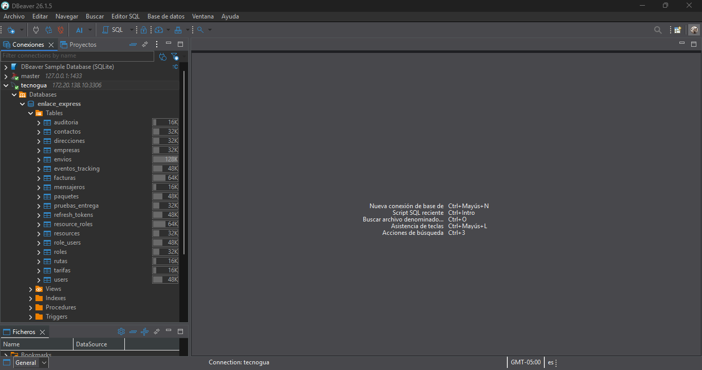

En esta evidencia se observa la conexión de DBeaver con la base de datos `enlace_express` en MySQL y la estructura de sus tablas.

### Estructura de tabla

> 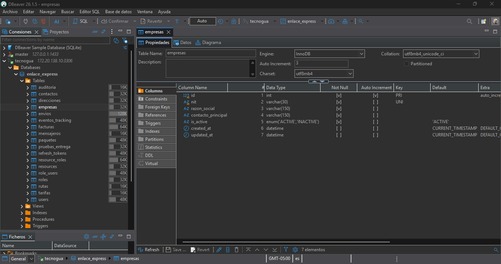

En esta evidencia se muestra la estructura de una tabla de EnlaceExpress mediante DBeaver, incluyendo sus columnas y tipos de datos.

---

## 2.2 PostgreSQL – DBeaver

### Base de datos

> 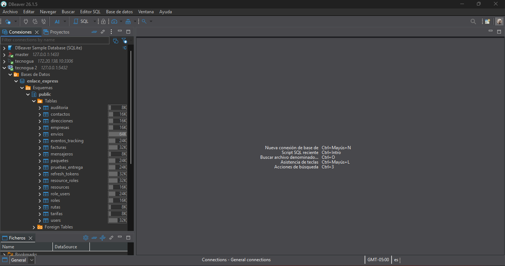

En esta evidencia se observa la conexión de DBeaver con la base de datos `enlace_express` de PostgreSQL y el esquema `public`, donde se encuentran las tablas del proyecto.

### Estructura de tabla

> 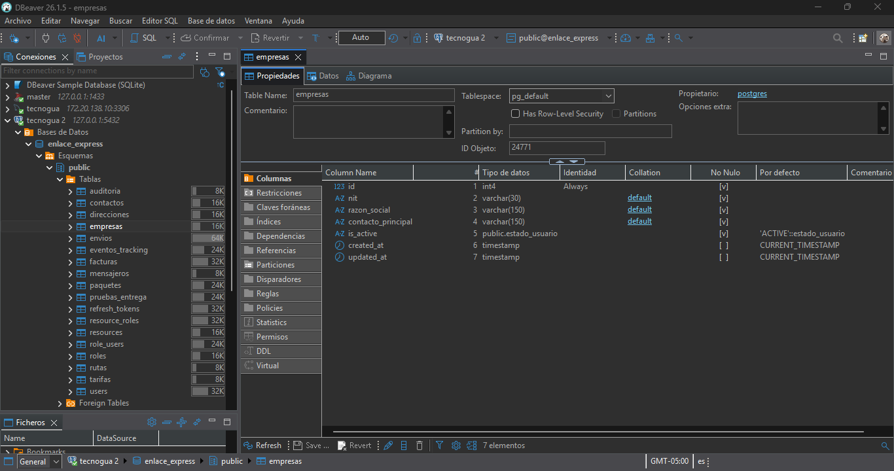

En esta evidencia se muestra la estructura de una tabla de EnlaceExpress desde DBeaver.

---

## 2.3 SQL Server – DBeaver

### Base de datos

> 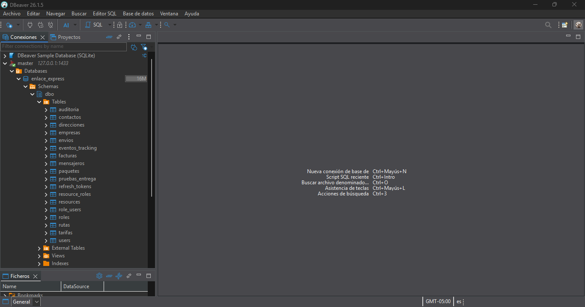

En esta evidencia se observa la conexión de DBeaver con la base de datos `enlace_express` de SQL Server y las tablas pertenecientes al esquema `dbo`.

### Estructura de tabla

> 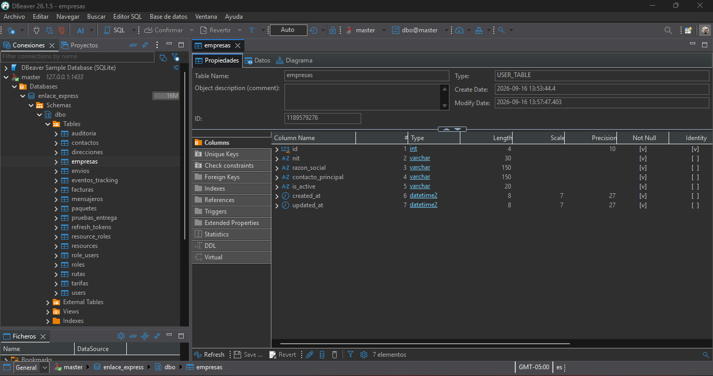

En esta evidencia se muestra la estructura de una tabla de EnlaceExpress mediante DBeaver.

---

## 2.4 Oracle – DBeaver

### Base de datos

> 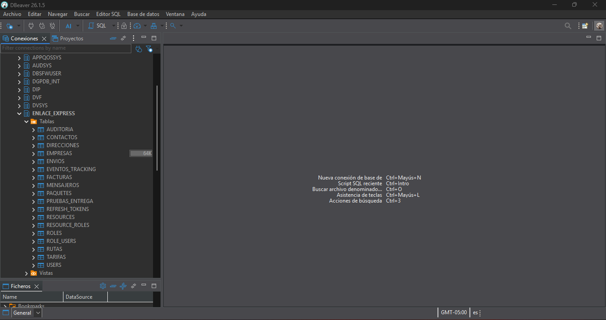

En esta evidencia se observa la conexión de DBeaver con el esquema `ENLACE_EXPRESS` en Oracle y las tablas correspondientes al proyecto.

### Estructura de tabla

> 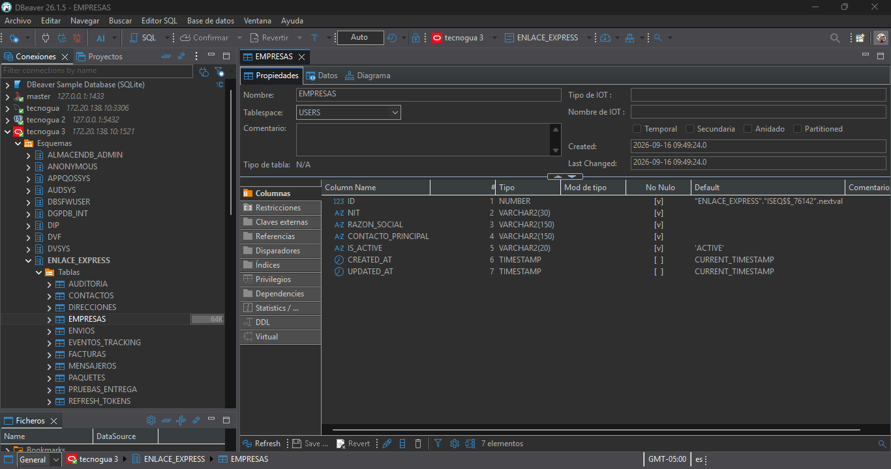

En esta evidencia se muestra la estructura de una tabla de EnlaceExpress desde DBeaver.

---

# 3. Evidencias mediante las GUI propias de cada motor

Además de DBeaver, cada motor fue conectado y verificado mediante su propia herramienta gráfica de administración.

---

## 3.1 MySQL Workbench

MySQL Workbench se utilizó para comprobar gráficamente la base de datos MySQL y visualizar la estructura de sus tablas.

### Base de datos

> 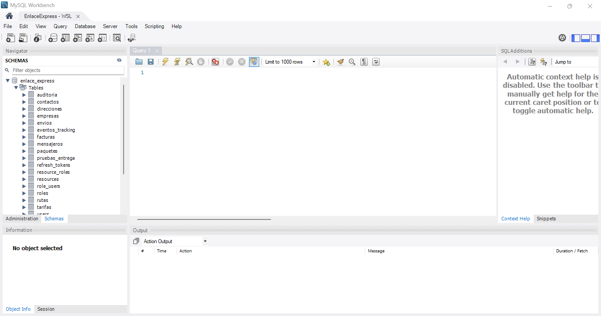

La evidencia muestra la base de datos `enlace_express` dentro de MySQL Workbench y las tablas disponibles para el proyecto.

### Estructura de tabla

> 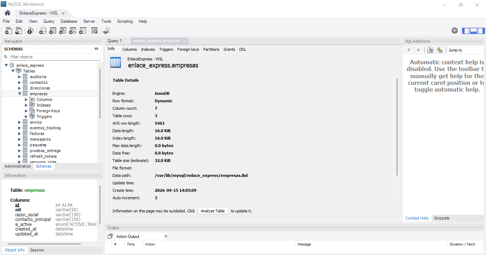

La evidencia muestra la estructura de una tabla de EnlaceExpress utilizando la herramienta gráfica de MySQL.

---

## 3.2 pgAdmin 4

pgAdmin 4 se utilizó como herramienta gráfica para PostgreSQL. La conexión permite visualizar la base de datos `enlace_express`, el esquema `public` y las tablas implementadas.

### Base de datos

> 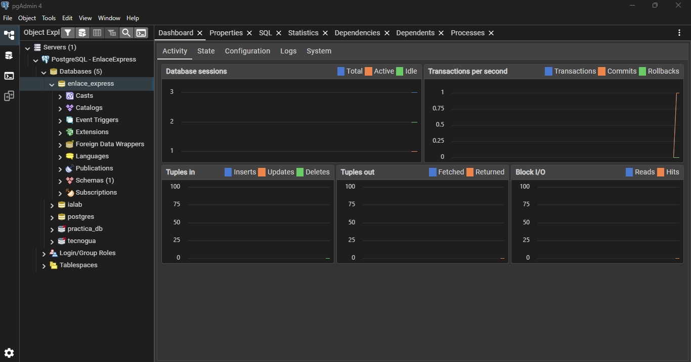

En esta evidencia se observa la base de datos `enlace_express`, el esquema `public` y las tablas de EnlaceExpress desde pgAdmin 4.

### Estructura de tabla

> 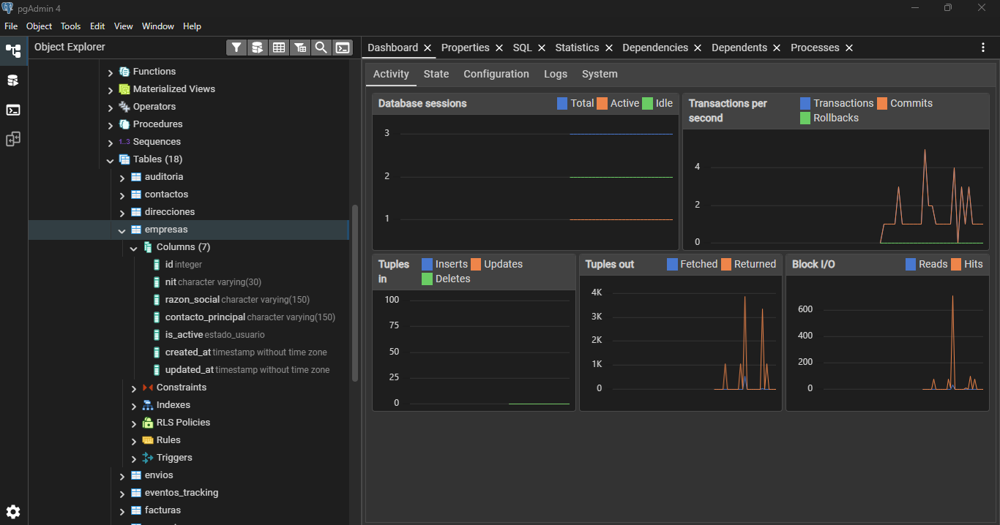

En esta evidencia se muestra la estructura de una tabla de EnlaceExpress mediante pgAdmin 4.

---

## 3.3 SQL Server Management Studio

SQL Server Management Studio (SSMS) se utilizó como herramienta gráfica propia de SQL Server para comprobar el acceso a la base de datos `enlace_express` y visualizar sus tablas.

### Base de datos

> 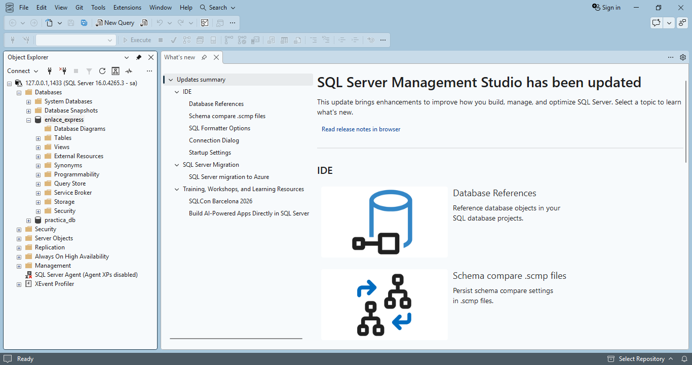

En esta evidencia se observa la base de datos `enlace_express` dentro de SQL Server Management Studio y las tablas pertenecientes al esquema `dbo`.

### Estructura de tabla

> 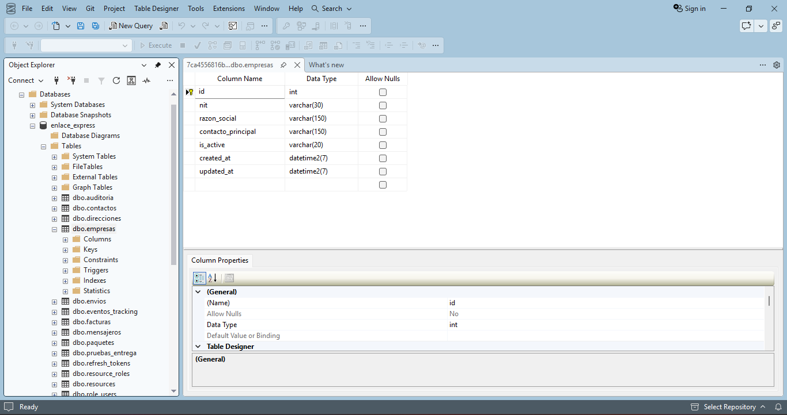

En esta evidencia se muestra la estructura de una tabla de EnlaceExpress mediante SQL Server Management Studio.

---

## 3.4 Oracle SQL Developer

Oracle SQL Developer se utilizó como herramienta gráfica propia de Oracle para comprobar el acceso al esquema `ENLACE_EXPRESS` y visualizar las tablas implementadas.

### Base de datos

> 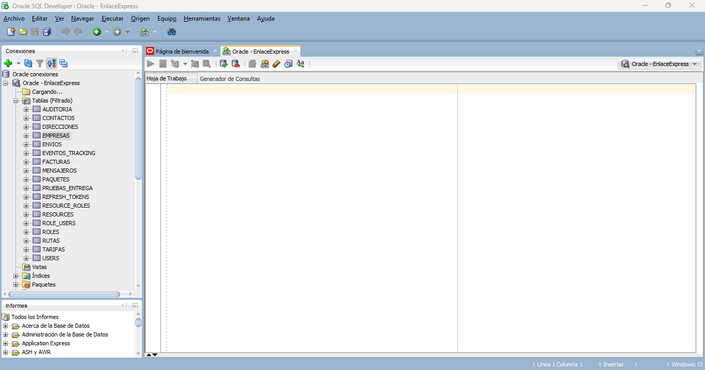

En esta evidencia se observa la conexión al esquema `ENLACE_EXPRESS` y las tablas de EnlaceExpress mediante Oracle SQL Developer.

### Estructura de tabla

> 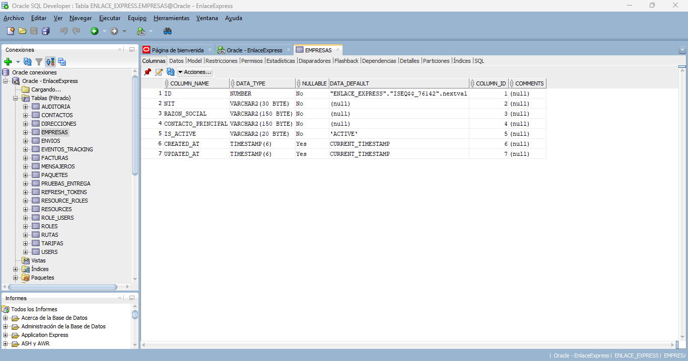

En esta evidencia se muestra la estructura de una tabla de EnlaceExpress mediante Oracle SQL Developer.

---

# 4. Resumen de evidencias

Las evidencias anteriores permiten comprobar gráficamente la implementación de EnlaceExpress en los cuatro motores de bases de datos.

| Motor      | DBeaver                    | GUI propia      | Estado     |
| ---------- | -------------------------- | --------------- | ---------- |
| MySQL      | Base de datos + estructura | MySQL Workbench | Verificado |
| PostgreSQL | Base de datos + estructura | pgAdmin 4       | Verificado |
| SQL Server | Base de datos + estructura | SSMS            | Verificado |
| Oracle     | Base de datos + estructura | SQL Developer   | Verificado |

En total se documentan:

* **8 evidencias mediante DBeaver**
* **8 evidencias mediante las GUI propias**
* **16 evidencias gráficas específicas**

---

# 5. Resultado de la verificación

Se verificó el acceso a las cuatro implementaciones de la base de datos **EnlaceExpress** mediante DBeaver y mediante las herramientas gráficas correspondientes a cada motor.

Las interfaces permitieron visualizar las bases de datos, esquemas y tablas implementadas, además de consultar la estructura de las tablas seleccionadas.

De esta manera se cuenta con evidencia gráfica de la implementación de EnlaceExpress en **MySQL, PostgreSQL, SQL Server y Oracle**, utilizando tanto una herramienta de administración común como las herramientas propias de cada motor.
